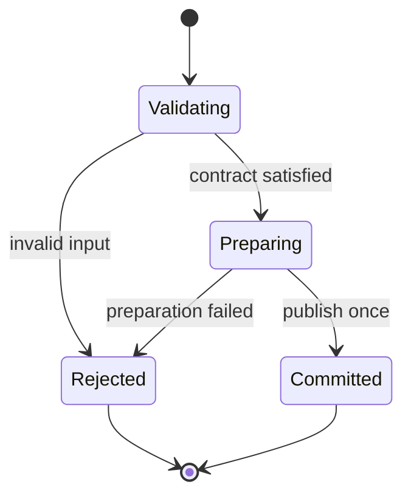

# Tiger Style for C#

**Safety > performance > developer experience.**

A practical coding standard for C# services, command-line tools, libraries, and editor
helpers on Arch Linux. Written for the Diver language documentation directory and adapted
from the supplied Lua guide. This is an independent interpretation of
[TigerBeetle's Tiger Style](https://github.com/tigerbeetle/tigerbeetle/blob/main/docs/TIGER_STYLE.md),
not an official TigerBeetle, Microsoft, or .NET Foundation document.

| Policy | Baseline |
| --- | --- |
| Language version | C# 12 / .NET 8 (LTS); C# 13 / .NET 9 notes marked where they differ |
| Nullable reference types | Enabled (`<Nullable>enable</Nullable>`); warnings are errors |
| Analysis | .NET analyzers, `AnalysisMode=All`, warnings as errors |
| Examples | Stable language features unless explicitly marked otherwise |
| Formatting | `dotnet format` or `csharpier`, four spaces, 120-column target |
| Function size | Review ordinary methods above 70 physical lines |
| Primary platform | Arch Linux; Native AOT and trimming notes where they change the rules |
| Document reviewed | 2026-10-06 |

The reference module below uses only stable C# 12 / .NET 8 APIs and was reviewed but not
executed for this documentation task; the sandbox has no .NET SDK. Validation details are
recorded at the end.

## Contents

- [1. Engineering contract](#1-engineering-contract)
- [2. Toolchain and build trust](#2-toolchain-and-build-trust)
- [3. Structure and naming](#3-structure-and-naming)
- [4. Types and state](#4-types-and-state)
- [5. Contracts and errors](#5-contracts-and-errors)
- [6. Bounds and arithmetic](#6-bounds-and-arithmetic)
- [7. Ownership and memory](#7-ownership-and-memory)
- [8. Control flow and concurrency](#8-control-flow-and-concurrency)
- [9. Unsafe code and foreign interfaces](#9-unsafe-code-and-foreign-interfaces)
- [10. Operating-system boundaries](#10-operating-system-boundaries)
- [11. Performance and reproducibility](#11-performance-and-reproducibility)
- [12. Tests and review gates](#12-tests-and-review-gates)
- [13. Complete reference module](#13-complete-reference-module)
- [14. Neovim integration](#14-neovim-integration)
- [15. Documentation and media](#15-documentation-and-media)
- [16. Review card and validation](#16-review-card-and-validation)

## 1. Engineering contract

Correctness comes before speed. Speed comes before convenience when the tradeoff is real.
Measure that tradeoff; do not use the priority order to justify speculative complexity.

Every substantial operation must identify:

1. Accepted inputs, rejected inputs, and the trust boundary.
2. Maximum work, memory, output, and elapsed time.
3. The owner of every allocation, handle, task, and subprocess.
4. The point at which externally visible state changes.
5. Failure behavior, cancellation behavior, and cleanup obligations.
6. The evidence supporting the result: tests, measurements, or a written invariant.

The garbage collector is a foundation. It does not enforce authorization, bounded queues,
appropriate retry policies, secrecy of logs, or application-level state transitions. Treat
these as explicit design obligations.

Use this rule for exceptions: name the rule, explain the need, bound the resulting risk,
and record a test or review condition. An exception belongs near the affected code or in
its design record. Blanket waivers are difficult to maintain.

Prefer a direct implementation that a reviewer can reason about. Do not ban LINQ,
pattern matching, or `Span<T>` merely because they are abstractions. Require them to make
ownership, cost, and failure clearer.

## 2. Toolchain and build trust

Pin the SDK in the repository root with `global.json`, not in the Neovim configuration.
This is a template: replace the version before using it.

```jsonc
// global.json — TEMPLATE; choose a tested SDK band.
{
  "sdk": {
    "version": "8.0.400",
    "rollForward": "latestFeature",
    "allowPrerelease": false
  }
}
```

`rollForward: latestFeature` stays inside the 8.0 feature band; `latestMajor` would silently
adopt .NET 9. Record `dotnet --info` when diagnosing discrepancies between terminal, editor,
and CI.

Enable the strict baseline in every project file. These settings are the contract, not
suggestions:

```xml
<!-- Directory.Build.props — applies to every project in the repo. -->
<Project>
  <PropertyGroup>
    <Nullable>enable</Nullable>
    <TreatWarningsAsErrors>true</TreatWarningsAsErrors>
    <AnalysisMode>All</AnalysisMode>
    <EnforceCodeStyleInBuild>true</EnforceCodeStyleInBuild>
    <!-- Overflow checking is off by default; see section 6. -->
    <CheckForOverflowUnderflow>true</CheckForOverflowUnderflow>
  </PropertyGroup>
</Project>
```

`<CheckForOverflowUnderflow>` emits `checked` arithmetic for `+`, `-`, `*` (not `/`) in
the project. It is a project-wide default you can still override locally with an explicit
`unchecked` block that names its reason. See the
[MSBuild reference](https://learn.microsoft.com/en-us/dotnet/csharp/language-reference/statements/checked-and-unchecked).

Commit lock-like reproducibility where it exists: `packages.lock.json` per project
(`<RestorePackagesWithLockFile>true</RestorePackagesWithLockFile>`) for applications.
Review package versions, licenses, and native dependencies on every change. A lock file pins
resolution; it does not certify a dependency as safe.

Build-time code generation is executable code. Source generators run inside the compiler;
opening an unfamiliar repository must not silently authorize its builds, generator
execution, tests, or debugger launch. Prefer `IIncrementalGenerator` over the legacy
`ISourceGenerator` interface; the incremental pipeline caches by input and avoids
re-running generation on every keystroke. Review what a generator emits before trusting it.

On Arch Linux, keep project SDK versions separate from rolling system updates. The
`dotnet-sdk` Arch package tracks latest; `global.json` pins the project. Use ordinary user
privileges for builds and restores. Never solve a NuGet permission problem with a
privileged `dotnet` run.

## 3. Structure and naming

Use `PascalCase` for public types, methods, and properties; `camelCase` for locals,
parameters, and private fields (prefix private fields consistently or not at all — pick one
per repository; this guide uses `_camelCase` for private fields). `UPPER_SNAKE_CASE` is not
idiomatic C#; use `PascalCase` for constants. Names carry domain meaning and units:
`outputBytesMax`, `deadline`, `retryCount`, `queueCapacity`, `elapsedMs`.

Prefer named options types to ambiguous boolean arguments. A call such as
`OpenCache(path, true, false)` hides policy. Use an options class or record with named
properties when the choices are independently meaningful.

Keep visibility narrow: `private` first, then `internal`, then `public` when a real
external API requires it. Put the public contract before private machinery. Split types
around state ownership and domain responsibilities, not an arbitrary line count. Prefer
`file`-scoped types (`file class Helper`) for single-file implementation details; they
cannot leak across the assembly.

Use the formatter as the mechanical authority. Keep comments about intent, proof, and
tradeoffs; remove comments that simply narrate syntax. Review ordinary methods over 70
physical lines. Split at meaningful contracts, not into one-use helpers that obscure a
single proof.

Use explicit `using` directives, ordered: `System.*` first, then other namespaces,
alphabetical within groups. Avoid `global using` in libraries unless the dependency is
genuinely ubiquitous; it hides coupling. Prefer an explicit type name where `var` hides an
important width, nullability, or ownership conversion. Do not annotate every obvious local
merely to make the file longer.

A small reviewed `.editorconfig` establishes the shared baseline:

```ini
[*.cs]
indent_style = space
indent_size = 4
max_line_length = 120
csharp_style_var_when_type_is_apparent = true:suggestion
dotnet_style_qualification_for_field = false:suggestion
```

Treat analyzer warnings as actionable. Suppress a particular rule only at the smallest
applicable scope with `#pragma warning disable` plus a justification comment, or
`[SuppressMessage]` with justification. Do not disable `AnalysisMode=All` categories
globally to silence noise.

> **In plain terms:** C# used to let any reference be null without saying so, which meant null-reference crashes were a matter of when, not if. Nullable reference types flip the default: the compiler now treats every reference as non-null unless you mark it with `?`, and warns when you hand a maybe-null value to code expecting a definite one. Think of it as a contract written into the type signature — the compiler checks the paperwork so the runtime doesn't have to file an incident report.


## 4. Types and state

Represent distinct concepts with distinct types when confusing them could violate a
contract: byte offsets versus element counts, authenticated identity versus user-supplied
identity, validated configuration versus raw configuration. A `readonly record struct`
with a validated factory method is the usual vehicle:

```csharp
public readonly record struct Port(int Value)
{
    public static Port From(int value) =>
        value is >= 1 and <= 65535
            ? new Port(value)
            : throw new ArgumentOutOfRangeException(nameof(value), value, "Port must be 1-65535.");
}
```

Use `enum` or a sealed hierarchy for mutually exclusive states. Avoid combinations such as
`IsStarted`, `IsFinished`, `IsFailed` booleans that can contradict one another. Exhaustive
`switch` expressions over a sealed hierarchy make new states visible to existing code; the
compiler warns when a case is missing.

Enable nullable reference types and treat the annotations as the null contract. A `string`
parameter never accepts null; a `string?` parameter documents that it might. Validate at the
trust boundary with `ArgumentNullException.ThrowIfNull`:

```csharp
public void Enqueue(string item)
{
    ArgumentNullException.ThrowIfNull(item);
    // ...
}
```

`ThrowIfNull` is a single runtime check with a standard exception type; prefer it over
hand-rolled null checks that vary by file. Deserialization is another constructor: a
`System.Text.Json` deserializer can populate supposedly validated properties, so validate
after deserialization or use a validated factory on the deserialized DTO.

Prefer `readonly struct` for small value types that are copied by value; keep them small
(16 bytes or fewer is the usual guidance — larger structs copy on every pass). Prefer
`record` for immutable data carriers with value equality, `record struct` when the
carrier is small and stack-friendly. Do not use `record` for mutable entities with
identity; use a `class`.

A state transition follows **validate → prepare → commit → observe**. Validate before
mutation; prepare fallible resources before publishing new state. If rollback is
impossible, document partial progress and return enough information for the caller to
recover safely.



Text equivalent: rejected validation or preparation leaves the published state unchanged;
only successful preparation reaches the commit point.

## 5. Contracts and errors

Validate external input with ordinary control flow and throw a meaningful exception.
Assert facts that a correct implementation has already established with
`Debug.Assert`; an attacker supplying malformed input is not an internal invariant failure.

| Situation | Preferred response |
| --- | --- |
| Invalid user input, protocol data, or configuration | `ArgumentException` family with the parameter name |
| Expected missing value | Nullable annotation, or a domain exception if absence violates the request |
| Corrupt internal relationship | `Debug.Assert` or an explicit `InvalidOperationException` |
| Expensive redundant development check | `Debug.Assert` (removed in release) |
| Operation failed for an environmental reason | `IOException`, `HttpRequestException`, or a domain exception |

`Debug.Assert` is removed in release builds; never put required mutation or validation
inside one. Never use assertions to validate external input.

Library exceptions should carry enough context for callers to decide what to do. Preserve
the cause with `innerException`. Human-readable `Message` text is for people, not a stable
parsing protocol. Keep sensitive paths, credentials, and payloads out of default messages;
`ArgumentException` includes the parameter name, not its value, for exactly this reason.

Do not use exceptions for ordinary control flow. Prefer `bool TryXxx(...)` patterns or
result types at hot boundaries. When a method can fail routinely (parsing, lookup), offer a
`Try-` variant and keep the throwing variant thin:

```csharp
public bool TryEnqueue(ReadOnlySpan<byte> item, out int rejectedBytes);
public void Enqueue(ReadOnlySpan<byte> item); // throws CapacityExceededException
```

Avoid catching `System.Exception` except at a deliberate top-level boundary (service loop,
request handler) that logs and converts. Do not swallow exceptions: an empty `catch` hides
failure. If an operation is intentionally best-effort, record the loss in a counter or log.

`IDisposable` cleanup must not depend on successfully reporting fallible business
operations; provide explicit `Flush`/`Close` methods where the result matters, and make
`Dispose` a best-effort release. Implement `IAsyncDisposable` (`await using`) when cleanup
itself is asynchronous. A finalizer is a last resort for unmanaged resources, not a
substitute for deterministic disposal; prefer `SafeHandle` derivatives, which already
implement the full pattern.

## 6. Bounds and arithmetic

Name resource limits with units. Choose values from the actual workload and operational
budget; the reference module's limits are examples, not universal defaults.

| Resource | Required contract |
| --- | --- |
| Input | Maximum bytes, records, nesting depth, and decoded expansion |
| Work | Maximum iterations, retries, and fan-out per request |
| Memory | Live objects, aggregate bytes, and temporary duplication |
| Output | Captured bytes and diagnostic count, including truncation behavior |
| Time | Deadline and the behavior when cancellation is not immediate |
| Concurrency | Queue capacity, active workers, and admission policy |

Integer overflow in C# is silent by default (`unchecked` context). This guide's baseline
enables `<CheckForOverflowUnderflow>true</CheckForOverflowUnderflow>`, which makes `+`,
`-`, `*` throw `OverflowException` on overflow. Division overflow (`int.MinValue / -1`)
still throws regardless. When wrapping is the specified result (hashing, checksums), use an
explicit `unchecked` block that names the reason — never rely on the ambient default:

```csharp
// Wrapping is specified here: FNV-1a requires modular arithmetic.
uint hash = 2166136261u;
unchecked
{
    foreach (byte b in data)
    {
        hash = (hash ^ b) * 16777619u;
    }
}
```

Use fixed-width integers (`int`, `long`) for wire and disk formats; avoid `nint`/`nuint`
in serialized layouts because their width is platform-dependent. Validate an index range
without first computing a possibly overflowing end:

```csharp
// Standalone helper; returning false means an invalid or unrepresentable range.
static bool TryGetEnd(int offset, int count, int length, out int end)
{
    end = 0;
    if ((uint)offset > (uint)length)
    {
        return false;
    }
    int remaining = length - offset; // offset <= length, no overflow
    if ((uint)count > (uint)remaining)
    {
        return false;
    }
    end = offset + count; // count <= remaining proves no overflow
    return true;
}
```

The `(uint)` casts turn negative values into large positives so a single comparison rejects
them; this is the standard unsigned-comparison idiom for range checks.

For floating-point input, decide whether infinities, NaNs, signed zero, denormals, and loss
of precision are allowed. Test those decisions. A tolerance must have units and a reason;
a large arbitrary epsilon can hide an algorithmic error. Prefer `decimal` for money.

Bound aggregate memory, not only individual objects. For workers that each retain one input
and one output, a planning upper bound is:

$$
M_{total} \le M_{shared} + W(M_{input,max} + M_{output,max} + M_{scratch,max}).
$$

This is a budget model, not a GC measurement. Include queue storage, large-object-heap
retention, thread stacks, duplicated buffers, and subprocesses in the deployed budget.
Objects over ~85,000 bytes go to the large object heap (LOH), which is collected but not
compacted by default; prefer `ArrayPool<T>` rental for large transient buffers.

> **In plain terms:** `Span<T>` is a window onto memory you don't own — fast and stack-bound, but it evaporates the moment the method returns or crosses an `await`. `Memory<T>` is the same idea in a form that survives the heap: slightly heavier, but safe to stash in a field or hand across an asynchronous boundary. The rule of thumb is boring on purpose: borrow with `Span` when you're just looking, own with `Memory` when you're keeping.


## 7. Ownership and memory

The GC owns managed memory; you own the *policy* around it. Borrow views for inspection
with `Span<T>` / `ReadOnlySpan<T>`; take ownership (`byte[]`, `Memory<T>`, `IMemoryOwner<T>`)
only when retaining the buffer is part of the contract.

`Span<T>` is a `ref struct`: it can live on the stack but never on the heap — not as a
field of a class, not in an array, not across an `await`. `Memory<T>` is the heap-safe
counterpart for exactly those positions. `ReadOnlySpan<T>` / `ReadOnlyMemory<T>` express
read-only intent. Choosing the wrong one is a compile error, which is the type system
doing its job; do not fight it with casts.

Rent large transient buffers from `ArrayPool<T>.Shared` instead of allocating. The pool
returns arrays that may be larger than requested and contain previous contents — never
assume zero-initialization or exact length; always slice to the rented-then-used range and
`Return` the array in a `finally` or via disposal:

```csharp
byte[] rented = ArrayPool<byte>.Shared.Rent(needed);
try
{
    var span = rented.AsSpan(0, needed);
    Fill(span);
}
finally
{
    // clearArray: true when the buffer held secrets.
    ArrayPool<byte>.Shared.Return(rented, clearArray: false);
}
```

Prefer `stackalloc` for small, short-lived scratch (a few hundred bytes at most); large
`stackalloc` in a loop or deep call chain risks `StackOverflowException`, which cannot be
caught reliably. `stackalloc` in a `Span<T>`-typed local is allowed without `unsafe`.

Avoid pinning (`fixed`, `GCHandle`) unless interop requires it; pinning fragments the heap
and blocks compaction for the pinned region. When P/Invoke needs a pointer, prefer
`Span<T>`-based overloads or `MemoryMarshal` helpers that pin for the minimal scope.

Treat closure allocations as explicit cost in hot paths: lambdas that capture locals
allocate a display class; lambdas assigned to `static` or converted to function pointers
(`static` lambdas, `delegate*`) do not. `string` concatenation in a loop allocates per
iteration; use `StringBuilder`, `string.Create`, or interpolated string handlers.

Finalizers run on a dedicated thread, delay collection by at least one generation, and
cannot reliably touch other managed objects. Prefer `SafeHandle` for unmanaged resources;
it already implements the dispose/finalizer pattern correctly.

> **In plain terms:** When you write `await`, the compiler quietly rewrites your method into a state machine that can pause and resume — which is why local variables survive the pause but the thread doesn't have to. `ValueTask` is a cheaper version of that machinery for hot paths, with one catch: it can only be awaited once, because reusing it is like rewinding a cassette someone already recorded over. If the single-await rule feels fragile, `Task` is always the safe default.


## 8. Control flow and concurrency

Prefer early returns and shallow branches. Loops need a finite input bound, an explicit
iteration budget, or a service lifecycle with bounded batches and cancellation. Use an
explicit stack with a depth cap instead of recursion in production paths under this policy.

A service loop may be intentionally long-lived. Each turn must still bound work and yield
control. Record when new work is rejected, delayed, or dropped. Never disguise dropped work
as successful completion.

Use bounded channels. `System.Threading.Channels.Channel.CreateBounded<T>` with an explicit
`BoundedChannelFullMode` defines behavior for a full queue: `Wait`, `DropNewest`,
`DropOldest`, or `DropWrite`. Choose deliberately; the default (`Wait`) applies
backpressure, which is usually what a service wants:

```csharp
var channel = Channel.CreateBounded<WorkItem>(new BoundedChannelOptions(capacity: 1024)
{
    FullMode = BoundedChannelFullMode.Wait,
    SingleReader = true, // documents the consumption pattern
});
```

Every `async` method that can be cancelled takes a `CancellationToken`, conventionally as
the last parameter with `= default`. Do not invent a parallel cancellation mechanism.
Link tokens with `CancellationTokenSource.CreateLinkedTokenSource` when combining an
external token with a local deadline. `OperationCanceledException` (and the derived
`TaskCanceledException`) is the cooperative-cancellation signal, not an error: let it
propagate; do not log it as a failure.

`ValueTask<T>` avoids an allocation when the result is often synchronous, but it may only
be awaited once and must not be awaited after the method that created it has been left in
an invalid state. Do not store `ValueTask` in fields or await it twice; use `Task<T>` when
the value needs to be shared or awaited multiple times. `IValueTaskSource<T>` pooling is an
advanced optimization with strict lifetime rules — measure before adopting it.

`ConfigureAwait(false)` remains the library default: it avoids capturing the caller's
`SynchronizationContext`. In .NET Core+ there is usually no context to capture, but a
library cannot know its host; keep the explicit call so the intent survives embedding in a
UI or legacy ASP.NET process.

For locks, document the protected invariant and any lock ordering. Prefer `SemaphoreSlim`
or channels over `lock` when the critical section contains `await` — holding a monitor
across an await blocks a thread-pool thread and risks deadlock. Minimize critical
sections. Do not hold any lock across an `await`.

Use `Interlocked` for single-word atomic updates; it is cheaper and clearer than a lock
for counters and flags. For compound state, a lock (or an immutable-swap via
`Interlocked.CompareExchange` on a reference) keeps the invariant in one place.

Retries require a retryable error class, bounded attempts, a total deadline, and an
idempotency argument. Retries after a possibly successful write can duplicate effects.
`Polly` is the established resilience library; if you hand-roll retry, the policy above is
still mandatory.

Use a generation token or `CancellationToken` for work whose result can become stale.
Capture the input identity and version when starting. Before publishing, check the token.
Cancellation saves resources; a freshness check protects correctness.

> **In plain terms:** Every call into native code is a handshake across a trust boundary: C# promises memory safety, C promises nothing. Source-generated P/Invoke (`LibraryImport`) moves the marshaling rules from runtime guesswork into compile-time code you can read, which means the boundary is documented instead of vibes-based. Treat each native signature like a contract negotiation — get the types wrong and the other side won't file a complaint, it'll just corrupt memory quietly.


## 9. Unsafe code and foreign interfaces

Default to safe code. For an assembly that requires no unsafe code, an assembly-level
policy is:

```csharp
// AssemblyInfo.cs or Directory.Build.props:
// <AllowUnsafeBlocks>false</AllowUnsafeBlocks>  (this is already the default)
```

`AllowUnsafeBlocks` defaults to `false`; keep it that way unless a reviewed need exists.
Every `unsafe` block needs a local safety explanation covering the applicable obligations:
valid allocation, provenance, alignment, initialized elements, bounds, aliasing, lifetime,
and thread access. "The caller knows" is insufficient unless that obligation is part of an
explicit public contract.

`Span<T>`-based interop usually removes the need for `unsafe`: `MemoryMarshal`,
`Unsafe` (the class, used carefully), and `NativeMemory` cover most buffer scenarios.
When you must take a pointer, pin for the minimal scope:

```csharp
// Pinning is scoped to the fixed statement; the pointer never escapes it.
fixed (byte* p = buffer)
{
    NativeMethods.Process(p, buffer.Length);
}
```

For P/Invoke, define the ABI explicitly: `CharSet`, `CallingConvention`, string marshaling,
and who frees what. Prefer `LibraryImport` (source-generated, .NET 7+) over `DllImport`;
the generator produces trimming-safe marshaling and avoids runtime IL generation, which
matters for Native AOT:

```csharp
internal static partial class NativeMethods
{
    [LibraryImport("native", StringMarshalling = StringMarshalling.Utf8)]
    internal static partial int Process(
        [MarshalAs(UnmanagedType.LPArray, SizeParamIndex = 1)] byte[] buffer,
        int length);
}
```

`[LibraryImport]` requires `partial` methods in a `partial` class and runs at compile
time — no `Reflection.Emit`, no runtime codegen. `UnmanagedCallersOnly` exposes managed
callbacks to native code with the same AOT-friendly properties.

Native AOT changes the rules further: no dynamic assembly loading, no runtime code
generation, and reflection is limited to what the trimmer can see. Annotate
reflection-dependent APIs with `[DynamicallyAccessedMembers]` and test the published
single-file binary, not just the JIT build. Treat every `IL20xx`/`IL30xx` trim warning as
actionable; suppressions need the same justification discipline as analyzer suppressions.

Do not expose safe wrappers that accept pointers or lengths without proving the invariants
their internal unsafe code requires. Add adversarial tests to the wrapper, not only happy
path tests to the native routine.

## 10. Operating-system boundaries

### Paths and files

Treat a path as a request, not authorization. String prefix checks do not establish
directory containment. Use `Path.GetFullPath` and compare against the authorized root
with proper separator handling, and be explicit about the symlink policy: .NET follows
symlinks by default, and `File.ResolveLinkTarget` exists to inspect them.

Keep configuration, persistent state, and cache distinct. Respect
`Environment.SpecialFolder` and XDG conventions on Linux (`XDG_CONFIG_HOME`,
`XDG_DATA_HOME`); do not hard-code `$HOME` layouts. Use restrictive file modes when
creating secrets — .NET has `File.SetUnixFileMode` on Unix; setting the mode after creation
leaves an exposure interval, so prefer creating with the mode where the API allows it.

Write important updates through a temporary file in the destination directory, then move
atomically with `File.Move(source, dest, overwrite: true)`. Atomic visibility and crash
durability are different requirements: flush the file and consider `fsync` semantics for
the durability contract. Bound directory traversal, archive extraction, decompression, and
file reads. Reject archive entries that escape the authorized destination.

Use async file I/O (`FileStream` with `useAsync: true`, `ReadAsync`/`WriteAsync`) for
anything that can block; synchronous I/O on a thread-pool thread is a scalability tax.
`File.ReadAllBytesAsync` and friends are fine for bounded, trusted sizes — never for
unbounded network input.

### Processes

Pass an executable and separate argument values with `System.Diagnostics.ProcessStartInfo`
using `ArgumentList`, not string concatenation. `ArgumentList` avoids shell quoting bugs
entirely; `UseShellExecute = false` is the default on .NET Core and must stay that way:

```csharp
var psi = new ProcessStartInfo
{
    FileName = "/usr/bin/tool",
    RedirectStandardOutput = true,
    RedirectStandardError = true,
};
psi.ArgumentList.Add("--input");
psi.ArgumentList.Add(userSuppliedPath); // no quoting, no shell
```

A process supervisor must bound stdout and stderr while draining both (read both streams
concurrently or use async reads; a full pipe buffer deadlocks the child), enforce a
deadline via `WaitForExitAsync(cts.Token)`, terminate according to policy
(`Kill(entireProcessTree: true)`), and observe the exit code. `Kill()` without the process
tree flag can leave descendants alive.

### Network and credentials

Set connection, read/write, and overall operation budgets. Reuse a single long-lived
`HttpClient` (or better, `IHttpClientFactory`); constructing `HttpClient` per request
exhausts sockets. Bound redirects and response expansion. TLS verification is on by
default — do not disable it. Check application authorization independently of successful
transport authentication.

Never log tokens or full credential-bearing URLs. Avoid secrets in process arguments, which
are observable to other local processes. Load credentials from the environment or a secret
store at startup, scope them narrowly, and do not invent a home-grown cryptographic
scheme; use `System.Security.Cryptography` primitives (`RandomNumberGenerator`,
`AesGcm`, `SHA256`) with documented parameters.

## 11. Performance and reproducibility

Establish correct behavior before tuning. Measure representative distributions, including
large valid inputs and rejected inputs. Report latency percentiles, throughput,
allocations, and peak memory when they matter. Record SDK version, runtime, target CPU,
flags, dataset, and warmup. BenchmarkDotNet is the standard harness; its reports include
the environment precisely so results are comparable.

Optimize the dominant cost. Prefer fewer allocations, better locality, and less duplicated
work before unsafe tricks. `Span<T>`-based parsing typically beats `string.Split` plus
`Substring` because it avoids per-token allocation; measure the actual workload rather
than assuming.

Bound generic specialization and assembly size where it matters for Native AOT: aggressive
generics increase binary size and compile time. Public abstraction boundaries should pay
for the complexity they impose on downstream users.

Determinism is a contract where it matters: stable diagnostics, sorted serialized keys
(`JsonSerializerOptions` with explicit ordering or sorted dictionaries), repeatable tests,
and explicit seeds. Do not depend on `Dictionary<TKey,TValue>` iteration order. Parallel
floating-point reductions may change rounding; document the permitted numerical variation.

Avoid `PublishReadyToRun` + `PublishSingleFile` assumptions leaking into logic; keep
deployment choices out of business code. For Native AOT, test the actual published binary:
startup behavior, reflection usage, and serialization (prefer source-generated
`JsonSerializerContext` over runtime reflection — it is faster and trim-safe).

## 12. Tests and review gates

Test contracts, not the incidental line-by-line implementation. Include zero, one, exact
limit, limit plus one, invalid conversion, overflow, cancellation, stale completion, and
failure before the commit point. Assert that rejected mutations leave state unchanged.

Use property tests (FsCheck) for invariants across many inputs and fuzz parsers/unsafe
wrappers when the input space warrants it. Keep generated work bounded and record
reproducing seeds. Separate hermetic unit tests from tests requiring network, credentials,
hardware, or services.

Typical gates for a reviewed .NET repository:

```sh
dotnet format --verify-no-changes
dotnet build --no-restore -warnaserror
dotnet test --no-build
```

`dotnet test` runs the test projects in the solution; add `--filter` to scope. Run analyzers
as part of build (`AnalysisMode=All` with warnings as errors already does this). Audit what
builds and tests execute before running them in an untrusted checkout — MSBuild targets and
source generators are code.

A passing formatter is not a passing compiler. A passing compiler is not a runtime test.
A passing unit suite does not establish whole-program security or portability. Report each
kind of evidence accurately.

Name tests for the contract they verify: `TryWrite_OverCapacity_RejectsWithoutMutation`,
not `Test1`. Keep one logical assertion focus per test; a test that verifies five
unrelated behaviors verifies none of them well.

## 13. Complete reference module

Save this fence as `bounded_writer.cs`. It demonstrates nullable annotations, `Span<T>`
borrowing, bounded copying with rejection-without-mutation, and the `Try-` pattern. It
uses a fixed-size array (no pool, no heap beyond the object itself) and no unsafe code.

The invariant is `_length <= Capacity`; `TryWrite` first proves
`value.Length <= Capacity - _length`. Only then is the copy performed and the public
length committed. Clearing changes logical length; it does not erase previous bytes.

```csharp
// bounded_writer.cs — compile: dotnet run (console project) or csc bounded_writer.cs
#nullable enable

using System;

/// <summary>
/// Fixed-capacity byte sink. Invariant: 0 &lt;= Length &lt;= Capacity.
/// Rejected writes leave the buffer entirely unchanged.
/// </summary>
public sealed class BoundedWriter
{
    private readonly byte[] _bytes;
    private int _length;

    public BoundedWriter(int capacity)
    {
        if (capacity < 0)
        {
            throw new ArgumentOutOfRangeException(nameof(capacity), capacity, "Capacity must be >= 0.");
        }

        _bytes = new byte[capacity];
        _length = 0;
    }

    public int Capacity => _bytes.Length;

    public int Length
    {
        get
        {
            // Invariant established by the constructor and TryWrite.
            System.Diagnostics.Debug.Assert((uint)_length <= (uint)_bytes.Length);
            return _length;
        }
    }

    public int Remaining => Capacity - Length;

    public ReadOnlySpan<byte> AsSpan() => _bytes.AsSpan(0, _length);

    /// <summary>
    /// Appends <paramref name="value"/> if it fits. Returns false and mutates
    /// nothing when the value would exceed capacity.
    /// </summary>
    public bool TryWrite(ReadOnlySpan<byte> value)
    {
        int remaining = Remaining;
        if (value.Length > remaining)
        {
            return false;
        }

        // value.Length <= Capacity - _length proves the slice is in range.
        value.CopyTo(_bytes.AsSpan(_length));
        _length += value.Length;
        return true;
    }

    public void Clear() => _length = 0;
}

/// <summary>Minimal self-contained test harness (no test framework required).</summary>
internal static class BoundedWriterTests
{
    private static int _failed;

    private static void Check(bool condition, string name)
    {
        if (condition)
        {
            Console.WriteLine($"  ok - {name}");
        }
        else
        {
            Console.WriteLine($"  FAIL - {name}");
            _failed++;
        }
    }

    public static int Run()
    {
        Console.WriteLine("BoundedWriter tests:");

        var b1 = new BoundedWriter(4);
        Check(b1.TryWrite(ReadOnlySpan<byte>.Empty), "empty write succeeds");
        Check(b1.Length == 0 && b1.Remaining == 4, "empty write preserves state");

        var b2 = new BoundedWriter(4);
        Check(b2.TryWrite("ab"u8), "first write succeeds");
        Check(b2.TryWrite("cd"u8), "exact-capacity write succeeds");
        Check(b2.AsSpan().SequenceEqual("abcd"u8), "contents match");
        Check(b2.Remaining == 0, "remaining is zero when full");

        var b3 = new BoundedWriter(4);
        Check(b3.TryWrite("ab"u8), "setup write succeeds");
        int lenBefore = b3.Length;
        Check(!b3.TryWrite("cde"u8), "over-capacity write rejected");
        Check(b3.Length == lenBefore, "rejection preserves length");
        Check(b3.AsSpan().SequenceEqual("ab"u8), "rejection preserves contents");

        var b4 = new BoundedWriter(0);
        Check(b4.TryWrite(ReadOnlySpan<byte>.Empty), "zero capacity accepts empty");
        Check(!b4.TryWrite("x"u8), "zero capacity rejects non-empty");

        var b5 = new BoundedWriter(4);
        Check(b5.TryWrite("abcd"u8), "fill succeeds");
        b5.Clear();
        Check(b5.Length == 0, "clear resets length");
        Check(b5.TryWrite("x"u8), "write after clear succeeds");
        Check(b5.AsSpan().SequenceEqual("x"u8), "contents after clear+write match");

        var b6 = new BoundedWriter(1);
        Check(b6.TryWrite("x"u8), "single-byte write succeeds");
        Check(b6.TryWrite(ReadOnlySpan<byte>.Empty), "empty write valid when full");

        Console.WriteLine(_failed == 0 ? "ALL TESTS PASSED" : $"{_failed} TESTS FAILED");
        return _failed;
    }
}

internal static class Program
{
    private static int Main() => BoundedWriterTests.Run();
}
```

Notes on the reference module:

- `"ab"u8` is a UTF-8 string literal (C# 11+), producing `ReadOnlySpan<byte>` with no
  allocation. `ReadOnlySpan<byte>.Empty` is the empty span.
- The constructor validates `capacity`; every other method relies on the established
  invariant, enforced in `Length` with `Debug.Assert` (removed in release).
- `TryWrite` borrows the caller's span — no copy on the rejection path, one bounded copy
  on success. The caller retains ownership of its buffer.
- A production library would add `IBufferWriter<byte>` integration and XML doc comments
  on every public member; the shape above is the minimal contract demonstration.

## 14. Neovim integration

Place this document at `lua/config/lang/TIGER_STYLE_CSHARP.md` in Diver. Markdown is
reference material; do not `require()` it from `init.lua`. Your C# language configuration,
LSP definitions, lint runner, and formatter remain their own Lua modules.

Two Roslyn-based servers exist. OmniSharp (`omnisharp`) is the legacy server; the
Roslyn-based language server (`roslyn_ls`, `Microsoft.CodeAnalysis.LanguageServer`) is the
current one and understands modern SDK-style projects, source generators, and analyzers.
Prefer the Roslyn server for new setups; keep OmniSharp only where the Roslyn server lacks
a needed legacy project type. Use the project's pinned SDK (`global.json`) consistently
for the language server, builds, formatting, and debugging. Compare the editor's
environment with the terminal before changing diagnostics to conceal a mismatch.

Formatting: `csharpier` is the opinionated formatter most setups want; `dotnet format`
applies `.editorconfig` rules and analyzer code fixes. Pick one owner for format-on-save
and avoid running both. Keep one owner for analyzers too — the build already runs
`AnalysisMode=All` with warnings as errors; the editor should surface the same
diagnostics, not a second opinion.

Make project execution deliberate: workspace trust gates builds, restores, source
generators, tests, external tools, and debugging. Read-only browsing and editing should
remain possible before trust. Expensive checks (full-solution analysis) should be
cancellable and must not block editor callbacks.

When a C# helper feeds Neovim diagnostics, use a versioned output schema and bounded
records. Specify byte versus character positions and zero- versus one-based indexing
(Roslyn uses zero-based line/character; the LSP protocol matches). Carry buffer identity
and input version through the request, and reject stale results before publishing them.
These are integration contracts, not guarantees supplied by the type system.

## 15. Documentation and media

Keep the core guide readable as plain Markdown. Use a table for comparisons, Mermaid for
state/ownership relationships, and math only where it clarifies a bound. Every diagram needs
a textual equivalent. Code fences must identify their language and whether they are complete,
fragments, or templates.

Use relative, repository-owned images with meaningful alt text after adding the actual asset.
The following is a template, not an included image:

```markdown

```

For a trusted renderer that supports HTML video, provide controls and a fallback link. Add
the media files before inserting this template into a rendered document:

```html
<video controls preload="metadata" aria-label="Bounded writer walkthrough">
  <source src="./assets/csharp-buffer-demo.mp4" type="video/mp4">
  <a href="./assets/csharp-buffer-demo.mp4">Open the walkthrough video</a>
</video>
```

SVG, custom CSS, JavaScript, video, and math support depend on the renderer. Keep active HTML
and scripts disabled for untrusted documentation. Never require JavaScript to read a safety
contract. If an interactive local page is useful, maintain it as a separate reviewed asset
with a static explanation in the Markdown.

## 16. Review card and validation

Before merging:

- [ ] Inputs are validated before allocation, indexing, and mutation.
- [ ] Types distinguish domain concepts; nullable annotations are the null contract.
- [ ] Work, queues, memory, output, retries, and time have explicit budgets.
- [ ] Arithmetic honors the checked-overflow policy; `unchecked` blocks name their reason.
- [ ] Errors preserve failure; assertions enforce established invariants.
- [ ] Every resource has an owner and a cleanup/shutdown path (`IDisposable`/`IAsyncDisposable`).
- [ ] Cancellation cannot publish obsolete results or duplicate effects silently.
- [ ] `ValueTask` is awaited once; `ConfigureAwait(false)` in libraries.
- [ ] Unsafe/P/Invoke contracts are local, reviewed, and trim-safe for Native AOT.
- [ ] Logs and subprocess environments expose no unnecessary secrets.
- [ ] Toolchain and dependency changes receive execution-trust review.
- [ ] Boundary tests and the actual supported target matrix are recorded.
- [ ] Performance claims include measurements and their environment.

**Validation record:** the complete `BoundedWriter` module was extracted from this document
and reviewed against C# 12 / .NET 8 semantics, but not compiled or executed — the sandbox
has no .NET SDK. The unsigned-comparison idiom in `TryGetEnd`, the `LibraryImport`
signatures, and the `Channel` options were checked against documented APIs. These checks
establish only the stated example behavior. The user's pinned SDK, analyzers, Native AOT
publish, and Neovim integration were not executed for this documentation task.

**Maintenance:** review this guide whenever the pinned SDK, deployment target (JIT vs
Native AOT), foreign interfaces, trust model, or supported feature matrix changes. Keep the
rule and the evidence together. Remove obsolete workarounds when their underlying constraint
disappears.
