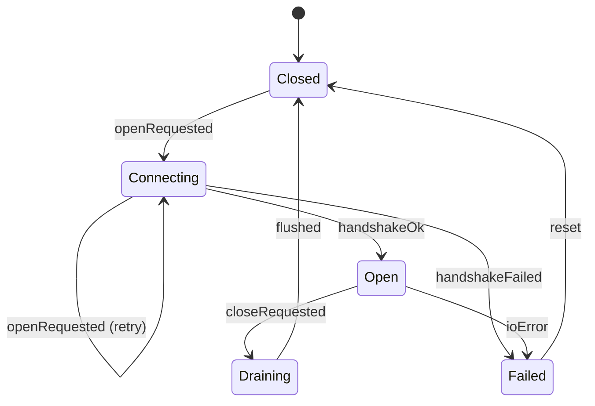

# Tiger Style for Dart

**Safety > performance > developer experience.**

A practical coding standard for Dart 3 command-line tools, servers, libraries, and
editor helpers. Written for the Diver language documentation directory and adapted from
the supplied Rust guide. This is an independent interpretation of
[TigerBeetle's Tiger Style](https://github.com/tigerbeetle/tigerbeetle/blob/main/docs/TIGER_STYLE.md),
not an official TigerBeetle, Dart, or Google document.

| Policy | Baseline |
| --- | --- |
| Language version | Dart 3 stable (sound null safety is mandatory, not optional) |
| Null safety | Non-nullable by default; `dynamic` only with a bounded, recorded reason |
| Analysis | `package:lints/strict.yaml`, `strict-casts`, `strict-raw-types`, zero warnings |
| Examples | Stable Dart 3 language features unless explicitly marked otherwise |
| Formatting | `dart format` (two spaces, 80 columns; the formatter is not negotiable) |
| Function size | Review ordinary functions above 60 physical lines |
| Primary platform | Linux/macOS/Windows native (VM, JIT and AOT); web notes where they change the rules |
| Document reviewed | 2026-10-06 |

The reference module below uses only `dart:core`, `dart:typed_data`, and `package:test`
APIs and was carefully reviewed by reading against Dart 3 semantics, but not executed:
this sandbox has no Dart SDK (verified: `command -v dart` returns nothing). Validation
details are recorded in section 16.

## Contents

- [1. Engineering contract](#1-engineering-contract)
- [2. Toolchain and build trust](#2-toolchain-and-build-trust)
- [3. Structure and naming](#3-structure-and-naming)
- [4. Types and state](#4-types-and-state)
- [5. Contracts and errors](#5-contracts-and-errors)
- [6. Bounds and arithmetic](#6-bounds-and-arithmetic)
- [7. Ownership and memory](#7-ownership-and-memory)
- [8. Control flow and concurrency](#8-control-flow-and-concurrency)
- [9. Unsafe code and foreign interfaces](#9-unsafe-code-and-foreign-interfaces)
- [10. Operating-system boundaries](#10-operating-system-boundaries)
- [11. Performance and reproducibility](#11-performance-and-reproducibility)
- [12. Tests and review gates](#12-tests-and-review-gates)
- [13. Complete reference module](#13-complete-reference-module)
- [14. Neovim integration](#14-neovim-integration)
- [15. Documentation and media](#15-documentation-and-media)
- [16. Review card and validation](#16-review-card-and-validation)

## 1. Engineering contract

Correctness comes before speed. Speed comes before convenience when the tradeoff is
real. Measure that tradeoff; do not use the priority order to justify speculative
complexity.

Every substantial operation must identify:

1. Accepted inputs, rejected inputs, and the trust boundary.
2. Maximum work, memory, output, and elapsed time.
3. The owner of every allocation, port, subscription, isolate, and subprocess.
4. The point at which externally visible state changes.
5. Failure behavior, cancellation behavior, and cleanup obligations.
6. The evidence supporting the result: tests, measurements, or a written invariant.

The garbage collector and the event loop are a foundation, not a policy: they don't
enforce authorization, bounded queues, retry policies, log secrecy, or state
transitions. Those are explicit design obligations.

Exceptions to any rule here must name the rule, explain the need, bound the risk,
and record a test or review condition — kept near the affected code. No blanket
waivers.

Prefer direct implementations a reviewer can reason about, and prefer
machine-checked claims over comments: a non-nullable type proves a value exists; a
sealed class with an exhaustive switch proves every case is handled.

## 2. Toolchain and build trust

Dart has no first-party SDK pin file: the `sdk` constraint is a floor, not a pin
(`>=3.4.0 <4.0.0` rejects older SDKs, silently accepts newer 3.x). Pin outside the
package — a `dart:3.4.0-sdk` image, an exact CI matrix version — and record
`dart --version` when terminal, editor, and CI disagree. Third-party managers (FVM,
mise) are Flutter-oriented; label them as such.

This is a template: replace the versions before using it.

```dart fragment
# pubspec.yaml — TEMPLATE; choose tested versions before using.
name: example_tool
description: One-line description of what this package does.
version: 0.1.0

environment:
  sdk: '>=3.4.0 <4.0.0'

dependencies:
  meta: ^1.12.0

dev_dependencies:
  lints: ^5.0.0
  test: ^1.25.0
```

Commit `pubspec.lock` for applications (command-line tools, servers, anything you
deploy): it pins the exact resolved tree. Do **not** commit `pubspec.lock` for library
packages published to pub.dev; the lock would constrain downstream resolution and the
Dart team's own guidance says libraries leave it out. Either way, review dependency
versions, licenses, and native assets on every change with `dart pub deps` and
`dart pub outdated`. A lock file pins resolution; it does not certify a dependency as
safe.

Real `dart pub` commands (package root): `get` resolves and fetches; `upgrade`
moves to newest allowed versions (`--major-versions` rewrites constraints — use
deliberately); `outdated` shows lag; `deps` prints the resolved tree for review;
`publish --dry-run` validates before release.

Vet every dependency: pub.dev scores and publisher identity, native code
(`dart:ffi`), build hooks, and the transitive closure. Prefer maintained packages
from verified publishers (the Dart team publishes `lints`, `test`, `args`, `path`,
`ffi`). Build-time code deserves runtime-level scrutiny.

Keep project SDK versions separate from rolling system updates. Use ordinary user
privileges for `dart pub get` and builds. Never solve a pub-cache permission problem
with a privileged `dart` run.

## 3. Structure and naming

Follow Effective Dart naming: `lowerCamelCase` for variables, parameters, functions,
methods, and constants; `UpperCamelCase` for classes, enums, mixins, extensions,
extension types, and typedefs; `lowercase_with_underscores` for file names, library
names, and package names. Names carry domain meaning and units: `outputBytesMax`,
`deadline`, `retryCount`, `queueCapacity`, `elapsedMs`.

Prefer named records or small option types over ambiguous positional booleans. A call
such as `openCache(path, true, false)` hides policy. A record like
`(path: path, readOnly: true, createParents: false)` or an options class with named
fields keeps each choice visible at the call site.

Keep visibility narrow: `_`-private first, public only for real external APIs. Dart
has no `internal`/`protected` — the underscore is the only encapsulation the
language gives you, so organize files around library privacy. Put the public
contract before private machinery. Split types around state ownership and domain
responsibilities, not line counts.

Organize imports in three alphabetical groups — `dart:`, then `package:`, then
relative — enforced by `directives_ordering`. Prefer `package:` imports even inside
the package (Effective Dart: avoid relative imports). Resolve clashes explicitly
with `show`/`hide` or import prefixes.

`dart format` is the mechanical authority — opinionated and non-negotiable. Comment
intent, proof, and tradeoffs; never narrate syntax. Review functions over 60 physical
lines; split at contracts, not into one-use helpers.

A small reviewed `analysis_options.yaml` establishes the shared baseline:

```dart fragment
# analysis_options.yaml — applies to the whole package.
include: package:lints/strict.yaml

analyzer:
  language:
    strict-casts: true
    strict-raw-types: true

linter:
  rules:
    - avoid_dynamic_calls
    - prefer_final_locals
```

`strict-casts` and `strict-raw-types` close the language's two default soundness
holes (implicit downcasts, raw generics); `avoid_dynamic_calls` makes `dynamic` a
deliberate decision. Suppress rules only at the smallest scope with `// ignore:`
plus justification — never globally.

A note on Flutter-adjacent concerns: this guide targets the Dart language, not the
Flutter framework. Widget trees, `BuildContext` lifetimes, and build-method purity are
out of scope. Where Flutter changes a rule in this guide (for example, `dart:io` is
unavailable on Flutter web), it is called out explicitly.

> **In plain terms:** Dart's null safety is sound, which is a stronger claim than most languages make: if your code compiles without warnings, a non-nullable variable genuinely cannot hold null at runtime — the compiler has proven it. This moves null handling from a runtime lottery to a design decision you make once, at the declaration. The migration-era `!` operator exists for interop with unmigrated code; in new code it's a code smell, the equivalent of disabling the smoke detector because you're sure you won't start a fire.


## 4. Types and state

Model state machines as sealed classes and drive transitions through exhaustive
switches. The compiler then rejects an unhandled state exactly the way a reviewer
should. This is the single highest-leverage Dart 3 habit in this guide.

```dart fragment
/// Connection lifecycle. Sealed: every state is listed here, in this file.
sealed class ConnectionState {
  const ConnectionState();
}

final class Closed extends ConnectionState {
  const Closed();
}

final class Connecting extends ConnectionState {
  const Connecting(this.attempt);
  final int attempt;
}

final class Open extends ConnectionState {
  const Open(this.openedAt);
  final DateTime openedAt;
}

final class Draining extends ConnectionState {
  const Draining(this.pendingWrites);
  final int pendingWrites;
}

final class Failed extends ConnectionState {
  const Failed(this.reason);
  final String reason;
}

/// Events the state machine accepts.
enum ConnectionEvent { openRequested, handshakeOk, handshakeFailed, ioError, closeRequested, flushed, reset }

/// Pure transition function: (state, event) -> state. Exhaustive by construction.
ConnectionState transition(ConnectionState state, ConnectionEvent event) {
  return switch ((state, event)) {
    (Closed(), ConnectionEvent.openRequested) => const Connecting(1),
    (Connecting(attempt: final n), ConnectionEvent.openRequested) => Connecting(n + 1),
    (Connecting(), ConnectionEvent.handshakeOk) => Open(DateTime.now()),
    (Connecting(), ConnectionEvent.handshakeFailed) => const Failed('handshake'),
    (Open(), ConnectionEvent.closeRequested) => const Draining(0),
    (Open(), ConnectionEvent.ioError) => const Failed('io'),
    (Draining(), ConnectionEvent.flushed) => const Closed(),
    (Failed(), ConnectionEvent.reset) => const Closed(),
    // Any other (state, event) pair is ignored: no silent transition.
    _ => state,
  };
}
```

The wildcard arm is policy for *events*, not states: unknown events are ignored, but
every state must appear in the patterns or compilation fails. Add a sixth state and
the compiler finds every switch — that is the point.



*Text equivalent of the diagram:* the connection starts `Closed`. `openRequested`
moves it to `Connecting` (repeated requests increment the attempt counter).
`handshakeOk` opens it; `handshakeFailed` fails it. From `Open`, `closeRequested`
starts `Draining` and `ioError` fails it. `Draining` returns to `Closed` on `flushed`;
`Failed` returns to `Closed` on `reset`. All other event/state pairs are ignored.

Related modeling rules:

- **Records for ad-hoc structure, classes for domain types.** Multi-value returns
  are records (`({int bytes, int remaining})`); types with invariants or behavior
  are classes. Records can't carry contracts.
- **Destructure with patterns, don't index.** `final (code, message) = parse(line);`
  and `if (json case {'name': String name})` replace indexing and manual casts.
- **Prefer `final` fields and immutable values.** Transitions produce new state
  objects (as above); the function stays pure and testable without an event loop.
- **`const` for immutable values.** `const Appended(3)` canonicalizes
  (`identical` is `true`). Never for mutable holders — a `const` constructor can't
  own a growable list (section 13).
- **Extension types for zero-cost newtypes.** `extension type const ByteCount(int
  value)` is statically distinct from `int` with no allocation — for units that
  must not be confused (`Meters`, `Port`).
- **Mixins for behavior, `on` for constraints.** `mixin Closer on HasHandle`
  constrains applicability; `mixin class` serves as both.

## 5. Contracts and errors

Dart's standard library has no `Result` type. Do not invent one and do not import
one casually: `fpdart` and `dartz` are third-party packages with their own idioms,
and adopting one is an architectural decision, not a default. The idiomatic Dart
answer is two mechanisms, chosen by the *caller's* situation:

- **Throw exceptions** for failures the caller cannot reasonably anticipate or
  recover from locally: I/O errors, programmer errors, violated preconditions.
- **Return a sealed outcome type** for expected domain outcomes the caller must
  branch on: validation results, parse results, bounded-buffer refusals. The
  exhaustive switch makes "forgot to handle the failure case" a compile error.

| Situation | Preferred response | Example |
| --- | --- | --- |
| Invalid argument (programmer bug) | `ArgumentError` (or `RangeError`) | Negative count passed to `take` |
| Invalid object state (programmer bug) | `StateError` | Reading from a closed port wrapper |
| Internal invariant, dev-only | `assert` | `assert(_length <= _capacity)` |
| Expected domain outcome | Sealed outcome + exhaustive switch | `AppendRejected(RejectReason.bufferFull)` |
| Parse of untrusted text | Nullable return or sealed outcome | `int.tryParse` returns `null`; never throws |
| Unexpected I/O failure | Exception, documented | `FileSystemException` from `dart:io` |
| Async failure at a boundary | `runZonedGuarded` at entry points | Top-level `main` zone handler |
| Function that always throws | Return type `Never` | `Never fail(String m) => throw StateError(m);` |

Rules that keep the table honest:

- **`assert` is dev-only.** Enabled in debug/JIT, disabled in production AOT.
  Never validate untrusted input with `assert` — use `ArgumentError` or a sealed
  outcome.
- **`ArgumentError` vs `StateError` is about blame.** "Called wrong" vs "called at
  the wrong time." Getting this right tells the next debugger where to look.
- **Throw specific, catch narrow.** `on FormatException` before bare `catch`; log
  the error *and* the `StackTrace`, then `rethrow` (`throw e` resets the stack).
- **`tryParse`, not `try/catch` around `parse`.** `int.tryParse`, `Uri.tryParse`,
  `DateTime.tryParse` return `null` — parsing untrusted text is not
  exception-driven control flow.
- **Async errors need a zone or a handler.** An unhandled `Future` error reaches
  the zone and crashes the isolate. Every entry point gets `runZonedGuarded`
  that logs and degrades — never a silent crash, never a swallowed error.
- **Document what you throw.** `/// Throws [ArgumentError] if ...` is part of the
  contract.

## 6. Bounds and arithmetic

On native platforms `int` is a 64-bit signed two's-complement integer. There is no
checked arithmetic and no overflow exception: overflow **wraps silently** (unlike
C#'s opt-in `checked` context). On the web, `int` is backed by a JavaScript number,
so integers beyond 2^53 lose precision silently. Both behaviors are sharp edges for
security-relevant code (lengths, offsets, money, cryptography).

- **Validate ranges at trust boundaries.** Any integer from the network, a file,
  FFI, or user input is range-checked before becoming a length, index, or offset.
  `RangeError.checkValidRange` and `RangeError.checkNotNegative` exist for this.
- **Indexing is checked.** `list[i]` throws `RangeError` out of range — never
  garbage. Don't rely on the throw for untrusted indices; check first, with a
  clear error.
- **Division operators differ.** `/` always returns `double`. `~/` truncates and
  throws `IntegerDivisionByZeroException` on zero. `%` is remainder.
- **`double` is IEEE 754 binary64.** `0.1 + 0.2 != 0.3`; `NaN != NaN` (use
  `isNaN`); `1 / 0.0` is `Infinity`, `1 / -0.0` is `-Infinity`. Never use `double`
  for money — use integer minor units or a deliberately chosen decimal package.
- **`BigInt` is opt-in.** The default `int` is fixed-width; crypto and hashing
  code must state its assumed width.
- **Prefer `Uint8List` for byte buffers.** `dart:typed_data` gives contiguous
  fixed-length lists with no per-element boxing; `List<int>` boxes every element.
  `Uint8List(n)` zero-fills; assignment range-checks the byte range.
- **Write the memory budget down.** `capacity * bytesPerElement + overhead`, max
  live buffers, who frees them. Unbounded `Stream<List<int>>` chunks into a
  growable list have no budget — cap bytes and shed load with a sealed outcome
  (section 13).

## 7. Ownership and memory

Dart gives you a tracing GC and no supported tuning knobs for application code
(VM flags like `--old_gen_heap_size` are deployment details, not a contract).
Memory safety comes from ownership discipline, not collector configuration.

- **Name the owner of every long-lived object.** Who closes the `ReceivePort`,
  cancels the `StreamSubscription`, kills the `Isolate`/`Process` — in the doc
  comment. No owner leaks; two owners double-close.
- **Cancel subscriptions; close ports and sinks.** A live subscription pins its
  stream and everything it retains. `await subscription.cancel()`; `await
  controller.close()`; close `ReceivePort`s. A forgotten broadcast listener is a
  silent leak.
- **Bound every stream pipeline.** Prefer `take(n)`, `timeout`, or byte caps over
  unbounded `.toList()` on attacker-influenced streams.
- **Isolate heaps are separate.** No shared memory (section 8); data crosses by
  copy, except `TransferableTypedData` (`dart:isolate`), materialized once via
  `materialize()`.
- **`WeakReference`/`Expando` are escape hatches.** For caches and
  instrumentation — never correctness-critical ownership.
- **Native memory needs a finalizer backstop.** Explicit `dispose()` *plus*
  `NativeFinalizer` on the wrapper (section 9): forgotten disposal is a bug, not
  a permanent leak.

> **In plain terms:** A Dart isolate is a universe unto itself: its own heap, its own event loop, no shared memory with any other isolate, ever. Two isolates communicate the way two processes do — by sending messages, with the data copied (or transferred) across the boundary. This eliminates entire categories of concurrency bugs by construction, at the cost of making "just share the object" impossible. If your mental model is threads, recalibrate: think processes, and the design constraints start feeling like features.


## 8. Control flow and concurrency

Dart is single-threaded per isolate with an event loop. Concurrency is cooperative:
`async`/`await`, `Future`s, and `Stream`s interleave on one thread; true parallelism
requires isolates. The rules below keep the loop honest.

**The event loop, in one paragraph.** Each isolate runs a loop with two queues: the
microtask queue (`scheduleMicrotask`, completed-future callbacks) drains completely
before each event-queue item (`Future(() => ...)`). A long synchronous computation
or a self-rescheduling microtask starves the loop — freezing timers, I/O, and UI.
Keep synchronous work bounded; move heavy computation to an isolate.

**Futures.** `await` is the default; never mix it with `.then` in one function.
`Future.wait` runs concurrently (`eagerError: true` fails fast; `cleanUp` releases
the losers' resources). `future.timeout(duration)` bounds elapsed time — give it an
`onTimeout`, or the `TimeoutException` is a crash, not a policy. Fire-and-forget is
a decision: `unawaited(future)` from `dart:async`, with error handling attached.
`Future.sync` captures synchronous throws; `Future.microtask` defers — choose
deliberately.

**Streams.** Single-subscription is the default (second listener throws
`StateError`); use it for one-shot sequences. Broadcast
(`StreamController.broadcast()`, `asBroadcastStream()`) never replays — late
subscribers silently miss earlier events, so document replay behavior. Breaking out
of `await for` cancels the subscription. Every subscription ends three ways: stream
closes, `await subscription.cancel()`, or an error. The fourth way — forgetting —
is the leak from section 7.

**Isolates: parallelism without shared memory.** `Isolate.spawn(entryPoint,
message)` needs a top-level/static entry taking one message; for one-shot compute
prefer `Isolate.run(() => compute(x))`. Communication is `SendPort`/`ReceivePort`
message-passing only — no shared mutable state, by guarantee. Only sendable values
cross (primitives, strings, lists/maps of sendables, `SendPort`,
`TransferableTypedData`); sending a closure or open file throws, so validate message
shapes with patterns. Bound every port: wire `onError`/`onExit`, kill idle isolates
(`isolate.kill()`), and close per-request `ReceivePort`s in `finally`.

**Zones: error boundaries, not ambient state.** `runZonedGuarded` (`dart:async`)
is the async top-level try/catch — wrap `main`, isolate entries, accept loops; log
error and stack, degrade deliberately. `Zone.current` carries observability context
(trace IDs, deadlines) across `await` — never mutable business state, never smuggled
configuration.

> **In plain terms:** `dart:ffi` lets Dart call C directly, which means all of C's memory-unsafety becomes your problem the moment you cross the boundary. Note the honest quirk the guide calls out: allocation helpers like `calloc` live in `package:ffi`, not `dart:ffi` itself — the kind of detail that bites exactly once, usually in production. Keep FFI behind narrow, well-tested wrappers, and never let a raw pointer type leak into your public API.


## 9. Unsafe code and foreign interfaces

`dart:ffi` is where Dart's safety guarantees end. Past it, the C ABI is the
contract, and the contract is yours to write down — types, calling convention,
thread affinity, ownership. Get them exactly right, or don't cross.

**What is real.** `dart:ffi` provides `Pointer<T>`, `DynamicLibrary` (`open`,
`process`, `executable`), `lookupFunction` with explicit native/Dart signatures,
`Struct`/`Union`, `Native<T>`, `sizeOf<T>()`, `Abi.current()`, `NativeFinalizer`.
Allocation helpers live in **`package:ffi`**, not `dart:ffi`: `calloc<T>()` /
`calloc.free(ptr)` and `Arena`. Static interop is a real Dart 3.3 feature:

```dart fragment
import 'dart:ffi';

// Static interop: the signature IS the contract. Checked at load time.
@Native<Int32 Function(Int32)>
external int abs(int value);
```

**Rules for the boundary.**

- **Never invent FFI helpers.** Use `package:ffi`'s `calloc` and `Arena`; don't
  hand-roll allocators. One reviewed path for allocation, zeroing, freeing.
- **Write the C contract in the doc comment.** Exact C signature, who allocates
  each pointer, who frees the return, valid ranges, thread affinity, `errno`
  semantics. If you can't write this, you can't call it.
- **Map types exactly.** `Int32` is `int32_t`, `Pointer<Utf8>` is `const char*`.
  Struct layout must match C — `sizeOf<T>()` plus a test against C `sizeof` is
  the evidence.
- **Own every native allocation twice.** Explicit `dispose()` *and* a
  `NativeFinalizer` attached at construction. The finalizer runs on GC —
  eventually, not promptly — so it's a leak bound, not a resource manager.
- **Isolate affinity is real.** Non-thread-safe native code is called from one
  documented isolate; `Isolate.spawn` doesn't make C reentrant.
- **Prefer `Arena` for call-scoped allocations.** `using((arena) { ... })` frees
  at block exit — no leak on early return or throw. `calloc` is for escaping
  lifetimes, with the finalizer treatment above.
- **No `dynamic` at the boundary.** FFI signatures are fully typed; `dynamic`
  through `lookupFunction` defeats the loader's one check.

## 10. Operating-system boundaries

`dart:io` is where the program touches files, processes, sockets, and the
environment. Every call here crosses a trust boundary: paths, arguments, and
payloads are attacker-influenced until proven otherwise.

**Files.** Build paths from components, never by interpolating untrusted segments;
normalize and check the prefix stays inside the intended directory before opening
— path traversal is a classic. `readAsString()` is for small trusted files; stream
`openRead()` with a byte cap for large or untrusted input (section 6).
Crash-safe writes: temp file in the same directory, `flush()`, rename. `dart:io`
doesn't exist on the web — code targeting JS/WASM needs a platform abstraction
with conditional imports, decided at design time.

**Processes.** `Process.start(executable, arguments)` takes an argument **list** —
no shell, no shell string to build. Never join strings into a command line; that's
argument injection. `runInShell: true` routes through a shell: a deliberate,
reviewed exception, never the default. Bound stdout/stderr: drain both with byte
caps, redirect to files, or cancel and `kill()` on timeout — `Process.run` buffers
everything into memory (fine small, DoS large). Set `workingDirectory` and
`environment` explicitly; pass the child exactly the variables it needs. Reap what
you spawn: `await process.exitCode`, handle non-zero exits as domain outcomes, and
enforce a wall-clock timeout that kills the child.

**Network.** `HttpClient` defaults aren't production defaults: set
`connectionTimeout`, `idleTimeout`, `maxConnectionsPerHost`, body caps, and request
timeouts — a client without timeouts is an event-loop slot an attacker holds
forever. Never disable TLS certificate checks for a dev annoyance. Servers
(`HttpServer.bind`) need the same budgets: max body size, request timeout,
connection cap.

**Secrets.** From `Platform.environment`, a secret manager, or restricted files —
never source, never `pubspec.yaml`, never logs. Pass secrets to children via
environment, not arguments (arguments are visible in the process list). Structure
logs so secret fields are absent by construction, not stripped by hope.

## 11. Performance and reproducibility

Performance work starts with a measurement, not a theory. Three honest instruments:

- **`dart:developer` Timeline.** `Timeline.startSync('parseFrame')` /
  `finishSync()` bracket sync work; async flows get `TimelineTask`. View in
  DevTools to correlate code with GC pauses and event-loop delays. Name spans
  with the operation and its bound (`'decode:<=64KB'`).
- **`Stopwatch`** (`dart:core`) for microbenchmarks. Warm up the JIT, run enough
  iterations to drown noise, report medians with counts — never a single run.
- **`package:benchmark_harness`** (third-party, the community standard) for
  repeatable microbenchmarks. Adopting it is a deliberate dependency decision
  (section 2).

**JIT vs AOT is a real boundary.** `dart run` is JIT: fast dev startup, warmup
makes early iterations unrepresentative. `dart compile exe` is AOT: slower
builds, no warmup, predictable tail latency — the choice for deployed tools and
servers. Benchmark the artifact you ship, with the flags you ship.

**Reproducibility.** Pin the SDK, commit the lock file (apps), record build flags
with every number — a benchmark without its toolchain version is an anecdote.
Deterministic inputs: fixed seeds, no `DateTime.now()` in the measured path, no
network. And optimization must never weaken a contract: a faster parser that
skips validation is a vulnerability with better latency. Re-run adversarial tests
after every performance change.

## 12. Tests and review gates

Tests are the evidence the engineering contract (section 1) demands. Write them
first for contracts, concurrently for behavior, and always for the adversarial
half: every feature gets validation tests (it works) and adversarial tests (it
fails safely). A common failure mode is testing only the happy path; the bug that
hurts you will come from the path you didn't test.

**Layout and framework.** Tests live in `test/`, mirroring `lib/`.
`package:test`: `group` organizes, `test` names one behavior, `expect` with
matchers (`isA`, `throwsA`, `isTrue`, `isNull`) states the claim. `setUp` /
`tearDown` for fixtures; explicit `timeout`s for slow tests.

```dart fragment
// Fragment — test/codec_test.dart
import 'package:test/test.dart';

void main() {
  group('decodeFrame', () {
    test('accepts a well-formed frame', () {
      // validation: the contract holds
    });

    test('rejects a truncated frame without throwing', () {
      // adversarial: malformed input -> sealed outcome, not a crash
    });

    test('rejects an over-long length prefix', () {
      // adversarial: the bound from section 6 is enforced
    }, timeout: const Timeout(Duration(seconds: 5)));
  });
}
```

**Review gates — run all four, in this order, before every review.**

```sh fragment
# 1. Static analysis: zero warnings under the strict baseline (section 3).
dart analyze --fatal-warnings

# 2. Formatting: the tree must already be formatted.
dart format --output=none --set-exit-if-changed .

# 3. Tests, including the adversarial half.
dart test

# 4. Dependency hygiene: nothing unexpected in the resolved tree.
dart pub deps
```

Add `dart doc --validate-links` when docs change, `dart pub publish --dry-run`
before any library release. Coverage (`dart test --coverage=coverage`) measures
execution, not assertion quality — a covered line with no `expect` is theater.

**Review checklist for the human.** Does every public function state its contract
in `///` docs? Every sealed outcome handled at every switch? A test feeding each
function its worst legal input? Every `dynamic` justified? Every isolate, port,
subscription, and process owned and closed? Any "no" means the code isn't done.

## 13. Complete reference module

A bounded byte buffer — the canonical Tiger Style exercise: bounds, ownership,
contracts, and error modeling in one small type. Appends are all-or-nothing; a
refusal leaves the buffer unchanged and says why via a sealed outcome.

```dart complete-module
// Complete module — save as lib/bounded_buffer.dart in a package with
// `sdk: '>=3.0.0 <4.0.0'`. Imports only dart:core (implicit) and
// dart:typed_data. No dependencies, no dynamic, no I/O.
import 'dart:typed_data';

/// Zero-cost wrapper for a buffer capacity in bytes.
///
/// An extension type: statically distinct from [int], with no allocation and
/// no indirection at runtime. Use it so a capacity can never be confused with
/// a length, an offset, or a port number.
extension type const ByteCount(int value) {
  /// True when [value] is a usable capacity.
  bool get isPositive => value > 0;
}

/// Why an append was refused. Enumerated so callers branch exhaustively.
enum RejectReason {
  /// The input was empty; nothing was stored.
  emptyInput,

  /// The input exceeds the buffer's total capacity and could never fit.
  inputTooLarge,

  /// The input would fit in an empty buffer, but not enough space is free now.
  bufferFull,
}

/// Outcome of [BoundedBuffer.append]: success or a classified refusal.
///
/// Sealed: every outcome is declared here, and switches over it are checked
/// for exhaustiveness by the compiler.
sealed class AppendOutcome {
  const AppendOutcome();
}

/// The whole input was stored. Nothing was partially written.
final class Appended extends AppendOutcome {
  const Appended(this.bytesWritten);

  /// Number of bytes stored. Always equals the input length.
  final int bytesWritten;
}

/// Nothing was stored; the buffer is unchanged.
final class AppendRejected extends AppendOutcome {
  const AppendRejected(this.reason);

  /// Why the append was refused.
  final RejectReason reason;
}

/// A fixed-capacity, all-or-nothing byte buffer.
///
/// Contract:
/// * [capacity] is positive and fixed at construction.
/// * [append] either stores the entire input or stores nothing.
/// * [take] never throws for short reads; it returns what is available.
/// * All methods are synchronous and O(n) in the bytes moved, O(1) otherwise.
/// * Not safe for concurrent mutation: confine to one isolate or guard
///   externally (see the guide, section 8).
class BoundedBuffer {
  /// Creates a buffer holding at most [capacity] bytes.
  ///
  /// Throws [ArgumentError] if the capacity is not positive. This is a
  /// programmer error (section 5): capacities come from code, not from
  /// untrusted input — untrusted sizes are validated before construction.
  BoundedBuffer(ByteCount capacity)
      : assert(capacity.isPositive, 'capacity must be positive'),
        _capacity = capacity.value,
        _bytes = Uint8List(capacity.value) {
    if (!capacity.isPositive) {
      throw ArgumentError.value(
          capacity.value, 'capacity', 'must be positive');
    }
  }

  final int _capacity;
  final Uint8List _bytes;
  int _length = 0;

  /// Total capacity in bytes. Fixed at construction.
  int get capacity => _capacity;

  /// Bytes currently stored.
  int get length => _length;

  /// Free space in bytes. Always `capacity - length`.
  int get freeSpace => _capacity - _length;

  /// True when no bytes are stored.
  bool get isEmpty => _length == 0;

  /// True when no more bytes can be appended.
  bool get isFull => _length == _capacity;

  /// Stores all of [data], or nothing.
  ///
  /// Returns [Appended] with the byte count on full success. Returns
  /// [AppendRejected] — leaving the buffer unchanged — when [data] is empty,
  /// larger than [capacity], or larger than [freeSpace].
  ///
  /// Throws [ArgumentError] if any element of [data] is not a byte (0-255).
  /// Element values are a contract on the caller, not a domain outcome.
  AppendOutcome append(List<int> data) {
    if (data.isEmpty) {
      return const AppendRejected(RejectReason.emptyInput);
    }
    if (data.length > _capacity) {
      return const AppendRejected(RejectReason.inputTooLarge);
    }
    if (data.length > freeSpace) {
      return const AppendRejected(RejectReason.bufferFull);
    }
    for (final int b in data) {
      if (b < 0 || b > 255) {
        throw ArgumentError.value(b, 'data', 'element is not a byte (0-255)');
      }
    }
    _bytes.setRange(_length, _length + data.length, data);
    _length += data.length;
    assert(_length <= _capacity, 'length exceeded capacity');
    return Appended(data.length);
  }

  /// Removes all stored bytes without returning them.
  void clear() {
    _length = 0;
  }

  /// Removes up to [count] bytes and returns them with the remaining count.
  ///
  /// Never throws for short reads: asking for more than [length] returns what
  /// is available. Throws [ArgumentError] if [count] is negative (programmer
  /// error, section 5).
  ({Uint8List bytes, int remaining}) take(int count) {
    if (count < 0) {
      throw ArgumentError.value(count, 'count', 'must not be negative');
    }
    final int n = count < _length ? count : _length;
    final Uint8List out = Uint8List(n);
    out.setRange(0, n, _bytes);
    // Shift the remainder to the front. O(n) in the bytes retained.
    _bytes.setRange(0, _length - n, _bytes, n);
    _length -= n;
    return (bytes: out, remaining: _length);
  }

  /// A read-only view of the stored bytes. The view reflects later mutation;
  /// copy it if you need a snapshot.
  Uint8List view() => Uint8List.sublistView(_bytes, 0, _length);
}

/// Demonstrates the contract. Not a test (see the test fragment below).
void main() {
  final BoundedBuffer buf = BoundedBuffer(const ByteCount(8));

  switch (buf.append([1, 2, 3])) {
    case Appended(:final bytesWritten):
      print('appended $bytesWritten bytes');
    case AppendRejected(:final reason):
      print('rejected: $reason');
  }

  switch (buf.append([4, 5, 6, 7, 8, 9])) {
    case Appended(:final bytesWritten):
      print('appended $bytesWritten bytes');
    case AppendRejected(:final reason):
      print('rejected: $reason'); // bufferFull: only 5 free
  }

  final (:bytes, :remaining) = buf.take(2);
  print('took $bytes, $remaining remaining'); // took [1, 2], 1 remaining

  // Const outcomes canonicalize: identical values are identical objects.
  assert(identical(const Appended(3), const Appended(3)));
}
```

The companion test file, using `package:test` (dev dependency per section 2).
Half validation, half adversarial, per the guide's testing policy.

```dart fragment
// Fragment — test/bounded_buffer_test.dart
import 'dart:typed_data';

import 'package:test/test.dart';

import 'package:bounded_buffer/bounded_buffer.dart';

void main() {
  group('BoundedBuffer', () {
    test('append then take round-trips bytes', () {
      final BoundedBuffer buf = BoundedBuffer(const ByteCount(8));
      expect(buf.append([1, 2, 3]), isA<Appended>());
      final (:bytes, :remaining) = buf.take(2);
      expect(bytes, orderedEquals([1, 2]));
      expect(remaining, 1);
    });

    test('append is all-or-nothing when full', () {
      final BoundedBuffer buf = BoundedBuffer(const ByteCount(2));
      buf.append([1, 2]);
      final AppendOutcome outcome = buf.append([3]);
      expect(outcome, isA<AppendRejected>());
      expect((outcome as AppendRejected).reason, RejectReason.bufferFull);
      expect(buf.length, 2); // unchanged
    });

    test('oversized input is rejected as inputTooLarge', () {
      final BoundedBuffer buf = BoundedBuffer(const ByteCount(2));
      final AppendOutcome outcome = buf.append([1, 2, 3]);
      expect((outcome as AppendRejected).reason, RejectReason.inputTooLarge);
      expect(buf.isEmpty, isTrue);
    });

    test('non-byte element is a programmer error', () {
      final BoundedBuffer buf = BoundedBuffer(const ByteCount(4));
      expect(() => buf.append([300]), throwsA(isA<ArgumentError>()));
      expect(buf.isEmpty, isTrue); // nothing partially written
    });

    test('negative take count is a programmer error', () {
      final BoundedBuffer buf = BoundedBuffer(const ByteCount(4));
      expect(() => buf.take(-1), throwsA(isA<ArgumentError>()));
    });

    test('non-positive capacity is a programmer error', () {
      expect(() => BoundedBuffer(const ByteCount(0)),
          throwsA(isA<ArgumentError>()));
    });

    test('take clamps to available bytes', () {
      final BoundedBuffer buf = BoundedBuffer(const ByteCount(4));
      buf.append([9]);
      final (:bytes, :remaining) = buf.take(100);
      expect(bytes, orderedEquals([9]));
      expect(remaining, 0);
      expect(buf.isEmpty, isTrue);
    });
  });
}
```

Deliberate choices: the constructor validates twice — `assert` for dev, a real
`ArgumentError` for production (asserts vanish in AOT; the throw is the contract).
`append` checks the byte range itself so the failure is an `ArgumentError` naming
the contract. `take` shifts the remainder in place: O(n) in retained bytes, zero
buffer allocation. `print` appears only in `main`; production code logs, and
`avoid_print` flags stray prints. (Const canonicalization is asserted in `main`.)

## 14. Neovim integration

**Language server.** The SDK ships the analysis server, which speaks LSP: point your
client at `dart language-server --protocol=lsp` with the SDK's `bin` on `PATH`
(nvim-lspconfig's `dartls` does exactly this). It reads `analysis_options.yaml`
from the package root, so the section 3 baseline applies in the editor too. Keep
the editor's SDK identical to CI's — skew is how "clean locally" happens.

**Formatter.** `dart format` is the mechanical authority. Wire it as format-on-save
over the whole package. Never hand-format around it: if its output surprises you,
your mental model is wrong, not the formatter. Two spaces, 80 columns, no
configuration.

**Diagnostics.** Treat analyzer diagnostics as errors during development — cheaper
at the keystroke than at review. Preview automated fixes with `dart fix --dry-run`
and review them like a colleague's diff.

**Project awareness.** Open Neovim at the package root so `pubspec.yaml` and
`analysis_options.yaml` are discovered; multi-package workspaces keep one
`analysis_options.yaml` per package.

## 15. Documentation and media

Documentation follows the same contract as code: explicit, bounded, and honest
about what it doesn't cover.

- **Doc comments are the API contract.** Every public declaration gets `///`
  docs: behavior, parameter contracts, return value, and `/// Throws
  [ArgumentError] if ...`. `dart doc` renders them; `--validate-links` keeps
  `[references]` honest.
- **Plain Markdown.** Phone-renderable: short paragraphs, real headings, tagged
  fences. Mark every fence complete-module or fragment (as this guide does); a
  reader must never wonder whether a snippet runs as-is.
- **Every Mermaid diagram ships with a text equivalent.** Follow each diagram
  with an italicized prose restatement (section 4). If they disagree, the
  paragraph wins and the diagram is a bug.
- **Media templates.** Fill every field below. No hotlinked images you don't
  control; no video without a text summary.

```markdown fragment
<!-- Template: screenshot or diagram. Replace the path, alt text, and the
     text equivalent. Delete this comment when filled in. -->


_Text equivalent: one or two sentences restating the image's content for
readers who cannot see it._
```

```markdown fragment
<!-- Template: screen recording or demo video. Replace the path and summary.
     Delete this comment when filled in. -->
<video src="docs/media/<name>.mp4" controls></video>

_Video summary: what the recording demonstrates, its duration, and the key
timestamps (e.g. 0:12 — the rejection path fires)._
```

- **Changelogs are evidence.** Record behavior changes, fixed bounds, and
  corrected contracts in the package changelog with the version that carries
  them. "Fixed" without a version is a rumor.

## 16. Review card and validation

**Review card.** Check every box before the code is done. A "no" is a finding,
not a footnote.

- [ ] Contracts: every public function documents accepted/rejected inputs,
      bounds, ownership, and thrown exceptions in `///` docs.
- [ ] Null safety: no nullable type where non-nullable is meant; no `!` without
      a comment explaining why promotion was impossible; no `late` without a
      documented initialization story.
- [ ] `dynamic`: absent, or each use has a bounded, recorded reason (e.g. JSON
      at a trust boundary, immediately validated into typed models).
- [ ] Exhaustiveness: every switch over a sealed type handles every subtype;
      adding a subtype breaks compilation at every site, as intended.
- [ ] Errors: `assert` only for dev-time invariants; `ArgumentError` for bad
      arguments; `StateError` for bad timing; sealed outcomes for expected
      domain results; zones at every entry point.
- [ ] Bounds: integer ranges validated at trust boundaries; no silent overflow
      assumptions; `Uint8List` for byte buffers; a written memory budget.
- [ ] Resources: every isolate, port, subscription, controller, file handle,
      and process has a named owner and a close/cancel/kill path.
- [ ] Concurrency: no unbounded streams or queues; timeouts on futures and
      network calls; isolate messages validated; no shared mutable state.
- [ ] FFI: C contract written down; `package:ffi` allocators only; finalizer
      backstop on every native allocation; no `dynamic` at the boundary.
- [ ] OS: no shell-string commands; subprocess stdout/stderr bounded; secrets
      from the environment, never logged or passed as arguments.
- [ ] Tests: validation *and* adversarial halves; gates green —
      `dart analyze --fatal-warnings`, `dart format --set-exit-if-changed`,
      `dart test`, `dart pub deps` reviewed.
- [ ] Docs: `dart doc` clean, links validated, diagrams have text equivalents.

**Validation record.** Written against Dart 3 stable semantics as of October 2026:
sound null safety, records, patterns, sealed classes with exhaustive switches,
extension types and `@Native` static interop (3.3+), `Isolate.run`/`spawn`,
`ReceivePort`, `StreamController`, `runZonedGuarded`, `TransferableTypedData`,
`NativeFinalizer`, `calloc`/`Arena` from `package:ffi`, `Process.start` argument
lists, and `HttpClient` timeouts are all real, stable APIs — nothing here is
invented. The section 13 module was reviewed by careful reading (contracts,
`setRange` signatures, record patterns, `package:test` matchers checked against
documented API shapes) but **not executed**: this sandbox has no Dart SDK
(`command -v dart` returns nothing), so the section 12 gates could not run here.
Run all four gates on an SDK-equipped machine before relying on the module.

**Maintenance.** Re-review on every Dart minor release: macros, new patterns, FFI
changes can obsolete today's advice. Out-of-cycle triggers: a stable SDK with
language changes, a `package:lints` strict-set change, or any correction found
applying this guide — fold corrections into the relevant section the same day.
The review card is the definition of done; the validation record is the proof.
