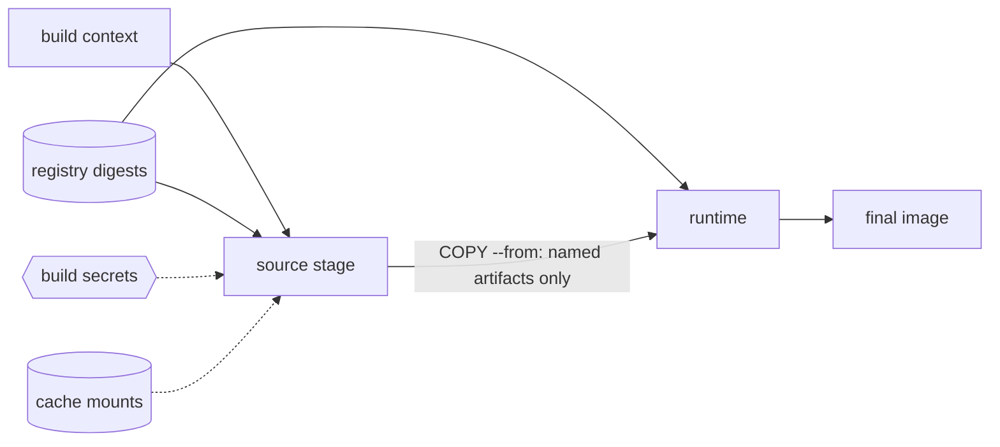

# Tiger Style for Dockerfile

**Safety > performance > developer experience.**

A practical standard for writing, reviewing, and building container image Dockerfiles on
Arch Linux. Written for the Diver language documentation directory and adapted from the
supplied Lua guide. This is an independent interpretation of
[TigerBeetle's Tiger Style](https://github.com/tigerbeetle/tigerbeetle/blob/main/docs/TIGER_STYLE.md),
not an official TigerBeetle or Docker document.

| Policy | Baseline |
| --- | --- |
| Dockerfile syntax | 1.x via `# syntax=docker/dockerfile:1`; digest-pin the syntax image for full reproducibility |
| Builder | BuildKit required (`docker buildx`); the classic builder is deprecated upstream |
| Linter | `hadolint`, zero findings; it is the gate, there is no canonical formatter |
| Base image | Distroless or minimal base preferred; every `FROM` pinned by digest |
| Runtime user | Non-root mandatory (`USER` other than root in the final stage) |
| Secrets | Never in a layer; BuildKit `--mount=type=secret` or runtime injection only |
| Examples | Stable Dockerfile 1.x / BuildKit features unless explicitly marked otherwise |
| Primary platform | Arch Linux; builder and registry assumptions recorded per image |
| Document reviewed | 2026-10-06 |

The reference module below uses only stable Dockerfile 1.x and BuildKit features and was
reviewed against the hadolint rule set and the BuildKit reference, but it was not built
for this documentation task; the sandbox has no Docker builder. Its digest placeholders
must be replaced with real digests before building. Validation details are recorded at
the end.

## Contents

- [1. Engineering contract](#1-engineering-contract)
- [2. Toolchain and build trust](#2-toolchain-and-build-trust)
- [3. Structure and naming](#3-structure-and-naming)
- [4. Schema and validation](#4-schema-and-validation)
- [5. Contracts and errors](#5-contracts-and-errors)
- [6. Bounds and layer budgets](#6-bounds-and-layer-budgets)
- [7. Resource lifecycle](#7-resource-lifecycle)
- [8. Build ordering and parallelism](#8-build-ordering-and-parallelism)
- [9. Privilege and security boundaries](#9-privilege-and-security-boundaries)
- [10. Operating-system boundaries](#10-operating-system-boundaries)
- [11. Performance and reproducibility](#11-performance-and-reproducibility)
- [12. Tests and review gates](#12-tests-and-review-gates)
- [13. Complete reference module](#13-complete-reference-module)
- [14. Neovim integration](#14-neovim-integration)
- [15. Documentation and media](#15-documentation-and-media)
- [16. Review card and validation](#16-review-card-and-validation)

## 1. Engineering contract

Correctness comes before speed. Speed comes before convenience when the tradeoff is real.
Measure that tradeoff; do not use the priority order to justify speculative complexity.

A Dockerfile is two contracts in one file: a build program that turns inputs into layers,
and a runtime declaration of what the resulting image does. The same image digest must
imply the same behavior. Every substantial image must identify:

1. Accepted inputs, rejected inputs, and the trust boundary: base images, build context,
   build arguments, registry credentials, and network access during the build.
2. Maximum work, size, and elapsed time: layer count, final image bytes, context bytes,
   and build time budget.
3. The owner of every layer, artifact, and secret: which stage produces it, which stage
   consumes it, and what crosses into the final image.
4. The point at which externally visible state changes: the push to a registry, under
   which tag and digest.
5. Failure behavior and cleanup obligations: what a failed build leaves behind, and what
   a failed container reports.
6. The evidence supporting the result: lint output, layer analysis, vulnerability scan,
   and structural tests.

A base image is a dependency like any other. An unpinned `FROM` is an unreviewed
dependency update on every build. Treat `latest` and floating tags as rejected inputs.

Use this rule for exceptions: name the rule, explain the need, bound the resulting risk,
and record a test or review condition. An exception belongs near the affected instruction
or in the image's design record. Blanket waivers are difficult to maintain.

Prefer direct instructions that a reviewer can reason about. Do not ban multi-stage
builds, heredocs, or BuildKit mounts merely because they are features. Require them to
make caching, cost, ownership, and failure clearer than the alternative.

## 2. Toolchain and build trust

Require BuildKit. The classic (non-BuildKit) builder is deprecated upstream and lacks the
mounts, secrets handling, and provenance features this guide depends on. Verify the
builder before diagnosing a build discrepancy:

```sh
docker buildx version
docker buildx inspect --bootstrap
```

Set `DOCKER_BUILDKIT=1` in environments where `buildx` is not yet the default `docker
build` backend. Record the BuildKit version alongside the image's build record when a
build behaves differently between machines.

Pin the Dockerfile syntax as the first line of every Dockerfile. The `:1` tag tracks the
stable 1.x channel; pinning its digest makes the frontend itself reproducible:

```dockerfile
# syntax=docker/dockerfile:1
```

```sh
# Resolve the digest when full pinning is required:
docker buildx imagetools inspect docker/dockerfile:1
```

Base images are executable code from a third party. Prefer official images or verified
publishers, review the base image's own Dockerfile when it is published (the
docker-library repositories publish theirs), and pin every `FROM` by digest with the tag
kept alongside as documentation of intent:

```dockerfile
ARG GO_VERSION=1.24
FROM golang:${GO_VERSION}-bookworm@sha256:PINNED_DIGEST_HERE AS builder
```

The digest is the pin; the tag names the review you performed. Refreshing a base image is
a deliberate act: update the digest, rebuild, re-scan, and record the change like any
other dependency update. A lockfile pins resolution; a digest pin does not certify the
base image as safe — the scan gates in section 12 do that job on every build.

Build arguments that select base images belong in a global `ARG` before the first `FROM`,
which is the only scope that can parameterize `FROM`. Registry authentication for private
bases belongs to the builder's credential configuration, never to an instruction in the
Dockerfile.

## 3. Structure and naming

Order instructions so a reviewer can read the image top to bottom as build phases. The
canonical order, with dependency order winning where the builder requires it:

| Phase | Instructions |
| --- | --- |
| Frontend | `# syntax=` directive (line 1, no exceptions) |
| Global parameters | `ARG` before the first `FROM` (base image selection only) |
| Base | `FROM ... AS <stage>` |
| Metadata | `LABEL` (OCI `org.opencontainers.image.*` keys) |
| Stage parameters | `ARG` scoped to the stage |
| Environment | `ENV` defaults the runtime needs |
| Shell policy | `SHELL` when the default shell behavior is wrong for this image |
| System setup | `RUN` package installation and toolchain setup |
| Source | `COPY` manifests, then dependencies, then source (least-changing first) |
| Build | `RUN` compilation, asset generation |
| Runtime assembly | `COPY --from=` artifacts into the final stage |
| Runtime declaration | `USER`, `EXPOSE`, `HEALTHCHECK`, `ENTRYPOINT`, `CMD` |

Name stages as lowercase role nouns: `deps`, `builder`, `test`, `runtime`. Never `stage1`
or `temp`. A stage name is a contract other stages and CI `--target` flags depend on.

Use absolute `WORKDIR` paths, one per stage, named for the role: `/src` for build stages,
`/app` for the runtime. Never `RUN cd ...`; hadolint rule DL3003 requires `WORKDIR` for
directory changes because each `RUN` starts in the previous working directory and a `cd`
does not survive the instruction boundary.

Keep independent `ENV`, `ARG`, and `LABEL` lines in alphabetical order, and alphabetize
package lists inside install commands. Dependency order wins only where the tool requires
it. One concern per `RUN`; use heredoc `RUN` blocks for multi-line shell so the layer
stays readable without backslash-continuation noise:

```dockerfile
RUN <<EOF
set -euo pipefail
apt-get update
apt-get install -y --no-install-recommends \
    ca-certificates \
    curl
rm -rf /var/lib/apt/lists/*
EOF
```

`ENTRYPOINT` and `CMD` use exec-form JSON notation (hadolint DL3025). Shell form wraps the
command in `/bin/sh -c`, which breaks signal delivery to PID 1 and hides the real
command from `docker inspect`. Avoid `ONBUILD` triggers: they are hidden behavior that
fires in downstream builds the reader of this file cannot see.

## 4. Schema and validation

`ARG` and `ENV` look similar and mean different things. Confusing them leaks build-time
configuration into runtime, or worse, into the image history where anyone with the image
can read it.

| Concern | `ARG` | `ENV` |
| --- | --- | --- |
| Lifetime | Build time only | Baked into the image config; visible at runtime |
| Override | `--build-arg` at build time | `-e` at run time |
| Visibility | Recorded in image history (`docker history`) | Readable via `docker inspect` by anyone with the image |
| May hold secrets | Never | Never |

Build arguments that change what the image does (feature flags, environment names,
endpoints) are undeclared runtime configuration. Prefer a small set of documented `ARG`
values for build-time selection (base image versions, toolchain variants) and `ENV` only
for defaults the container genuinely needs to run. Everything else is runtime
configuration supplied at deploy time, not baked into the image.

Treat `.dockerignore` as the validation of the build context. The build context is
untrusted input sent to the builder; `.dockerignore` decides what the Dockerfile is even
allowed to see. Every image ships one, and it is reviewed like code:

```dockerignore
.git
.github
Dockerfile
.dockerignore
*.md
.env
.env.*
```

Target stages are validated configurations, not comments. Expose `deps`, `builder`,
`test`, and `runtime` as named stages so CI builds each one explicitly with
`docker buildx build --target <stage>`. A stage that cannot be built alone is a stage
whose contract was never checked.

An image follows **validate → prepare → commit → observe**. Validate before building:
lint the Dockerfile, check the context against `.dockerignore`, resolve base digests.
Prepare fallible resources before publishing: install dependencies, compile, run the
test stage. Commit once: tag and push a single digest. Observe after: health checks and
scans confirm the published artifact. A failed validation or preparation step must not
publish anything.

## 5. Contracts and errors

A `RUN` instruction that can fail silently is a build that can lie. Every shell fragment
in a Dockerfile runs under an explicit failure policy:

```dockerfile
SHELL ["/bin/bash", "-o", "pipefail", "-c"]
```

or `set -euo pipefail` as the first line of a heredoc `RUN` block. This is hadolint rule
DL4006: without `pipefail`, a failing command in a pipeline reports success and the
build continues on a broken foundation. Never append `|| true` or `; true` to hide a
failure; if a command is allowed to fail, the justification is a comment and the
acceptable exit codes are tested explicitly.

Make each `RUN` atomic for its concern: download, verify, and install in one layer so a
failure cannot leave a half-installed tool cached as success. Anything fetched from the
network is verified against a published checksum in the same layer:

```dockerfile
RUN <<EOF
set -euo pipefail
curl -fsSL -o /tmp/tool.tar.gz "https://example.com/tool-1.2.3.tar.gz"
echo "<published-sha256>  /tmp/tool.tar.gz" | sha256sum -c -
tar -xzf /tmp/tool.tar.gz -C /usr/local/bin
rm /tmp/tool.tar.gz
EOF
```

The cache-invalidation contract is explicit: any instruction whose inputs changed
invalidates its own cache and every layer after it. Document, per image, which `COPY`
instructions are expected to invalidate often (source) and which must almost never
invalidate (dependency manifests, toolchain installs). A dependency install that
re-runs on every source edit is a broken contract; fix the `COPY` ordering (section 11),
not the cache.

Diagnose failures with full logs: `docker buildx build --progress=plain` renders every
step's output instead of the interactive summary. A build that only passes with the
interactive progress viewer is not debugged; it is hidden.

hadolint is the contract checker. Representative rules this guide relies on:

| Rule | Contract |
| --- | --- |
| DL3002 | Last `USER` must not be root |
| DL3003 | Use `WORKDIR`, not `RUN cd` |
| DL3006 | Always tag the base image explicitly |
| DL3007 | Do not use `latest` |
| DL3008 / DL3018 / DL3016 | Pin versions in `apt-get`, `apk`, `npm` installs |
| DL3009 | Delete `apt-get` lists after installing |
| DL3015 | Pass `--no-install-recommends` to `apt-get` |
| DL3020 | Use `COPY`, not `ADD`, for files and folders |
| DL3025 | Exec-form JSON notation for `CMD` and `ENTRYPOINT` |
| DL3059 | Consolidate consecutive `RUN` instructions |
| DL4006 | Set `pipefail` for shell pipelines |

Suppress a rule only at the smallest applicable scope, with a reason in a comment naming
the rule. A global ignore file that silences whole rule families is a blanket waiver.

## 6. Bounds and layer budgets

Name image budgets with units. Choose values from the actual workload and operational
constraints; the reference module's numbers are examples, not universal defaults.

| Resource | Required contract |
| --- | --- |
| Final image | Maximum bytes; measured with `dive` or `docker images` |
| Layers | Count limit; the overlayfs hard ceiling is 128 lower layers |
| Build context | Maximum bytes sent to the builder; enforced by `.dockerignore` review |
| Builder scratch | Cache and stage bytes retained between builds |
| Build time | Deadline for a clean build and for a no-op cached rebuild |
| Wasted bytes | `dive` efficiency floor; duplicated or dead files are a budget item |

A useful planning upper bound for the final image is:

$$
S_{final} \le S_{base} + \sum S_{artifact} + S_{config}
$$

where each artifact is a file deliberately copied into the runtime stage. Anything in the
final image that is not a named artifact — a package cache, a compiler, a build log —
is waste against this budget, and `dive` will show it as such.

Example budgets for a small compiled service (adjust to the workload):

| Budget | Example value |
| --- | --- |
| Final image size | <= 50 MB |
| Layers in final image | <= 10 |
| Build context | <= 5 MB |
| `dive` efficiency | >= 0.98 |
| Wasted bytes | <= 1 MB |

Enforce the efficiency and waste budgets in CI with `dive --ci` and a `.dive-ci`
configuration rather than a human eyeballing the TUI. A budget that is not gated is a
suggestion.

## 7. Resource lifecycle

> **In plain terms:** A multi-stage build is a factory with a clean room at the end. The builder stage holds all the messy tools — compilers, package managers, source code — and the final stage contains only the finished product plus the minimal runtime it needs. The only door between them is `COPY --from`, which names exactly what crosses over. If a compiler shows up in your final image, something walked through a door that should not exist.

Multi-stage builds are ownership boundaries. The builder stage owns compilation; the
runtime stage owns serving. Nothing crosses that boundary except named artifacts, and
every crossing names its owner on both sides:



Text equivalent: build secrets and cache mounts are side inputs that never become
layers. Base images arrive from the registry by digest. Only artifacts explicitly named
in a `COPY --from` instruction cross into the final image; everything else stays in its
owning stage.

Discipline for the crossing:

- `COPY --from=builder` names the stage and the exact artifact path. Never copy whole
  directories across stages when one binary or config file is the contract.
- `COPY --chown=<user>:<group>` sets ownership at copy time. A separate `RUN chown`
  duplicates the file bytes into a new layer — paying the budget twice for one decision.
- `COPY --link` creates independent layers for copied files, so a later source change
  does not invalidate the ownership and permission metadata of unchanged files.
- Temporary files (archives, package lists, intermediate objects) are removed in the
  same `RUN` instruction that created them. A file deleted in a later layer still ships
  in the earlier layer's bytes.

The final stage contains the runtime base, the named artifacts, configuration the
container needs, and nothing else. If `dive` shows a compiler, a package manager cache,
or a shell history file in the final image, the lifecycle contract is broken — fix the
stage boundary, not the budget.

## 8. Build ordering and parallelism

BuildKit builds independent stages in parallel. Do not rely on execution order between
stages that have no declared dependency; the declared dependencies are `COPY --from`,
`--mount=type=bind,from=`, and the `FROM` chain itself. If two stages must run in a
particular order, that order must be visible as an instruction, not assumed from file
position.

> **In plain terms:** A cache mount is a shared scratch disk the builder lends to a `RUN` step — package downloads, compiler caches — that evaporates when the step finishes. Unlike a layer, it never ships in the image. Think of layers as what gets packed in the shipping box and cache mounts as the tools on the workbench: they speed up the work but do not travel with the product.


Cache mounts are shared, persistent package storage that never becomes a layer. Use them
for every package manager and compiler cache in the build:

```dockerfile
RUN --mount=type=cache,target=/var/cache/apt,sharing=locked \
    --mount=type=cache,target=/var/lib/apt,sharing=locked \
    apt-get update && apt-get install -y --no-install-recommends ca-certificates
```

```dockerfile
RUN --mount=type=cache,target=/go/pkg/mod,sharing=locked \
    --mount=type=cache,target=/root/.cache/go-build,sharing=locked \
    go build ./...
```

Name each mount's `target` for the tool that owns it, and use `sharing=locked` when
parallel stages could write to the same cache. A cache mount is not a substitute for
pinning: the mount speeds up the download, the version pin decides what is downloaded.

Keep network-dependent steps explicit. Steps that must not touch the network (pure
compilation from vendored sources, checksum verification) can declare
`RUN --network=none` to make accidental network access a build failure instead of a
silent dependency. Steps that do need the network — package installs, module downloads —
are grouped so the image's network surface is countable.

Do not fight the parallelism with artificial serialization. If a build is slow, the
answers are cache mounts, better `COPY` ordering, and fewer invalidated layers — in that
order — not `--no-cache` heroics or single-stage flattening that destroys the ownership
boundaries from section 7.

## 9. Privilege and security boundaries

> **In plain terms:** Docker layers are permanent and content-addressed: once a secret is written into a layer, it exists in every copy of that image forever — on every registry and every host that pulls it. Deleting the file in a later layer does not help; the earlier layer still contains it, like tearing a page out of a book that has already been photocopied. Secrets must enter through BuildKit secret mounts, which exist only for the duration of the build step and never become part of any layer.

The security policy for an image fits in one sentence: **no secret may appear in any
layer, and the runtime must not run as root.** Everything in this section is machinery
for those two sentences. A layer, once built, is content-addressed and permanent;
anything written into one — a credential, a private key, a token — ships to every
registry and every host that pulls the image, and `docker history` will show how it got
there. Treat layer contents with the permanence they have.

Secrets enter the build only through BuildKit secret mounts, which never become layers:

```dockerfile
RUN --mount=type=secret,id=npmrc,target=/root/.npmrc,required=false \
    npm ci --prefer-offline
```

```sh
docker buildx build --secret id=npmrc,src="$HOME/.npmrc" -t example/app:ci .
```

The `required=false` flag makes the secret optional so the same Dockerfile builds in
environments without it; the build script must then handle the unauthenticated path
explicitly. Never pass a credential as `ARG` or `ENV`, never `COPY` a credential file
into the image even if a later layer deletes it, and never `echo` a secret into a
config file during the build. Trivy's secret scanner (`--scanners vuln,secret`) runs on
every built image in the gates precisely because review alone misses these.

The final stage runs as a non-root user. This is hadolint DL3002 and it is mandatory,
not advisory:

```dockerfile
USER 65532:65532
```

Create an explicit user with a fixed numeric UID in stages that have a shell, or use
the distroless `nonroot` user (UID 65532) where the base provides it. Numeric UIDs need
no `/etc/passwd` lookup and behave identically on every host. The builder stages may
run as root — that privilege is build-time only, contained by the builder, and none of
it crosses into the final image. Runtime root is the risk; build-time root is the tool.

Prefer distroless or otherwise minimal base images for the runtime stage. A base with no
shell, no package manager, and no privilege-escalation tooling shrinks the attack
surface to the application and its declared dependencies. `gcr.io/distroless/static`
suits statically compiled binaries; language-specific minimal bases (Alpine, slim
variants) are the fallback when the application needs a shell or dynamic libraries —
each addition justified in a comment, each package version pinned (DL3008/DL3018).

Do not use `ADD` for remote URLs. `ADD` fetches without checksum verification and its
behavior (URL download versus tar auto-extraction) depends on the argument, which is
exactly the kind of implicit behavior this guide rejects; hadolint DL3020 requires
`COPY`. Fetch with `curl` and verify the checksum in a `RUN` instruction (section 5),
where the failure policy is explicit.

Design the container to run with a read-only root filesystem (`docker run --read-only`
or the orchestrator equivalent). Writable paths the application needs — temp files,
caches — are declared as `tmpfs` mounts at run time, not as writable image layers.
Document every path the application writes to; an undocumented write path is a
privilege assumption waiting to break in production. Drop Linux capabilities the
application does not need at deploy time; the Dockerfile's part of that contract is to
not require any: no setuid binaries, no raw-socket tricks, no assumption of
`CAP_SYS_ADMIN`.

## 10. Operating-system boundaries

### Build context as trust boundary

The build context is the set of files the builder is allowed to see, and `docker
buildx build` transmits it to the builder before the first instruction runs. Keep it
small, keep it reviewed, and keep credentials out of it — `.dockerignore` is the
enforcement point (section 4). A context that includes `.git`, editor state, or local
secret files is not a convenience; it is an exfiltration path the moment the context
leaves the machine. Measure context size in the gates; a context that grows without a
corresponding `.dockerignore` change is a review finding.

### Host mounts

Dockerfile instructions do not mount the host filesystem. The only mounts during a
build are BuildKit's explicit `--mount=type=bind` (read-only where possible) and
`--mount=type=cache`, both declared per `RUN` instruction and gone when the instruction
finishes. Runtime volume mounts are a deploy-time concern: the Dockerfile documents
which paths expect external data (in comments and in the image documentation), but it
does not create anonymous volumes. Avoid the `VOLUME` instruction in application
images: it creates anonymous volumes on every run, cannot be unset by downstream
Dockerfiles, and turns a deployment detail into image state.

### Network during build

Package installs and module downloads need the network; compilation from vendored
sources does not. The image documents which stages need network access, and stages
that do not need it declare `RUN --network=none` so a stray download fails loudly
instead of succeeding silently. Builds that must be hermetic — release builds,
air-gapped pipelines — pass `--network=none` to the whole build and vendor every
input. A hermetic build that passes is proof the dependency list is complete; a
networked build that passes proves only that the network was up.

## 11. Performance and reproducibility

> **In plain terms:** Docker builds an image as a stack of layers, one per instruction, and it caches each layer by its inputs. Change anything in an instruction and every layer after it rebuilds from scratch — but layers before it are reused for free. That is why dependency manifests (which rarely change) are copied before application source (which changes constantly): it keeps the expensive dependency-install layer cached across most builds. Get the order backwards and every keystroke triggers a full reinstall.

Establish a correct, scannable image before tuning the build. Then make the build fast
by respecting the layer cache, which is a pure function of instruction inputs: same
inputs, same cache hit.

Order `COPY` instructions least-changing first. Dependency manifests change rarely;
application source changes constantly. The canonical sequence per stage is:

1. `COPY` dependency manifests (`go.mod`, `package.json`, `requirements.txt`).
2. `RUN` install dependencies (with cache mounts, versions pinned).
3. `COPY` application source.
4. `RUN` build.

Inverting steps 2 and 3 makes every source edit re-run the dependency install — the
most common Dockerfile performance bug, and a broken cache-invalidation contract
(section 5). `COPY --link` keeps the permission metadata of unchanged files in
independent layers so source edits do not cascade invalidation through the image.

Use cache mounts for every package manager and compiler cache (section 8). The mount
speeds up the download; the version pin decides what is downloaded. Never commit a
package cache into a layer to "save" a download — that is how stale dependencies
become permanent.

Reproducibility is a contract: rebuilding from the same inputs must produce the same
digest. The practices that establish it:

- Every `FROM` pinned by digest (section 2); tags document intent, digests decide.
- Every package install version-pinned (DL3008/DL3018/DL3016).
- Timestamps that the build embeds (archive metadata, generated files) driven by
  `SOURCE_DATE_EPOCH` rather than the wall clock.
- Compiler flags that remove host-specific paths: `-trimpath` for Go, equivalent
  deterministic-build flags per toolchain.
- No `apt-get upgrade`, no unpinned `pip install <package>`, no "latest" anywhere.

Measure, do not assume: `--progress=plain` shows which steps hit cache and which
rebuilt, and `dive` shows whether the fast build produced a fat image. A build that is
fast because it skips verification is not optimized; it is unverified.

## 12. Tests and review gates

Test the image, not the Dockerfile's line-by-line syntax. The gates run cheapest first:
lint, then build each target stage, then analyze layers, then scan, then structural
tests. A failure at any gate stops the pipeline; no gate is advisory.

```sh
hadolint Dockerfile
docker buildx build --target deps -t example/server:deps .
docker buildx build --target builder -t example/server:builder .
docker buildx build --target test -t example/server:test .
docker buildx build -t example/server:ci .
dive --ci example/server:ci
trivy image --severity HIGH,CRITICAL --scanners vuln,secret --exit-code 1 example/server:ci
container-structure-test test --image example/server:ci --config container-structure-test.yaml
```

`grype example/server:ci` is an acceptable substitute for the Trivy vulnerability scan
where the team has standardized on it; pick one scanner per pipeline and record the
choice, do not run both and compare.

`dive --ci` enforces the layer budgets from section 6 with a `.dive-ci` file:

```yaml
rules:
  lowestEfficiency: 0.98
  highestWastedBytes: 1MB
```

`container-structure-test` asserts the runtime contract structurally — files exist,
metadata is correct, commands behave:

```yaml
schemaVersion: "2.0.0"
fileExistenceTests:
  - name: "server binary exists"
    path: "/app/server"
    shouldExist: true
metadataTest:
  user: "65532"
  exposedPorts: ["8080"]
  entrypoint: ["/app/server"]
commandTests:
  - name: "healthcheck contract"
    command: ["/app/server", "-healthcheck"]
    expectedOutput: [".*ok.*"]
```

Include boundary cases in the structural tests: the healthcheck failing when the port is
occupied, the container refusing to start as root (assert the `USER` metadata), the
image containing no package manager (`command: ["which", "apt-get"]` expecting
non-zero exit). A passing scan is not a passing structural test; a passing lint is not
a passing build. Report each kind of evidence accurately.

## 13. Complete reference module

Save this fence as `Dockerfile`. It is a **template**: replace every
`@sha256:PINNED_DIGEST_HERE` placeholder with a real digest from
`docker buildx imagetools inspect <image>` before building. It demonstrates digest
pinning, stage ownership, secret mounts, cache mounts, non-root runtime, and an
exec-form healthcheck against a distroless base. It assumes a Go module with
`./cmd/server`; the binary honors a `-healthcheck` flag that exits 0 when its own
`/healthz` endpoint would answer 200.

```dockerfile
# syntax=docker/dockerfile:1
# TIGER_STYLE_DOCKERFILE reference module — TEMPLATE.
# Replace every @sha256:PINNED_DIGEST_HERE with a real digest:
#   docker buildx imagetools inspect golang:1.24-bookworm
#   docker buildx imagetools inspect gcr.io/distroless/static-debian12
# Build it:
#   docker buildx build --secret id=netrc,src="$HOME/.netrc" -t example/server:ci .

# ---------------------------------------------------------------------------
# Global arguments: base-image selection only. No secrets, no credentials,
# no flags that silently change runtime behavior.
# ---------------------------------------------------------------------------
ARG DISTROLESS_TAG=debian12
ARG GO_VERSION=1.24

# ---------------------------------------------------------------------------
# deps: dependency resolution. Manifests first; this layer stays cached while
# application source changes underneath it.
# ---------------------------------------------------------------------------
FROM golang:${GO_VERSION}-bookworm@sha256:PINNED_DIGEST_HERE AS deps
WORKDIR /src
COPY --link go.mod go.sum ./
RUN --mount=type=cache,target=/go/pkg/mod,sharing=locked \
    --mount=type=secret,id=netrc,target=/root/.netrc,required=false \
    go mod download

# ---------------------------------------------------------------------------
# builder: compilation. Root here is build-time only; the only things that
# leave this stage are the named artifacts copied below.
# ---------------------------------------------------------------------------
FROM golang:${GO_VERSION}-bookworm@sha256:PINNED_DIGEST_HERE AS builder
WORKDIR /src
COPY --link --from=deps /go/pkg/mod /go/pkg/mod
COPY --link . .
RUN --mount=type=cache,target=/go/pkg/mod,sharing=locked \
    --mount=type=cache,target=/root/.cache/go-build,sharing=locked \
    CGO_ENABLED=0 go build -trimpath -ldflags="-s -w" -o /out/server ./cmd/server

# ---------------------------------------------------------------------------
# runtime: the only stage that ships. Distroless: no shell, no package
# manager, no privilege-escalation tooling. Non-root by policy.
# ---------------------------------------------------------------------------
FROM gcr.io/distroless/static-${DISTROLESS_TAG}@sha256:PINNED_DIGEST_HERE AS runtime

LABEL org.opencontainers.image.description="Example Tiger Style service image" \
      org.opencontainers.image.licenses="Apache-2.0" \
      org.opencontainers.image.title="example/server"

WORKDIR /app
COPY --link --from=builder --chown=65532:65532 /out/server /app/server

# Numeric UID: no /etc/passwd lookup needed, identical on every host.
USER 65532:65532

EXPOSE 8080

# Distroless has no shell, so HEALTHCHECK must be exec-form against a binary.
HEALTHCHECK --interval=30s --timeout=3s --start-period=5s --retries=3 \
    CMD ["/app/server", "-healthcheck"]

ENTRYPOINT ["/app/server"]
```

The `deps` stage owns dependency resolution and nothing else; `builder` owns
compilation and produces exactly one artifact, `/out/server`; `runtime` owns serving
and receives exactly one file. The secret mount in `deps` authenticates private module
proxies without touching any layer. The cache mounts make rebuilds fast without
persisting package caches into the image. `COPY --chown` sets ownership without a
second layer, and `--link` keeps the copy independent of later source changes.
`CGO_ENABLED=0` with `-trimpath -ldflags="-s -w"` produces a static, reproducible
binary suited to the distroless static base. Nothing in the final image can open a
shell, install a package, or run as root — those capabilities were left behind in the
stages that owned them.

Standalone checks, after replacing the digest placeholders:

```sh
hadolint Dockerfile
docker buildx build --secret id=netrc,src="$HOME/.netrc" -t example/server:ci .
dive --ci example/server:ci
trivy image --severity HIGH,CRITICAL --scanners vuln,secret --exit-code 1 example/server:ci
```

## 14. Neovim integration

Place this document at `lua/config/lang/TIGER_STYLE_DOCKERFILE.md` in Diver. Markdown
is reference material; do not `require()` it from `init.lua`. The Dockerfile language
server, lint runner, and diagnostics remain their own Lua modules.

Use `dockerls` (`docker-langserver`) for completion, hover documentation, and
syntax validation of Dockerfiles in the editor. Wire `hadolint` as the linter through
the usual lint runner so diagnostics appear on save with rule codes; hadolint is the
gate, and its diagnostics are the review checklist made visible while editing.

There is no canonical Dockerfile formatter, and that is deliberate: generic formatters
mangle heredocs, line continuations, and mount syntax. Do not run one on Dockerfiles.
Formatting discipline comes from this guide's structure section and from hadolint, not
from a rewrite pass.

Keep the builder the editor assumes consistent with the builder CI uses: BuildKit via
`buildx`, the same `# syntax=` directive behavior, the same hadolint version. Compare
the editor's diagnostics with CI's before changing either to conceal a mismatch. Make
image builds deliberate: a build is an explicit command with explicit `--target`,
`--secret`, and tag arguments, never a background side effect of editing.

## 15. Documentation and media

Keep the core guide readable as plain Markdown. Use a table for comparisons, Mermaid for
stage/ownership relationships, and math only where it clarifies a bound. Every diagram
needs a textual equivalent. Code fences must identify their language and whether they
are complete, fragments, or templates.

Use relative, repository-owned images with meaningful alt text after adding the actual
asset. The following is a template, not an included image:

```markdown

```

For a trusted renderer that supports HTML video, provide controls and a fallback link.
Add the media files before inserting this template into a rendered document:

```html
<video controls preload="metadata" aria-label="Layer analysis walkthrough">
  <source src="./assets/dockerfile-dive-demo.mp4" type="video/mp4">
  <a href="./assets/dockerfile-dive-demo.mp4">Open the walkthrough video</a>
</video>
```

SVG, custom CSS, JavaScript, video, and math support depend on the renderer. Keep active
HTML and scripts disabled for untrusted documentation. Never require JavaScript to read
a safety contract. If an interactive local page is useful, maintain it as a separate
reviewed asset with a static explanation in the Markdown.

## 16. Review card and validation

Before merging:

- [ ] Every `FROM` is pinned by digest, with the tag kept as documentation of intent.
- [ ] The `# syntax=docker/dockerfile:1` directive is the first line.
- [ ] The final stage runs as a non-root user (numeric UID); builder root never crosses stages.
- [ ] No secret appears in any layer: no credential `ARG`/`ENV`/`COPY`, secret mounts only.
- [ ] `.dockerignore` exists, is reviewed, and excludes credentials, VCS state, and build outputs.
- [ ] `COPY` ordering is least-changing first; dependency installs do not re-run on source edits.
- [ ] `RUN` instructions fail loudly: `pipefail` set, no swallowed failures, checksums verified for fetched artifacts.
- [ ] `COPY` is used instead of `ADD`; no remote URLs fetched by `ADD`.
- [ ] `ENTRYPOINT`/`CMD` use exec-form JSON notation; no `ONBUILD` triggers.
- [ ] Only named artifacts cross stage boundaries via `COPY --from`, with `--chown` set at copy time.
- [ ] `HEALTHCHECK` is present and exec-form; the health contract is tested.
- [ ] Image size, layer count, and `dive` efficiency budgets are met and gated in CI.
- [ ] `hadolint` reports zero findings; `trivy`/`grype` report no unaddressed HIGH/CRITICAL.
- [ ] The container is designed for a read-only root filesystem with declared writable paths.

**Validation record:** the reference Dockerfile was reviewed against the hadolint rule
set and the BuildKit Dockerfile reference for this documentation task. It was not built:
the sandbox has no Docker builder, so `hadolint`, `docker buildx build`, `dive`,
`trivy`, and `container-structure-test` were not executed here. The digest placeholders
are intentionally non-hex (`PINNED_DIGEST_HERE`) so they fail loudly instead of
passing as real pins. These checks establish only the stated example behavior. The
user's builder version, registry credentials, base-image review, and Neovim
integration were not executed for this documentation task.

**Maintenance:** review this guide whenever the Dockerfile syntax channel, BuildKit
features, base-image policy, registry trust model, or scanner tooling changes. Keep the
rule and the evidence together. Remove obsolete workarounds when their underlying
constraint disappears.
