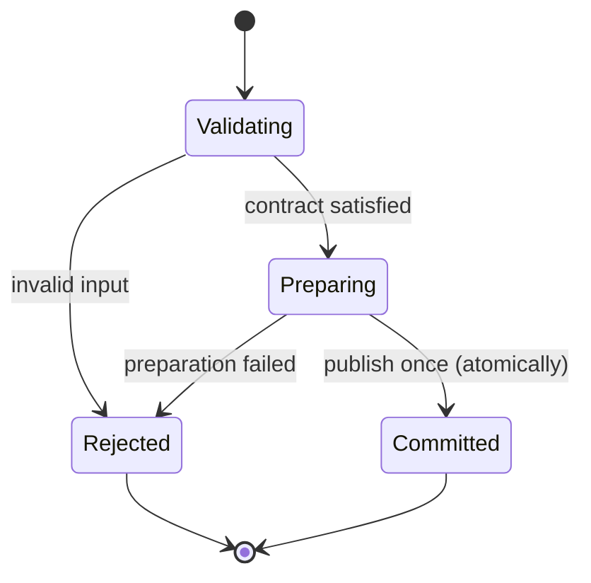

# Tiger Style for Haskell

**Safety > performance > developer experience.**

A practical coding standard for Haskell services, command-line tools, libraries, and editor
helpers on Arch Linux. Written for the Diver language documentation directory and adapted
from the supplied Lua guide. This is an independent interpretation of
[TigerBeetle's Tiger Style](https://github.com/tigerbeetle/tigerbeetle/blob/main/docs/TIGER_STYLE.md),
not an official TigerBeetle or Haskell document.

| Policy | Baseline |
| --- | --- |
| Language edition | GHC2021 |
| Compiler | GHC 9.8 or newer, pinned per project (ghcup-managed) |
| Build tool | cabal with a committed `cabal.project.freeze`; stack with a pinned resolver is the documented alternative |
| Examples | GHC2021 language only, unless an extension is named explicitly |
| Formatting | `ormolu`, default settings (`fourmolu` only with a checked-in config) |
| Function size | Review ordinary functions above 70 physical lines |
| Warning policy | `-Wall -Werror`, plus `-Wincomplete-patterns` and `-Wincomplete-uni-patterns`; never disabled |
| Primary platform | Arch Linux; portability claims require target-specific checks |
| Document reviewed | 2026-10-06 |

The edition policy pins the language, not the compiler: GHC2021 means the same source
language on GHC 9.8, 9.10, and 9.12, so the compiler version is chosen for platform and
tooling support, not for syntax. The complete reference module below uses only GHC2021
plus `CPP` for its test gate. Validation details are recorded at the end.

## Contents

- [1. Engineering contract](#1-engineering-contract)
- [2. Toolchain and build trust](#2-toolchain-and-build-trust)
- [3. Structure and naming](#3-structure-and-naming)
- [4. Types and state](#4-types-and-state)
- [5. Contracts and errors](#5-contracts-and-errors)
- [6. Bounds and arithmetic](#6-bounds-and-arithmetic)
- [7. Ownership and memory](#7-ownership-and-memory)
- [8. Control flow and concurrency](#8-control-flow-and-concurrency)
- [9. Unsafe code and foreign interfaces](#9-unsafe-code-and-foreign-interfaces)
- [10. Operating-system boundaries](#10-operating-system-boundaries)
- [11. Performance and reproducibility](#11-performance-and-reproducibility)
- [12. Tests and review gates](#12-tests-and-review-gates)
- [13. Complete reference module](#13-complete-reference-module)
- [14. Neovim integration](#14-neovim-integration)
- [15. Documentation and media](#15-documentation-and-media)
- [16. Review card and validation](#16-review-card-and-validation)

## 1. Engineering contract

Correctness comes before speed. Speed comes before convenience when the tradeoff is real.
Measure that tradeoff; do not use the priority order to justify speculative complexity.

In Haskell the contract is carried by types: total functions, explicit effects, and lawful
typeclasses. `undefined` and `error` are not values; they are deferred crashes wearing a
type signature.

Every substantial operation must identify:

1. Accepted inputs, rejected inputs, and the trust boundary.
2. Maximum work, memory, output, and elapsed time.
3. The owner of every handle, thread, transaction, and subprocess.
4. The point at which externally visible state changes (usually one STM commit).
5. Failure behavior, cancellation behavior, and cleanup obligations.
6. The evidence supporting the result: tests, measurements, or a written invariant.

The type checker does not enforce authorization, bounded queues, appropriate retry policies,
secrecy of logs, or application-level state transitions. Treat these as explicit design
obligations, exactly as in less safe languages.

Use this rule for exceptions: name the rule, explain the need, bound the resulting risk,
and record a test or review condition. An exception belongs near the affected code or in
its design record. Blanket waivers are difficult to maintain.

> **In plain terms:** A monad is a uniform interface for sequencing steps where each step can have an effect — fail, read configuration, perform I/O — without sprinkling error checks through every line. `Maybe` short-circuits on missing values, `Either` short-circuits while carrying an error message, `IO` sequences side effects in order. The `do`-notation you see everywhere is ordinary imperative-looking code the compiler desugars into these sequencing operations. You do not need the category theory; you need to know which monad your function lives in and what its short-circuit behavior is.


State the typeclass laws you rely on and test them. If your code assumes `Monoid`
identity or `Monad` associativity for a hand-written instance, a property test asserting
those laws belongs in the suite (see §12).

Effects must be explicit and singular per project: one documented approach — an explicit
transformer stack (`ReaderT Env (ExceptT AppError IO)` with `MonadReader` / `MonadError`
constraints) or one effect library (`effectful`, `eff`, `polysemy`, `fused-effects`,
`bluefin`). Do not mix two effect systems in one codebase, and do not mandate a specific
library as universal; write the tradeoffs where a new contributor will find them. See §8.

Prefer a direct implementation that a reviewer can reason about. Do not ban higher-order
abstractions, polymorphism, or laziness merely because they are abstractions. Require them
to make totality, cost, and failure clearer.

## 2. Toolchain and build trust

Pin the toolchain per project, not in the Neovim configuration, and manage it with
[ghcup](https://www.haskell.org/ghcup/), which installs matched sets of GHC, cabal,
stack, and HLS — e.g. GHC 9.8.2, cabal 3.10.3.0, HLS 2.9.0.0 (template; choose tested
versions). HLS releases support a fixed set of GHC versions; upgrading one without
checking the other breaks editor diagnostics. Record the triple when diagnosing
terminal/editor/CI discrepancies.

Declare the language edition in the package description so every build uses it:

```cabal
-- *.cabal — merge with the existing stanza; do not overwrite other settings.
cabal-version:      3.8
library
  default-language: GHC2021
  ghc-options:      -Wall -Werror -Wincomplete-patterns -Wincomplete-uni-patterns
```

Use a `cabal-version` recent enough to understand the `GHC2021` language value (3.8 is
safe on this baseline). The flags above are the minimum and are never disabled
project-wide. A suppression, if ever justified, is per-function with a comment naming
the invariant behind the missing case, plus a test that would catch the invariant
breaking.

Commit the freeze file for applications: `cabal freeze` writes `cabal.project.freeze`,
pinning every dependency version and the package index state. Review dependency changes
the way you would review code. A freeze file pins resolution; it does not certify a
dependency as safe. Libraries may also commit one so CI reproduces; Hackage ignores it.

The documented alternative is Stack: a `stack.yaml` with a pinned Stackage resolver
(`resolver: lts-23.0`, i.e. the GHC 9.8 series — pick a tested snapshot, not `nightly`)
plus the committed `stack.yaml.lock`. Do not mix cabal and Stack builds for the same
project; pick one and document the choice.

Custom `Setup.hs` files are executable code. Opening an unfamiliar repository must not
silently authorize its builds, test execution, or Template Haskell runs; audit what
builds and tests execute before running them in an untrusted checkout.

On Arch Linux, keep project compiler versions separate from rolling system updates, and
never solve a build permission problem with a privileged `cabal` or `stack` run.

## 3. Structure and naming

Use `UpperCamelCase` for modules, types, typeclasses, and data constructors; `lowerCamelCase`
for functions, values, and record fields; short lowercase names for type variables (`a`,
`m`, `s`). Names carry domain meaning and units: `maxQueueBytes`, `retryDeadlineMs`,
`requestId`. Inside a module hierarchy, name modules after the domain concept they own:
`Acme.Billing.Invoice`, not `Acme.Utils` or `Acme.Helpers`.

Give every module an explicit export list, in alphabetical order where dependencies allow.
An explicit export list is the module's public contract: it decides what is API and what
is machinery, and it keeps accidental exports out of Hackage documentation. Do not use
bare `module Foo where` in production code.

Keep visibility narrow: export the type but not its constructors when an invariant needs
guarding (see §4), export the smart constructor instead. Put the public contract before
private machinery in the file.

Give every top-level binding a type signature, exported or not. A signature is a
machine-checked contract and the cheapest documentation in the file. Consider enabling
`-Wmissing-signatures` (outside `-Wall`) to enforce this; at minimum, enforce it in
review.

Use `ormolu` as the mechanical authority; it sorts imports and normalizes layout without
configuration. Keep comments about intent, proof, and tradeoffs; remove comments that
simply narrate syntax. Review ordinary functions over 70 physical lines. Split at
meaningful contracts, not into one-use helpers that obscure a single proof.

Prefer qualified imports for everything except the Prelude and the module's own closest
collaborators. `ImportQualifiedPost` is in GHC2021, so the modern form reads naturally:

```haskell
import Data.Sequence (Seq)
import Data.Sequence qualified as Seq
import Data.Text (Text)
import Data.Text qualified as T
```

Avoid wildcard imports in production modules. Treat compiler warnings as actionable, and
suppress a particular warning only at the smallest applicable scope, with a reason. Do not
enable every warning indiscriminately and then silence the resulting noise globally.

## 4. Types and state

Represent distinct concepts with distinct types when confusing them could violate a
contract: byte offsets versus element counts, an authenticated identity versus a
user-supplied one, validated configuration versus raw configuration. A `newtype` is
zero-cost and makes the confusion a type error:

```haskell
-- | Never expose a raw primitive across a module boundary.
newtype UserId = UserId { unUserId :: Int }
  deriving stock (Eq, Ord, Show)
```

Use `newtype` for a single-field wrapper with an invariant; use `data` for sums and for
products whose fields have a joint invariant. Keep constructors private when their
relationship is the invariant and expose a smart constructor that validates
(`mkCapacity :: Int -> Either CapacityError Capacity`). Parsing and deserialization are
constructors too: they must go through the smart constructor.

Use sum types for mutually exclusive states — never boolean blindness (a `Bool` argument
or contradictory `Bool` fields). Exhaustive matching makes new states visible to
existing code, and `-Wincomplete-patterns` turns a missed case into a build failure.

For state machines, let the type system hold the state. Phantom types
(`DataKinds`/`KindSignatures` are GHC2021) make illegal transitions unrepresentable:

```haskell
data ReadMode
data WriteMode

-- | Only an open connection can be queried; closing consumes the handle.
data DbHandle (mode :: Type) = DbHandle { handleFd :: Fd }

openDb :: DbConfig -> IO (Either DbError (DbHandle mode))
closeDb :: DbHandle mode -> IO (DbHandle ClosedMode)
queryDb :: DbHandle ReadMode -> Query -> IO (Either DbError [Row])
```

A GADT is the heavier form of the same idea; reach for it only when the phantom
parameter alone cannot express the invariant.

Strictness is part of the state contract. GHC2021 enables `StrictData`: every data
constructor field is strict by default. Use an explicit lazy pattern (`~`) only
deliberately, with a comment saying why that field must stay lazy.

A state transition follows **validate → prepare → commit → observe**. In Haskell the
commit point is usually one `atomically` block: rejected validation leaves the published
`TVar` unchanged.



Text equivalent: rejected validation or preparation leaves the published state unchanged;
only successful preparation reaches the single atomic commit point.

## 5. Contracts and errors

> **In plain terms:** A total function returns a value for every possible input; a partial function crashes on some of them. `head` is partial — it explodes on an empty list — while a pattern match with a case for `[]` is total. In most languages a crash is a bug you find in testing; in a long-running Haskell service it is a dead thread and a 3 AM page. The discipline is simple: every function must say what it does with every input, and `-Wincomplete-patterns` turns a forgotten case into a build error instead of a runtime surprise.

Validate external input with ordinary control flow and return a meaningful typed error.
Reserve `error` for broken internal invariants — facts a correct implementation has
already established — never for malformed input. An attacker supplying bad bytes is not
an internal invariant failure.

| Situation | Preferred response |
| --- | --- |
| Invalid user input, protocol data, or configuration | `Either E a` with a typed error carrying bounded context |
| Failure inside `IO` with recovery by the caller | `ExceptT E IO a`, or explicit `IO (Either E a)` at boundaries |
| Expected missing value | `Maybe a`, or a domain error if absence violates the request |
| Corrupt internal relationship | `error` with a message naming the invariant (never caught) |
| Unavailable optional tool | Explicit unavailable status; no fabricated success |

`error` throws `ErrorCall`, which is technically catchable — do not catch it.
Swallowing a broken invariant turns corruption into silent wrong answers.

Every pattern match must be total. `-Wincomplete-patterns` and `-Wincomplete-uni-patterns`
are on and never disabled. When an invariant makes a case impossible, keep the case, name
the invariant in a comment, and add a test that would fail if the invariant ever broke:

```haskell
evictOldest :: Seq Entry -> Seq Entry
evictOldest entries = case Seq.viewl entries of
  Seq.EmptyL -> entries -- unreachable: callers hold at least one entry; see prop_evict
  _ Seq.:< _ -> Seq.drop 1 entries
```

Ban partial functions from production paths: `head`, `tail`, `init`, `last`, `!!`,
`fromJust`, `read`, and their cousins. Each has a total replacement — enforceable with
a lint or a pre-commit grep:

| Partial | Total replacement |
| --- | --- |
| `head` / `tail` | Pattern match, or `NonEmpty` (`Data.List.NonEmpty.nonEmpty :: [a] -> Maybe (NonEmpty a)`) |
| `fromJust` | `case` / `maybe` / `fromMaybe` with an explicit default |
| `read` | `Text.Read.readMaybe :: Read a => String -> Maybe a`, or `Safe.readMay` from the `safe` package |
| `(!!)` | `Safe.atMay` from the `safe` package, or restructure to avoid indexing |
| `fromLeft` / `fromRight` on untrusted values | `either` / explicit `case` |

In `IO`, exceptions are for exceptional conditions: resource exhaustion, async
cancellation, bugs in dependencies. Prefer `throwIO` over the lazy `throw` in `IO` code.
Catch with `try`/`catch` only at boundaries where you own the recovery, and rethrow what
you do not understand. Force pure values at boundaries with `evaluate` so their
exceptions surface where you can handle them.

Library errors must be structured enough for callers to decide what to do; preserve the
cause when adding context. Human-readable text is for people, not a stable parsing
protocol. Keep sensitive paths, credentials, and payloads out of `Show` instances and
error messages.

## 6. Bounds and arithmetic

Name resource limits with units. Choose values from the actual workload and operational
budget; the reference module's limits are examples, not universal defaults.

| Resource | Required contract |
| --- | --- |
| Input | Maximum bytes, records, nesting depth, and decoded expansion |
| Work | Maximum iterations, retries, and fan-out per request |
| Memory | Live objects, aggregate bytes, and temporary duplication |
| Output | Captured bytes and diagnostic count, including truncation behavior |
| Time | Deadline and the behavior when cancellation is not immediate |
| Concurrency | Queue capacity, active workers, and admission policy |

`Int` is fixed-width machine arithmetic; overflow wraps in practice and the language
report leaves it unspecified, so treat any overflow as a bug. The discipline: compute
sizes from untrusted input in `Integer` (arbitrary precision), range-check against
explicit bounds, and convert with `fromIntegral` only after the check. Use
fixed-width `Int32`/`Word64` from `Data.Int`/`Data.Word` for wire and disk formats.

```haskell
-- | Total conversion of a peer-supplied byte count.
checkedByteCount :: Integer -> Either RangeError Int
checkedByteCount n
  | n < 0 = Left (NegativeCount n)
  | n > fromIntegral (maxBound :: Int) = Left (CountTooLarge n)
  | otherwise = Right (fromIntegral n)
```

For floating-point input, decide whether infinities, NaNs, signed zero, denormals, and
loss of precision are allowed, and test those decisions. A tolerance must have units and
a reason.

Bound aggregate memory, not only individual objects. For workers that each retain one
input and one output, a planning upper bound is:

$$
M_{total} \le M_{shared} + W(M_{input,max} + M_{output,max} + M_{scratch,max}).
$$

This is a budget model, not an allocator measurement. Include queue storage, thunk
accumulation, thread stacks, duplicated buffers, and subprocesses in the deployed budget.

Never hold an unbounded structure in memory because the input "is usually small". For
large or unbounded data, stream it in constant memory. `conduit` is the baseline
streaming vocabulary on this policy (`streaming` and `pipes` are acceptable documented
alternatives — pick one per project):

```haskell
import Conduit

-- | Copy a file in constant memory. 'ResourceT' guarantees the handles close
-- even if the pipeline is cancelled partway through.
copyFileBounded :: FilePath -> FilePath -> IO ()
copyFileBounded src dst =
  runConduitRes $ sourceFile src .| sinkFile dst
```

Lazy `ByteString`/`Text` are the lighter alternative for chunked processing, but prefer
strict `ByteString`/`Text` plus an explicit streaming pipeline at any trust boundary
(see §8 for the lazy-I/O handle rules).

## 7. Ownership and memory

> **In plain terms:** Haskell does not compute a value until something actually needs it — instead it stores a thunk, a frozen promise to compute later that holds all its inputs alive in the meantime. A thousand unforced thunks chained together can pin a gigabyte of memory that looks like it should have been freed long ago; that is a space leak. The fix is not to abandon laziness but to force evaluation where the value is known to be needed — strict folds, strict fields, `deepseq` at thread boundaries. Laziness is the default; strictness is the deliberate, documented choice.

Haskell has no borrow checker; laziness is the memory model you must reason about. A
thunk is a deferred computation holding its inputs alive. The classic space leak is an
accumulator that builds a chain of unevaluated thunks instead of a value:

```haskell
sumLazy :: [Int] -> Int
sumLazy = foldl (+) 0 -- WRONG: thunk chain proportional to the input.

sumStrict :: [Int] -> Int
sumStrict = foldl' (+) 0 -- RIGHT: accumulator forced at each step.
```

Reach for strictness deliberately, in this order: strict data fields (the GHC2021
`StrictData` default), strict folds (`foldl'`), the primed concurrent operations
(`modifyTVar'`, `atomicModifyIORef'`), then `seq` / `$!` for single evaluation points,
then `BangPatterns` for strict function arguments. Each step needs a reason a reviewer
can check; do not sprinkle bangs to "be safe".

Know what strictness you are buying: `seq` and `$!` evaluate to weak head normal form
(WHNF) — the outermost constructor only. When a nested structure must be fully evaluated
(before handing it to another thread or storing it in a cache), use `deepseq`/`force`
from `Control.DeepSeq` with an `NFData` instance, and document why the boundary needs it.

Every handle has exactly one owner, named in a comment or a type. Ordinary resources are
acquired and released with `bracket` (or `bracketOnError` when acquisition itself can
leave partial state, and `finally` when cleanup must run regardless):

```haskell
-- | The socket closes on normal return, exception, and async cancellation.
withConnection :: Host -> (Socket -> IO a) -> IO a
withConnection host = bracket (connect host) close
```

Where `bracket` nesting would become its own bug farm (streaming pipelines), `ResourceT`
from the `resourcet` package scopes finalizers to the pipeline's lifetime: `runResourceT`
runs every registered release action even on early termination.

`Weak` references (`System.Mem.Weak`: `mkWeakPtr`, `deRefWeak`) are for caches and memo
tables: entries die when nothing else references them. A cache without an eviction
policy — size bound, TTL, or weak keys — is unbounded memory growth; name the policy.

Find leaks with evidence: build with `-prof -fprof-auto`, run with `+RTS -p -hc`, and
read the heap profile. A space leak is a steadily growing band labeled with the cost
centre that retains it. Do not "fix" a suspected leak with strictness until the profile
names the retainer.

## 8. Control flow and concurrency

Prefer early returns (`ExceptT` short-circuit, guards) and shallow branches. Loops need
a finite input bound, an explicit iteration budget, or a service lifecycle with bounded
batches and cancellation. Recursion is ordinary in Haskell, but a production loop over
untrusted input still needs a depth or count cap — a stack overflow is a denial of
service with a prettier name.

> **In plain terms:** Locks are pessimistic: each thread grabs a lock, does its work, and hopes nobody deadlocks or forgets to unlock on the exception path. STM is optimistic: each transaction reads shared variables freely, then at commit time the runtime checks whether anyone else changed what you read — if so, your transaction transparently retries from the start. No lock ordering to get wrong, no forgotten unlocks, and the type system physically prevents I/O inside a transaction. The price is that transactions must be short and retry-safe; the reward is composable concurrency without the deadlock taxonomy.


Shared mutable state goes through STM. `TVar`, `TMVar`, `TChan`, `TQueue`, and the
bounded `TBQueue` compose inside `atomically`, and the type system forbids `IO` inside a
transaction — that is the feature. Keep transactions short, and use
`retry`/`orElse`/`check` for blocking coordination rather than polling loops.

```haskell
-- | Bounded admission: producers block when full. 128 is this service's budget.
newWorkQueue :: IO (TBQueue WorkItem)
newWorkQueue = newTBQueueIO 128
```

Structured concurrency owns every thread it spawns. The `async` package is the baseline:
`withAsync` scopes a thread to a region, `race`/`concurrently` compose supervised
computations, `mapConcurrently` fans out over a bounded input. A bare `forkIO` whose
handle nobody keeps is a leaked thread; if you use one, name its owner, shutdown
signal, and exception policy in a comment.

`MVar` discipline: never `takeMVar` without a guaranteed `putMVar` on every path,
including the exception path — use the masking combinators (`withMVar`,
`modifyMVar'`) or `bracket (takeMVar v) (putMVar v)`. An `MVar` used as a mutex around
a large critical section is a throughput and deadlock review flag — prefer STM.

Never disguise dropped work as success: when a queue is full, a deadline passes, or a
stale result is discarded, record it so the caller can distinguish "done" from
"dropped".

Effects, continued from §1: the project's single documented approach applies here too.
With a transformer stack, concurrency combinators live at the bottom (`IO`) and lifting
is explicit. With an effect library, follow its documented concurrency story — do not
smuggle a second one in through `liftIO` escape hatches.

Avoid lazy I/O. `readFile` defers reading until the content is forced and keeps the
handle open — a resource leak wearing convenience syntax. Use strict
`Data.ByteString.readFile` / `Data.Text.IO.readFile` for inputs that fit the budget, or
a streaming pipeline (§6) for everything else.

Retries require a retryable error class, bounded attempts, a total deadline, and an
idempotency argument. Retrying a non-idempotent write can duplicate effects.

## 9. Unsafe code and foreign interfaces

The default is: no `unsafePerformIO`, no `unsafeDupablePerformIO`, no
`unsafeInterleaveIO` in production code. These functions lie to the type system about
purity, and the optimizer believes the lie — inlining, common-subexpression elimination,
and floating can duplicate or reorder the hidden effects. There is no module-level
`forbid` pragma for them, so the policy is enforced by review plus a CI grep gate that
must come back empty outside the allow-list:

```sh
# CI gate: any hit outside src/Ffi/AllowListed.hs fails the build.
rg -n "unsafe(PerformIO|DupablePerformIO|InterleaveIO)" --glob '*.hs' src test
```

The single narrow exception is a reviewed FFI thunk that is observably pure: a top-level
foreign call with no observable effects, marked `{-# NOINLINE #-}`, with a written purity
argument covering thread-safety and reentrancy, reviewed by a second person, and listed
in the allow-list. Global mutable state via `unsafePerformIO` + `IORef` is never
acceptable — §8 already gives you the honest version.

For FFI, declare the contract at the boundary: ABI, representation, encoding,
nullability, length units, ownership transfer, and which allocator releases the memory.
`foreign import ccall safe` may call back into Haskell and may block, at the cost of a
context switch; `unsafe` is cheaper but must not call back, must not block the
capability long, and must not raise async exceptions across the boundary. Justify the
choice in a comment at each import.

Marshalling must be total: convert C enums to Haskell sums with an explicit mapping
returning `Maybe`/`Either` for unknown values — never `fromJust` a lookup table. Keep
callbacks alive for exactly the promised period, and translate errors at the boundary
into the project's typed errors.

`Safe` Haskell (`{-# LANGUAGE Safe #-}`) is defense in depth for code that consumes
untrusted modules or plugins: it rules out the unsafe functions above and unverifiable
FFI at compile time. Consider it for plugin interfaces; it is not a substitute for the
grep gate in ordinary application code.

## 10. Operating-system boundaries

### Paths and files

`FilePath` is `String`: a bare string is not a validated path. Build paths with the
`filepath` combinators (`</>`, `takeDirectory`, `normalise`), and consider the `path`
package (`Path Abs File`, `Path Rel Dir`) where absolute-vs-relative confusion is a real
hazard — its parsers turn malformed input into `Maybe`, not exceptions. For filenames
that are not valid Unicode on POSIX, the filepath ecosystem's `System.OsPath` (`OsPath`)
carries the OS-native encoding; decode to `Text` at the boundary with an explicit error
for undecodable names.

Treat a path as a request, not authorization. String prefix checks do not establish
directory containment; canonicalization alone cannot eliminate races with concurrent
filesystem changes. Sensitive operations need a reviewed traversal and symlink policy.

Keep configuration, persistent state, and cache distinct. Respect XDG locations,
validate environment-derived paths, and use restrictive permissions when creating
secrets. Write important updates through a temporary file in the destination
filesystem, then rename at the commit point
(`System.IO.Temp.withSystemTempFile`). Bound traversal, archive extraction, and file
reads; reject entries that escape the authorized destination.

### Processes

Spawn processes with `typed-process`, never with shell interpolation. `proc` takes an
executable plus an explicit argument vector — no shell, no quoting bugs, no injection:

```haskell
import System.Process.Typed (proc, readProcessStdout_)

-- | No shell is involved: executable plus an explicit argv.
gitTopLevel :: IO ByteString
gitTopLevel = readProcessStdout_ (proc "git" ["rev-parse", "--show-toplevel"])
```

A process supervisor must bound stdout/stderr while draining both, enforce a deadline,
terminate the process group (not just the parent), and reap the child. Never pass
untrusted input through `System.Process.shell`.

### Environment and credentials

Read the environment once at startup with `System.Environment.lookupEnv`, parse every
value into a validated configuration record, and fail fast with a typed error. After
startup, business logic reads the config record — never the environment. Never log
tokens. Avoid secrets in argv (visible via `/proc`); prefer environment variables or
files with restrictive permissions, and define how credentials are loaded, scoped,
rotated, and released.

### Network

Set connection, read, and total-operation timeouts on every client (pick values from
the operational budget, not the library default). Bound redirects and response body
size. Use TLS with certificate verification enabled, and check application-level
authorization independently of transport authentication. Never log bodies or headers
that may carry credentials.

## 11. Performance and reproducibility

Establish correct behavior before tuning. Measure representative distributions, including
large valid inputs and rejected inputs. Report latency percentiles, throughput,
allocations, and peak residency when they matter. Record GHC version, flags, dataset,
and warmup alongside every number.

Profile before optimizing: build with `-prof -fprof-auto`, run with `+RTS -p`, and read
the `.prof` output. `{-# SCC "name" #-}` narrows the search; the eventlog (`-l`) plus
threadscope covers concurrency; `-ddump-stranal` shows what the strictness analyser
concluded — check the compiler's reasoning before adding bangs.

Optimize the dominant cost: fewer allocations, better locality, less duplicated work,
tighter strictness at proven boundaries. Do not assume a hand-rolled loop beats a
well-fused pipeline; measure the actual workload.

Determinism is a contract where it matters: stable diagnostics, sorted serialized keys,
repeatable tests, explicit QuickCheck seeds. Do not depend on `HashMap` iteration order.

Reproducible builds are a freeze file plus a pinned index state plus recorded tool
versions (see §2). CI builds with `--offline` against the freeze file fail loudly on
unreviewed resolution drift.

## 12. Tests and review gates

Test contracts, not the incidental line-by-line implementation. Include zero, one, exact
limit, limit plus one, invalid conversion, overflow, cancellation, stale completion, and
failure before the commit point. Assert that rejected mutations leave state unchanged.

Use property tests for invariants across many inputs: QuickCheck (`quickCheck`,
`Arbitrary`, `forAll`, `(===)`) or Hedgehog (integrated shrinking, `Gen`/`forAll`).
State the typeclass laws you rely on as properties. Keep generated work bounded and
record reproducing seeds. Separate hermetic unit tests from tests requiring network,
credentials, hardware, or services.

Run suites with HSpec (`describe`/`it`/`shouldBe`) or Tasty (`defaultMain`/`testGroup`
with `tasty-quickcheck`, `tasty-hspec`, `tasty-hedgehog` providers). Declare the suite
in the package description:

```cabal
test-suite spec
  type:             exitcode-stdio-1.0
  main-is:          Spec.hs
  hs-source-dirs:   test
  default-language: GHC2021
  ghc-options:      -Wall -Werror -threaded -rtsopts
  build-depends:    base, mylib, hspec, QuickCheck
```

Typical gates for a reviewed project (`hlint` hints are advisory — a "simplification"
can obscure a strictness boundary or a totality argument, so each is reviewed on its
merits):

```sh
cabal build --enable-tests
cabal test --test-show-details=direct
hlint src test
ormolu --mode check $(git ls-files '*.hs')
```

A passing formatter is not a passing compiler. A passing compiler is not a runtime
test. A passing unit suite does not establish whole-program security or portability.
Report each kind of evidence accurately.

## 13. Complete reference module

Save this fence as `BoundedLog.hs`: an abstract `newtype` with a smart constructor,
total functions, `Either` error handling, a state machine enforced by exhaustive
matching, STM as the single commit point, and QuickCheck properties asserting the
retention contract. GHC2021 plus `CPP` for the test gate; GHC2021's `StrictData` keeps
the fields strict. The invariant is `1 <= capacity <= 1_000_000`; appends keep the
newest `capacity` entries, and closing freezes the log.

```haskell
{-# LANGUAGE CPP #-}

-- | A bounded, thread-safe, append-only log. Every state change happens inside a
-- single STM transaction, so readers always observe a consistent snapshot.
-- 'closeLog' freezes the log: reads keep working, appends are rejected.
module BoundedLog
  ( LogCapacity
  , mkLogCapacity
  , LogError (..)
  , BoundedLog
  , newBoundedLog
  , closeLog
  , appendEntry
  , readEntries
#ifdef TESTING
  , main
#endif
  ) where

import Control.Concurrent.STM (TVar, atomically, newTVarIO, readTVar, writeTVar)
import Data.Foldable (toList)
import Data.Sequence (Seq)
import Data.Sequence qualified as Seq
import Data.Text (Text)
#ifdef TESTING
import Data.Text qualified as T
import Test.QuickCheck
  ( Arbitrary (..)
  , Property
  , chooseInt
  , conjoin
  , ioProperty
  , quickCheck
  , (===)
  )
#endif

-- | Maximum retained entries. Invariant: 1 <= capacity <= 1_000_000.
-- The constructor is private; build values with 'mkLogCapacity'.
newtype LogCapacity = LogCapacity { unLogCapacity :: Int }
  deriving stock (Eq, Ord, Show)

-- | Typed failures. 'Show' output never includes log entries.
data LogError
  = InvalidCapacity Int
  | LogClosed
  deriving stock (Eq, Show)

-- | Smart constructor: the only way to obtain a 'LogCapacity'.
mkLogCapacity :: Int -> Either LogError LogCapacity
mkLogCapacity n
  | n >= 1 && n <= maxCapacity = Right (LogCapacity n)
  | otherwise = Left (InvalidCapacity n)
  where
    maxCapacity :: Int
    maxCapacity = 1000000

-- | Internal state. 'Closed' carries the frozen entries so reads keep working.
data LogState
  = Open (Seq Text)
  | Closed (Seq Text)
  deriving stock (Eq, Show)

-- | The log: a capacity plus the mutable state. The 'TVar' is the single
-- commit point.
data BoundedLog = BoundedLog
  { logCapacity :: LogCapacity
  , logState :: TVar LogState
  }

-- | Create an empty log. Total: the capacity is already validated.
newBoundedLog :: LogCapacity -> IO BoundedLog
newBoundedLog cap = do
  stateVar <- newTVarIO (Open Seq.empty)
  pure (BoundedLog cap stateVar)

-- | Freeze the log (idempotent). Appends after this are rejected; reads work.
closeLog :: BoundedLog -> IO ()
closeLog log_ = atomically $ do
  st <- readTVar (logState log_)
  case st of
    Open entries -> writeTVar (logState log_) (Closed entries)
    Closed _ -> pure ()

-- | Append one entry, evicting the oldest when full. One STM transaction.
appendEntry :: BoundedLog -> Text -> IO (Either LogError ())
appendEntry log_ entry = atomically $ do
  st <- readTVar (logState log_)
  case st of
    Closed _ -> pure (Left LogClosed)
    Open entries -> do
      -- Invariant cap >= 1: keep the newest 'cap' entries; a non-positive
      -- drop count drops nothing (the under-capacity case).
      let cap = unLogCapacity (logCapacity log_)
          trimmed = Seq.drop (Seq.length entries + 1 - cap) (entries Seq.|> entry)
      writeTVar (logState log_) (Open trimmed)
      pure (Right ())

-- | Snapshot the current entries, oldest first. Works on closed logs.
readEntries :: BoundedLog -> IO [Text]
readEntries log_ = atomically $ do
  st <- readTVar (logState log_)
  pure $ case st of
    Open entries -> toList entries
    Closed entries -> toList entries

#ifdef TESTING
-- | Generated capacities stay inside the smart-constructor bounds.
instance Arbitrary LogCapacity where
  arbitrary = LogCapacity <$> chooseInt (1, 64)

-- | The log never holds more than @capacity@ entries; survivors are newest.
prop_retention :: LogCapacity -> [String] -> Property
prop_retention cap strs = ioProperty $ do
  let entries = map T.pack strs
  log_ <- newBoundedLog cap
  mapM_ (appendEntry log_) entries
  kept <- readEntries log_
  let expected = drop (length entries - unLogCapacity cap) entries
  pure (kept === expected)

-- | Closing freezes the log: the late append is rejected, state unchanged.
prop_close_freezes :: LogCapacity -> [String] -> Property
prop_close_freezes cap strs = ioProperty $ do
  log_ <- newBoundedLog cap
  mapM_ (appendEntry log_) (map T.pack strs)
  before <- readEntries log_
  closeLog log_
  result <- appendEntry log_ (T.pack "late")
  after <- readEntries log_
  pure $ conjoin [result === Left LogClosed, after === before]

-- | A fresh log reads empty.
prop_empty_reads_empty :: LogCapacity -> Property
prop_empty_reads_empty cap = ioProperty $ do
  log_ <- newBoundedLog cap
  kept <- readEntries log_
  pure (kept === [])

-- | Run the contract properties. Production builds never see this code.
main :: IO ()
main = do
  quickCheck prop_empty_reads_empty
  quickCheck prop_retention
  quickCheck prop_close_freezes
#endif
```

Standalone checks, after saving the fence:

```sh
# Production build: must compile warning-free with no test dependency.
ghc -XGHC2021 -Wall -Werror -c BoundedLog.hs

# Property tests: -DTESTING enables the QuickCheck gate (stm, text, containers,
# and QuickCheck must be visible, e.g. via the project's test environment).
ghc -XGHC2021 -Wall -Werror -DTESTING -main-is BoundedLog.main BoundedLog.hs \
  -o bounded_log_tests
./bounded_log_tests
```

The `LogError` constructors are exported because callers match on them to decide
recovery; the `LogCapacity` constructor stays private so the bounds invariant has one
enforcement point. A production project moves the properties into a `test-suite`
stanza (see §12) and keeps the `CPP` gate only for this standalone reference.

## 14. Neovim integration

Place this document at `lua/config/lang/TIGER_STYLE_HASKELL.md` in Diver. Markdown is
reference material; do not `require()` it from `init.lua`. Your Haskell language
configuration, LSP definitions, lint runner, and formatter remain their own Lua modules.

Serve diagnostics with `haskell-language-server` (HLS), built for the project's pinned
GHC — an HLS/GHC mismatch produces phantom errors, so compare the editor's environment
with the terminal before changing code to conceal it. HLS discovers the project through
`hie.yaml` (or its cabal/stack bios cradles); run the editor from the project root.
Format with `ormolu` (or `fourmolu` with a checked-in config) and surface `hlint` —
one owner for format-on-save and one for lint, never two runners fighting over the
buffer.

Make project execution deliberate: workspace trust gates builds, tests, Template
Haskell expansion, and debugging. Expensive checks should be cancellable and must not
block editor callbacks.

When a Haskell helper feeds Neovim diagnostics, use a versioned output schema and
bounded records. Specify byte versus character positions and zero- versus one-based
indexing. Carry buffer identity and input version through the request, and reject stale
results before publishing them. These are integration contracts, not guarantees supplied
by Haskell's types.

## 15. Documentation and media

Keep the core guide readable as plain Markdown. Write Haddock comments (`-- |`, `-- ^`)
in code; this guide stays prose. Use a table for comparisons, Mermaid for
state/ownership relationships, and math only where it clarifies a bound. Every diagram
needs a textual equivalent. Code fences name their language and whether they are
complete, fragments, or templates.

Use relative, repository-owned images with meaningful alt text after adding the actual
asset. The following is a template, not an included image:

```markdown

```

For a trusted renderer that supports HTML video, provide controls and a fallback link.
Add the media files before inserting this template into a rendered document:

```html
<video controls preload="metadata" aria-label="Bounded log walkthrough">
  <source src="./assets/haskell-log-demo.mp4" type="video/mp4">
  <a href="./assets/haskell-log-demo.mp4">Open the walkthrough video</a>
</video>
```

SVG, custom CSS, JavaScript, video, and math support depend on the renderer. Keep active
HTML and scripts disabled for untrusted documentation. Never require JavaScript to read
a safety contract. If an interactive local page is useful, maintain it as a separate
reviewed asset with a static explanation in the Markdown.

## 16. Review card and validation

Before merging:

- [ ] Inputs are validated before allocation, indexing, and mutation; `Either` carries recoverable failure.
- [ ] No partial functions (`head`, `tail`, `fromJust`, `read`, `(!!)`) in production paths.
- [ ] All pattern matches are total (`-Wincomplete-patterns`, `-Wincomplete-uni-patterns` clean under `-Werror`).
- [ ] `newtype`s and smart constructors guard domain invariants; phantom types where state matters.
- [ ] Strictness reviewed: no space leaks; the `StrictData` default is understood; `deepseq` where nested thunks escape.
- [ ] Every resource has an owner and a `bracket`/`ResourceT` cleanup path; no lazy I/O.
- [ ] STM transactions are short and `IO`-free; threads are structured (`async`); `MVar`s use masking combinators.
- [ ] No `unsafePerformIO` outside the reviewed FFI allow-list; FFI `safe`/`unsafe` justified; marshalling total.
- [ ] Paths, environment, and subprocesses validated; no shell interpolation; secrets out of argv and logs.
- [ ] Freeze file committed; toolchain versions recorded; dependency changes reviewed.
- [ ] Property tests state the laws and invariants; boundary cases covered.
- [ ] Performance claims include measurements and their environment.

**Validation record:** the `BoundedLog` module was written against the GHC2021 extension
set and reviewed by hand, including a `-Wall`-cleanliness pass over imports, bindings,
and pattern coverage in both configurations. No GHC was available on the documentation
host, so the module was not compiled and the properties were not executed here; their
agreement with the implementation was checked by reasoning (induction on the append
count for `prop_retention`). The pinned toolchain, HLS, ormolu, hlint, and Neovim
integration were not executed for this documentation task.

**Maintenance:** review this guide whenever the pinned GHC version, the freeze file,
foreign interfaces, the trust model, or the chosen effect approach changes. Keep the
rule and the evidence together. Remove obsolete workarounds when their underlying
constraint disappears.
