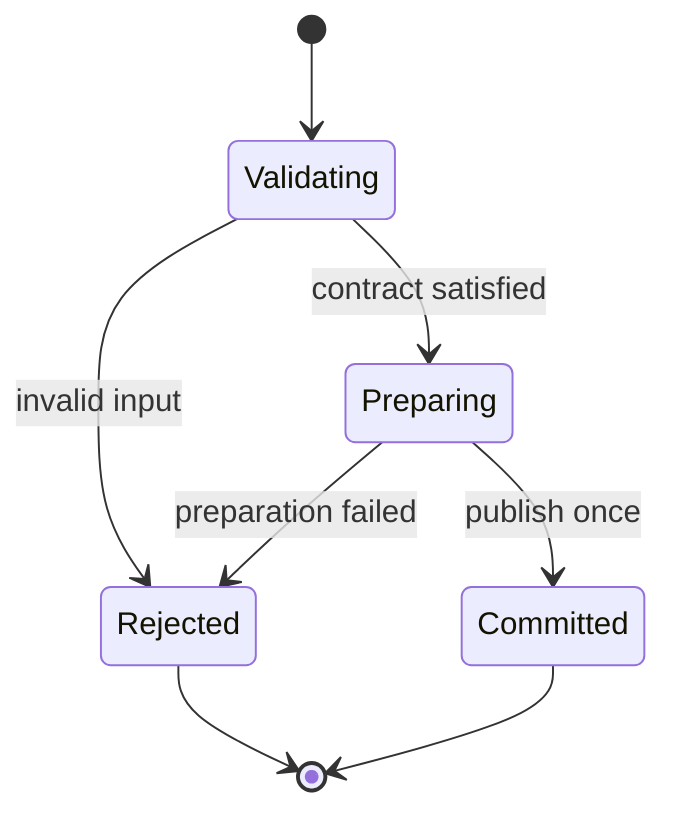

# Tiger Style for Java

**Safety > performance > developer experience.**

A practical coding standard for Java services, command-line tools, libraries, and editor
helpers on Arch Linux. Written for the Diver language documentation directory and adapted
from the supplied Lua guide. This is an independent interpretation of
[TigerBeetle's Tiger Style](https://github.com/tigerbeetle/tigerbeetle/blob/main/docs/TIGER_STYLE.md),
not an official TigerBeetle or Oracle document.

| Policy | Baseline |
| --- | --- |
| Language version | Java 21 (LTS); preview features need an explicit `--enable-preview` decision |
| Nullness | JSpecify annotations + NullAway or Error Prone; no implicit null contract |
| Analysis | Error Prone (or SpotBugs) with warnings as errors |
| Examples | Final language features unless explicitly marked preview |
| Formatting | `google-java-format`, four spaces (Google style), 100-column target |
| Function size | Review ordinary methods above 70 physical lines |
| Primary platform | Arch Linux; container/JPMS deployment notes where they change the rules |
| Document reviewed | 2026-10-06 |

Preview features (structured concurrency, the foreign-function API, scoped values) are
preview in Java 21 and need `--enable-preview` plus a removal condition if the final form
changes. The reference module below uses only final Java 21 APIs and was reviewed but not
executed for this documentation task; the sandbox has no JDK. Validation details are
recorded at the end.

## Contents

- [1. Engineering contract](#1-engineering-contract)
- [2. Toolchain and build trust](#2-toolchain-and-build-trust)
- [3. Structure and naming](#3-structure-and-naming)
- [4. Types and state](#4-types-and-state)
- [5. Contracts and errors](#5-contracts-and-errors)
- [6. Bounds and arithmetic](#6-bounds-and-arithmetic)
- [7. Ownership and memory](#7-ownership-and-memory)
- [8. Control flow and concurrency](#8-control-flow-and-concurrency)
- [9. Unsafe code and foreign interfaces](#9-unsafe-code-and-foreign-interfaces)
- [10. Operating-system boundaries](#10-operating-system-boundaries)
- [11. Performance and reproducibility](#11-performance-and-reproducibility)
- [12. Tests and review gates](#12-tests-and-review-gates)
- [13. Complete reference module](#13-complete-reference-module)
- [14. Neovim integration](#14-neovim-integration)
- [15. Documentation and media](#15-documentation-and-media)
- [16. Review card and validation](#16-review-card-and-validation)

## 1. Engineering contract

Correctness comes before speed. Speed comes before convenience when the tradeoff is real.
Measure that tradeoff; do not use the priority order to justify speculative complexity.

Every substantial operation must identify:

1. Accepted inputs, rejected inputs, and the trust boundary.
2. Maximum work, memory, output, and elapsed time.
3. The owner of every allocation, handle, task, and subprocess.
4. The point at which externally visible state changes.
5. Failure behavior, cancellation behavior, and cleanup obligations.
6. The evidence supporting the result: tests, measurements, or a written invariant.

The garbage collector and the type system are a foundation. They do not enforce
authorization, bounded queues, appropriate retry policies, secrecy of logs, or
application-level state transitions. Treat these as explicit design obligations.

Use this rule for exceptions: name the rule, explain the need, bound the resulting risk,
and record a test or review condition. An exception belongs near the affected code or in
its design record. Blanket waivers are difficult to maintain.

Prefer a direct implementation that a reviewer can reason about. Do not ban streams,
records, or pattern matching merely because they are abstractions. Require them to make
ownership, cost, and failure clearer.

## 2. Toolchain and build trust

Pin the JDK in the repository, not in the Neovim configuration. For Maven:

```xml
<!-- pom.xml — TEMPLATE; choose a tested release. -->
<properties>
  <maven.compiler.release>21</maven.compiler.release>
</properties>
```

For Gradle:

```kotlin
// build.gradle.kts — TEMPLATE.
java {
    toolchain {
        languageVersion.set(JavaLanguageVersion.of(21))
    }
}
```

`release = 21` compiles against the Java 21 API with no preview features. Enabling a
preview feature requires `--enable-preview` on `javac` and `java` alike, a named owner, a
validation path, and a removal condition for when the feature finalizes. Do not enable
preview casually: preview APIs can change incompatibly between releases.

Record `java -version` and `mvn -version` (or the Gradle toolchain resolution) when
diagnosing discrepancies between terminal, editor, and CI. On Arch Linux, keep project JDK
versions separate from rolling system updates; the `jdk21-openjdk` package tracks the
latest 21 update, which is fine for the 21 baseline but must be recorded.

Commit dependency lockfiles where the build supports them (`mvnw` wrapper plus a lock via
the `maven-lockfile` plugin, or Gradle's `dependency-locking`). Review dependency
versions, licenses, and native artifacts on every change. A lockfile pins resolution; it
does not certify a dependency as safe.

Build plugins and annotation processors are executable code. Opening an unfamiliar
repository must not silently authorize its builds, processor execution, tests, or debugger
launch. Apply the same workspace trust decision in the editor and the terminal. Use
ordinary user privileges for builds. Never solve a build permission problem with a
privileged Maven or Gradle run.

Static analysis is part of the build, not an editor adornment. Error Prone runs as a
`javac` plugin and fails the build on its findings; SpotBugs runs on bytecode after
compilation. Pick one as the build gate and keep the editor's diagnostics consistent with
it. NullAway (an Error Prone plugin) enforces JSpecify nullness annotations at compile
time.

## 3. Structure and naming

Use `UpperCamelCase` for types; `lowerCamelCase` for methods, fields, and locals;
`UPPER_SNAKE_CASE` for constants. Package names are lowercase, reversed domain:
`ai.qompass.diver.lang`. Names carry domain meaning and units: `outputBytesMax`,
`deadline`, `retryCount`, `queueCapacity`, `elapsedMs`.

Prefer named options types to ambiguous boolean arguments. A call such as
`openCache(path, true, false)` hides policy. Use a builder or a parameter object with
named setters when the choices are independently meaningful.

Keep visibility narrow: `private` first, then package-private, then `protected`, then
`public` when a real external API requires it. Put the public contract before private
machinery. Split types around state ownership and domain responsibilities, not an
arbitrary line count. Prefer package-private top-level types in the same file for
single-file implementation details only when the file stays coherent; otherwise use
separate files — one public type per file is the Java convention.

Use the formatter as the mechanical authority. Keep comments about intent, proof, and
tradeoffs; remove comments that simply narrate syntax. Review ordinary methods over 70
physical lines. Split at meaningful contracts, not into one-use helpers that obscure a
single proof.

Use explicit imports, alphabetical, no wildcards in production code. `var` is permitted
for locals where the type is obvious from the initializer (`var buffer = new byte[4096]`);
it is not permitted for fields, parameters, or return types, and never where it hides an
important width or nullability. Do not annotate every obvious local merely to make the
file longer.

A small reviewed `.editorconfig` plus the formatter establishes the shared baseline.
`google-java-format` is opinionated; its AOSP variant uses 4-space continuation indents
where the Google style uses 8. Pick one per repository and record the choice.

Treat analyzer findings as actionable. Suppress a particular check only at the smallest
applicable scope with `@SuppressWarnings` plus a justification comment. Do not suppress
whole categories globally to silence noise.

> **In plain terms:** A sealed hierarchy is a closed menu: the interface declares exactly which classes may implement it, and the compiler refuses to compile a `switch` that doesn't handle all of them. This turns "someone added a new state and forgot to update the handlers" from a production incident into a build error. It's the type system doing code review before the code review.


## 4. Types and state

Represent distinct concepts with distinct types when confusing them could violate a
contract: byte offsets versus element counts, authenticated identity versus user-supplied
identity, validated configuration versus raw configuration. A `record` with a validated
compact constructor is the usual vehicle:

```java
public record Port(int value) {
    public Port {
        if (value < 1 || value > 65535) {
            throw new IllegalArgumentException("Port must be 1-65535, got: " + value);
        }
    }
}
```

The compact constructor runs on every construction path, including the canonical one, so
the invariant cannot be bypassed by ordinary construction. Deserialization frameworks can
bypass constructors; validate after deserialization or deserialize into a DTO and convert
through the validated factory.

Use sealed hierarchies for mutually exclusive states. A `switch` with pattern matching
over a sealed type is checked for exhaustiveness by the compiler; adding a permitted
subtype breaks compilation at every unhandled switch, which is exactly the visibility you
want:

```java
public sealed interface Session permits ActiveSession, ClosedSession, FailedSession {}

public String describe(Session session) {
    return switch (session) {
        case ActiveSession a -> "active since " + a.startedAt();
        case ClosedSession c -> "closed: " + c.reason();
        case FailedSession f -> "failed: " + f.error().getMessage();
    };
}
```

No `default` branch is needed when the switch is exhaustive, and adding one would silence
the exhaustiveness check — prefer the compiler error. Avoid parallel `boolean` flags
(`started`, `finished`, `failed`) that can contradict one another.

Java has no language-level nullable reference types. The null contract is expressed with
JSpecify annotations (`org.jspecify.annotations.Nullable`) and enforced by NullAway or
Error Prone at compile time. Annotate deliberately: an unannotated type in a
`@NullMarked` package is non-null by default, which is the stance this guide recommends —
annotate `@Nullable` only where null is legitimate:

```java
@NullMarked
public final class Queue {
    // Never null: no annotation needed under @NullMarked.
    public void enqueue(String item) {
        Objects.requireNonNull(item, "item");
    }

    // May legitimately be absent.
    public @Nullable String peek() { ... }
}
```

`Objects.requireNonNull` is the standard trust-boundary check; prefer it over hand-rolled
null checks that vary by file. `Optional` is a return-type idiom for "absent is a normal
answer", not a field type, not a parameter type, and never serialized. Do not call
`Optional.get()` without `isPresent()`; prefer `orElseThrow`, `map`, or `ifPresent`.

A state transition follows **validate → prepare → commit → observe**. Validate before
mutation; prepare fallible resources before publishing new state. If rollback is
impossible, document partial progress and return enough information for the caller to
recover safely.



Text equivalent: rejected validation or preparation leaves the published state unchanged;
only successful preparation reaches the commit point.

## 5. Contracts and errors

Java distinguishes checked exceptions (declared, must be handled: `IOException`) from
unchecked exceptions (programming errors: `IllegalArgumentException`,
`IllegalStateException`, `NullPointerException`). Validate external input and throw the
specific unchecked exception that names the violated contract; use checked exceptions for
environmental failures the caller can plausibly recover from.

| Situation | Preferred response |
| --- | --- |
| Invalid argument | `IllegalArgumentException` (or `Objects.requireNonNull`) |
| Invalid object state for the call | `IllegalStateException` |
| Environmental failure (I/O, network) | Checked exception (`IOException`) or a domain checked exception |
| Expected missing value | `Optional` return, or `@Nullable` with documented semantics |
| Corrupt internal relationship | `assert` or explicit `IllegalStateException` |
| Unavailable optional tool | Explicit unavailable status; no fabricated success |

Assertions (`assert`) are disabled by default at runtime and enabled with `-ea`; never use
them for required validation or mutation. They document invariants for readers and for
test runs with assertions enabled.

Do not wrap checked exceptions in `RuntimeException` merely to avoid declaring them; the
declaration is the contract. Where a functional interface (e.g. `Function`, `Consumer`)
cannot throw checked exceptions, convert at the boundary with a documented unchecked
wrapper — sneaky-throw generics tricks hide the contract and are banned by this guide.

Preserve the cause with exception chaining (`new DomainException(message, cause)`).
Human-readable messages are for people, not a stable parsing protocol. Keep sensitive
paths, credentials, and payloads out of default messages.

Do not use exceptions for ordinary control flow. When a method can fail routinely
(parsing, lookup), offer a result-returning variant (`Optional`, a result record, or a
`boolean` with an out-style holder) and keep the throwing variant thin.

Avoid catching `Exception` or `Throwable` except at a deliberate top-level boundary
(service loop, request handler) that logs and converts. Do not swallow exceptions: an
empty `catch` hides failure. If an operation is intentionally best-effort, record the loss
in a counter or log. Never catch `InterruptedException` and continue as if nothing
happened: restore the interrupt status with `Thread.currentThread().interrupt()` and
propagate, or allow the method to throw it.

Resources are closed deterministically with try-with-resources; the resource must
implement `AutoCloseable`. A `close()` that throws a checked exception forces handling at
every use site — prefer unchecked exceptions from `close()` unless the failure is
routinely recoverable. Do not depend on finalizers or `Cleaner` for normal-path cleanup;
`Cleaner` is a safety net for missed closes, not a disposal strategy.

> **In plain terms:** Java integers wrap silently on overflow — `Integer.MAX_VALUE + 1` is a negative number, no exception, no warning, just wrong. `Math.addExact` and friends exist precisely because "silently wrong" is the worst failure mode in financial, sizing, and security-sensitive arithmetic. Use the `Exact` variants at every trust boundary; save the raw operators for places where wraparound is the documented intent, not an accident.


## 6. Bounds and arithmetic

Name resource limits with units. Choose values from the actual workload and operational
budget; the reference module's limits are examples, not universal defaults.

| Resource | Required contract |
| --- | --- |
| Input | Maximum bytes, records, nesting depth, and decoded expansion |
| Work | Maximum iterations, retries, and fan-out per request |
| Memory | Live objects, aggregate bytes, and temporary duplication |
| Output | Captured bytes and diagnostic count, including truncation behavior |
| Time | Deadline and the behavior when cancellation is not immediate |
| Concurrency | Queue capacity, active workers, and admission policy |

Integer overflow in Java is silent for `int` and `long` (`+`, `-`, `*` wrap). Use the
`Math.*Exact` family (`addExact`, `subtractExact`, `multiplyExact`, `toIntExact`) at trust
boundaries where overflow must become a recoverable `ArithmeticException` instead of a
wrong size:

```java
// Allocation sizes computed from external input must not wrap.
int total;
try {
    total = Math.addExact(headerLen, Math.multiplyExact(count, recordLen));
} catch (ArithmeticException e) {
    throw new IllegalArgumentException("Dimensions overflow int range", e);
}
```

`Math.toIntExact(long)` is the checked narrowing conversion; a bare `(int)` cast on a
`long` from external input is a latent truncation bug. Validate an index range without
first computing a possibly overflowing end:

```java
// Returns false for an invalid or unrepresentable range.
static boolean tryGetEnd(int offset, int count, int length, int[] endOut) {
    if (Integer.compareUnsigned(offset, length) > 0) {
        return false;
    }
    int remaining = length - offset; // offset <= length, no overflow
    if (Integer.compareUnsigned(count, remaining) > 0) {
        return false;
    }
    endOut[0] = offset + count; // count <= remaining proves no overflow
    return true;
}
```

`Integer.compareUnsigned` turns negative values into large positives so one comparison
rejects them — the standard unsigned-comparison idiom for range checks.

For floating-point input, decide whether infinities, NaNs, signed zero, and loss of
precision are allowed. Test those decisions. A tolerance must have units and a reason; a
large arbitrary epsilon can hide an algorithmic error. Prefer `BigDecimal` for money, with
an explicit `RoundingMode`.

Bound aggregate memory, not only individual objects. For workers that each retain one input
and one output, a planning upper bound is:

$$
M_{total} \le M_{shared} + W(M_{input,max} + M_{output,max} + M_{scratch,max}).
$$

This is a budget model, not a heap measurement. Include queue storage, thread stacks
(platform threads default to ~1 MB of virtual stack each; virtual threads are cheap),
duplicated buffers, direct (`ByteBuffer.allocateDirect`) memory outside the heap, and
subprocesses in the deployed budget.

## 7. Ownership and memory

The GC owns managed memory; you own the *policy* around it. Borrow views for inspection;
take ownership (arrays, `ByteBuffer`, `MemorySegment`) only when retaining the buffer is
part of the contract.

Prefer `byte[]` slices by offset/length or `ByteBuffer` views over copying. `ByteBuffer`
has two flavors: heap buffers (`allocate`) live on the GC heap; direct buffers
(`allocateDirect`) live outside it and are freed when the buffer becomes unreachable (plus
an explicit `Cleaner` path in newer JDKs). Direct buffers suit long-lived I/O buffers;
they are expensive to allocate, so pool them. Do not allocate a direct buffer per request.

Avoid pinning objects for longer than a single native call. The foreign-function API
(preview in Java 21, final in Java 22) provides `Arena`-scoped off-heap segments with
explicit lifetimes — prefer arenas over `sun.misc.Unsafe`, which is unsupported internal
API and banned by this guide outside a separately reviewed compatibility shim:

```java
// Foreign-function API (preview in 21; final in 22). Arena bounds the lifetime.
try (Arena arena = Arena.ofConfined()) {
    MemorySegment segment = arena.allocate(1024);
    // ... Linker.downcallHandle(...).invoke(segment) ...
} // segment is invalidated here; use-after-close fails fast
```

The arena's `try`-with-resources scope is the ownership contract: the segment cannot
outlive it, and use-after-close throws instead of corrupting memory.

Treat boxing as explicit cost in hot paths: `Integer`/`Long` in collections or streams
allocate per element; prefer primitive arrays, `IntStream`, or specialized libraries.
`String` concatenation in a loop allocates per iteration; use `StringBuilder` or
`String.join`. String deduplication (`-XX:+UseStringDeduplication`, G1 only) is an
operational tuning, not a substitute for avoiding the garbage.

`ThreadLocal` is shared mutable state with lifecycle hazards in pooled-thread
environments: values can leak across requests and prevent class unloading. Prefer
`ScopedValue` (preview in 21) for request-scoped immutable context, or pass the context
explicitly. If `ThreadLocal` is unavoidable, remove in a `finally`.

Soft, weak, and phantom references are GC-interaction machinery for caches and cleanup,
not general-purpose tools. A `WeakHashMap` cache without a size bound is still unbounded
in the short term; bound caches explicitly (Caffeine is the established library).

> **In plain terms:** A platform thread is expensive — megabytes of stack, OS-scheduled — so the old rule was to pool a few and never block them. A virtual thread is cheap enough to create one per task, which inverts the economics: blocking code becomes fine again, and the contortions of reactive frameworks become optional. The catch is pinning: a `synchronized` block on a virtual thread can pin its carrier, quietly reintroducing the scarcity you thought you'd escaped — prefer `ReentrantLock`, which doesn't.


## 8. Control flow and concurrency

Prefer early returns and shallow branches. Loops need a finite input bound, an explicit
iteration budget, or a service lifecycle with bounded batches and cancellation. Use an
explicit stack with a depth cap instead of recursion in production paths under this policy.

A service loop may be intentionally long-lived. Each turn must still bound work and yield
control. Record when new work is rejected, delayed, or dropped. Never disguise dropped work
as successful completion.

Virtual threads (final in Java 21) change the economics of blocking: create a virtual
thread per task with `Thread.ofVirtual()` or `Executors.newVirtualThreadPerTaskExecutor()`
and write straightforward blocking code. The old "never block a pooled thread" discipline
still applies to *platform* threads and to shared scarce resources (locks, semaphores),
but a virtual thread blocked on I/O simply unmounts its carrier:

```java
try (var executor = Executors.newVirtualThreadPerTaskExecutor()) {
    for (WorkItem item : items) {
        executor.submit(() -> process(item));
    }
} // close() waits for all submitted tasks: structured lifetime
```

Two caveats specific to JDK 21. First, `synchronized` blocks and methods *pin* the
carrier thread for their duration, defeating the scalability benefit; prefer
`ReentrantLock` (or `StampedLock` for read-heavy state) in code that runs on virtual
threads. Second, `ThreadLocal` does not migrate across the unmount/remount cycle
predictably — see section 7. Both are reasons to keep concurrency primitives explicit
and reviewed.

Structured concurrency (preview in Java 21, `StructuredTaskScope`) treats a group of
subtasks as one unit: if any fails or the deadline expires, the rest are cancelled, and
the scope waits for all of them before returning. It is the structured replacement for
fire-and-forget `submit` plus manual bookkeeping. Using it requires `--enable-preview`
on 21 with the removal condition recorded.

For classic executors, always bound the queue: `new ThreadPoolExecutor(n, n, 0L,
TimeUnit.MILLISECONDS, new ArrayBlockingQueue<>(capacity), handler)` with an explicit
`RejectedExecutionHandler` (`AbortPolicy`, `CallerRunsPolicy`, or a custom recording
handler). An unbounded `LinkedBlockingQueue` with a fixed pool silently accumulates work
until the heap gives out. Shut executors down explicitly (`shutdown()`, then
`awaitTermination` with a deadline, then `shutdownNow()`); never rely on GC.

`CompletableFuture` composition needs the same discipline: bound the executor it runs on,
handle exceptions in the pipeline (`exceptionally`, `handle`) rather than letting them
vanish, and prefer `join()` (unchecked `CompletionException`) over `get()` (checked
`ExecutionException` + `InterruptedException`) only where the exception contract is
documented. A future that nobody observes can fail silently — attach handling or record
the future.

Cancellation in Java is cooperative: interrupt the thread (`Future.cancel(true)`) and have
blocking code respond to interruption. `InterruptedException` clears the interrupt flag;
restore it (`Thread.currentThread().interrupt()`) when you cannot propagate. Check
`Thread.currentThread().isInterrupted()` in long loops.

Retries require a retryable error class, bounded attempts, a total deadline, and an
idempotency argument. Retries after a possibly successful write can duplicate effects.
Resilience4j is the established library; if you hand-roll retry, the policy above is still
mandatory.

> **In plain terms:** Java deserialization is famously a remote-code-execution vending machine: handing untrusted bytes to `ObjectInputStream` lets the sender choose which classes get instantiated. `ObjectInputFilter` with an allow-list flips this to deny-by-default — only the classes you name may materialize. The Foreign Function & Memory API has the same shape of risk at the native boundary: an `Arena` scopes native memory to a lifetime the GC understands, so a forgotten `free` becomes a compile-time structure instead of a leak.


## 9. Unsafe code and foreign interfaces

There is no `unsafe` keyword in Java; the hazard surface is `sun.misc.Unsafe`,
serialization gadgets, deserialization of untrusted data, and native interop. Ban
`sun.misc.Unsafe` outside a separately reviewed compatibility shim with a removal
condition — it bypasses every safety property the platform provides, and its methods can
change or disappear without notice.

The supported native-interop path is the foreign-function and memory API
(`java.lang.foreign`; preview in Java 21 via JEP 442, final in Java 22 via JEP 454).
Define the ABI explicitly: function descriptors (`FunctionDescriptor`), layouts
(`ValueLayout.JAVA_INT`, struct layouts with explicit padding), string encoding, and who
frees what. Keep segments alive for exactly the promised period with `Arena` scoping, as
shown in section 7. Translate errors at the boundary using the agreed foreign
representation (`errno` capture immediately after the call, before any other native call
clobbers it).

JNI remains supported but is the legacy path: prefer the FFM API for new interop. If JNI
is required (an existing native library with a JNI surface), keep the JNI boundary thin,
validate every array length and string conversion on entry, and never let a Java exception
propagate through native frames — check `ExceptionOccurred` after each upcall-sensitive
sequence or use `PushLocalFrame`/`PopLocalFrame` discipline for local references.

Deserialization is a trust boundary. Java native serialization (`ObjectInputStream`) of
untrusted data is a known remote-code-execution vector: do not deserialize untrusted
streams with it, period. Use a data format with a schema (JSON with Jackson and explicit
type registration, protobuf) and validate after parsing. If `ObjectInputStream` is
unavoidable, install an `ObjectInputFilter` (`setObjectInputFilter`) that allow-lists
classes and bounds depth, references, and array sizes:

```java
ObjectInputFilter filter = ObjectInputFilter.Config.createFilter(
    "com.example.dto.*;java.base/*;!*");
in.setObjectInputFilter(filter);
```

The `!*` rejects everything not explicitly allowed. Test the filter with adversarial
payloads, not only happy-path data.

Do not expose wrappers that accept lengths or offsets without proving the invariants
their internal native code requires. Add adversarial tests to the wrapper, not only happy
path tests to the native routine.

## 10. Operating-system boundaries

### Paths and files

Treat a path as a request, not authorization. String prefix checks do not establish
directory containment. Resolve with `Path.toRealPath()` (which resolves symlinks; decide
explicitly whether symlinks are followed) and verify containment against the authorized
root:

```java
Path root = Path.of("/srv/data").toRealPath();
Path candidate = root.resolve(userSupplied).normalize();
if (!candidate.startsWith(root)) {
    throw new SecurityException("Path escapes authorized root");
}
```

`normalize()` alone does not resolve symlinks; `toRealPath()` does. Choose deliberately
and document the symlink policy.

Keep configuration, persistent state, and cache distinct. Respect XDG conventions on Linux
(`XDG_CONFIG_HOME`, `XDG_DATA_HOME`) or `user.home`-derived locations; do not hard-code
layouts. Create secret files with restrictive POSIX permissions
(`Files.createFile(path, PosixFilePermissions.asFileAttribute(...))`) — setting
permissions after creation leaves an exposure interval.

Write important updates through a temporary file in the destination directory
(`Files.createTempFile(dir, prefix, suffix)`), then move atomically with
`Files.move(src, dst, StandardCopyOption.ATOMIC_MOVE)`. Atomic visibility and crash
durability are different requirements: force the file content and directory entry
(`FileChannel.force(true)`) as required by the durability contract. Bound directory
traversal (`Files.walk` with a depth and a file-count cap), archive extraction, and
decompression. Reject archive entries that escape the authorized destination (Zip Slip).

Use `java.nio` channels and `Files.newInputStream`/`newOutputStream` for I/O; blocking
I/O on virtual threads is cheap, on platform threads it is a scalability tax — know
which thread you are on. Never use `Files.readAllBytes` on unbounded or network-derived
input; bound the size first.

### Processes

Pass an executable and separate argument values with `ProcessBuilder(String...)`; it does
not invoke a shell. Keep the executable choice, working directory (`.directory(...)`),
and environment (`.environment()`) explicit; arguments can still trigger the target
program's own dangerous options:

```java
Process process = new ProcessBuilder("/usr/bin/tool", "--input", userSuppliedPath)
    .redirectErrorStream(true)
    .start();
```

A process supervisor must bound stdout and stderr while draining both (merge with
`redirectErrorStream(true)` or read both concurrently; a full pipe buffer deadlocks the
child), enforce a deadline (`waitFor(timeout, unit)`), destroy forcibly on expiry
(`destroyForcibly()` plus descendants via `process.toHandle().descendants()`), and
observe the exit value. `Process` does not kill descendants by default.

### Network and credentials

Set connection, read, and overall operation budgets (`HttpClient.Builder` with
`connectTimeout`, per-request `timeout`). Reuse one long-lived `HttpClient`; it pools
connections. Bound redirects (`followRedirects`) and response expansion — never
`BodyHandlers.ofString()` on an unbounded response; use `ofInputStream` with a counted
read. TLS verification is on by default; do not disable it. Check application
authorization independently of successful transport authentication.

Never log tokens or full credential-bearing URLs. Avoid secrets in process arguments,
which are observable to other local processes. Load credentials from the environment or a
secret store at startup, scope them narrowly, and do not invent a home-grown
cryptographic scheme; use `java.security` primitives (`SecureRandom`, `MessageDigest`,
`javax.crypto`) with documented parameters.

## 11. Performance and reproducibility

Establish correct behavior before tuning. Measure representative distributions, including
large valid inputs and rejected inputs. Report latency percentiles, throughput,
allocations, and peak memory when they matter. Record JDK version, GC, flags, dataset, and
warmup. JMH is the standard microbenchmark harness; its reports include the environment
precisely so results are comparable. Never benchmark without warmup — the JIT needs it,
and dead-code elimination will happily optimize away a benchmark that discards results
(consume results with a JMH `Blackhole`).

Optimize the dominant cost. Prefer fewer allocations, better locality, and less duplicated
work before exotic tricks. Do not assume a manual loop outperforms a stream; measure the
actual workload. Streams have per-element overhead that matters in tight numeric loops
and vanishes in I/O-bound pipelines.

Choose the garbage collector deliberately: G1 is the default and suits most services;
ZGC and Shenandoah target low pause times at some throughput cost. Record the choice and
the pause-time budget it serves. Size heaps from the section-6 budget, not from
machine RAM; an oversized heap hides leaks and lengthens pauses.

Determinism is a contract where it matters: stable diagnostics, sorted serialized keys,
repeatable tests, and explicit seeds. Do not depend on `HashMap` iteration order. Parallel
stream reductions over floating point may change rounding; document the permitted
numerical variation.

For deployment, `jlink` builds a minimal runtime image containing only the modules the
application needs, and `jpackage` wraps it for distribution. Both shrink the attack
surface and the download. Test the linked image, not just the classpath build: module
boundaries (`exports`/`opens`) and resource loading behave differently under `jlink`.
Class-data sharing (`-Xshare:on` with an application class-data archive) improves startup;
measure it rather than assuming.

## 12. Tests and review gates

Test contracts, not the incidental line-by-line implementation. Include zero, one, exact
limit, limit plus one, invalid conversion, overflow, cancellation, stale completion, and
failure before the commit point. Assert that rejected mutations leave state unchanged.

Use property tests (jqwik) for invariants across many inputs. Keep generated work bounded
and record reproducing seeds. Separate hermetic unit tests from tests requiring network,
credentials, hardware, or services (JUnit 5 `@Tag("integration")` plus a separate
Surefire/Failsafe execution).

Typical gates for a reviewed Maven project:

```sh
mvn -B -DskipTests=false verify
```

with `google-java-format` validation bound to the `validate` phase, Error Prone active in
`compile`, and JaCoCo coverage thresholds enforced in `verify`. For Gradle:

```sh
./gradlew build
```

with the `spotless` plugin (`ratchetFrom` the main branch so only changed files are
checked), Error Prone via the `net.ltgt.errorprone` plugin, and test tasks configured
with JUnit 5. Audit what builds and tests execute before running them in an untrusted
checkout — plugins and annotation processors are code.

Use JUnit 5 (Jupiter) with AssertJ assertions; AssertJ's fluent assertions produce better
failure messages than JUnit's bare asserts. Name tests for the contract they verify:
`tryWrite_overCapacity_rejectsWithoutMutation`, not `test1`. Keep one logical assertion
focus per test.

A passing formatter is not a passing compiler. A passing compiler is not a runtime test.
A passing unit suite does not establish whole-program security or portability. Report each
kind of evidence accurately.

## 13. Complete reference module

Save this fence as `BoundedBuffer.java`. It demonstrates a validated record-style
invariant, bounded copying with rejection-without-mutation, and the `Optional`-free
`Try`-style result record. It allocates only its backing array and uses no preview APIs.

The invariant is `0 <= size <= capacity`; `tryWrite` first proves
`value.length <= capacity - size`. Only then is the copy performed and the public size
committed. Clearing changes logical size; it does not erase previous bytes.

```java
// BoundedBuffer.java — compile: javac BoundedBuffer.java && java -ea BoundedBuffer
import java.util.Arrays;
import java.util.Objects;

/**
 * Fixed-capacity byte sink. Invariant: 0 &lt;= size() &lt;= capacity().
 * Rejected writes leave the buffer entirely unchanged.
 */
public final class BoundedBuffer {
    private final byte[] bytes;
    private int size;

    public BoundedBuffer(int capacity) {
        if (capacity < 0) {
            throw new IllegalArgumentException("Capacity must be >= 0, got: " + capacity);
        }
        this.bytes = new byte[capacity];
        this.size = 0;
    }

    public int capacity() {
        return bytes.length;
    }

    public int size() {
        assert size >= 0 && size <= bytes.length : "invariant violated";
        return size;
    }

    public int remaining() {
        return capacity() - size();
    }

    /** Defensive copy of the logical contents. */
    public byte[] toByteArray() {
        return Arrays.copyOf(bytes, size);
    }

    /** Result of a write attempt: accepted, or rejected with the reason. */
    public record WriteResult(boolean accepted, int rejectedBytes) {
        public WriteResult {
            if (rejectedBytes < 0) {
                throw new IllegalArgumentException("rejectedBytes must be >= 0");
            }
        }

        public static WriteResult accepted() {
            return new WriteResult(true, 0);
        }

        public static WriteResult rejected(int bytes) {
            return new WriteResult(false, bytes);
        }
    }

    /**
     * Appends {@code value} if it fits. A rejected write mutates nothing.
     */
    public WriteResult tryWrite(byte[] value) {
        Objects.requireNonNull(value, "value");
        int remaining = remaining();
        if (value.length > remaining) {
            return WriteResult.rejected(value.length);
        }
        // value.length <= capacity - size proves the range is valid.
        System.arraycopy(value, 0, bytes, size, value.length);
        size += value.length;
        return WriteResult.accepted();
    }

    public void clear() {
        size = 0;
    }

    // --- Minimal self-contained test harness (run with -ea) ---

    private static void check(boolean condition, String name) {
        if (!condition) {
            throw new AssertionError("FAILED: " + name);
        }
        System.out.println("  ok - " + name);
    }

    public static void main(String[] args) {
        System.out.println("BoundedBuffer tests:");

        var b1 = new BoundedBuffer(4);
        check(b1.tryWrite(new byte[0]).accepted(), "empty write succeeds");
        check(b1.size() == 0 && b1.remaining() == 4, "empty write preserves state");

        var b2 = new BoundedBuffer(4);
        check(b2.tryWrite(new byte[] { 'a', 'b' }).accepted(), "first write succeeds");
        check(b2.tryWrite(new byte[] { 'c', 'd' }).accepted(), "exact-capacity write succeeds");
        check(Arrays.equals(b2.toByteArray(), new byte[] { 'a', 'b', 'c', 'd' }), "contents match");
        check(b2.remaining() == 0, "remaining is zero when full");

        var b3 = new BoundedBuffer(4);
        check(b3.tryWrite(new byte[] { 'a', 'b' }).accepted(), "setup write succeeds");
        int sizeBefore = b3.size();
        var rejected = b3.tryWrite(new byte[] { 'c', 'd', 'e' });
        check(!rejected.accepted() && rejected.rejectedBytes() == 3, "over-capacity write rejected");
        check(b3.size() == sizeBefore, "rejection preserves size");
        check(Arrays.equals(b3.toByteArray(), new byte[] { 'a', 'b' }), "rejection preserves contents");

        var b4 = new BoundedBuffer(0);
        check(b4.tryWrite(new byte[0]).accepted(), "zero capacity accepts empty");
        check(!b4.tryWrite(new byte[] { 'x' }).accepted(), "zero capacity rejects non-empty");

        var b5 = new BoundedBuffer(4);
        check(b5.tryWrite(new byte[] { 'a', 'b', 'c', 'd' }).accepted(), "fill succeeds");
        b5.clear();
        check(b5.size() == 0, "clear resets size");
        check(b5.tryWrite(new byte[] { 'x' }).accepted(), "write after clear succeeds");
        check(Arrays.equals(b5.toByteArray(), new byte[] { 'x' }), "contents after clear+write match");

        var b6 = new BoundedBuffer(1);
        check(b6.tryWrite(new byte[] { 'x' }).accepted(), "single-byte write succeeds");
        check(b6.tryWrite(new byte[0]).accepted(), "empty write valid when full");

        System.out.println("ALL TESTS PASSED");
    }
}
```

Notes on the reference module:

- The `WriteResult` record carries the rejection reason without exceptions; its compact
  constructor validates the invariant on every construction path.
- `tryWrite` borrows the caller's array — no copy on the rejection path, one bounded
  `arraycopy` on success. The caller retains ownership of its buffer.
- `toByteArray` returns a defensive copy; the internal array never escapes.
- `assert` in `size()` documents the invariant for `-ea` test runs; it performs no
  required validation.
- A production library would add JSpecify `@NullMarked` annotations and Javadoc on every
  public member; the shape above is the minimal contract demonstration.

## 14. Neovim integration

Place this document at `lua/config/lang/TIGER_STYLE_JAVA.md` in Diver. Markdown is
reference material; do not `require()` it from `init.lua`. Your Java language
configuration, LSP definitions, lint runner, and formatter remain their own Lua modules.

The language server is `jdtls` (Eclipse JDT Language Server). It needs a per-project
workspace directory and the project's pinned JDK (21); running it under a different JDK
than the build produces phantom diagnostics. Compare the editor's environment with the
terminal before changing diagnostics to conceal a mismatch. `jdtls` understands Maven
and Gradle projects natively; keep its project import consistent with the build.

Formatting: `google-java-format` via the formatter runner, matching the repository's
chosen style (Google vs AOSP). Pick one owner for format-on-save. Keep one owner for
analysis too — Error Prone findings belong to the build; the editor should surface the
same diagnostics, not a second opinion.

Make project execution deliberate: workspace trust gates builds, annotation processors,
tests, external tools, and debugging. Read-only browsing and editing should remain
possible before trust. Expensive checks (full-project Error Prone, SpotBugs) should be
cancellable and must not block editor callbacks.

When a Java helper feeds Neovim diagnostics, use a versioned output schema and bounded
records. Specify byte versus character positions and zero- versus one-based indexing
(JDT uses zero-based line/character; the LSP protocol matches). Carry buffer identity
and input version through the request, and reject stale results before publishing them.
These are integration contracts, not guarantees supplied by the type system.

## 15. Documentation and media

Keep the core guide readable as plain Markdown. Use a table for comparisons, Mermaid for
state/ownership relationships, and math only where it clarifies a bound. Every diagram needs
a textual equivalent. Code fences must identify their language and whether they are complete,
fragments, or templates.

Use relative, repository-owned images with meaningful alt text after adding the actual asset.
The following is a template, not an included image:

```markdown

```

For a trusted renderer that supports HTML video, provide controls and a fallback link. Add
the media files before inserting this template into a rendered document:

```html
<video controls preload="metadata" aria-label="Bounded buffer walkthrough">
  <source src="./assets/java-buffer-demo.mp4" type="video/mp4">
  <a href="./assets/java-buffer-demo.mp4">Open the walkthrough video</a>
</video>
```

SVG, custom CSS, JavaScript, video, and math support depend on the renderer. Keep active HTML
and scripts disabled for untrusted documentation. Never require JavaScript to read a safety
contract. If an interactive local page is useful, maintain it as a separate reviewed asset
with a static explanation in the Markdown.

## 16. Review card and validation

Before merging:

- [ ] Inputs are validated before allocation, indexing, and mutation.
- [ ] Types distinguish domain concepts; sealed hierarchies keep state exhaustive.
- [ ] Work, queues, memory, output, retries, and time have explicit budgets.
- [ ] Arithmetic uses `Math.*Exact` at trust boundaries; casts name their reason.
- [ ] Errors preserve failure; `InterruptedException` restores the interrupt flag.
- [ ] Every resource has an owner and a cleanup path (try-with-resources).
- [ ] Virtual threads avoid `synchronized` pinning and `ThreadLocal` leakage.
- [ ] Deserialization has an allow-list filter; native serialization of untrusted data is banned.
- [ ] Native interop uses the FFM API with `Arena` lifetimes, not `sun.misc.Unsafe`.
- [ ] Logs and subprocess environments expose no unnecessary secrets.
- [ ] Toolchain and dependency changes receive execution-trust review.
- [ ] Boundary tests and the actual supported target matrix are recorded.
- [ ] Performance claims include measurements and their environment.

**Validation record:** the complete `BoundedBuffer` module was extracted from this document
and reviewed against Java 21 semantics, but not compiled or executed — the sandbox has no
JDK. The `Integer.compareUnsigned` idiom, the `ObjectInputFilter` syntax, the
`ProcessBuilder` usage, and the virtual-thread executor pattern were checked against
documented APIs. Preview-status claims (structured concurrency, FFM, `ScopedValue`) reflect
their Java 21 preview state. These checks establish only the stated example behavior. The
user's pinned JDK, Error Prone, and Neovim integration were not executed for this
documentation task.

**Maintenance:** review this guide whenever the pinned JDK, preview-feature decisions,
deployment target, foreign interfaces, trust model, or supported feature matrix changes.
Keep the rule and the evidence together. Remove obsolete workarounds when their underlying
constraint disappears.
