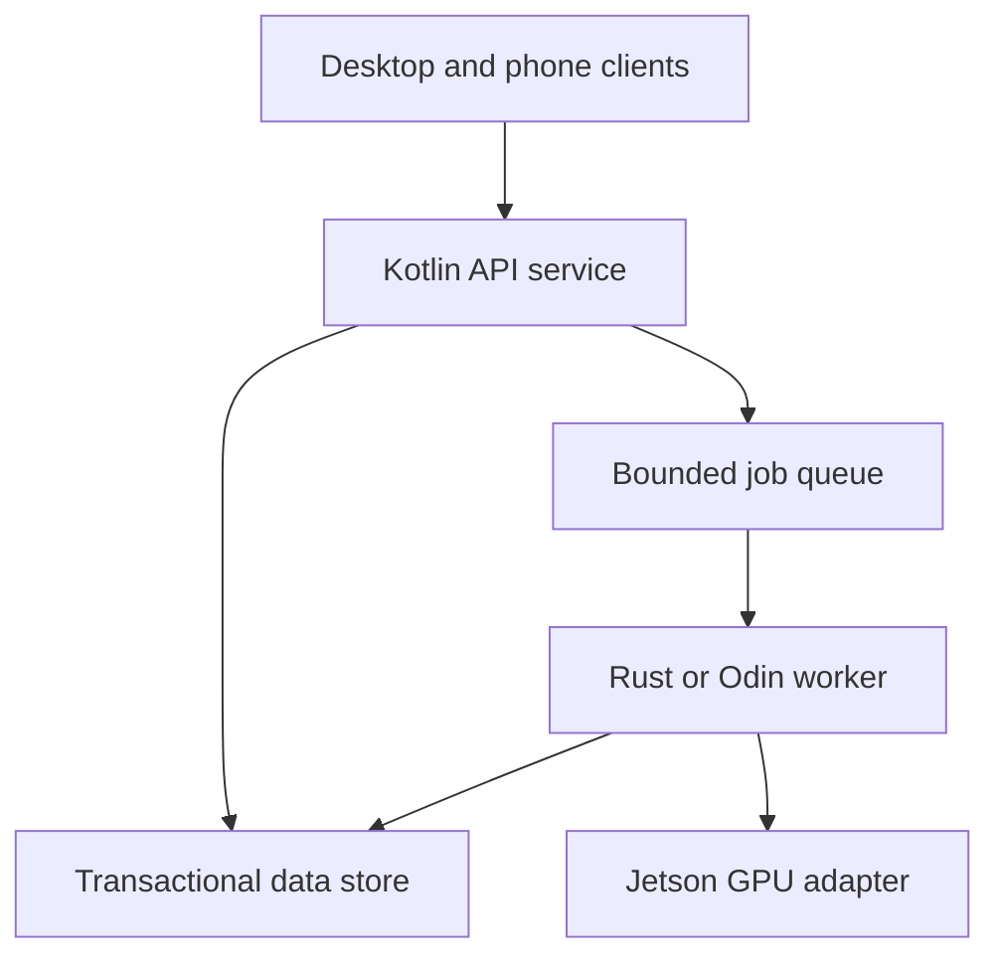

# Tiger Style for Kotlin

**Safety > performance > developer experience.**

A practical standard for Kotlin applications, services, shared libraries, and device-facing
software. Modeled after the supplied `TIGER_STYLE_LUA.md` and `TIGER_STYLE_RUST.md`.
This is an independent adaptation of
[TigerBeetle's engineering philosophy](https://github.com/tigerbeetle/tigerbeetle/blob/main/docs/TIGER_STYLE.md),
not an official Kotlin or TigerBeetle standard.

| Policy | Baseline |
| --- | --- |
| Language | A pinned, reviewed Kotlin release; stable features by default |
| Build | Committed Gradle Wrapper, compatible plugin/JDK/SDK versions, reviewed dependencies |
| JVM starting point | JDK 21 toolchain where the selected framework/plugin matrix supports it; separately declare bytecode/runtime targets |
| Formatting | Four spaces, 100-column target; idiomatic Kotlin naming |
| Function size | Review ordinary functions above 70 physical lines |
| Deployment | Windows, Linux, macOS, Android, iOS, browser clients, Linux aarch64 services |
| Development host | Arch Linux where supported; Apple final builds use a supported macOS host |
| Review date | 2026-09-21; target support is a dated snapshot, not a perpetual guarantee |

Kotlin is a strong candidate for the client and service layers of a full-stack product.
Rust and Odin can supply native workers; Lua can supply controlled tooling and extensions.
Use a language where its implementation and operating model earn their cost. A product
need not use every language in every process.

## Contents

1. [Engineering contract](#1-engineering-contract)
2. [Platforms and runtime choices](#2-platforms-and-runtime-choices)
3. [Full-stack boundaries](#3-full-stack-boundaries)
4. [Toolchains and build trust](#4-toolchains-and-build-trust)
5. [Structure and naming](#5-structure-and-naming)
6. [Types, nullability, and state](#6-types-nullability-and-state)
7. [Contracts and error handling](#7-contracts-and-error-handling)
8. [Bounds, arithmetic, and text](#8-bounds-arithmetic-and-text)
9. [Memory and resource ownership](#9-memory-and-resource-ownership)
10. [Coroutines and cancellation](#10-coroutines-and-cancellation)
11. [UI and mobile lifecycle](#11-ui-and-mobile-lifecycle)
12. [Services, data, and offline operation](#12-services-data-and-offline-operation)
13. [Operating-system boundaries](#13-operating-system-boundaries)
14. [Native and cross-language interfaces](#14-native-and-cross-language-interfaces)
15. [Jetson and aarch64 deployment](#15-jetson-and-aarch64-deployment)
16. [Performance and reproducibility](#16-performance-and-reproducibility)
17. [Complete reference module](#17-complete-reference-module)
18. [Testing and release gates](#18-testing-and-release-gates)
19. [Editor integration and documentation](#19-editor-integration-and-documentation)
20. [Review card and validation](#20-review-card-and-validation)

## 1. Engineering contract

Each substantial operation must identify its accepted input, maximum work, owner, commit
point, failure mode, cancellation behavior, and evidence. Encode resource budgets as named
configuration with units. Reject invalid input before allocating expensive resources or
publishing state.

Use assertions for internal facts and normal error paths for expected external failures.
Do not equate a type-safe language with a secure application: authorization, deadlines,
queue admission, and secret handling remain application responsibilities.

Prefer direct, bounded implementations. Kotlin idioms such as sealed hierarchies, extension
functions, collection operations, and coroutines are welcome when their cost and lifetime
are clear. Do not mechanically translate Rust ownership syntax or Lua naming into Kotlin.

Document exceptions close to the affected code: the rule, reason, affected targets, owner,
remaining bound, and test or removal condition. A blanket exception for a whole application
is not an engineering argument.

## 2. Platforms and runtime choices

A target means **OS + CPU + runtime/ABI + SDK + dependencies + packaging**, not merely an
architecture name. `aarch64`, `arm64`, and `ARM64` commonly identify the same CPU family;
Android, Apple platforms, and GNU/Linux still require different binaries and interfaces.

| Deployment | Starting implementation | Required evidence |
| --- | --- | --- |
| Windows x86-64 | Kotlin/JVM service or Compose desktop client | Matching JRE, native dependencies, installer, Windows behavior |
| Windows ARM64 | JVM/Compose route supported by the selected release | ARM64 JRE and every native component; x86 emulation is a separate lane |
| Linux x86-64 | Kotlin/JVM service; Compose desktop where needed | libc baseline, native libraries, X11/Wayland behavior if graphical |
| Linux aarch64 / Jetson | Headless Kotlin/JVM service first; `linuxArm64` native only for a demonstrated need | ARM64 runtime, board integration, memory/thermal tests |
| macOS Apple Silicon | JVM desktop or Kotlin/Native component | Apple SDK, signing, packaging, native dependencies |
| macOS Intel | Explicit compatibility lane | Verify the exact Kotlin/Compose release; do not assume new releases retain this target |
| Android phones/tablets | Kotlin Android with Android UI tooling or Compose Multiplatform | Android API level, lifecycle, ABI-specific native libraries, real-device tests |
| iPhone/iPad | Kotlin Multiplatform shared logic and a supported iOS UI integration | macOS/Xcode build, simulator plus signed physical-device testing |
| Browser / phone browser | Kotlin/JS, or Kotlin/Wasm with compatible UI and browser baseline | Browser support, accessibility, asset delivery, fallback strategy |

Kotlin's support table currently lists Android, iOS, JVM desktop/server, and Kotlin/JS as
stable; Kotlin/Wasm and Compose web are listed as beta. Compose has its own OS/CPU/version
matrix. Neither table proves support for every dependency in your application.
See [KMP platform status](https://kotlinlang.org/docs/multiplatform/supported-platforms.html)
and [Compose compatibility](https://kotlinlang.org/docs/multiplatform/compose-compatibility-and-versioning.html).

The current Kotlin/Native table lists `linuxArm64` as a Tier 2 **target**, but Linux ARM64
is not a supported host for producing final native binaries. Build that artifact on a
supported host and run it on the board. Apple final binaries require macOS. `macosX64` is
listed as deprecated; `mingwX64` and Android Native targets are Tier 3. Normal Android app
code uses the Android Kotlin/JVM toolchain, not `androidNativeArm64` by default.
See [Native targets and hosts](https://kotlinlang.org/docs/native-target-support.html).

These are independent decisions: Kotlin/JVM on an ARM64 JRE does not require Kotlin/Native
host support. A Compose desktop package commonly bundles a JVM; “native distribution” does
not mean the program was compiled with Kotlin/Native. Desktop package construction has
host-specific constraints. See [desktop distributions](https://kotlinlang.org/docs/multiplatform/compose-native-distribution.html).

## 3. Full-stack boundaries

Start with one service and explicit modules. Add another process when independent deployment,
fault isolation, hardware ownership, or measured scaling requires it. Sharing a repository
is not a reason to share mutable memory or expose database internals to a phone.

| Layer | Recommended responsibility | Boundary rule |
| --- | --- | --- |
| Kotlin clients | UI, local state, offline queue, accessibility | Treat server responses and restored state as untrusted input |
| Shared Kotlin domain | Validation, domain types, state transitions | No desktop-only APIs in common source sets |
| Kotlin/JVM service | HTTP/API transport, authorization, persistence orchestration | Validate authorization for each resource and operation |
| Rust or Odin worker | Native compute, device I/O, bounded transformations | Versioned IPC first; narrow C ABI when in-process cost is justified |
| Jetson accelerator worker | GPU/model ownership and bounded inference admission | Keep CUDA/TensorRT dependencies out of ordinary clients |
| Lua tooling | Editor/build automation or reviewed extension contracts | Explicit capabilities; language embedding alone is not a sandbox |

A useful deployment relationship is:



Clients access the API. The API authorizes and admits jobs. Workers own execution and publish
results; the GPU adapter is specific to the selected Jetson software stack. A small deployment
may keep the API and queue in one process while retaining these ownership boundaries.

Maintain one versioned protocol specification and shared test vectors. Share validated domain
logic where useful; keep platform permissions, native handles, ORM entities, and UI state out
of wire models. Avoid requiring identical Kotlin compiler versions across network peers.

## 4. Toolchains and build trust

Pin compatible versions of Kotlin, Gradle, Android Gradle Plugin where applicable, Compose,
coroutines, serialization, JDK, Android SDK/NDK, Xcode, and native SDKs. Select an exact tested
combination; a moving “latest” identifier is not a reproducible build policy.

Commit the Wrapper scripts/JAR/properties, version catalog, application dependency locks,
and verification metadata. Review Wrapper changes as executable changes. Record the actual
Gradle JVM independently of the Java toolchain used for compilation. A machine with JDK 21
installed does not establish the app's minimum runtime or Android API compatibility.

Review repositories, plugin resolution, transitive dependencies, and downloaded native
artifacts. Verification metadata generated from an untrusted initial download does not
establish authenticity by itself. See [Gradle dependency verification](https://docs.gradle.org/current/userguide/dependency_verification.html).

On Arch, separate rolling system tools from pinned project tools. Review AUR PKGBUILDs before
use; do not run Gradle, compiler tasks, or dependency installation with sudo. Never disable
TLS verification to make a build succeed. Reproducible builds should not read a developer's
private home directory for undeclared dependencies.

A JVM-only Gradle Kotlin DSL **fragment**, inside an already configured compatible Kotlin
project, is:

```kotlin
kotlin {
    jvmToolchain(21)
}
```

This selects a toolchain; it does not configure all Kotlin Multiplatform targets or Android.
Do not paste an application-wide KMP build script from a guide without checking the selected
plugin's current DSL and supported SDK combination.

## 5. Structure and naming

Use `UpperCamelCase` for types, `lowerCamelCase` for functions/properties/locals, and
`UPPER_SNAKE_CASE` for true constants. Follow lowercase package names and language conventions;
use `outputBytesMax`, `retryCount`, `timeoutMs`, and `queueCapacity` to carry units and meaning.
See [Kotlin coding conventions](https://kotlinlang.org/docs/coding-conventions.html).

Use four spaces and a 100-column target. Choose one pinned formatter configuration; do not
alternate different default styles between the editor and CI. Review functions over 70 lines
at their contract boundaries rather than splitting coherent logic into trivial wrappers.

Prefer explicit public API return types. Keep visibility private, then internal, then public
as needed. Extension functions should provide a clear operation on their receiver, not hide
network access behind a harmless-looking property. Avoid long chains of `let`, `also`, `run`,
and `apply` when they obscure mutation or which object `this` refers to.

An example repository split is:

| Directory/module | Contents |
| --- | --- |
| `shared/domain` | Common Kotlin types and pure operations |
| `shared/protocol` | Versioned DTOs and codecs with limits |
| `clients/android`, `clients/ios`, `clients/desktop`, `clients/web` | Platform composition and lifecycle |
| `services/api` | JVM service, authorization, transactions |
| `workers/rust`, `workers/odin` | Native processes or libraries |
| `platform/jetson` | Reviewed deployment and accelerator adapters |
| `tools/lua` | Trusted automation and editor adapters |

Directory names are architecture examples, not automatically generated Gradle source sets.

## 6. Types, nullability, and state

Use nullable types for legitimate absence and explicit outcome types for expected failure.
Distinguish “not found,” “not authorized,” “unavailable,” and “invalid” at internal boundaries;
the external API may deliberately conceal distinctions that leak protected resource existence.

Do not use `!!` on network data, database rows, Java platform types, saved UI state, or FFI
results. Validate Java and native nullability at the boundary. A successful cast does not
validate a domain value's range or authorization.

Prefer sealed states to interacting booleans. A request cannot simultaneously be queued,
running, cancelled, and committed. Define transitions and ownership of the transition lock
or event loop. Use value classes where they materially prevent confusion, without assuming
that they are unboxed on every backend or serialization path.

`val` prevents reassignment of a reference, not mutation of the referred object. A `List<T>`
view can still observe changes made through another reference. Copy at ownership boundaries
or use an explicitly immutable representation; include that copy in the memory budget.

Keep persistence DTOs separate from validated domain objects. Deserialization and database
migration are construction paths and must preserve the same invariants as ordinary factories.
Avoid data-class `copy` paths that bypass the intended validation design.

## 7. Contracts and error handling

| Situation | Policy |
| --- | --- |
| Untrusted invalid request | Structured rejection with bounded, nonsecret context |
| Invalid programmer-supplied argument | `require` when it represents the API contract |
| Broken internal state | `check`, or a deliberate invariant failure |
| Optional value absent | Nullable value when absence is a normal outcome |
| Recoverable operation failure | Domain outcome or narrowly handled exception |
| Cancellation | Preserve propagation; perform owned cleanup |

On JVM, do not rely on `assert` for production validation: assertion enabling differs from
`require` and `check`. No required mutation belongs inside an assertion condition.
See [Kotlin exception and precondition handling](https://kotlinlang.org/docs/exceptions.html).

Catch specific failures where recovery is owned. Do not catch `Throwable` and return an empty
list as success. Do not attempt generic recovery from out-of-memory failures. Error messages
are for humans; machine decisions use stable codes and typed fields.

In suspending code, rethrow `CancellationException` before translating other failures.
`runCatching` also captures cancellation; using it indiscriminately can turn cancellation into
an ordinary error result. An application-level exception handler must preserve cancellation
and avoid exposing stack traces or payloads to remote clients.

## 8. Bounds, arithmetic, and text

Define maximum input bytes, decoded size, nesting depth, collection elements, fan-out,
concurrent jobs, retained output, and elapsed time. A small compressed request can expand
into a large object graph. A count-limited queue can retain large payloads through references.

Kotlin's integer operators do not automatically turn overflow into an application error.
Prove arithmetic safe before forming allocation sizes or end offsets; narrowing conversions
need explicit validation. JVM `Math.*Exact` is a platform-specific option, not a common-code
API. See [Kotlin numeric types](https://kotlinlang.org/docs/numbers.html).

A complete common-code helper, returning null only for an invalid slice request:

```kotlin
fun checkedEnd(offset: Int, count: Int, length: Int): Int? {
    if (length < 0 || offset < 0 || count < 0 || offset > length) {
        return null
    }
    if (count > length - offset) {
        return null
    }
    return offset + count
}
```

For allocation products, validate each dimension and prove `count <= limit / elementBytes`
before multiplying, after handling zero and negative values. Avoid using floating-point
values as intermediate byte counts. Set a representation policy for 64-bit IDs crossing
JavaScript/JSON boundaries; decimal strings can avoid precision loss in ordinary JS clients.

Separate UTF-8 bytes, UTF-16 code units, Unicode scalar values, and displayed graphemes.
Protocol limits must name which quantity they constrain. Normalize text only according to
its domain; do not normalize arbitrary filesystem bytes or identifiers by accident. Reject
or deliberately replace malformed encodings at the appropriate boundary.

Money and exact counters need exact representations. Define allowed NaN/infinity behavior
and error tolerances for model output. A CPU/GPU agreement test needs a numerical contract,
not a universal epsilon.

## 9. Memory and resource ownership

The JVM and Kotlin/Native manage object memory, but sockets, transactions, native buffers,
GPU work, and callbacks still need explicit owners. Kotlin/Native's current memory manager
uses a shared heap and tracing GC; that is not a Rust borrow checker or automatic foreign
resource management. See [Native memory management](https://kotlinlang.org/docs/native-memory-manager.html).

Use `use` for compatible closeable APIs and `try/finally` for other owned resources. Model
fallible commit/flush as explicit operations. Finalizers and garbage collection are not
reliable completion mechanisms. Avoid activity/window references in long-lived singletons.

Use primitive arrays when representation and allocation predictability matter. A
`MutableList<Byte>` is not interchangeable with `ByteArray` for memory planning. Bound copies
made by serializers, immutable snapshots, database buffering, and UI state updates.

Make object pooling earn its complexity. Pool reset must clear ownership and authorization
state. Logical clearing is not guaranteed secret erasure on a managed runtime. Minimize
secret lifetimes and use reviewed platform credential storage rather than promising to wipe
all copies of an immutable string.

## 10. Coroutines and cancellation

Attach work to an explicit lifecycle: request, screen, worker, or application service. Avoid
`GlobalScope` in normal application code. A long-lived service scope has a shutdown owner;
its existence must not be an excuse to lose task handles.

Use structured concurrency to observe child completion. Use supervision only when siblings
are intentionally independent and each failure is handled. A `suspend` function can still
block; do not put blocking I/O or long CPU work on the UI thread. Keep `runBlocking` at a
reviewed blocking entry boundary, not inside suspending or UI code.
See [runBlocking's contract](https://kotlinlang.org/api/kotlinx.coroutines/kotlinx-coroutines-core/kotlinx.coroutines/run-blocking.html).

Use bounded channels and active-worker limits. Define the full-queue policy: reject, suspend
until a deadline, or replace explicitly obsolete work. Suspended producers also retain memory;
a semaphore alone does not bound the number of waiting requests. Observe `trySend` results
and define who releases undelivered native resources.
See [Channel](https://kotlinlang.org/api/kotlinx.coroutines/kotlinx-coroutines-core/kotlinx.coroutines.channels/-channel/).

Timeout cancellation is cooperative. CPU loops need periodic cancellation checks; blocking
native calls and already launched GPU kernels need their own termination/completion design.
`withTimeout` does not prove that the external effect stopped. Acquire/use/close resources
inside a protected lifetime, including the race between completion and cancellation.
See [withTimeout](https://kotlinlang.org/api/kotlinx.coroutines/kotlinx-coroutines-core/kotlinx.coroutines/with-timeout.html).

Use freshness tokens before publishing search results, model outputs, or editor diagnostics.
Keep token updates under the same state owner as result publication. Cancelling old work
saves resources; rejecting stale completion preserves correctness even when cancellation loses.

## 11. UI and mobile lifecycle

Treat UI state as a bounded projection of domain state. Separate event handling, asynchronous
effects, and rendering. Do not launch a network request merely because a rendering function
was evaluated again. Use lifecycle-aware collection and explicitly owned effects.

Test keyboard, mouse, touch, focus traversal, screen readers, font scaling, contrast, IME,
rotation, resize, split-screen, and low-memory restoration. Do not infer tablet/desktop layout
from a platform name; use available space and interaction capabilities.

Phones can suspend or terminate the process. Persist only the minimal recovery state; avoid
serializing active sockets, native pointers, or secrets into saved UI state. Use the platform's
supported background scheduling/permissions rather than trying to keep an arbitrary service
alive indefinitely. A foreground window and a background job have different budgets.

Request permissions at the feature boundary and provide an unavailable state when denied.
Test camera/GPU absence and server disconnection. Shipping a browser client or calling a
remote Jetson is a valid way to reach a phone without copying accelerator dependencies onto it.

## 12. Services, data, and offline operation

A Kotlin/JVM service framework such as Ktor can own the API layer; choose its engine and
plugins deliberately and keep domain logic outside handlers. The official
[Ktor project guide](https://ktor.io/docs/server-create-a-new-project.html) is a setup reference,
not a substitute for the service's security and operations design.

Apply authentication, resource-level authorization, schema validation, and admission limits
before expensive work. Bound headers, bodies, decompression, uploads, WebSocket messages,
connection counts, and database result sets. Use parameterized queries and an explicit
transaction boundary. Never trust an object ID merely because it arrived from your own UI.

Keep access tokens out of logs and URLs. Use established TLS and identity libraries. Do not
put reusable server secrets in mobile/desktop bundles. Restrict outbound destinations where
a request can trigger HTTP fetches; a valid URL is not proof that it is an authorized target.

Define idempotency keys for retryable writes, including a bounded retention policy. If a
write times out after possibly committing, report uncertainty or reconcile by operation ID.
Do not blindly retry a payment, deployment, or inference job with external side effects.

For offline clients, bound the local outbox by bytes and count; encrypt sensitive persisted
state using platform facilities. Specify expiry, ordering, conflict resolution, tombstones,
and user-visible failure. Persist jobs and schema versions, not in-memory coroutine state.
Server and client upgrades must tolerate the declared compatibility window.

## 13. Operating-system boundaries

| Boundary | Policy |
| --- | --- |
| Application paths | Linux XDG directories; Windows known folders; Apple sandbox/Application Support; Android app-specific storage |
| User documents | Platform file picker and retained access permissions where required |
| Filesystem writes | Reviewed symlink policy, restrictive creation, bounded reads, explicit crash-durability contract |
| Process launch | JVM `ProcessBuilder` or reviewed platform adapter; separate executable and arguments |
| Credentials | OS credential facilities or approved secret delivery; no secrets in argv |
| Background service | Platform service manager, least privilege, graceful shutdown and bounded restart policy |

A path prefix is not containment. Account for case sensitivity, Unicode, reserved names,
Windows drive/UNC paths, separators, and TOCTOU races. Use secure handle-based operations
where required. Temporary-file plus rename improves publication behavior, but does not by
itself guarantee persistence through power loss or identical Windows sharing semantics.

Subprocess supervision must concurrently drain bounded stdout/stderr, enforce a deadline,
terminate according to policy, and wait for completion. Windows command-line quoting differs
from POSIX argv; never hand-build a shell string from untrusted values. `ProcessBuilder`
is JVM-specific, not an API you can put in commonMain and expect on iOS or the browser.

## 14. Native and cross-language interfaces

Prefer versioned IPC when failure isolation and ownership clarity matter more than call
latency. For in-process interfaces, keep a small C ABI with fixed-width scalar fields,
explicit byte lengths, status codes, and opaque handles. Do not pass Kotlin collections,
Rust trait objects, Odin slices, or C++ containers as if they were shared binary layouts.

On the JVM/Android, JNI is a distinct integration path from Kotlin/Native cinterop. Kotlin/JS
and browser Wasm need their own host bindings; they cannot load a desktop `.so` directly.
Pin Kotlin/Native cinterop dependencies and contain experimental opt-ins to the adapter.
See [Kotlin/Native C interop](https://kotlinlang.org/docs/native-c-interop.html).

Write down who allocates, who frees, whether a pointer is borrowed, which thread may invoke
a callback, and when callbacks are unregistered. Pinning managed memory does not authorize
a foreign library to retain it after the pin's scope. Use a completion handshake for async
native operations; release resources only after foreign access has ended.

Keep exceptions, panics, and foreign unwinding inside their own supported boundaries. Return
bounded errors at the ABI. The Odin side uses a matching C calling convention and explicitly
establishes any required context. Rust wrappers must explain their unsafe invariants.

## 15. Jetson and aarch64 deployment

Treat each Orin Nano or AGX Orin as a Linux device with a specific board/BSP, not an arbitrary
ARM64 server image. Preserve the tested Jetson Linux/JetPack/CUDA/TensorRT compatibility set.
Record the actual installed versions before choosing runtime artifacts; do not replace the
board OS with Arch merely because Arch is your development workstation. Consult
[NVIDIA's JetPack documentation](https://developer.nvidia.com/embedded/jetpack).

Start with a headless API or worker on an ARM64 JRE if that fits measured memory and latency.
A native worker may reduce runtime overhead for some workloads, but measure the whole path.
An ARM64 container image does not provide the host GPU driver, and ordinary Docker CPU
emulation does not validate Jetson GPU behavior.

Kotlin code does not become a CUDA kernel by selecting `linuxArm64`. Use an explicitly built
accelerator adapter or an inference service. CUDA kernels and C++-only SDK surfaces can live
behind a reviewed C wrapper or a separate worker. Keep an actual CPU fallback if the product
promises one; otherwise return an explicit unavailable result.

Do not assume a TensorRT engine built on a workstation is portable to another OS, GPU, or
runtime version. Track model hash, engine provenance, GPU/runtime compatibility, and build
settings; enable version/hardware compatibility only when supported and tested.
See [TensorRT's support matrix](https://docs.nvidia.com/deeplearning/tensorrt/latest/getting-started/support-matrix.html).

Budget the board's shared resources together:

$$
M_{peak} \le M_{OS} + M_{JVM} + M_{models} + M_{GPU\ allocations}
+ N_{active}M_{job,max} + M_{queues} + M_{cache}.
$$

Avoid double-counting physically shared allocations; the equation is an ownership inventory,
not a direct memory-tool reading. Leave measured headroom for runtime/driver overhead.
Test steady-state thermals, reduced memory, network loss, restart recovery, and power loss.
Report the power mode and cooling configuration when publishing benchmarks.

## 16. Performance and reproducibility

Measure end-to-end latency distributions, throughput, allocations, resident memory, startup,
and battery/power cost where relevant. JVM warmup and GC, Native GC, serialization copies,
network transfer, GPU queueing, and thermal throttling can dominate different deployments.

Do not block the UI for deterministic-looking timing. Prefer bounded batching and buffer
reuse before specialization or unsafe interop. Maintain scalar/native fallback behavior
where optional acceleration is advertised. Record CPU/GPU baseline and SDK versions.

Sort map keys when output ordering matters. Use reproducible test seeds, explicit locales,
and monotonic clocks for elapsed time. Do not promise bitwise identical floating-point results
across different CPU/GPU execution orders unless that is separately implemented and tested.

## 17. Complete reference module

This standalone file demonstrates a bounded byte buffer with typed capacity rejection and
no mutation on rejected append. It uses only Kotlin standard-library features. It is designed
to keep its core usable in common code; the executable `main` supplies a JVM/CLI test entry.
**It was not compiled in this environment.** Commands below are validation instructions.

The factory bounds allocation to 4,096 bytes. `snapshot` returns a copy, preserving ownership;
callers retaining many snapshots still need their own aggregate memory limit. This type is
single-owner and not thread-safe. Logical clear is not secure erasure.

<details>
<summary>Open BoundedBytes.kt — implementation and self-checks</summary>

```kotlin
private const val CAPACITY_BYTES_MAX = 4096

sealed interface BufferCreation {
    data class Created(val buffer: BoundedBytes) : BufferCreation
    data class InvalidCapacity(val requested: Int) : BufferCreation
}

sealed interface AppendResult {
    data object Appended : AppendResult
    data class CapacityExceeded(val remaining: Int, val requested: Int) : AppendResult
}

class BoundedBytes private constructor(private val storage: ByteArray) {
    var size: Int = 0
        private set

    val remaining: Int
        get() {
            check(size >= 0 && size <= storage.size)
            return storage.size - size
        }

    fun tryAppend(input: ByteArray): AppendResult {
        val available = remaining
        if (input.size > available) {
            return AppendResult.CapacityExceeded(available, input.size)
        }
        // Admission proves this sum fits storage.size and Int.
        val end = size + input.size
        input.copyInto(storage, destinationOffset = size)
        size = end
        return AppendResult.Appended
    }

    fun snapshot(): ByteArray = storage.copyOfRange(0, size)

    fun clear() {
        size = 0
    }

    companion object {
        fun create(capacity: Int): BufferCreation {
            if (capacity < 0 || capacity > CAPACITY_BYTES_MAX) {
                return BufferCreation.InvalidCapacity(capacity)
            }
            return BufferCreation.Created(BoundedBytes(ByteArray(capacity)))
        }
    }
}

private fun createForTest(capacity: Int): BoundedBytes =
    when (val result = BoundedBytes.create(capacity)) {
        is BufferCreation.Created -> result.buffer
        is BufferCreation.InvalidCapacity -> error("Invalid test fixture")
    }

fun main() {
    check(BoundedBytes.create(-1) is BufferCreation.InvalidCapacity)
    check(BoundedBytes.create(CAPACITY_BYTES_MAX + 1) is BufferCreation.InvalidCapacity)

    val empty = createForTest(0)
    check(empty.tryAppend(byteArrayOf()) == AppendResult.Appended)
    check(empty.tryAppend(byteArrayOf(1)) == AppendResult.CapacityExceeded(0, 1))
    check(empty.size == 0)

    val buffer = createForTest(4)
    val source = byteArrayOf(1, 2)
    check(buffer.tryAppend(source) == AppendResult.Appended)
    source[0] = 9
    check(buffer.snapshot().contentEquals(byteArrayOf(1, 2)))

    val before = buffer.snapshot()
    check(buffer.tryAppend(byteArrayOf(3, 4, 5)) == AppendResult.CapacityExceeded(2, 3))
    check(buffer.snapshot().contentEquals(before))
    check(buffer.size == 2)
    check(buffer.tryAppend(byteArrayOf(3, 4)) == AppendResult.Appended)
    check(buffer.remaining == 0)
    check(buffer.tryAppend(byteArrayOf()) == AppendResult.Appended)

    val snapshot = buffer.snapshot()
    snapshot[0] = 99
    check(buffer.snapshot()[0] == 1.toByte())
    buffer.clear()
    check(buffer.size == 0 && buffer.remaining == 4)
    check(buffer.tryAppend(byteArrayOf(7)) == AppendResult.Appended)

    val maximum = createForTest(CAPACITY_BYTES_MAX)
    check(maximum.tryAppend(ByteArray(CAPACITY_BYTES_MAX)) == AppendResult.Appended)
    check(maximum.tryAppend(byteArrayOf(1)) == AppendResult.CapacityExceeded(0, 1))
    println("BoundedBytes checks passed")
}
```

Save the fence as `BoundedBytes.kt`; use the project's reviewed Kotlin 2.x compiler:

```sh
kotlinc BoundedBytes.kt -include-runtime -d bounded-bytes.jar
java -jar bounded-bytes.jar
```

These commands exercise JVM behavior only. Move the core and equivalent tests into the
appropriate commonMain/commonTest source sets for target-specific validation.

</details>

## 18. Testing and release gates

Test zero, one, limit minus one, exact limit, limit plus one, invalid conversions, cancellation,
timeouts, and failure before commit. Verify rejected operations leave published state unchanged.
Use property tests and bounded fuzzing for parsers, codecs, and foreign wrappers.

| Lane | Minimum evidence before claiming support |
| --- | --- |
| Shared domain | Common tests plus each supported backend's compilation/tests |
| JVM service | Selected JDK, real database/migrations, concurrency and shutdown tests |
| Windows/Linux/macOS desktop | Native runtime dependencies, installer, launch, upgrade, UI access |
| Android | Emulator plus real ARM64 device, lifecycle, permissions, offline recovery |
| iOS | macOS build, simulator, physical device, signing, lifecycle |
| Browser | Named browsers/versions, security headers, accessibility, network failure |
| Jetson | Actual supported board/JetPack, CPU/GPU results, load, resource and recovery tests |

A generic project entry check is `./gradlew --version` followed by the repository's registered
verification tasks. `./gradlew check` covers only what that project wires into `check`; it is
not proof that every native/device target ran. On Windows use `gradlew.bat`. Inspect task
names for the selected plugin versions instead of inventing universal KMP task names.

Build and sign platform packages in their appropriate CI lanes. Pin OCI image digests and
publish distinct linux/amd64 and linux/arm64 images when both are supported. Inspect linked
native dependencies and deployment libc requirements; compile success is not installation
success. Include upgrade/rollback and schema-compatibility tests before shipping migrations.

## 19. Editor integration and documentation

Keep this guide as Markdown reference material, for example
`lua/config/lang/TIGER_STYLE_KOTLIN.md` in Diver. It is not a Lua module to require.
Use the same JDK, project model, formatter, and compiler baseline in Neovim, terminal, and CI.
Choose one owner for formatting and avoid duplicate background checks.

Workspace trust applies to Gradle project import/build logic, tests, native tools, and debug
launches. Keep read-only editing usable before trust. Carry input version and buffer identity
through asynchronous diagnostics and reject stale responses.

Use tables, fenced code, Mermaid, and native HTML disclosure elements. Mark snippets as
complete modules, fragments, or templates. Reference only actual included media; do not
require scripts, remote images, or executable HTML to read a safety contract.

## 20. Review card and validation

<details>
<summary>Open the Kotlin review checklist</summary>

- [ ] Runtime, host, OS, CPU, SDK, and package support are separately recorded.
- [ ] Kotlin/JVM, Android, Native, JS, and Wasm APIs are kept in their proper source sets.
- [ ] Toolchains, Wrapper, repositories, dependencies, and native artifacts are reviewed/pinned.
- [ ] External data is validated before allocation, indexing, authorization-sensitive use, or mutation.
- [ ] State and errors are explicit; no default-success path hides a failed operation.
- [ ] Integer sizes, text units, serialized IDs, and numerical tolerances are defined.
- [ ] Aggregate memory, producer count, queues, I/O, retries, and time have limits.
- [ ] Every task, native buffer, handle, and callback has a lifecycle owner.
- [ ] Cancellation is propagated and stale completions cannot publish results.
- [ ] UI effects, background work, accessibility, and restoration are tested per platform.
- [ ] Protocol/database changes preserve the declared compatibility and idempotency contract.
- [ ] Foreign code uses a reviewed ABI, thread model, and allocator/completion contract.
- [ ] Jetson artifacts match the actual board/runtime stack and have hardware evidence.
- [ ] Packaging, signing, update, rollback, and runtime tests cover every claimed target.
- [ ] Documentation distinguishes observed results from proposed architecture and templates.

</details>

**Validation record:** the attached guides were reviewed; platform and language claims were
checked against the linked official documentation. Markdown structure and source-fence layout
were checked locally. A JVM was available, but no Kotlin compiler was installed; the reference
module and Gradle fragment were not compiled or executed. No desktop/mobile/Jetson deployment,
formatter, Android SDK, Xcode, or Kotlin language-server validation was performed.

**Maintenance:** revisit this guide when language/toolchain versions, target support, SDKs,
foreign interfaces, security policy, or resource budgets change. Keep target-specific exceptions
and their evidence next to the affected implementation.
