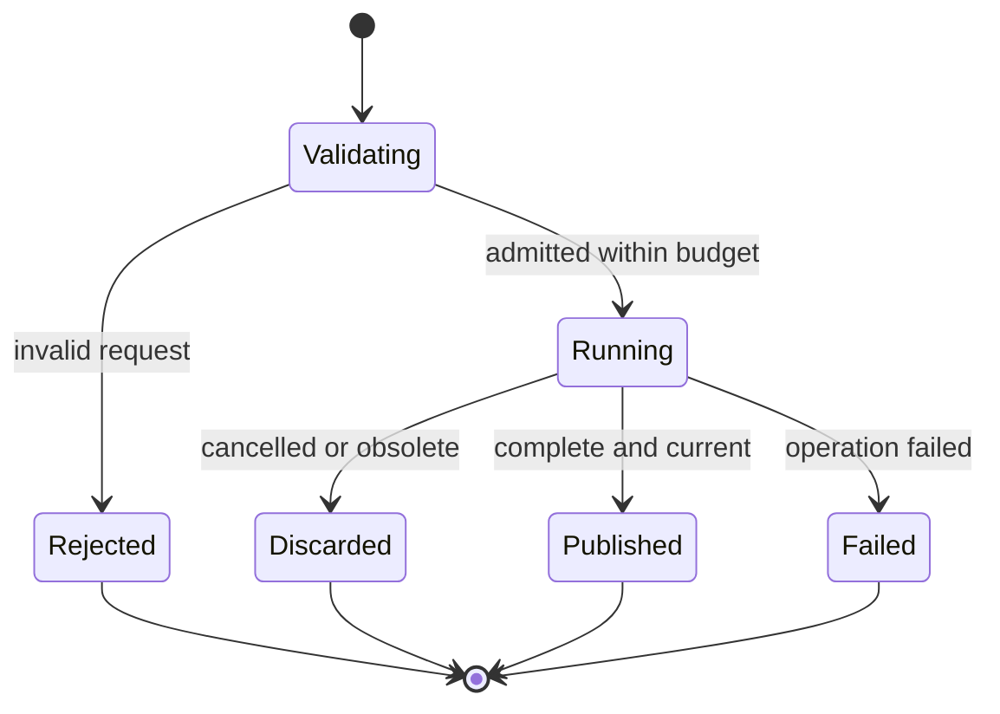

# Tiger Style for Mojo

**Safety > performance > developer experience.**

A practical coding standard for Mojo CPU programs, numerical kernels, GPU applications, and
Python integration on Arch Linux. Written for the Diver language documentation directory
and adapted from the supplied Lua guide. This is an independent interpretation of
[TigerBeetle's Tiger Style](https://github.com/tigerbeetle/tigerbeetle/blob/main/docs/TIGER_STYLE.md),
not an official TigerBeetle or Modular document.

| Policy | Baseline |
| --- | --- |
| Language syntax | Current Mojo manual reviewed on 2026-09-20; manual identifies version 1.1.0 |
| Project compatibility | Pin the actual compiler, standard library, and related packages together |
| Formatting | Four spaces, 100-column target; the pinned formatter governs output |
| Function size | Review ordinary functions above 70 physical lines |
| Primary platform | Arch Linux; validate CPU/GPU support for the exact installed toolchain |
| Example verification | Reviewed against official documentation; not compiled in this task |

Mojo evolves quickly. A guide is not a substitute for the project's pinned compiler and its
matching documentation. This guide deliberately uses current `def`, `raises`, `comptime`,
`mut`, and `var` conventions. Do not mix them with examples from older language releases.
The [Mojo manual](https://mojolang.org/docs/manual/) is the language reference baseline.

## Contents

- [1. Engineering contract](#1-engineering-contract)
- [2. Toolchain and Arch Linux policy](#2-toolchain-and-arch-linux-policy)
- [3. Source structure and naming](#3-source-structure-and-naming)
- [4. Functions and ownership](#4-functions-and-ownership)
- [5. Lifetimes and resource cleanup](#5-lifetimes-and-resource-cleanup)
- [6. Errors and assertions](#6-errors-and-assertions)
- [7. Bounds and numeric contracts](#7-bounds-and-numeric-contracts)
- [8. State and mutation](#8-state-and-mutation)
- [9. Memory and unsafe boundaries](#9-memory-and-unsafe-boundaries)
- [10. Compile-time programming](#10-compile-time-programming)
- [11. SIMD and GPU work](#11-simd-and-gpu-work)
- [12. Python and operating-system boundaries](#12-python-and-operating-system-boundaries)
- [13. Performance and reproducibility](#13-performance-and-reproducibility)
- [14. Tests and tool commands](#14-tests-and-tool-commands)
- [15. Complete reference example](#15-complete-reference-example)
- [16. Neovim integration](#16-neovim-integration)
- [17. Documentation and media](#17-documentation-and-media)
- [18. Review card and validation](#18-review-card-and-validation)

## 1. Engineering contract

Design a correct operation before making it fast. State the accepted inputs, resource budget,
ownership, failure modes, and commit point. Prefer direct control flow that keeps those facts
visible to a reviewer.

Safety includes memory behavior, authorization, bounded work, correct numerics, reproducible
state transitions, and honest failure reporting. A successful compilation does not prove all
of these properties. Neither does an impressive benchmark.

Use explicit limits for inputs, buffers, nesting, queue depth, diagnostics, retries, and
concurrent work. A long-lived service may run indefinitely, but each batch must be bounded
and cancellation must have a documented effect.

Do not interpret Tiger Style as a ban on all allocation, abstraction, or dynamic behavior.
Choose the simplest mechanism that makes the contract clear. Tight numerical kernels and
interactive orchestration have different cost profiles; keep their boundaries explicit.

Exceptions require a reason, a local owner, and a check. Describe what assumption would make
the exception invalid. Avoid global suppressions that make later violations invisible.

## 2. Toolchain and Arch Linux policy

Pin a reviewed compiler version and its matching standard library. If using MAX, pin it and
its accelerator libraries consistently. Keep the package/environment manifest and lockfile
in the project. Do not use a moving nightly channel as a reproducibility claim.

Record these facts in build or release evidence:

- Compiler version and package environment.
- Source revision and resolved dependency revisions.
- CPU target, operating system, and relevant native libraries.
- Optimization and assertion settings.
- GPU model, driver/runtime versions, and selected device when applicable.
- Python implementation and package environment when Python interop is enabled.

Use `mojo --version`, `mojo build --help`, and `mojo format --help` from the same environment
that Neovim uses. A global executable and a project executable can refer to different language
releases. Resolve that discrepancy before changing code or weakening diagnostics.

Arch is a rolling distribution. Do not infer vendor support from the fact that a package can
be installed locally. Check the release's supported platforms and device requirements before
claiming compatibility. Keep compiler updates separate from unrelated system maintenance so
failures can be attributed and rolled back coherently.

Build and test as an ordinary user. Review package channels, installers, AUR build files, and
foreign dependencies before executing them. Keep credentials out of build environments.
Opening source code must not silently authorize package installation, build tasks, Python
imports, benchmarks, or device access.

A toolchain upgrade is a reviewed change. Re-run formatting, compilation, tests, representative
benchmarks, and foreign-boundary checks. Record syntax migrations rather than adding ad hoc
compatibility branches for every historic Mojo release.

## 3. Source structure and naming

Use `.mojo` filenames for straightforward shell and editor interoperability. Use `snake_case`
for modules, functions, variables, and fields; `UpperCamelCase` for structs and traits; and
`SCREAMING_SNAKE_CASE` for named limits and compile-time constants.

Names should expose units and role: `input_bytes_max`, `element_count`, `offset_elements`,
`output_capacity`, `deadline_ms`. Distinguish bytes from elements, rows from strides, and
logical shape from physical allocation.

Keep public contracts before implementation machinery. Group code by ownership and domain
responsibility. Prefer explicit imports to wildcard imports; avoid module names that shadow
standard or project dependencies.

Use four spaces and a 100-column target. Let the pinned `mojo format` decide mechanical
formatting. Review ordinary functions above 70 physical lines; split at a real responsibility
boundary. Do not hide a long algorithm behind many helpers with unexplained preconditions.

Use type annotations on public inputs and outputs. Add local annotations where they clarify
numeric precision, container element type, or a boundary conversion. Avoid annotations that
merely repeat an obvious constructor without helping review.

Current Mojo uses `var` for explicit runtime variable declarations and `comptime` for values
known at compile time. `var` does not mean a variable should be reassigned gratuitously; keep
mutation narrow. See [variables](https://mojolang.org/docs/manual/variables/) and
[compile-time evaluation](https://mojolang.org/docs/manual/metaprogramming/comptime-evaluation/).

## 4. Functions and ownership

Current Mojo functions use `def`. Make the return type explicit for a value-returning public
function. Use `raises` when errors can escape. Do not reproduce the old rule that `fn` is
the required spelling for all strict typed code. See
[functions](https://mojolang.org/docs/manual/functions/).

Understand each argument convention before choosing it:

| Convention | Meaning in the current ownership model | Review question |
| --- | --- | --- |
| `value: T` | Immutable reference by default | Is inspection sufficient? |
| `mut value: T` | Mutable reference | Is mutation required and exclusive? |
| `var value: T` | Callee owns the value | Is ownership transfer part of the API? |
| `out value: T` | Callee initializes an output | Is initialization complete on success? |
| `ref value: T` | Parametric mutability | Is this generality necessary? |
| `deinit self` | Destructive/deinitializing access | Is cleanup precisely owned? |

Use the transfer operator `value^` only when giving up ownership is intended. A default
immutable argument is not a promise of an automatic deep copy. Mutable references must obey
exclusivity. Constructors commonly initialize through `out self`. See
[ownership and argument conventions](https://mojolang.org/docs/manual/values/ownership/).

Prefer immutable inspection at the API boundary. If a function mutates, put that fact in its
signature and document which state may change before an error. If it takes ownership, explain
whether it consumes, retains, transforms, or returns that resource.

Avoid boolean policy arguments when a named option or domain type makes the decision clearer.
Do not return a tuple whose positions mix unrelated ownership or status meanings without a
clear contract. Small explicit interfaces are easier to compose safely.

Example of a bounded, validated mutation; this is a function fragment, not a standalone program:

```mojo
def consume_budget(mut remaining: Int, amount: Int) raises:
    if remaining < 0:
        raise Error("invalid remaining budget")
    if amount < 0:
        raise Error("amount must be nonnegative")
    if amount > remaining:
        raise Error("budget exhausted")
    remaining -= amount
```

The only mutation follows every rejection check. Rejected calls preserve `remaining`.
The nonnegative bounds prove that subtraction cannot underflow for a valid `Int` input.

## 5. Lifetimes and resource cleanup

Name the owner of every list, allocation, file, callback, foreign object, and device buffer.
A view must not outlive the storage it refers to. Review ownership again whenever a value is
stored in a closure, container, asynchronous operation, or foreign runtime.

Mojo tracks reference relationships using origins/lifetimes. Do not mechanically translate
Rust lifetime annotations into Mojo, or assume a raw pointer carries an ownership guarantee.
Use the current [lifetime model](https://mojolang.org/docs/manual/values/lifetimes/) when designing
APIs that return views or retain references.

Mojo uses ASAP destruction: an owned value may be destroyed after its last use rather than
at the closing indentation boundary. Lexical scope alone is not a lifetime-extension proof.
Use documented lifetime extension or a suitable owner when delayed work still needs storage.
See [destruction and lifetime extension](https://mojolang.org/docs/manual/lifecycle/death/).

For device work and callbacks, distinguish the lifetime of a submission object from the
lifetime of the memory used by the eventual computation. Keep storage valid until the API's
completion condition is satisfied. Enqueuing work is not evidence that it is safe to release
its inputs.

Use explicit completion methods when close, flush, synchronization, or transaction commit
can fail meaningfully. Cleanup paths must not silently turn a failed operation into success.
Keep one owner responsible for final release, including partial initialization failures.

When cancellation is requested, define whether it stops admission, stops computation, waits
for completion, or only suppresses publication. Do not release memory still used by foreign
or device work merely because a UI task was cancelled.

## 6. Errors and assertions

External input is checked with ordinary branches and explicit errors. Assertions express
internal facts established by the implementation. Tests verify that violations are detected.
These are different responsibilities.

Use `raises` in the API where failure is part of the contract. Add context at the layer that
knows its meaning; preserve the underlying failure. Prefer domain-specific error types when
callers need to distinguish cases. Current Mojo supports typed errors as well as the general
`Error`; see [error handling](https://mojolang.org/docs/manual/errors/).

The small reference example uses `Error` to stay self-contained. Its messages are not a
recommended machine-readable error protocol. Production integrations should use a reviewed
structured representation, particularly across Python, process, or editor boundaries.

Do not catch everything and return zero, an empty list, or success. If an optional feature is
unavailable, report unavailable. If a cleanup failure occurs while another error is active,
preserve the primary failure and record the cleanup issue without leaking secrets.

### Assertion policy

Mojo's `debug_assert` behavior depends on `ASSERT`. Normal assertions are disabled by default;
`debug_assert[assert_mode="safe"](...)` participates in the default safe mode. Explicitly
record the chosen mode:

| Build define | Documented behavior |
| --- | --- |
| `ASSERT=all` | Enable all assertions |
| `ASSERT=safe` | Enable safe assertions; default mode |
| `ASSERT=none` | Disable assertions |
| `ASSERT=warn` | Report assertion failures without exiting |

Never use a removable assertion as the sole check before an unsafe operation on untrusted
input. Keep assertion expressions free of required side effects and unnecessary allocation;
evaluation costs may remain even when checks are disabled. See
[`debug_assert`](https://mojolang.org/docs/std/builtin/debug_assert/debug_assert/).

For this policy, development and CI enable `ASSERT=all`. Deployment retains at least the
reviewed safe checks. A benchmark using `none` or `warn` must disclose that configuration and
cannot substitute for safety validation. Do not infer assertion behavior from `-O0` or `-O3`.

## 7. Bounds and numeric contracts

Choose limits from a real workload and operational budget. Enforce them before allocating,
converting, copying, decompression, indexing, or launching device work.

| Quantity | Contract to state |
| --- | --- |
| Input | Bytes, records, dimensions, and nesting depth |
| Container | Element limit and aggregate byte budget |
| Numeric value | Allowed range, width, precision, and exceptional values |
| Loop | Maximum iterations and cancellation granularity |
| Queue | Capacity, retained bytes, and full-queue behavior |
| Output | Bytes/records and truncation/error behavior |
| Retry | Retryable failures, maximum attempts, and total deadline |
| Device work | Shape, launch bounds, memory budget, and completion ownership |

Do not assume `Int` is a protocol's fixed-width integer. Make wire/storage representation
explicit and validate conversions. Arithmetic on sizes needs a proof before evaluation;
checking an already-overflowed product is too late.

For a range `[offset, offset + count)`, first establish nonnegative `length`, then
`0 <= offset <= length`, then `0 <= count <= length - offset`. Only then form the end.
The reference example below follows that sequence with a bounded length.

For tensor allocation, validate rank and each dimension; then prove each multiplication fits
both the arithmetic type and the configured memory budget. Account for strides, padding,
alignment, layout, and backing storage. A valid logical shape does not prove every physical
address is in range.

Define whether NaNs, infinities, signed zero, denormals, and precision loss are acceptable.
Validate those conditions before comparisons whose meaning depends on finite values. Keep
integer and floating-point conversions deliberate; narrowing is not harmless formatting.

A nonnegative reduction with at most `N` elements each at most `V` has:

$$
0 \le S \le N V.
$$

The reference example uses `N = 4096` and `V = 1000`, so `S <= 4,096,000`. Every partial sum
obeys the same bound. The caller must still bound allocation before constructing the list;
checking its length later cannot undo memory already allocated.

## 8. State and mutation

Separate raw input from validated state. Keep related fields behind operations that preserve
their relationship. Do not expose a mutable buffer length independently of its storage and
capacity without a compelling low-level contract.

Use a distinct state representation instead of contradictory flags. Document legal
transitions and how failure affects the current state. Avoid a “ready” marker being published
before data, handles, or device transfers are actually ready.

Prefer **validate → prepare → commit** for fallible changes. If preparation fails, keep the
old visible state. If partial mutation is unavoidable, return an explicit partial result or
recovery requirement. Do not imply transactional behavior that the implementation lacks.

For editor-driven work, capture a generation and input version at submission. Before
publishing results, verify both are current. Requesting cancellation is useful for resource
control; freshness validation is still necessary for correctness.



Text equivalent: only a completed, still-current request publishes a result. Rejection,
failure, cancellation, and obsolescence remain distinguishable terminal outcomes.

## 9. Memory and unsafe boundaries

Prefer ordinary owned values and safe container operations. A memory-safe operation can
still exhaust resources; pair it with an application limit. Do not equate reserved container
capacity with an enforced maximum size.

Current documentation distinguishes `Pointer`, `OwnedPointer`, and `ArcPointer`. `Pointer`
includes operations with explicit unsafe contracts; safe conveniences do not make every raw
pointer operation safe. Confirm the API for the pinned release instead of copying legacy
`UnsafePointer` examples indiscriminately. See
[pointers](https://mojolang.org/docs/manual/pointers/).

Every unsafe boundary must document applicable assumptions: allocation origin, alignment,
initialized extent, lifetime, aliasing, mutability, address space, and concurrent access.
Specify exactly which allocator frees the memory. Keep unsafe implementation details behind
a small interface with enforceable preconditions.

Do not create an unchecked pointer merely to suppress a type or ownership error. Understand
why the compiler cannot establish the relationship. If the relationship is external, state
it explicitly and test the wrapper's rejection paths.

Avoid allocation in hot loops where a reusable buffer is suitable. Reuse still needs reset
semantics and an aggregate memory limit. Large local arrays or deeply nested value objects
need a stack-size review. Copying into device or foreign memory counts toward peak usage.

Do not claim a buffer is erased because its logical length is reset or its owner is dropped.
Secret handling needs an explicit storage, copying, lifetime, and erasure policy appropriate
to the runtime and platform.

## 10. Compile-time programming

Use compile-time parameters for properties genuinely fixed at specialization: element type,
vector width, layout, or a small set of algorithm choices. Keep request data and user-sized
inputs at runtime.

`comptime` evaluation and `comptime if`/`for` are distinct from ordinary runtime evaluation.
Respect restrictions on compile-time operations and control how much work specialization
creates. See [parameters](https://mojolang.org/docs/manual/parameters/) and
[compile-time evaluation](https://mojolang.org/docs/manual/metaprogramming/comptime-evaluation/).

Bound the supported specialization space. A Cartesian product of dtypes, widths, layouts,
shapes, and devices can produce excessive compile time and binary size even when each kernel
is small. Prefer a reviewed finite set with runtime selection when appropriate.

Compile-time checks are for compile-time facts. They do not validate runtime tensor contents,
file sizes, user-provided offsets, or permissions. Preserve those runtime checks explicitly.

Keep metaprogramming readable. A direct implementation is preferable when a generated one
adds no measurable performance or correctness benefit. Document generated variants and
include them in the supported test matrix.

## 11. SIMD and GPU work

Start with a scalar CPU reference implementation and a precise numerical contract. Treat an
optimized kernel as another implementation of that contract, with its own memory and
synchronization obligations.

### SIMD review

Specify lane type, width, alignment, input extent, and tail handling. Test lengths zero,
one, one less than a vector width, exactly one width, and one more. A masked operation still
requires checking the documented behavior of its inactive lanes and memory accesses.

Do not assume every supported CPU has the build machine's instruction set. Record the target
baseline or runtime dispatch policy. Compare both numerical results and performance against
the scalar reference. State whether reassociation or fused operations are permitted.

### GPU review

Current GPU examples use MAX accelerator APIs, including `max.gpu` and
`max.gpu.host.DeviceContext`. Compilation and execution are asynchronous relative to host
submission; synchronize or use the documented completion mechanism before consuming results.
See the [official GPU introduction](https://max.modular.com/gpu/intro-tutorial/).

For each kernel, review these application contracts:

- Dtype, rank, dimensions, strides, and address space agree with actual storage.
- Grid and block choices cover the valid domain without out-of-range accesses.
- Tail handling covers sizes that do not divide evenly by the block or vector width.
- Every required barrier is reached by the participating execution group.
- Concurrent writes are disjoint or use a specified synchronization/reduction method.
- Host and device allocations remain owned until all work using them has completed.
- Launch/submission errors and completion errors are both observed.
- Retry after uncertain completion cannot silently duplicate effects.

Keep host validation outside kernels where practical. A device assertion is diagnostic
support, not a substitute for a valid host-side launch contract. Establish what happens if a
device is unavailable, a transfer fails, or execution does not complete promptly.

A timeout does not automatically cancel a GPU kernel. Document the runtime's actual behavior
and keep ownership valid during shutdown. For isolation-critical untrusted workloads, define
a process/device-level recovery policy rather than pretending a task cancellation resets the
device safely.

GPU access expands a sandbox's permissions. On hybrid systems, select and report the compute
device explicitly; do not infer it from the desktop renderer. Validate the installed driver,
compiler, runtime, and GPU together before claiming compatibility.

Time completed work. Host submission duration alone is not kernel runtime. Include the cost
of transfers and synchronization when they belong to the user-visible operation. Separate
first-use compilation from warmed execution in benchmark reports.

## 12. Python and operating-system boundaries

### Python interoperability

Treat Python as a dynamic and executable boundary. Validate imported objects, return values,
shapes, dtypes, lengths, and exceptions before using them as trusted Mojo inputs. Keep dynamic
conversion outside tight loops where possible.

Current examples import through `from std.python import Python`. Follow the pinned version's
interop and runtime configuration rules; do not assume every Python object becomes a safe,
zero-copy Mojo view. See
[Python from Mojo](https://mojolang.org/docs/manual/python/python-from-mojo/).

Importing a module executes code and searches configured locations. Review the interpreter,
module search path, project environment, and dependency sources. Do not import an untrusted
project merely to discover metadata for an editor view.

For shared buffers, document the owner, writable aliases, release rule, and how long foreign
references remain valid. Check contiguity and strides instead of assuming them. Account for
copies, pinning, and synchronization explicitly.

Bound conversion work and error messages. Avoid serializing an entire foreign object for a
log entry. Propagate useful error context without logging tokens, payloads, or arbitrary
`repr` output containing sensitive values.

### Files, processes, and network

Validate paths against the operation's authority. String prefix checks and a one-time
canonicalization are not complete defenses against symlinks or concurrent path changes.
Use a reviewed filesystem boundary for sensitive operations.

Keep config, state, and cache distinct and respect configured XDG locations. Create secret
files with restrictive permissions from the outset. Use secure temporary-file creation and
bound file reads, traversal, archive expansion, and output sizes.

Launch tools with a reviewed executable and separate argument values, explicit cwd, and a
minimal environment. Avoid shell interpolation. The tool's own option parser still matters:
validate option-like input and use its documented end-of-options mechanism where appropriate.

Supervise processes with bounded output, deadlines, cancellation, and child reaping. Manage
descendants according to a deliberate policy. A sandbox restricts accessible resources; it
does not automatically impose CPU, memory, output, or time budgets.

For network work, set operation deadlines and bounded response sizes, preserve certificate
verification, and separate transport success from application authorization. Use established
security libraries; do not invent cryptographic primitives or credential protocols.

## 13. Performance and reproducibility

Measure the real workload after correctness is established. Record dataset, shape distribution,
dtype, target, compiler, flags, assertion mode, device, warmup, and sample count. Report tail
latency and peak memory when those are part of the operational budget.

Attribute cost before optimizing: Python conversion, host allocation, compilation, transfer,
synchronization, kernel execution, or output processing. A faster kernel may not make the
whole operation faster if transfers dominate.

Prefer removing unnecessary work and copies before introducing unsafe memory access or more
specializations. Keep a simple reference path for tests and debugging. Require reproducible
evidence for claims about speed, allocation, or vectorization.

Define numerical reproducibility. Parallel reductions can change rounding order; decide
whether exact bits, absolute tolerance, relative tolerance, or a domain-specific metric is
required. Document accepted error against representative and adversarial data.

Sort externally visible unordered results when stable output matters. Control random seeds
in tests, while retaining the ability to vary them in exploratory testing. Record a seed that
reproduces a failure. Do not allow nondeterministic test order to hide shared-state dependence.

## 14. Tests and tool commands

Tests should cover contracts and failure paths: empty inputs, exact limits, one beyond each
limit, negative indexes, extreme integers, rejected mutation, ownership boundaries, and
resource cleanup. Test supported dtype/shape/target combinations rather than a single example.

For numerics, include finite extremes, NaN/infinity policy, rounding-sensitive data, and the
scalar reference comparison. For GPU work, include tails, multiple launch shapes, and explicit
completion. Keep unavailable hardware distinguishable from a passing test.

Current Mojo uses `std.testing` and `TestSuite` for unit tests. A test file provides a `main`
that discovers and runs its module-level tests, then runs through `mojo run`. Do not invent a
`mojo test` command. See the [testing guide](https://mojolang.org/docs/tools/testing/).

After saving the complete example below as `test_bounded_window.mojo`, run these commands in
the project's pinned environment:

```sh
mojo --version
mojo run -D ASSERT=all test_bounded_window.mojo
mojo build -O0 -D ASSERT=all test_bounded_window.mojo -o bounded_window_debug
./bounded_window_debug
mojo build -O3 -D ASSERT=all test_bounded_window.mojo -o bounded_window_release
./bounded_window_release
```

The compiler documents optimization, `-D`, and sanitizer options. Address/thread sanitizers
may help on supported targets; check support and run them separately as appropriate. A host
sanitizer is not a proof of device correctness. See
[`mojo build`](https://mojolang.org/docs/cli/build/).

Formatting mutates the named source file:

```sh
mojo format test_bounded_window.mojo
```

For a CI formatting gate, run that command in a clean disposable checkout and compare the
tracked file afterward with `git diff --exit-code -- test_bounded_window.mojo`. Do not assume
an undocumented `--check` flag exists in every release. See
[`mojo format`](https://mojolang.org/docs/cli/format/).

Report formatter, compiler, runtime, CPU, and GPU results separately. A syntax review does
not establish successful compilation; a CPU test does not establish GPU behavior.

## 15. Complete reference example

Save this fence as `test_bounded_window.mojo`. It bounds range arithmetic and sums a validated
window without mutating the caller's list. At most 4096 values are visited; each visited value
must be in `0..1000`. Values outside the selected window are intentionally not validated.

This is an instructional CPU example, reviewed against the documented syntax. It has not
been compiler-tested here. Run it with the pinned compatible Mojo toolchain before adopting
it as production code. It makes no claim about container allocation failure recovery. The typed list literals follow
the current [List API](https://mojolang.org/docs/std/collections/list/List/).

```mojo
from std.collections import List
from std.testing import TestSuite, assert_equal, assert_raises

comptime ITEM_COUNT_MAX = 4096
comptime ITEM_VALUE_MAX = 1000


def checked_end(offset: Int, count: Int, length: Int) raises -> Int:
    if length < 0 or length > ITEM_COUNT_MAX:
        raise Error("length outside supported range")
    if offset < 0 or offset > length:
        raise Error("offset outside input")
    if count < 0:
        raise Error("count must be nonnegative")

    # offset <= length makes subtraction safe before computing the end.
    if count > length - offset:
        raise Error("window exceeds input")
    return offset + count


def sum_window(values: List[Int], offset: Int, count: Int) raises -> Int:
    var end = checked_end(offset, count, len(values))
    var total: Int = 0
    for index in range(offset, end):
        var value = values[index]
        if value < 0 or value > ITEM_VALUE_MAX:
            raise Error("value outside supported range")
        # At most 4096 nonnegative terms of at most 1000: total <= 4096000.
        total += value
    return total


def test_empty_window() raises:
    var values = List[Int]()
    assert_equal(sum_window(values, 0, 0), 0)


def test_selected_window() raises:
    var values: List[Int] = [2, 3, 5, 7]
    assert_equal(sum_window(values, 1, 2), 8)
    assert_equal(sum_window(values, 4, 0), 0)
    assert_equal(values[1], 3)


def test_exact_limits() raises:
    var values = List[Int]()
    for _ in range(ITEM_COUNT_MAX):
        values.append(ITEM_VALUE_MAX)
    assert_equal(
        sum_window(values, 0, ITEM_COUNT_MAX),
        ITEM_COUNT_MAX * ITEM_VALUE_MAX,
    )


def test_invalid_ranges() raises:
    with assert_raises(contains="length outside"):
        _ = checked_end(0, 0, -1)
    with assert_raises(contains="length outside"):
        _ = checked_end(0, 0, ITEM_COUNT_MAX + 1)
    with assert_raises(contains="offset outside"):
        _ = checked_end(-1, 0, 4)
    with assert_raises(contains="offset outside"):
        _ = checked_end(5, 0, 4)
    with assert_raises(contains="count must"):
        _ = checked_end(0, -1, 4)
    with assert_raises(contains="window exceeds"):
        _ = checked_end(3, 2, 4)
    with assert_raises(contains="window exceeds"):
        _ = checked_end(1, Int.MAX, 4)


def test_invalid_values_leave_input_unchanged() raises:
    var negative: List[Int] = [1, -1]
    with assert_raises(contains="value outside"):
        _ = sum_window(negative, 0, 2)
    assert_equal(negative[0], 1)
    assert_equal(negative[1], -1)

    var excessive: List[Int] = [ITEM_VALUE_MAX + 1]
    with assert_raises(contains="value outside"):
        _ = sum_window(excessive, 0, 1)
    assert_equal(excessive[0], ITEM_VALUE_MAX + 1)


def test_values_outside_window_are_not_inspected() raises:
    var values: List[Int] = [-1, 2, 3]
    assert_equal(sum_window(values, 1, 2), 5)


def test_oversized_list_is_rejected() raises:
    var values = List[Int]()
    for _ in range(ITEM_COUNT_MAX + 1):
        values.append(1)
    with assert_raises(contains="length outside"):
        _ = sum_window(values, 0, 0)


def main() raises:
    TestSuite.discover_tests[__functions_in_module()]().run()
```

The arithmetic proof is deliberately small: all range arithmetic follows validation and the
sum is bounded by a constant far below the signed 32-bit maximum. The list itself already
exists when the function begins, so the caller remains responsible for limiting allocation
at ingestion. A production parser must enforce its bound before appending each element.

## 16. Neovim integration

Place this document at `lua/config/lang/TIGER_STYLE_MOJO.md` in Diver. It is Markdown reference
material; do not load it with `require()` or add it to the Lua module list in `init.lua`.
Keep runtime configuration in the existing Mojo language, LSP, lint, and formatter modules.

Resolve the compiler, formatter, and language server from one reviewed project environment.
Keep one owner for format-on-save. Run expensive compilation and benchmarks through explicit,
cancellable commands instead of blocking editor callbacks.

Workspace trust must govern execution: builds, tests, Python imports, package installation,
and GPU access. A language server's analysis behavior also needs review if it can execute
project-supplied code or tasks. Do not conflate opening a file with authorizing its tooling.

For helper output consumed by Neovim, use a versioned schema with bounded messages and records.
Specify location encoding, index bases, and whether positions are bytes or characters. Carry
request generation and buffer version through completion so stale results cannot overwrite
current diagnostics.

This guide does not claim that a particular native Neovim API exists in every 0.13 development
snapshot. Runtime Lua integrations must use the APIs actually available in the installed build
and report unavailable capabilities explicitly.

## 17. Documentation and media

Keep safety contracts readable in plain Markdown. Tables suit comparisons; Mermaid suits
state transitions; equations suit quantitative bounds. Add text equivalents for diagrams.
Label executable examples, incomplete fragments, and configuration templates distinctly.

Use repository-owned assets with relative paths and useful alt text. This is an image template;
add the SVG file before using it outside a code fence:

```markdown

```

A video template for trusted HTML-capable renderers:

```html
<video controls preload="metadata" aria-label="Mojo kernel validation walkthrough">
  <source src="./assets/mojo-kernel-validation.mp4" type="video/mp4">
  <a href="./assets/mojo-kernel-validation.mp4">Open the walkthrough video</a>
</video>
```

No media assets are required to read this guide. SVG, CSS, JavaScript, HTML video, and math
support depend on the renderer. Keep active scripts disabled for untrusted documentation.
Interactive demonstrations should be separate reviewed assets with static explanations and
must not download or run project code automatically.

## 18. Review card and validation

Before merging:

- [ ] Compiler, libraries, formatter, and documentation use a compatible pinned baseline.
- [ ] Public signatures make types, ownership, mutation, and failure visible.
- [ ] Views and foreign/device references cannot outlive their owners.
- [ ] ASAP destruction is accounted for where delayed work retains storage.
- [ ] Input checks remain effective independently of assertion settings.
- [ ] Allocation, work, output, retries, and concurrency have explicit limits.
- [ ] Arithmetic is proven safe before computing sizes, offsets, and products.
- [ ] Rejected operations preserve state or explicitly report partial progress.
- [ ] Unsafe operations have local, reviewable contracts.
- [ ] Specializations and compile-time work are bounded.
- [ ] SIMD/GPU tails, synchronization, and completion are tested where supported.
- [ ] Python conversion and imports cross an explicit trust boundary.
- [ ] Benchmarks state numerical, device, optimization, and assertion assumptions.
- [ ] Test reports distinguish reviewed, compiled, executed, skipped, and unavailable work.

**Validation record:** language conventions, ownership, destruction, assertion settings,
testing APIs, and build/format commands were reviewed against the official sources linked
throughout this guide. The Markdown structure and example consistency were checked locally.
No Mojo compiler was available for this task, so the examples were not compiled or run.
Neither GPU behavior nor Arch Linux runtime compatibility was verified. The seven reference
tests and commands above are the concrete local validation path for the pinned toolchain.

**Maintenance:** review this guide when upgrading Mojo, MAX, Python interop, or the device
runtime. Refresh syntax and examples as one change, record the versions tested, and remove
obsolete guidance rather than accumulating contradictory rules.
