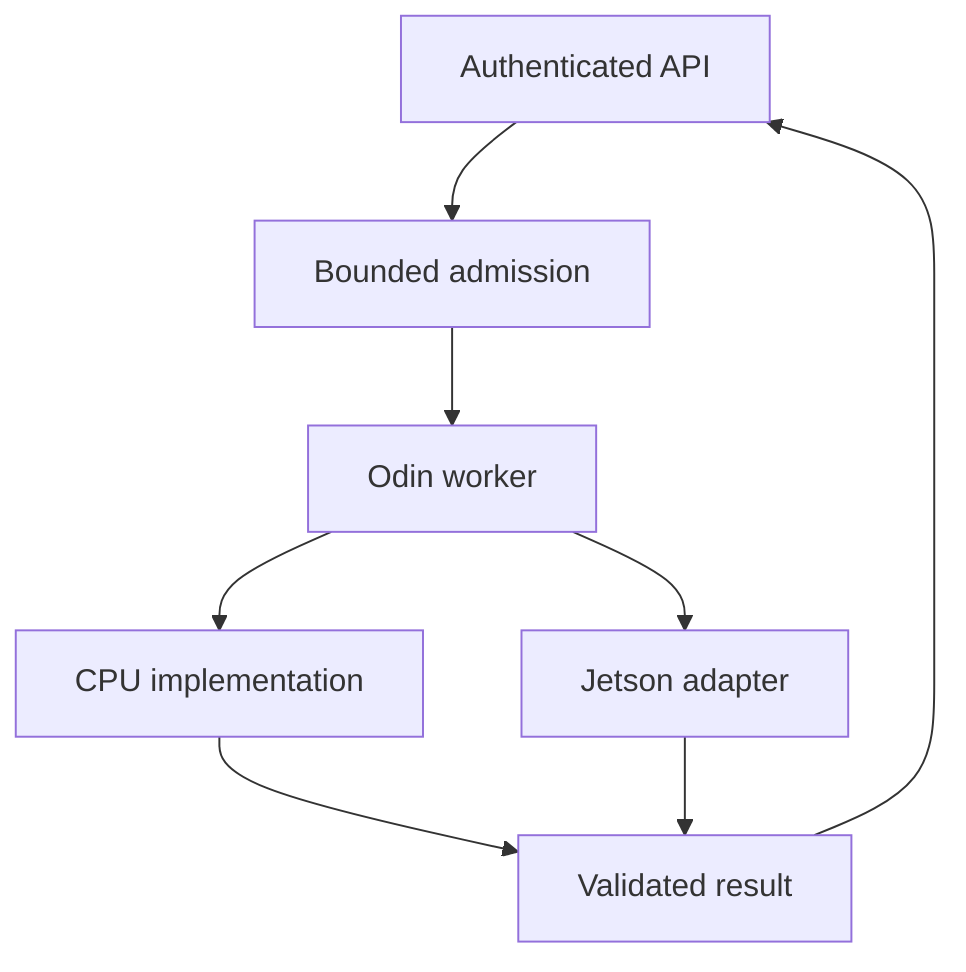

# Tiger Style for Odin

**Safety > performance > developer experience.**

A practical coding standard for Odin libraries, native workers, services, desktop components,
and Linux aarch64 device software. Modeled after the supplied Lua and Rust Tiger Style guides.
This is an independent adaptation of
[TigerBeetle's engineering philosophy](https://github.com/tigerbeetle/tigerbeetle/blob/main/docs/TIGER_STYLE.md),
not an official Odin or TigerBeetle standard.

| Policy | Baseline |
| --- | --- |
| Toolchain | Exact reviewed Odin release/commit and matching base/core/vendor tree |
| Foreign toolchain | Pinned compatible linker, SDK, C/C++ dependencies, and deployment ABI |
| Memory | Explicit owner, allocator, lifetime, and aggregate limit |
| Formatting | Four-space house style, 100-column target; one reviewed formatter configuration |
| Function size | Review ordinary procedures above 70 physical lines |
| Primary hosts | Arch Linux x86-64; tested Linux aarch64, macOS, and Windows lanes as required |
| Product scope | Desktop/native components and services; mobile/browser integration needs explicit target evidence |
| Review date | 2026-09-21; target support is a dated snapshot |

Odin can serve a full-stack product without being responsible for every UI, database driver,
or authentication layer. A Kotlin client/API with an Odin compute worker is a coherent design.
Choose in-process integration only when the additional ownership and failure coupling are
justified. Keep a usable CPU or remote path where a product promises portability.

## Contents

1. [Engineering contract](#1-engineering-contract)
2. [Platforms, hosts, and deployment](#2-platforms-hosts-and-deployment)
3. [Full-stack responsibilities](#3-full-stack-responsibilities)
4. [Toolchains and build trust](#4-toolchains-and-build-trust)
5. [Package structure and naming](#5-package-structure-and-naming)
6. [Types, state, and contracts](#6-types-state-and-contracts)
7. [Bounds, arithmetic, and representation](#7-bounds-arithmetic-and-representation)
8. [Allocation and context](#8-allocation-and-context)
9. [Lifetimes, aliases, and cleanup](#9-lifetimes-aliases-and-cleanup)
10. [Errors and commit points](#10-errors-and-commit-points)
11. [Concurrency and cancellation](#11-concurrency-and-cancellation)
12. [Foreign interfaces](#12-foreign-interfaces)
13. [Full-stack security and persistence](#13-full-stack-security-and-persistence)
14. [Desktop, phone, and browser integration](#14-desktop-phone-and-browser-integration)
15. [Jetson and accelerator ownership](#15-jetson-and-accelerator-ownership)
16. [Operating-system boundaries](#16-operating-system-boundaries)
17. [Performance and reproducibility](#17-performance-and-reproducibility)
18. [Complete reference package](#18-complete-reference-package)
19. [Tests, packaging, and editor integration](#19-tests-packaging-and-editor-integration)
20. [Review card and validation](#20-review-card-and-validation)

## 1. Engineering contract

For every important procedure, a reviewer should be able to identify permitted inputs,
maximum work, valid state, resource owner, mutation point, failure behavior, and evidence.
Avoid implicit conventions that require reading the whole program to establish one invariant.

Odin provides useful low-level control; it does not provide Rust's compile-time ownership
proofs. Pointers, aliases, foreign data, manual lifetime management, and concurrent access
require deliberate review. Do not call code “memory-safe” merely because it compiles or keeps
bounds checks enabled.

Prefer simple data and shallow control flow. A fixed buffer, explicit loop, or dedicated arena
can make a proof clearer, but is not automatically superior to a dynamic representation.
Choose according to the workload's limits, failure policy, and resource lifetime.

Every exception records the rule, need, affected targets, owner, compensating check, and
removal condition. Do not apply a blanket “performance” waiver to bounds checks, allocator
errors, authentication, or release testing.

## 2. Platforms, hosts, and deployment

The official installation guide lists compiler hosts including Linux and macOS on amd64 and
arm64, and Windows on amd64 with the MSVC toolchain. The FAQ lists amd64, arm64, and Wasm
architectures, while emphasizing that LLVM code generation alone does not establish a
supported ABI. See [Odin installation](https://odin-lang.org/docs/install/) and
[Odin platform FAQ](https://odin-lang.org/docs/faq/).

A CPU architecture is not a complete deployment target. Record OS, ABI, object format, libc,
minimum SDK/runtime, native libraries, graphics/compute APIs, and package format separately.
Do not infer Android support from Linux ARM64, iOS support from macOS ARM64, or Windows ARM64
support from Linux/macOS ARM64.

| Deployment | Project policy | Evidence required |
| --- | --- | --- |
| Linux x86-64 | Baseline native service/worker/desktop lane | Compiler, linker, libc, native dependencies, runtime tests |
| Linux aarch64 | Native worker/service lane; includes tested Jetson boards | Actual ARM64 libraries, board OS, runtime and hardware tests |
| Windows x86-64 | Native build/package lane using reviewed Windows toolchain | MSVC/SDK compatibility, DLL loading, installer and service behavior |
| Windows ARM64 | Conditional target; not claimed by this guide | Exact compiler target/ABI, ARM64 dependencies and native execution proof |
| macOS ARM64 / x86-64 | Separate supported product lanes when required | Apple SDK, linked frameworks, signing/notarization and runtime evidence |
| Android | Kotlin/native platform shell, remote service first | On-device Odin only after target, NDK/ABI, runtime, JNI and packaging proof |
| iOS/iPadOS | Kotlin/Swift platform shell, remote service first | On-device Odin only after compiler target, Apple SDK, C ABI and signing proof |
| Browser / mobile browser | Reviewed Wasm module or remote API | Host imports, memory interface, JS bridge, browser testing and delivery |

“Conditional” is a project support status, not a claim that implementation is impossible.
The reviewed documents do not establish a turnkey Odin mobile application pipeline. Prototype
and validate the entire pipeline before committing a product to it. A phone can reliably
consume an Odin service through the same versioned API as a desktop client.

For cross-compilation, inspect the exact pinned compiler's target list and help output.
Pin a target sysroot and matching foreign libraries; choose a deployment CPU baseline rather
than copying the build host's instruction set. Build success is not a runtime test. Emulation
can exercise some CPU paths, but does not validate GPU, driver, real-time, or device behavior.

## 3. Full-stack responsibilities

Use this table as a starting architecture, not a requirement to deploy microservices:

| Component | Default responsibility | Contract |
| --- | --- | --- |
| Kotlin desktop/mobile/web UI | User interaction and offline state | Versioned network API, platform lifecycle and permissions |
| Kotlin/JVM or other established API service | Transport, identity, authorization, transactions | Bounded request handling and authenticated worker admission |
| Odin worker | Native transformation, simulations, device I/O, data-oriented compute | Bounded protocol, explicit memory and cancellation ownership |
| Rust component | Memory-sensitive infrastructure or reviewed native adapters | Safe public interface with audited unsafe internals where necessary |
| Jetson GPU adapter | Driver/model handles and accelerator scheduling | Target-specific SDK and completion protocol |
| Lua tools/extensions | Editor integration and controlled automation | Declared capabilities and execution trust |

Keep stateful device ownership in one component. Do not let multiple language runtimes assume
they independently own the same camera, GPU stream, file descriptor, or model instance.
Use IPC when it reduces shared-memory or crash coupling. Start with a local socket or HTTP
protocol according to the trust boundary; do not introduce a new transport without a need.

A useful ownership diagram is:



The API authenticates and authorizes. Admission bounds queued/active work. The worker selects
an available implementation. Both implementations must satisfy the same result contract
before a response is published.

## 4. Toolchains and build trust

Pin the compiler release or full commit, matching standard collections, linker, and external
SDK/library revisions. Preserve an inventory of `base`, `core`, and `vendor`; the compiler
and those collections are one compatibility set. Do not silently mix a new compiler with
an old ODIN_ROOT. Record the value of ODIN_ROOT in reproducibility diagnostics.

The compiler's installation guide documents platform tooling requirements. Use a reviewed
LLVM/linker version compatible with the pinned compiler; choose the Windows SDK/MSVC and
Apple SDK in their respective CI lanes. Do not import a workstation's libraries accidentally
into a cross build. See [the build prerequisites](https://odin-lang.org/docs/install/).

Build as an ordinary user. On Arch, review PKGBUILDs/AUR helpers and isolate project toolchains
from rolling system changes. Keep executable downloads and Git revisions pinned and verified;
never pipe an unreviewed network script into a privileged shell.

Odin does not give this project an automatic dependency trust or locking policy. Use a
reviewed manifest, submodule commits, vendored revisions, or the chosen dependency tool's
lock mechanism. Include native binaries, generated bindings, shader tools, and code generators.
Compiler execution, build scripts, foreign compilation, tests, and debugger launch all need
the same execution-trust decision in editor, terminal, and CI.

Treat optimization and diagnostics flags as reviewed inputs. Keep assertions and bounds
checks in ordinary release code under this policy. Any local removal requires a measured
benefit, a replacement proof, and adversarial testing. Do not distribute a generic binary
compiled only for the developer machine's CPU.

## 5. Package structure and naming

Odin packages are directories. Keep files together by ownership/domain responsibility and
split OS implementations at narrow boundaries. Use explicit imports; avoid broad `using`
imports where they hide the origin of an operation. Declarations are public by default, so
mark implementation declarations private where needed. See the
[Odin language overview](https://odin-lang.org/docs/overview/).

Use `snake_case` for procedures, variables, and fields; this guide uses `Upper_Snake_Case`
for types and `UPPER_SNAKE_CASE` for policy constants. These are house conventions chosen
to fit the surrounding Odin ecosystem, not rules imposed by the compiler. Follow a bound
foreign API's spelling at its boundary rather than renaming it inconsistently.

Names carry units: `payload_size_bytes`, `output_bytes_max`, `item_count`, `deadline_ns`,
`queue_capacity`, `generation_id`. Distinguish native element counts from protocol lengths.
Use named option records instead of multiple boolean arguments with unclear meaning.

Choose a formatter compatible with the pinned toolchain and retain one repository
configuration. Four spaces is this guide's house rule; do not claim it is Odin's universal
upstream format. Compiler checking and semicolon removal are not a replacement for a formatter.
Review ordinary procedures over 70 lines at real state/ownership boundaries.

An example layout:

| Directory | Responsibility |
| --- | --- |
| `cmd/worker` | Process entry point and service lifecycle |
| `domain` | Bounded state and transformations |
| `protocol` | Versioned input/output codecs |
| `platform` | OS-specific files, clocks, processes and synchronization |
| `accelerators` | CPU/GPU implementation adapters |
| `ffi` | Narrow exported/imported C interfaces |
| `tests/fixtures` | Bounded, reproducible protocol and arithmetic cases |

## 6. Types, state, and contracts

Use enums and unions to represent alternatives, not several booleans whose combinations
can contradict one another. Keep a zero-initialized state valid or visibly uninitialized;
never treat a zero handle as an authenticated/open resource without the relevant API contract.

Use distinct domain types where mixing quantities would cause harm. Raw pointers and integer
handles must not stand in for validated identity. Validate enum values, lengths, and tagged
variants received from a wire or C interface before using them.

Keep internal invariants documented even when fields cannot be hidden by the chosen API.
A public struct's field relationships are not protected like a Rust type with private fields.
For a stronger boundary, expose operations around a private implementation or opaque handle
and validate handle generation/liveness.

A useful procedure contract is:

| Property | Example statement |
| --- | --- |
| Input | Valid borrowed bytes, at most 4,096 elements |
| Ownership | Caller retains input; callee copies before returning |
| Concurrency | Exactly one owner mutates this object |
| Mutation | Logical length changes only after all admitted bytes are written |
| Failure | Capacity rejection leaves the complete buffer unchanged |
| Lifetime | No input pointer retained after return |

Assertions enforce programmer-established invariants; malformed external data returns a
structured rejection. Avoid inserting required state changes inside an assertion expression.

## 7. Bounds, arithmetic, and representation

Bound work before allocation, decoding, indexing, pointer construction, and publication.
Make limits explicit for individual requests and aggregate service retention.

| Resource | Required limit |
| --- | --- |
| Input/output | Bytes, records, decoded expansion, nesting depth |
| Memory | Payloads plus descriptors, queues, scratch, alignment and allocator overhead |
| Work | Iterations, recursion depth or explicit-stack capacity, fan-out |
| Time | Monotonic deadline and cancellation observation interval |
| Concurrency | Active workers, queued requests, waiting producers |
| Retry | Attempts, total elapsed budget, and idempotency requirement |

Do not depend on overflow wrapping or a diagnostic to validate external sizes. Check
nonnegative counts and prove `count <= capacity - used` only after establishing
`0 <= used <= capacity`. For byte products, prove `count <= limit / element_size` before
multiplying, with explicit zero handling. Validate narrowing conversions before casting.

Use fixed-width integers for serialized fields and the declared ABI types for C interop.
Do not serialize a native struct with raw memory copying: padding, endianness, alignment,
`int` width, pointers, and compiler layout are not a wire format. `size_of`, `align_of`, and
ABI layout checks belong in interoperability tests, not as assumptions derived from amd64.

Strings and slices are views whose data lifetime matters. `len` and the iteration model are
not a user-interface character-count contract. Track UTF-8 bytes, scalar values, and graphemes
separately; C strings add termination requirements. A foreign `cstring` must be bounded by
an agreed allocation/length before it is scanned or copied.

Bound parser stacks explicitly. If malformed nesting can reach a procedure recursively,
replace it with a bounded work stack under this policy. Include cycles in tests for graph
inputs; a node count alone does not stop repeated traversal without a visitation policy.

## 8. Allocation and context

Odin's context carries allocator state. Allocation helpers may use `context.allocator`, and
changing it affects called Odin procedures. Choose an allocator for each lifetime rather
than relying on a hidden ambient choice. Explicitly record the matching release operation.
See [core:mem and allocator semantics](https://pkg.odin-lang.org/core/mem/).

| Lifetime | Possible allocation strategy | Required ownership rule |
| --- | --- | --- |
| Process configuration | Long-lived allocator | Release on orderly shutdown; avoid mutable global sharing |
| Worker/request scratch | Dedicated bounded arena | Reset only when no borrowed view, callback, or GPU operation can still use it |
| Asynchronous queued payload | Owned allocation/pool entry | Explicit transfer and completion/cancellation release |
| Frame-local UI data | Frame scratch | Never retain it in a later frame or foreign callback |
| Foreign/GPU storage | SDK allocator/handle | Free with that SDK after confirmed completion |

Arena use is not automatically allocation-free or bounded. Some arena implementations can
grow by obtaining more blocks. Enforce a capacity/failure policy and test allocator exhaustion.
A tracking allocator can help expose leaks; it does not prove absence of all lifetime errors.

Capture the intended allocator explicitly when lifetime crosses a procedure call, thread, or
callback. A context value is not an OS sandbox, authorization token, or synchronization
primitive. Do not assume a worker thread inherits a valid, thread-safe scratch allocator.

Prefer ordinary initialized allocation. Any deliberately uninitialized storage must be
fully written before every possible read; inspect error paths and partial I/O carefully.
Allocator failures are normal operational events where recovery is part of the contract.
Match the exact return/error semantics of the pinned core API instead of copying an old
allocation example whose signature has changed.

## 9. Lifetimes, aliases, and cleanup

Odin copies do not provide ownership-transfer semantics or automatic destructors. Copying a
slice, dynamic-array descriptor, or handle can create another view of the same resource.
Use explicit destruction and `defer` for normal scope cleanup. See
[Odin's ownership and cleanup FAQ](https://odin-lang.org/docs/faq/).

Register cleanup immediately after successful acquisition. Avoid closing a resource before
checking whether acquisition succeeded. Scope a per-iteration resource so it does not remain
live until the end of a long-running outer procedure. Keep cleanup idempotent where retries
or multiple shutdown paths can converge.

A `defer` is not crash recovery. Process termination, faults, power loss, or some test-runner
abort paths can bypass ordinary cleanup. Persistent correctness needs a transactional or
recovery design. A cleanup failure that affects correctness needs a visible error channel;
logging it is insufficient if the caller was promised a durable commit.

Avoid returning a view into a local array or reset scratch storage. Document whether returned
bytes are copied, borrowed, or newly owned. A borrowed view expires when its owner's contract
says it does, even if the pointer still has the same numeric value.

Review overlapping input/output slices before copying. Distinguish APIs that support overlap
from those that require disjoint memory; a valid length alone does not settle aliasing.
Do not double-delete copied owning descriptors. Logical clear/reset does not promise secure
erasure or revoke already exported aliases.

## 10. Errors and commit points

Use a result enum or `(value, error)` representation consistently at an API boundary.
Reserve zero/success values deliberately. Do not return a plausible default value after
I/O, allocator, parser, or foreign-library failure.

Prepare fallible resources before publishing state. Once a transaction/command can have
external effects, distinguish rejected, failed-before-commit, committed, and unknown outcome.
A timeout after an external write is not proof of rollback.

Preserve useful failure context without logging whole payloads, credentials, or native
memory. Bound diagnostics by count and bytes. Return stable machine-readable error codes;
human strings can change independently.

Close/flush/commit APIs may fail independently. If both the main operation and cleanup fail,
preserve the main failure and report the cleanup consequence without falsely reporting
success. Use a process-level health policy for invariant corruption; do not continue serving
requests from state that has not been revalidated.

## 11. Concurrency and cancellation

Assign each mutable object one owner or a documented synchronization protocol. Keep the lock
invariant and lock order visible. Do not hold a broad lock while waiting on network, disk,
GPU completion, or a foreign callback that might reenter the worker.

Use bounded work queues and byte-based admission. Reject, wait with a deadline, or replace
obsolete work according to a documented policy. A fixed number of threads can still retain
unbounded waiting payloads elsewhere in the application.

A long-running service loop owns its shutdown signal and performs bounded batches. Define
where cancellation is observed and what happens to pending/active items. Thread cancellation
and foreign-library cancellation are separate capabilities; do not free memory still in use
merely because the caller stopped waiting.

Use monotonic deadlines for elapsed budgets. Protect generation tokens with the same owner
or synchronization that publishes results. Avoid assuming x86 memory behavior will hide
missing synchronization on ARM64. Atomics require an ordering argument, not just an atomic
variable declaration.

Capture a valid Odin context at foreign/thread entry when required. Establish whether the
allocator can be used concurrently and whether the callback may outlive that context's
resources. Shutdown stops admission, signals active work, observes completion, and only then
releases shared allocators/device handles.

## 12. Foreign interfaces

Use an explicit C calling convention for an exported C ABI; the default Odin convention has
an implicit context and other ABI behavior that must not be assumed compatible. Non-Odin
entry points must establish context before calling procedures that need it.
See [calling conventions and context](https://odin-lang.org/docs/overview/#calling-conventions).

Keep foreign headers and generated bindings versioned. Wrap C++-only APIs behind a small C
surface instead of pretending that a C++ class layout is a stable C ABI. Use fixed-width
status fields, explicit lengths, opaque handles, and a version/capability query.

| Interface field | Required contract |
| --- | --- |
| Pointer | Alignment, nullability, allocation extent, initialized region |
| Length | Bytes or elements; signedness, upper bound, overflow checks |
| Handle | Owner, generation, allowed threads, closed-state behavior |
| Callback | Calling convention, registration lifetime, threading/reentrancy |
| Result | Status code, partial-write policy, who owns returned storage |
| Allocator | Exact matching free API; never mix runtimes by assumption |

Do not pass Odin slices, strings, maps, or dynamic-array descriptors directly as a public C
wire contract. Define a C-compatible representation with separately stated ownership. Network
serialization remains a different boundary from the C ABI.

Kotlin/JVM and Android generally enter native code through a JNI adapter; Kotlin/Native uses
its C interop path. A Rust library should expose a reviewed C surface or speak IPC. Lua state
and callbacks require their own thread/lifetime policy. Wasm exports/imports require a host
bridge and are not equivalent to loading a system shared library.

Foreign failures must not unwind through unsupported boundaries. Do not let a Kotlin exception,
Rust panic, C++ exception, or fatal Odin invariant masquerade as an ordinary cross-language
return. Test invalid handles, short buffers, cancellation, callbacks-after-close, and ABI
layout on each supported architecture.

## 13. Full-stack security and persistence

Odin is not automatically an HTTP framework, identity provider, database driver, or TLS
implementation. Select maintained libraries or put those responsibilities in an established
API layer. A binding's presence does not establish application-level safety.

Authenticate service peers and authorize each operation. Workers must not assume every local
caller is authorized merely because IPC is used. Bind to deliberately selected addresses,
restrict peer access, and validate all framed messages before allocation or dispatch.

A worker protocol needs version, request ID, payload bounds, deadline/cancellation semantics,
result code, and an idempotency policy. Reject unknown critical fields or versions according
to the compatibility contract. Use shared golden test vectors across Kotlin, Rust, Odin, and
Lua tools; do not parse log text as a protocol.

Use established TLS/crypto libraries with verification enabled. Keep secrets out of argv,
traces, and crash artifacts. Do not embed reusable service credentials in a distributed
mobile client. Restrict file/network/device capabilities to the operation being performed.

Use parameterized database operations and explicit transactions. Bound query results and
connection pools. Schema migrations need forward/backward compatibility and rollback or
roll-forward policy. A successful filesystem rename is not proof a database transaction is
durable, and an unacknowledged write can still have committed.

For disconnected devices, persist a bounded job/outbox record with stable identity and schema
version. Include replay/reconciliation behavior after reboot. Do not persist raw pointers,
GPU handles, allocator state, or thread-local context as application recovery data.

## 14. Desktop, phone, and browser integration

Keep rendering/input adapters separate from domain state. A graphics/window binding may
supply pixels and events without supplying accessible widgets, text input, file dialogs,
clipboard security, IME support, or platform permissions. Test each required capability.

| Client form | Required design |
| --- | --- |
| Desktop Odin UI | Reviewed window/graphics libraries, focus/input model, accessibility plan |
| Kotlin desktop/mobile UI + Odin worker | Versioned API or validated native adapter; independent lifecycle ownership |
| Browser UI + Odin service | Authenticated API, offline behavior, bounded message sizes |
| Browser Wasm component | Explicit host imports, memory growth cap, copy/ownership protocol, fallback |
| Native phone component | Verified compiler target, runtime, SDK, ABI, signing and app-store packaging |

Do not promise a phone port merely because the core algorithm has no OS imports. Mobile
processes can be suspended or killed. The platform shell owns background scheduling,
permissions, saved state, and lifecycle-aware cancellation. UI render loops must not block
on network or long-running native/GPU calls.

Test touch and pointer interaction, keyboard navigation, resize/orientation, display density,
font scaling, localization, and screen-reader behavior. Expose a meaningful unavailable or
remote mode when a native/accelerator capability is missing.

A Wasm artifact cannot directly use arbitrary POSIX calls, desktop DLL loading, or CUDA.
Define the browser/runtime imports and threat model explicitly. Wasm isolation does not
prevent a badly designed host API from granting excessive access.

## 15. Jetson and accelerator ownership

Use a supported Linux ARM64 lane for Orin Nano and AGX Orin, then validate the actual board,
carrier, Jetson Linux/JetPack version, and attached devices. Ordinary aarch64 code generation
is not proof of camera/GPU compatibility. Keep the vendor BSP stack separate from your Arch
workstation's rolling driver packages. See
[NVIDIA JetPack](https://developer.nvidia.com/embedded/jetpack).

Odin selecting an ARM64 CPU target does not compile Odin procedures into CUDA device kernels.
Use a reviewed CUDA/TensorRT adapter: a suitable foreign API, a small C/C++ wrapper, or an
isolated inference worker. Bindings must match the installed headers, libraries, and ABI.
Do not invent a compiler target that combines ARM64 and CUDA.

Assign ownership of device/context handles, models, streams, events, pinned host storage,
device buffers, and output views. An asynchronous launch can return while the GPU still
accesses memory. Require event/completion evidence before reusing/freeing that memory or
resetting its scratch arena. Check asynchronous error reporting at the appropriate completion
boundary as well as the immediate launch result.

A cancelled request may stop publication without stopping an already executing kernel.
Keep its buffers alive until the accelerator contract permits release. Where a driver call
cannot be reliably bounded or recovered, process isolation can be preferable to in-process
fault coupling; termination still needs a tested hardware/runtime recovery policy.

Do not assume serialized TensorRT engines move between workstation GPUs and Jetson boards.
Record model/engine hash, runtime, GPU compatibility settings, and build provenance; apply
only documented compatibility modes. See
[TensorRT support](https://docs.nvidia.com/deeplearning/tensorrt/latest/getting-started/support-matrix.html).

Budget actual board memory, including model weights, activation/workspace storage, shared
CPU/GPU buffers, queues, allocator overhead, and other services:

$$
M_{live} \le M_{shared} + Q M_{queued,max}
+ W(M_{input,max} + M_{output,max} + M_{scratch,max}) + M_{accelerator}.
$$

Identify physically shared storage to avoid double-counting. Set admission limits below the
measured safe ceiling. Test temperature/power throttling, peak concurrency, missing devices,
low memory, network loss, worker restart, and power-loss recovery on each claimed board class.
Do not tune power/clock settings in production without an explicit measured deployment policy.

## 16. Operating-system boundaries

Keep path discovery, filesystem access, process supervision, clocks, synchronization, and
service installation behind small OS adapters. Never scatter platform conditionals across
domain algorithms merely to access a path or timer.

Use XDG locations on Linux, known folders on Windows, Apple application/sandbox directories,
and mobile app-specific storage as appropriate. Keep cache, durable state, logs, and secrets
separate. Validate environment overrides. Do not hardcode `/home/...` or assume a writable
working directory in a packaged application.

Containment requires more than string prefixes or a one-time canonicalization. Define
symlink behavior and use race-resistant handle-based operations where required. Create secret
files with restrictive permissions initially. Bound recursive traversal, archive expansion,
file reads, and diagnostic output.

Use executable plus separate arguments for subprocesses through the selected OS adapter.
Avoid shell interpolation; arguments can still invoke dangerous options in the child, so
validate those semantics too. Account for Windows quoting, process trees, and inherited
handles. Drain stdout/stderr concurrently with caps; terminate and reap on deadline or cancel.

For durable updates, prepare in the destination filesystem, validate, flush/sync as required,
and publish with the target filesystem's supported atomic operation. Test locked files and
sharing behavior on Windows. Atomic visibility, write durability, and recoverability are
three different guarantees.

Run services with narrowly scoped filesystem/network/device access. Do not run the entire
application as root because one device permission is missing. Container CPU architecture,
libc, device runtime, and host driver compatibility must all be checked independently.

## 17. Performance and reproducibility

Prefer bounded batching, contiguous data, reduced copying, and allocator lifetime design
before low-level tricks. Data-oriented layout should match measured access patterns; structure
of arrays is not automatically faster than array of structures.

Measure throughput and latency distributions, resident memory, temporary peaks, CPU/GPU
utilization, startup, and power where relevant. Include rejected inputs and sustained load.
Record compiler revision, optimization flags, CPU features, linker, dataset, SDK, board,
cooling, and power mode. A short burst on a cool board is not a steady-state service benchmark.

Use explicit scalar fallbacks or distinct builds for optional instruction sets. Validate
alignment rather than assuming an x86-friendly access is valid or efficient on ARM64. Avoid
assuming identical floating-point reductions, FMA behavior, or denormal treatment across
compilers/devices; define the numerical acceptance contract.

Use deterministic traversal/order where it affects persisted output, diagnostics, or tests.
Seed generated tests explicitly and retain reproducing cases. Reproducibility also includes
protocol schemas, model versions, and native SDK artifacts, not only source revision.

## 18. Complete reference package

This standalone package demonstrates fixed storage, bounded append, a pre-mutation capacity
check, copy-out instead of a returned internal alias, and tests for rejection without mutation.
It uses no dynamic allocation in its buffer operations. **It was not compiled here.**

Save the fence as `bounded_bytes.odin` in an otherwise isolated package directory, then run
`odin test .` with the reviewed compiler. The testing interface is documented in
[core:testing](https://pkg.odin-lang.org/core/testing/).

The object has a fixed maximum of 4,096 bytes and a chosen logical capacity. The public struct
is a caller-owned demonstration, not opaque enforced encapsulation. Fields must not be
mutated except by these procedures. One owner may mutate it at a time. Input and destination
must be valid for their lengths and must not overlap the object's backing storage. Invalid
pointer provenance/lifetime cannot be repaired by checking an integer length.

<details>
<summary>Open bounded_bytes.odin — implementation and tests</summary>

```odin
package bounded_bytes

import "core:testing"

CAPACITY_BYTES_MAX :: 4096

Buffer_Status :: enum {
    Ok,
    Invalid_Capacity,
    Invalid_State,
    Capacity_Exceeded,
    Destination_Too_Small,
}

Bounded_Bytes :: struct {
    storage:  [CAPACITY_BYTES_MAX]u8,
    length:   int,
    capacity: int,
}

buffer_init :: proc(buffer: ^Bounded_Bytes, capacity: int) -> Buffer_Status {
    assert(buffer != nil)
    if capacity < 0 || capacity > CAPACITY_BYTES_MAX {
        return .Invalid_Capacity
    }
    buffer^ = Bounded_Bytes{capacity = capacity}
    return .Ok
}

buffer_valid :: proc(buffer: ^Bounded_Bytes) -> bool {
    assert(buffer != nil)
    return buffer.capacity >= 0 && buffer.capacity <= CAPACITY_BYTES_MAX &&
        buffer.length >= 0 && buffer.length <= buffer.capacity
}

buffer_append :: proc(buffer: ^Bounded_Bytes, input: []u8) -> Buffer_Status {
    assert(buffer != nil)
    if !buffer_valid(buffer) {
        return .Invalid_State
    }
    available := buffer.capacity - buffer.length
    if len(input) > available {
        return .Capacity_Exceeded
    }
    // Admission proves the index and new length fit the backing array.
    end := buffer.length + len(input)
    for value, index in input {
        buffer.storage[buffer.length + index] = value
    }
    buffer.length = end
    return .Ok
}

buffer_copy_out :: proc(
    buffer: ^Bounded_Bytes,
    destination: []u8,
) -> (written: int, status: Buffer_Status) {
    assert(buffer != nil)
    if !buffer_valid(buffer) {
        return 0, .Invalid_State
    }
    if len(destination) < buffer.length {
        return 0, .Destination_Too_Small
    }
    for index in 0..<buffer.length {
        destination[index] = buffer.storage[index]
    }
    return buffer.length, .Ok
}

buffer_clear :: proc(buffer: ^Bounded_Bytes) -> Buffer_Status {
    assert(buffer != nil)
    if !buffer_valid(buffer) {
        return .Invalid_State
    }
    buffer.length = 0
    return .Ok
}

@(test)
zero_and_invalid_capacity :: proc(t: ^testing.T) {
    buffer: Bounded_Bytes
    testing.expect(t, buffer_init(&buffer, -1) == .Invalid_Capacity)
    testing.expect(t, buffer_init(&buffer, CAPACITY_BYTES_MAX + 1) == .Invalid_Capacity)
    testing.expect(t, buffer_init(&buffer, 0) == .Ok)
    empty: []u8
    one := [1]u8{7}
    testing.expect(t, buffer_append(&buffer, empty) == .Ok)
    testing.expect(t, buffer_append(&buffer, one[:]) == .Capacity_Exceeded)
    testing.expect(t, buffer.length == 0)
}

@(test)
rejection_preserves_buffer :: proc(t: ^testing.T) {
    buffer: Bounded_Bytes
    testing.expect(t, buffer_init(&buffer, 4) == .Ok)
    initial := [2]u8{1, 2}
    excess := [3]u8{3, 4, 5}
    testing.expect(t, buffer_append(&buffer, initial[:]) == .Ok)
    before := buffer
    testing.expect(t, buffer_append(&buffer, excess[:]) == .Capacity_Exceeded)
    testing.expect(t, buffer.length == before.length)
    testing.expect(t, buffer.capacity == before.capacity)
    for index in 0..<CAPACITY_BYTES_MAX {
        testing.expect(t, buffer.storage[index] == before.storage[index])
    }
}

@(test)
exact_capacity_copy_and_reuse :: proc(t: ^testing.T) {
    buffer: Bounded_Bytes
    testing.expect(t, buffer_init(&buffer, 4) == .Ok)
    input := [4]u8{1, 2, 3, 4}
    testing.expect(t, buffer_append(&buffer, input[:]) == .Ok)
    input[0] = 99
    testing.expect(t, buffer.storage[0] == 1)
    short := [3]u8{9, 9, 9}
    written, status := buffer_copy_out(&buffer, short[:])
    testing.expect(t, status == .Destination_Too_Small && written == 0)
    testing.expect(t, short[0] == 9 && short[1] == 9 && short[2] == 9)
    output: [4]u8
    written, status = buffer_copy_out(&buffer, output[:])
    testing.expect(t, status == .Ok && written == 4)
    for value, index in output {
        testing.expect(t, value == u8(index + 1))
    }
    output[0] = 99
    testing.expect(t, buffer.storage[0] == 1)
    testing.expect(t, buffer_clear(&buffer) == .Ok)
    testing.expect(t, buffer.length == 0)
    testing.expect(t, buffer_append(&buffer, output[:1]) == .Ok)
}

@(test)
maximum_and_invalid_state :: proc(t: ^testing.T) {
    buffer: Bounded_Bytes
    testing.expect(t, buffer_init(&buffer, CAPACITY_BYTES_MAX) == .Ok)
    input: [CAPACITY_BYTES_MAX]u8
    testing.expect(t, buffer_append(&buffer, input[:]) == .Ok)
    one := [1]u8{1}
    testing.expect(t, buffer_append(&buffer, one[:]) == .Capacity_Exceeded)
    buffer.length = -1 // Deliberate invariant fault injection.
    testing.expect(t, buffer_append(&buffer, one[:]) == .Invalid_State)
}
```

The tests copy fixed arrays, so they exercise more stack storage than a single buffer. Do
not increase the example constant into megabytes without reviewing stack/object placement.
Successful reinitialization replaces the logical object; callers must not retain aliases
across it. `buffer_clear` does not wipe the previous bytes.

Validation commands for the isolated package:

```sh
odin version
odin test .
odin test . -o:speed
```

These are instructions, not a recorded passing run. Keep safety checks enabled and verify
flags against the exact pinned compiler. Add model-based/property tests and allocation/FFI
failure tests when adapting this pattern to a dynamic or asynchronous implementation.

</details>

## 19. Tests, packaging, and editor integration

Test contracts before implementation details. Include zero, one, limit minus one, exact
limit, limit plus one, signed/unsigned conversion, malformed enums, short buffers, overlapping
views where the API supports them, allocator exhaustion, and failure before commit.
Test repeated close/cancel, stale handles, thread races, delayed callbacks, and shutdown with
active work. Invalid-pointer tests require a suitable isolated harness; do not corrupt the
production test runner merely to generate arbitrary addresses.

| Lane | Evidence required before claiming product support |
| --- | --- |
| Linux amd64 | Debug/optimized tests, deployment libc, service installation and recovery |
| Linux ARM64 / Jetson | Native CPU tests plus actual target GPU/device/thermal tests |
| Windows amd64 | MSVC/SDK build, DLL/CRT compatibility, installer/service and update tests |
| macOS | Claimed CPU variants, frameworks, signing, package and UI tests |
| Android/iOS native component | Compiler/ABI/SDK proof plus physical-device integration and lifecycle |
| Browser Wasm | Actual browser/runtime imports, memory limits, host permissions and fallback |
| Cross-language boundary | Golden protocol vectors and C ABI layout/lifetime tests on every target |

Compiler checking, formatter checking, tests, sanitizer support, and runtime packaging are
separate gates. Use memory/race tools only on targets where the pinned stack supports them;
record exclusions rather than treating an unavailable tool as a pass. Test optimized builds
because optimization can expose assumptions hidden in a debug run.

For distributed artifacts, record compiler, target, flags, linked libraries, symbols,
licenses, and dependency/model inventory. Produce target-specific packages and OCI images.
Use appropriate platform signing/update mechanisms and retain a safe rollback path for the
application and its data schema. Do not require every developer to hold production keys.

In Diver, this document can live at `lua/config/lang/TIGER_STYLE_ODIN.md`; it is reference
material, not a Lua module. Pin an Odin language server compatible with the compiler, and
ensure editor and terminal agree on ODIN_ROOT, collection paths, build defines, and target.
Keep formatter ownership singular and reject stale asynchronous diagnostics.

Use Markdown, tables, fenced examples, and collapsible review cards. Keep code examples
labeled as complete packages or fragments. Documentation must remain useful without active
HTML/JavaScript and without nonexistent media assets.

## 20. Review card and validation

<details>
<summary>Open the Odin review checklist</summary>

- [ ] The complete host/target/SDK/ABI/package matrix is recorded and tested.
- [ ] Mobile/Windows ARM64/browser claims have target-specific evidence, not CPU inference.
- [ ] Compiler and base/core/vendor revisions match; external artifacts are reviewed/pinned.
- [ ] Input validation precedes arithmetic, allocation, indexing, and privileged operations.
- [ ] Types and state transitions carry domain meaning; zero states are deliberate.
- [ ] Work, memory, queues, producers, output, nesting, retries, and time are bounded.
- [ ] Every allocation/view/handle has a documented owner, allocator, and lifetime.
- [ ] Scratch reset cannot invalidate an active callback, queued payload, or GPU access.
- [ ] Owning descriptors are not accidentally copied, double-freed, or retained after close.
- [ ] Error and cleanup paths preserve the commit/result contract.
- [ ] Concurrency has a synchronization argument valid on ARM64 as well as amd64.
- [ ] Cancellation cannot publish stale output or release still-used foreign resources.
- [ ] FFI calling convention, context, layout, alignment, lengths, and release API are explicit.
- [ ] Protocols and database changes preserve authorization, idempotency, and compatibility.
- [ ] GPU code and engine artifacts match the actual Jetson software/hardware stack.
- [ ] UI, packaging, signatures, update/recovery, and device behavior are tested per target.
- [ ] Performance claims include sustained-load measurements and their environment.
- [ ] Validation records distinguish review, compilation, execution, and hardware evidence.

</details>

**Validation record:** the attached guides were reviewed and the linked official Odin,
Kotlin, and NVIDIA documentation informed the target/interface guidance. Markdown structure
and code-fence layout were checked locally. No Odin compiler was installed; the complete
reference package, test commands, formatter configuration, language server, foreign adapters,
and OS/device packages were not compiled or executed. No mobile or Jetson hardware validation
was performed. This guide intentionally does not certify an untested mobile toolchain.

**Maintenance:** revisit the guide when compiler/core APIs, target support, SDKs, allocator
policy, foreign contracts, deployment privileges, or resource budgets change. Keep the rule,
its justified exceptions, and the evidence together.
