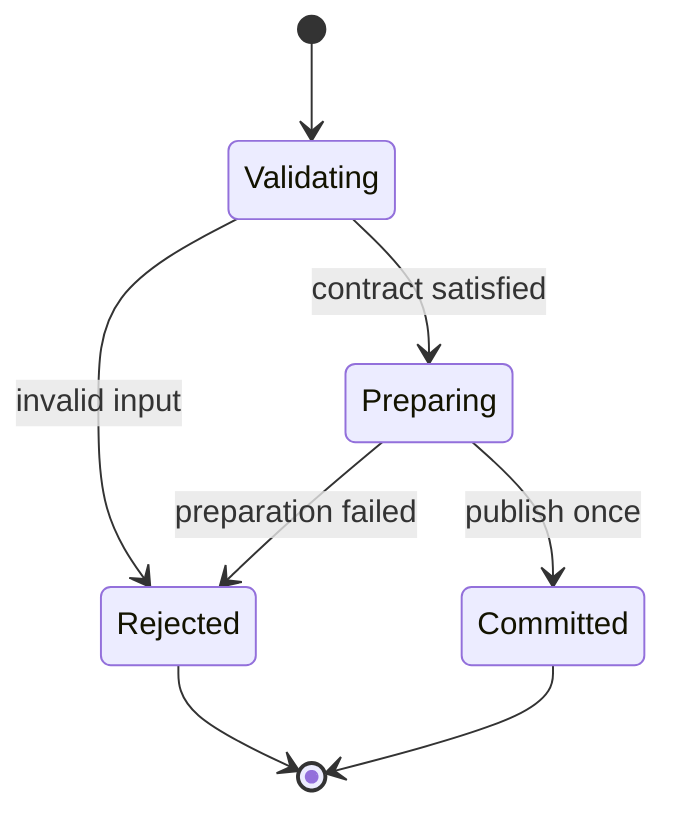

# Tiger Style for Rust

**Safety > performance > developer experience.**

A practical coding standard for Rust services, command-line tools, libraries, and editor
helpers on Arch Linux. Written for the Diver language documentation directory and adapted
from the supplied Lua guide. This is an independent interpretation of
[TigerBeetle's Tiger Style](https://github.com/tigerbeetle/tigerbeetle/blob/main/docs/TIGER_STYLE.md),
not an official TigerBeetle or Rust document.

| Policy | Baseline |
| --- | --- |
| Edition | Rust 2024 |
| Project toolchain | An exact, reviewed nightly date; preserve Diver's existing policy |
| Examples | Stable language features unless explicitly marked otherwise |
| Formatting | `rustfmt`, four spaces, 100-column target |
| Function size | Review ordinary functions above 70 physical lines |
| Primary platform | Arch Linux; portability claims require target-specific checks |
| Document reviewed | 2026-09-20 |

The nightly policy does not require unstable features. The complete reference module below
uses stable Rust and was tested separately from the user's configuration. Validation details
are recorded at the end.

## Contents

- [1. Engineering contract](#1-engineering-contract)
- [2. Toolchain and build trust](#2-toolchain-and-build-trust)
- [3. Structure and naming](#3-structure-and-naming)
- [4. Types and state](#4-types-and-state)
- [5. Contracts and errors](#5-contracts-and-errors)
- [6. Bounds and arithmetic](#6-bounds-and-arithmetic)
- [7. Ownership and memory](#7-ownership-and-memory)
- [8. Control flow and concurrency](#8-control-flow-and-concurrency)
- [9. Unsafe code and foreign interfaces](#9-unsafe-code-and-foreign-interfaces)
- [10. Operating-system boundaries](#10-operating-system-boundaries)
- [11. Performance and reproducibility](#11-performance-and-reproducibility)
- [12. Tests and review gates](#12-tests-and-review-gates)
- [13. Complete reference module](#13-complete-reference-module)
- [14. Neovim integration](#14-neovim-integration)
- [15. Documentation and media](#15-documentation-and-media)
- [16. Review card and validation](#16-review-card-and-validation)

## 1. Engineering contract

Correctness comes before speed. Speed comes before convenience when the tradeoff is real.
Measure that tradeoff; do not use the priority order to justify speculative complexity.

Every substantial operation must identify:

1. Accepted inputs, rejected inputs, and the trust boundary.
2. Maximum work, memory, output, and elapsed time.
3. The owner of every allocation, handle, task, and subprocess.
4. The point at which externally visible state changes.
5. Failure behavior, cancellation behavior, and cleanup obligations.
6. The evidence supporting the result: tests, measurements, or a written invariant.

Safe Rust is a foundation. It does not enforce authorization, bounded queues, appropriate
retry policies, secrecy of logs, or application-level state transitions. Treat these as
explicit design obligations.

Use this rule for exceptions: name the rule, explain the need, bound the resulting risk,
and record a test or review condition. An exception belongs near the affected code or in
its design record. Blanket waivers are difficult to maintain.

Prefer a direct implementation that a reviewer can reason about. Do not ban iterators,
traits, heap allocation, or generics merely because they are abstractions. Require them to
make ownership, cost, and failure clearer.

## 2. Toolchain and build trust

Pin a toolchain in the Rust project's root, not in the Neovim configuration solely because
this guide lives there. This is a template: replace the date before using it.

```toml
# rust-toolchain.toml — TEMPLATE; choose a tested date.
[toolchain]
channel = "nightly-YYYY-MM-DD"
profile = "minimal"
components = ["rustfmt", "clippy", "rust-src"]
```

An environment override can change the selected toolchain. Record `rustup show active-toolchain`,
`rustc --version --verbose`, and `cargo --version` when diagnosing discrepancies between
terminal, editor, and CI. See the official
[rustup override rules](https://rust-lang.github.io/rustup/overrides.html).

Every unstable feature needs a specific benefit, an owner, a validation path, and a removal
condition. Do not copy obsolete feature gates into new code. For example, let chains are
stable in Rust 1.88 and require edition 2024; they do not need a nightly feature gate on that
baseline. See the [edition guide](https://doc.rust-lang.org/edition-guide/rust-2024/let-chains.html).

Commit application and workspace lockfiles. Keep a reviewed lockfile for reproducible
library development too, while remembering that downstream library users resolve their own
dependency graph. Review registry changes, Git revisions, features, licenses, and native
build dependencies. A lockfile pins resolution; it does not certify a dependency as safe.

Build scripts and procedural macros are executable code. Opening an unfamiliar repository
must not silently authorize its builds, macro expansion, tests, or debugger launch. Apply
the same workspace trust decision in the editor and the terminal.

On Arch Linux, keep project compiler versions separate from rolling system updates. Record
linker, target, libc assumptions, and relevant native libraries. Use ordinary user privileges
for builds. Review AUR build instructions before executing them; package availability is
not a trust guarantee. Never solve a build permission problem with a privileged Cargo run.

For projects that want release overflow checks, make the policy explicit:

```toml
# Cargo.toml — merge with the existing profile; do not overwrite other settings.
[profile.release]
overflow-checks = true
```

Cargo's development and release defaults differ. This setting is defense in depth; checked
operations still express recoverable overflow at input boundaries. Choose panic behavior
separately: aborting can bypass destructors. See
[Cargo profiles](https://doc.rust-lang.org/cargo/reference/profiles.html).

## 3. Structure and naming

Use `snake_case` for modules, functions, fields, and locals; `UpperCamelCase` for types and
traits; `SCREAMING_SNAKE_CASE` for constants. Names carry domain meaning and units:
`output_bytes_max`, `deadline`, `retry_count`, `queue_capacity`, `elapsed_ms`.

Prefer named structs and enums to ambiguous tuples and boolean arguments. A call such as
`open_cache(path, true, false)` hides policy. Use an options type with named fields when the
choices are independently meaningful.

Keep visibility narrow: private first, then `pub(crate)`, then `pub` when a real external API
requires it. Put the public contract before private machinery. Split modules around state
ownership and domain responsibilities, not an arbitrary line count.

Use `rustfmt` as the mechanical authority. Keep comments about intent, proof, and tradeoffs;
remove comments that simply narrate syntax. Review ordinary functions over 70 physical
lines. Split at meaningful contracts, not into one-use helpers that obscure a single proof.

Use explicit imports. Avoid wildcard imports in production modules. Prefer a local type
annotation where inference hides an important width, ownership conversion, or error type.
Do not annotate every obvious local merely to make the file longer.

A small reviewed `rustfmt.toml` can establish the shared baseline:

```toml
edition = "2024"
max_width = 100
hard_tabs = false
tab_spaces = 4
```

Treat compiler and Clippy warnings as actionable. Suppress a particular lint only at the
smallest applicable scope, with a reason. Do not enable every pedantic lint indiscriminately
and then silence the resulting noise globally.

## 4. Types and state

Represent distinct concepts with distinct types when confusing them could violate a
contract: byte offsets versus element counts, authenticated identity versus user-supplied
identity, validated configuration versus raw configuration.

Use enums for mutually exclusive states. Avoid combinations such as `started`, `finished`,
`failed`, and `cancelled` booleans that can contradict one another. Exhaustive matching makes
new states visible to existing code.

Keep fields private when their relationship is an invariant. Expose constructors that
validate and methods that preserve that relationship. Deserialization is another constructor;
it must not bypass validation by populating supposedly validated fields directly.

Prefer `Option<T>` for legitimate absence and `Result<T, E>` for failure. Avoid magic values
such as `-1`, empty paths, or an all-zero identifier unless the protocol explicitly assigns
that meaning. Do not convert failure into an empty collection and report success.

A state transition follows **validate → prepare → commit → observe**. Validate before mutation;
prepare fallible resources before publishing new state. If rollback is impossible, document
partial progress and return enough information for the caller to recover safely.



Text equivalent: rejected validation or preparation leaves the published state unchanged;
only successful preparation reaches the commit point.

## 5. Contracts and errors

Validate external input with ordinary control flow and return a meaningful error. Assert
facts that a correct implementation has already established. An attacker supplying malformed
input is not an internal invariant failure.

| Situation | Preferred response |
| --- | --- |
| Invalid user input, protocol data, or configuration | A typed error with bounded context |
| Expected missing value | `Option`, or a domain error if absence violates the request |
| Corrupt internal relationship | `assert!` or an explicit invariant failure |
| Expensive redundant development check | `debug_assert!` |
| Unavailable optional tool | Explicit unavailable status; no fabricated success |

`assert!` remains active in release builds; `debug_assert!` normally does not. Neither should
replace a recoverable input check. Never put required mutation inside an assertion expression.
See [Rust's assertion documentation](https://doc.rust-lang.org/std/macro.assert.html).

Library errors should be structured enough for callers to decide what to do. Preserve the
cause when adding context. Human-readable text is for people, not a stable parsing protocol.
Keep sensitive paths, credentials, and payloads out of default messages.

Use `?` to propagate failure where the caller owns recovery. Match explicitly when a failure
changes cleanup, retry policy, or state. Do not silently discard `Result` with `let _ =` unless
the operation is intentionally best-effort and its loss is recorded or justified.

Avoid `unwrap()` and `expect()` on external data, I/O, lock acquisition, and subprocess results.
An `expect()` for a proven internal property needs that proof nearby. Tests may use these
methods to make failures immediate and readable.

Panic is not ordinary error handling. Do not use `catch_unwind` as general recovery from
corrupted state. Destructors must not depend on successfully reporting fallible business
operations; provide explicit `finish`, `flush`, or `close` behavior where the result matters.

## 6. Bounds and arithmetic

Name resource limits with units. Choose values from the actual workload and operational
budget; the reference module's limits are examples, not universal defaults.

| Resource | Required contract |
| --- | --- |
| Input | Maximum bytes, records, nesting depth, and decoded expansion |
| Work | Maximum iterations, retries, and fan-out per request |
| Memory | Live objects, aggregate bytes, and temporary duplication |
| Output | Captured bytes and diagnostic count, including truncation behavior |
| Time | Deadline and the behavior when cancellation is not immediate |
| Concurrency | Queue capacity, active workers, and admission policy |

Use fixed-width integers for wire and disk formats. Use `usize` for native indexing after
checked conversion. Avoid unchecked `as` casts for externally supplied sizes. Use `TryFrom`
when conversion can fail, and propagate the failure.

Use checked arithmetic for sizes, offsets, deadlines, and allocation products. Validate an
index range without first computing a possibly overflowing end:

```rust
// Standalone helper; returning None means an invalid or unrepresentable range.
fn checked_end(offset: usize, count: usize, length: usize) -> Option<usize> {
    let remaining = length.checked_sub(offset)?;
    if count > remaining {
        return None;
    }
    offset.checked_add(count)
}
```

Saturating arithmetic is appropriate only when saturation is the specified result. Wrapping
arithmetic belongs in algorithms and protocols that explicitly require modular arithmetic.
Do not turn overflow into a smaller accepted allocation.

For floating-point input, decide whether infinities, NaNs, signed zero, denormals, and loss of
precision are allowed. Test those decisions. A tolerance must have units and a reason; a
large arbitrary epsilon can hide an algorithmic error.

Bound aggregate memory, not only individual objects. For workers that each retain one input
and one output, a planning upper bound is:

$$
M_{total} \le M_{shared} + W(M_{input,max} + M_{output,max} + M_{scratch,max}).
$$

This is a budget model, not an allocator measurement. Include queue storage, allocator
rounding, thread stacks, duplicated buffers, and subprocesses in the deployed budget.

## 7. Ownership and memory

Borrow for inspection; take ownership when retaining or transferring a resource is part of
the contract. Prefer `&str`, `&[T]`, and narrow domain references over a larger container when
only a view is needed. Choose lifetimes that describe real ownership, not merely satisfy the
compiler through leaked memory or unnecessary reference counting.

Treat `.clone()` as an explicit cost and semantic decision. Cloning an `Arc` is different
from cloning a large buffer. Document expensive copies and include their peak memory in the
budget. Shared ownership does not replace a shutdown protocol.

A `Vec` capacity is reserved storage, not a maximum length. Reject excessive growth before
pushing or extending. Use `try_reserve` where allocation failure should become a recoverable
error, but keep an independent logical cap. Reservation can exceed the requested amount.
See the [Vec API](https://doc.rust-lang.org/std/vec/struct.Vec.html).

Fixed arrays can simplify bounded storage, but large arrays may exhaust a thread stack or
produce expensive moves. Review the size and allocation location. Do not turn a small fixed
buffer example into a megabyte-scale stack object without measurement.

Use RAII for ordinary resources. Name the owner of cleanup explicitly when work escapes a
scope through a task, callback, reference-counted object, or subprocess. Do not depend on
process exit to close long-lived resources during normal operation.

Keep allocation outside tight loops when practical. Reuse buffers with explicit reset
semantics. Clearing a buffer does not promise secure erasure of its previous contents; secret
handling requires a separately reviewed memory and lifetime policy.

## 8. Control flow and concurrency

Prefer early returns and shallow branches. Loops need a finite input bound, an explicit
iteration budget, or a service lifecycle with bounded batches and cancellation. Use an
explicit stack with a depth cap instead of recursion in production paths under this policy.

A service loop may be intentionally long-lived. Each turn must still bound work and yield
control. Record when new work is rejected, delayed, or dropped. Never disguise dropped work
as successful completion.

Use bounded queues. Define behavior for a full queue: reject, block until a deadline, or
replace obsolete work. A queue of pointers can still retain an unbounded payload unless
admission counts the referenced bytes.

For locks, document the protected invariant and any lock ordering. Minimize critical
sections. Do not hold a blocking mutex across an `.await`. Choose poisoning recovery only
when the protected state can be revalidated; do not blindly call `into_inner()` everywhere.

Async cancellation is runtime- and operation-specific. Dropping a future does not guarantee
that already-started external work has stopped. Own task handles, drain or abort according
to a documented policy, and observe completion. Spawned blocking work and child processes
need their own termination design.

Use a generation token for work whose result can become stale. Capture the input identity,
version, and options when starting. Before publishing, check the token and the current
object's validity. Cancellation saves resources; a freshness check protects correctness.

Retries require a retryable error class, bounded attempts, a total deadline, and an
idempotency argument. Retries after a possibly successful write can duplicate effects.

## 9. Unsafe code and foreign interfaces

Default to safe Rust. For a crate that requires no unsafe code, a crate-level policy is:

```rust
#![forbid(unsafe_code)]
```

A crate that genuinely needs unsafe code cannot use that prohibition for the same code.
Instead, isolate the boundary, require review, and consider
`#![deny(unsafe_op_in_unsafe_fn)]` to keep unsafe operations visibly scoped.

Every unsafe operation needs a local safety explanation covering applicable obligations:
valid allocation, provenance, alignment, initialized elements, bounds, aliasing, lifetime,
thread access, and the corresponding foreign API contract. “The caller knows” is insufficient
unless that obligation is part of an explicit public safety contract.

An unsafe block does not permit undefined behavior. The reference defines the obligations;
review assumptions whenever representation or ownership changes. See
[behavior considered undefined](https://doc.rust-lang.org/reference/behavior-considered-undefined.html).

For FFI, define ABI, representation, encoding, nullability, length units, ownership transfer,
and the allocator responsible for release. Keep callbacks alive for exactly the promised
period. Do not allow unwinding across a boundary that does not support it. Translate errors
at the boundary using the agreed foreign representation.

Avoid exposing safe wrappers that accept pointers or lengths without proving the invariants
required by their internal unsafe code. Add adversarial tests to the wrapper, not only happy
path tests to the foreign routine.

Use Miri where supported to exercise unsafe assumptions. It detects problems on executed
paths; it is not a proof of soundness and does not model every foreign interaction.
See [Miri's supported checks and limitations](https://github.com/rust-lang/miri).

## 10. Operating-system boundaries

### Paths and files

Treat a path as a request, not authorization. String prefix checks do not establish directory
containment. Canonicalization alone cannot eliminate races with concurrent filesystem
changes. Sensitive operations need a reviewed handle-based traversal/open policy and a
clear symlink policy.

Keep configuration, persistent state, and cache distinct. Respect configured XDG locations
and validate environment-derived paths. Use restrictive permissions when creating secrets;
changing permissions afterward leaves a possible exposure interval.

Write important updates through a temporary file in the destination filesystem, then rename
at the commit point. Atomic visibility and crash durability are different requirements:
flush/sync the file and parent directory as required by the filesystem and durability
contract. Handle failures without reporting that persistence succeeded.

Use libraries with secure temporary-file creation rather than guessing a filename and then
opening it. Bound directory traversal, archive extraction, decompression, and file reads.
Reject archive entries that escape the authorized destination.

### Processes

Pass an executable and separate argument values with `std::process::Command`. On Linux this
does not invoke a shell implicitly. Keep the executable choice, working directory, and
environment explicit; arguments can still trigger the target program's own dangerous
options. See [Command](https://doc.rust-lang.org/std/process/struct.Command.html).

A process supervisor must bound stdout and stderr while draining both, enforce a deadline,
handle cancellation, terminate according to policy, and reap the child. Do not use unbounded
`output()` capture for an untrusted tool. Killing only a parent may leave descendants alive.
Dropping `Child` does not automatically kill or wait for it; see
[Child lifecycle](https://doc.rust-lang.org/std/process/struct.Child.html).

Sandboxing is an operational layer around the process, not a replacement for these limits.
Grant only the required filesystem, environment, network, and device access. A read-only
host filesystem mount still exposes readable secrets. Test denied-access failures and keep
sandbox mode visible to the user.

### Network and credentials

Set connection, read/write, and overall operation budgets. Bound redirects and response
expansion. Use an established TLS implementation with verification enabled. Check application
authorization independently of successful transport authentication.

Never log tokens or full credential-bearing URLs. Avoid secrets in command-line arguments,
which may be observable by other local processes. Define how credentials are loaded, scoped,
rotated, and released; do not invent a home-grown cryptographic scheme.

## 11. Performance and reproducibility

Establish correct behavior before tuning. Measure representative distributions, including
large valid inputs and rejected inputs. Report latency percentiles, throughput, allocations,
and peak memory when they matter. Record compiler, target CPU, flags, dataset, and warmup.

Optimize the dominant cost. Prefer fewer allocations, better locality, and less duplicated
work before unsafe tricks. Do not assume a manual loop outperforms an iterator, or a generic
implementation always beats dynamic dispatch; inspect and measure the actual workload.

Bound specialization and code size. Many generic instantiations can increase compile time,
binary size, and instruction-cache pressure. Public abstraction boundaries should pay for
the complexity they impose on downstream users.

Determinism is a contract where it matters: stable diagnostics, sorted serialized keys,
repeatable tests, and explicit seeds. Do not depend on hash-map iteration order. Parallel
floating-point reductions may change rounding; document the permitted numerical variation.

Avoid universal `target-cpu=native` in distributed binaries. It ties generated instructions
to the build host. Choose an explicit deployment baseline or reviewed runtime dispatch and
test on the least capable supported machine.

## 12. Tests and review gates

Test contracts, not the incidental line-by-line implementation. Include zero, one, exact
limit, limit plus one, invalid conversion, overflow, cancellation, stale completion, and
failure before the commit point. Assert that rejected mutations leave state unchanged.

Use property tests for invariants across many inputs and fuzz parsers/unsafe wrappers when
the input space warrants it. Keep generated work bounded and record reproducing seeds.
Separate hermetic unit tests from tests requiring network, credentials, hardware, or services.

Typical gates for a reviewed Cargo workspace:

```sh
cargo fmt --all -- --check
cargo clippy --workspace --all-targets --locked -- -D warnings
cargo test --workspace --locked
cargo test --workspace --release --locked
```

These commands exercise the default feature selection. Test the supported feature matrix
explicitly; `--all-features` is appropriate only when those features are compatible. Audit
what builds and tests execute before running them in an untrusted checkout. Clippy's command
behavior is documented in the [Cargo manual](https://doc.rust-lang.org/cargo/commands/cargo-clippy.html).

If the pinned nightly provides Miri and the test scope supports it, add `cargo miri test` as
a separate gate. Do not install a different moving nightly silently just to make that gate
available. Missing support is a recorded limitation.

A passing formatter is not a passing compiler. A passing compiler is not a runtime test.
A passing unit suite does not establish whole-program security or portability. Report each
kind of evidence accurately.

## 13. Complete reference module

Save this fence as `bounded_bytes.rs`. It demonstrates private invariants, bounded copying,
recoverable rejection, and failure without mutation. It does not allocate on the heap or use
unsafe code. Large `N` still needs a stack and object-size review.

The invariant is `len <= N`; append first proves `input.len() <= N - len`. Only then is the
new end formed and the public length committed. Clearing changes logical length; it does
not erase previous bytes.

```rust
#![forbid(unsafe_code)]

#[derive(Debug, Clone, Copy, PartialEq, Eq)]
pub struct CapacityExceeded {
    pub remaining: usize,
    pub requested: usize,
}

#[derive(Debug, PartialEq, Eq)]
pub struct BoundedBytes<const N: usize> {
    bytes: [u8; N],
    len: usize,
}

impl<const N: usize> BoundedBytes<N> {
    pub const fn new() -> Self {
        Self {
            bytes: [0; N],
            len: 0,
        }
    }

    pub fn as_slice(&self) -> &[u8] {
        &self.bytes[..self.len]
    }

    pub fn remaining(&self) -> usize {
        assert!(self.len <= N, "length must fit the backing array");
        N - self.len
    }

    pub fn try_extend(&mut self, input: &[u8]) -> Result<(), CapacityExceeded> {
        let remaining = self.remaining();
        if input.len() > remaining {
            return Err(CapacityExceeded {
                remaining,
                requested: input.len(),
            });
        }

        // input.len() <= N - len proves this addition and slice are valid.
        let end = self.len + input.len();
        self.bytes[self.len..end].copy_from_slice(input);
        self.len = end;
        Ok(())
    }

    pub fn clear(&mut self) {
        self.len = 0;
    }
}

impl<const N: usize> Default for BoundedBytes<N> {
    fn default() -> Self {
        Self::new()
    }
}

#[cfg(test)]
mod tests {
    use super::{BoundedBytes, CapacityExceeded};

    #[test]
    fn empty_append_preserves_empty_buffer() {
        let mut buffer = BoundedBytes::<4>::new();
        assert_eq!(buffer.try_extend(b""), Ok(()));
        assert_eq!(buffer.as_slice(), b"");
        assert_eq!(buffer.remaining(), 4);
    }

    #[test]
    fn exact_capacity_is_accepted() {
        let mut buffer = BoundedBytes::<4>::new();
        assert_eq!(buffer.try_extend(b"ab"), Ok(()));
        assert_eq!(buffer.try_extend(b"cd"), Ok(()));
        assert_eq!(buffer.as_slice(), b"abcd");
        assert_eq!(buffer.remaining(), 0);
    }

    #[test]
    fn rejection_preserves_the_entire_buffer() {
        let mut buffer = BoundedBytes::<4>::new();
        buffer.try_extend(b"ab").unwrap();
        let before = BoundedBytes {
            bytes: buffer.bytes,
            len: buffer.len,
        };
        assert_eq!(
            buffer.try_extend(b"cde"),
            Err(CapacityExceeded {
                remaining: 2,
                requested: 3,
            }),
        );
        assert_eq!(buffer, before);
    }

    #[test]
    fn zero_capacity_accepts_only_empty_input() {
        let mut buffer = BoundedBytes::<0>::new();
        assert_eq!(buffer.try_extend(b""), Ok(()));
        assert_eq!(
            buffer.try_extend(b"x"),
            Err(CapacityExceeded {
                remaining: 0,
                requested: 1,
            }),
        );
        assert_eq!(buffer.as_slice(), b"");
    }

    #[test]
    fn clear_allows_reuse() {
        let mut buffer = BoundedBytes::<4>::new();
        buffer.try_extend(b"abcd").unwrap();
        buffer.clear();
        assert_eq!(buffer.as_slice(), b"");
        assert_eq!(buffer.try_extend(b"x"), Ok(()));
        assert_eq!(buffer.as_slice(), b"x");
    }

    #[test]
    fn empty_append_is_valid_when_full() {
        let mut buffer = BoundedBytes::<1>::new();
        buffer.try_extend(b"x").unwrap();
        assert_eq!(buffer.try_extend(b""), Ok(()));
        assert_eq!(buffer.as_slice(), b"x");
    }
}
```

Standalone checks, after saving the fence:

```sh
rustc --edition=2024 --deny warnings --test bounded_bytes.rs -o bounded_bytes_tests
./bounded_bytes_tests
rustc --edition=2024 --deny warnings -O --test bounded_bytes.rs -o bounded_bytes_tests_release
./bounded_bytes_tests_release
```

The error's fields are public because they are informational; callers cannot mutate the
buffer through them. A production library may add `Display` and `Error` implementations to
integrate with its error policy. No generic error framework is necessary for this example.

## 14. Neovim integration

Place this document at `lua/config/lang/TIGER_STYLE_RUST.md` in Diver. Markdown is
reference material; do not `require()` it from `init.lua`. Your Rust language configuration,
LSP definitions, lint runner, and formatter remain their own Lua modules.

Use the project's selected toolchain consistently for rust-analyzer, Cargo checks, formatting,
and debugging. Compare the editor's environment with the terminal before changing diagnostics
to conceal a mismatch. Keep one owner for format-on-save and avoid duplicate check runners.

Make project execution deliberate: workspace trust gates builds, tests, procedural macros,
external tools, and debugging. Read-only browsing and editing should remain possible before
trust. Expensive checks should be cancellable and must not block editor callbacks.

When a Rust helper feeds Neovim diagnostics, use a versioned output schema and bounded
records. Specify byte versus character positions and zero- versus one-based indexing. Carry
buffer identity and input version through the request, and reject stale results before
publishing them. These are integration contracts, not guarantees supplied by Rust's types.

## 15. Documentation and media

Keep the core guide readable as plain Markdown. Use a table for comparisons, Mermaid for
state/ownership relationships, and math only where it clarifies a bound. Every diagram needs
a textual equivalent. Code fences must identify their language and whether they are complete,
fragments, or templates.

Use relative, repository-owned images with meaningful alt text after adding the actual asset.
The following is a template, not an included image:

```markdown

```

For a trusted renderer that supports HTML video, provide controls and a fallback link. Add
the media files before inserting this template into a rendered document:

```html
<video controls preload="metadata" aria-label="Bounded buffer walkthrough">
  <source src="./assets/rust-buffer-demo.mp4" type="video/mp4">
  <a href="./assets/rust-buffer-demo.mp4">Open the walkthrough video</a>
</video>
```

SVG, custom CSS, JavaScript, video, and math support depend on the renderer. Keep active HTML
and scripts disabled for untrusted documentation. Never require JavaScript to read a safety
contract. If an interactive local page is useful, maintain it as a separate reviewed asset
with a static explanation in the Markdown.

## 16. Review card and validation

Before merging:

- [ ] Inputs are validated before allocation, indexing, and mutation.
- [ ] Types distinguish domain concepts and make invalid states difficult to construct.
- [ ] Work, queues, memory, output, retries, and time have explicit budgets.
- [ ] Arithmetic and conversions preserve sizes and protocol meanings.
- [ ] Errors preserve failure; assertions enforce established invariants.
- [ ] Every resource has an owner and a cleanup/shutdown path.
- [ ] Cancellation cannot publish obsolete results or duplicate effects silently.
- [ ] Unsafe/FFI contracts are local, reviewed, and tested where possible.
- [ ] Logs and subprocess environments expose no unnecessary secrets.
- [ ] Toolchain and dependency changes receive execution-trust review.
- [ ] Boundary tests and the actual supported target/feature matrix are recorded.
- [ ] Performance claims include measurements and their environment.

**Validation record:** the complete `BoundedBytes` module was extracted from this document
and compiled with Rust 1.90.0, edition 2024, with warnings denied. Its six tests passed both
without optimization and with `-O`. The `checked_end` helper was separately exercised at
zero, exact bounds, invalid bounds, and `usize::MAX`. These checks establish only the stated
example behavior. The user's pinned nightly, Cargo workspace, Clippy, Miri, Arch runtime,
and Neovim integration were not executed for this documentation task.

**Maintenance:** review this guide whenever the pinned toolchain, deployment target, foreign
interfaces, trust model, or supported feature matrix changes. Keep the rule and the evidence
together. Remove obsolete workarounds when their underlying constraint disappears.
