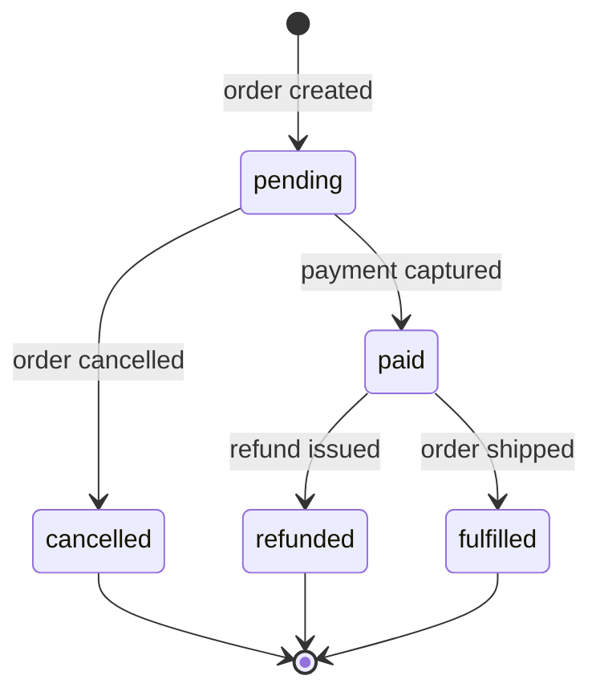

# Tiger Style for SQL

A safety-first standard for writing SQL, PostgreSQL dialect primary, with notes
where standard SQL differs. Safety outranks performance; performance outranks
developer experience. Every query is a contract: explicit inputs, bounded work,
stated locks, stated failure behavior.

SQL looks declarative, which tempts writers to treat it as self-evidently safe.
It is not. An unparameterized literal is a code-injection hole. A missing
`ORDER BY` is a nondeterministic contract. A transaction without a stated
isolation level is an assumption about concurrency the database was never told.
This guide makes each explicit, in plain language first, then in full depth.
PostgreSQL features are named exactly as the server implements them; nothing
here invents syntax.

## Contents

1. [Engineering contract](#1-engineering-contract)
2. [Toolchain and build trust](#2-toolchain-and-build-trust)
3. [Structure and naming](#3-structure-and-naming)
4. [Types and state](#4-types-and-state)
5. [Contracts and errors](#5-contracts-and-errors)
6. [Bounds and arithmetic](#6-bounds-and-arithmetic)
7. [Ownership and memory](#7-ownership-and-memory)
8. [Control flow and concurrency](#8-control-flow-and-concurrency)
9. [Unsafe code and foreign interfaces](#9-unsafe-code-and-foreign-interfaces)
10. [Operating-system boundaries](#10-operating-system-boundaries)
11. [Performance and reproducibility](#11-performance-and-reproducibility)
12. [Tests and review gates](#12-tests-and-review-gates)
13. [Complete reference module](#13-complete-reference-module)
14. [Neovim integration](#14-neovim-integration)
15. [Documentation and media](#15-documentation-and-media)
16. [Review card and validation](#16-review-card-and-validation)

## 1. Engineering contract

Before a query ships, the author states all five of these:

1. **Accepted inputs and their trust boundary.** Every value is a bound
   parameter (`$1`, `:name`, `%s` per driver) or a compile-time literal the
   author wrote. Nothing from the network, the user, or a file is ever
   concatenated into query text. Section 9 makes this absolute.
2. **Row-count bounds.** The maximum rows read, returned, and written.
   User-facing reads carry `LIMIT` (or a keyset cursor); writes carry a
   `WHERE` first proven on a `SELECT`.
3. **Lock scope.** Which tables and rows the statement locks, in which mode,
   and for how long. `SELECT ... FOR UPDATE` locks rows; `CREATE INDEX`
   without `CONCURRENTLY` blocks writes; a transaction held open across
   application code holds every lock it has taken until commit.
4. **Time budget.** `statement_timeout`, `lock_timeout`, and
   `idle_in_transaction_session_timeout`, set per role — never infinite on
   application roles.
5. **Failure behavior.** Which SQLSTATE codes the caller can see
   (`23505`, `23503`, `40001`, `40P01`, `57014`) and what each means for
   retry safety. A retry is safe only when the failure left no visible
   effect; `40001` is retryable only by re-running the whole transaction
   from the beginning.

An exception to any rule needs a named reason, a bound on the resulting
risk, and a test or review condition recorded near the query. Blanket
waivers rot.

## 2. Toolchain and build trust

Pin the PostgreSQL major version (for example, 17) in every environment;
major-version drift changes planner, collation, and sometimes SQL semantics.
Pin extension versions alongside it (`pg_stat_statements`, `pgTAP`).

Treat the schema as code: migrations are ordered, append-only, reviewed by a
second person, applied by a single writer. Never hand-edit production; an
emergency hand-edit is followed immediately by the migration reproducing it.
Seed data ships as separate idempotent migrations. Record the database
locale at creation; prefer `C.UTF-8`.

Gates, in order, on every change:

1. `sqruff lint` — syntax, style, and real bugs.
2. `pg_format` — canonical formatting so diffs show logic, not whitespace.
3. Migration up, down, up on an empty database at the pinned version.
   Irreversible migrations are labeled as such in the header — a reviewed
   decision, not a default.
4. The test suite from section 12.

## 3. Structure and naming

`snake_case` for everything. Tables are singular nouns (`event`); columns
are bare nouns or adjective-noun pairs (`created_at`, `balance_cents`) —
never prefix a column with its table name.

Constraint and index names carry table and purpose, so an error message
names the contract that fired:

| Object        | Pattern                   | Example                             |
| ------------- | ------------------------- | ----------------------------------- |
| Primary key   | `{table}_pkey`            | `event_pkey`                        |
| Foreign key   | `{table}_{column}_fkey`   | `ledger_entry_account_id_fkey`      |
| Unique        | `{table}_{columns}_key`   | `account_external_id_key`           |
| Check         | `{table}_{columns}_check` | `ledger_entry_amount_nonzero_check` |
| Exclusion     | `{table}_{columns}_excl`  | `booking_room_during_excl`          |
| Index         | `{table}_{columns}_idx`   | `event_occurred_at_idx`             |
| Partial index | `{table}_{columns}_p_idx` | `event_pending_p_idx`               |

Schemas, alphabetically: `app` (tables, views, functions; the only schema
on the application role's `search_path`), `audit` (append-only history),
`extensions` (all extensions installed here, never `public`),
`migrations` (the migration ledger, if tooling lacks its own), `public`
(kept empty by policy), `reporting` (materialized views, no write path to
`app`).

Column definitions are alphabetical, with `id` first as the conventional
anchor; generated columns are the exception, since they must follow the
columns they reference.

```sql
-- fragment: column ordering convention
CREATE TABLE app.ledger_entry (
    id           bigint GENERATED ALWAYS AS IDENTITY PRIMARY KEY,
    account_id   bigint NOT NULL REFERENCES app.account (id),
    amount_cents bigint NOT NULL CONSTRAINT ledger_entry_amount_nonzero_check
                            CHECK (amount_cents <> 0),
    created_at   timestamptz NOT NULL DEFAULT now(),
    memo         text
);
```

## 4. Types and state

Choose the type that makes the illegal state unrepresentable.

- **Money is `numeric`, never `float`.** Binary floating point cannot
  represent `0.10`; sums drift. Store minor units as `bigint`
  (`amount_cents`) or major units as `numeric(19, 4)`; avoid the
  locale-dependent `money` type.
- **Event data is `timestamptz`, never `timestamp`.** `timestamp without
  time zone` silently discards offsets, so two servers in different zones
  disagree about what happened. `timestamptz` stores an absolute instant
  (UTC internally) and renders in the session zone. Plain `timestamp` is
  only for wall-clock concepts ("opens at 09:00 local"), zoned at read time.
- **Identifiers are `bigint GENERATED ALWAYS AS IDENTITY`.** Identity
  columns are SQL-standard, visible in `\d`, and honor `OVERRIDING SYSTEM
  VALUE`; prefer them over legacy `serial`. Use `uuid`
  (`gen_random_uuid()`) when identifiers are generated outside the database
  or merged across databases.
- **`DOMAIN` types bundle repeated contracts.** A domain pairs the type
  with its `CHECK`s, so every column of that kind enforces the same rule
  without copy-paste drift.
- **Enums are for closed, stable sets** like `('pending','paid','refunded')`;
  open-ended sets are lookup tables. Hazard: `ALTER TYPE ... ADD VALUE`
  cannot run in a transaction block and is invisible until commit — give
  enum changes their own migration step.

```sql
-- fragment: domain types as contracts
CREATE DOMAIN app.email_address AS text
    CONSTRAINT email_address_format_check
    CHECK (VALUE ~ '^[A-Za-z0-9._%+-]+@[A-Za-z0-9.-]+\.[A-Za-z]{2,}$');

CREATE DOMAIN app.positive_cents AS bigint
    CONSTRAINT positive_cents_check CHECK (VALUE > 0);
```

State machines belong in the database when transitions are the contract:
the type constrains the *values*, while a transition table plus trigger
constrains the *transitions* — a bare `CHECK` cannot see the old value and
cannot forbid `paid → pending`.



Text equivalent: an order is born `pending`, moves to `paid` or `cancelled`,
then to `refunded` or `fulfilled`. The last three are terminal; `pending`
is never re-entered.

```sql
-- fragment: transition table + guard trigger (complete logic, fragment fence)
CREATE TYPE app.order_status AS ENUM ('pending', 'paid', 'cancelled', 'refunded', 'fulfilled');

CREATE TABLE app.order_status_transition (
    from_status app.order_status NOT NULL,
    to_status   app.order_status NOT NULL,
    PRIMARY KEY (from_status, to_status)
);

INSERT INTO app.order_status_transition (from_status, to_status) VALUES
    ('pending', 'paid'), ('pending', 'cancelled'),
    ('paid', 'refunded'), ('paid', 'fulfilled');

CREATE FUNCTION app.guard_order_status_transition()
RETURNS trigger LANGUAGE plpgsql AS $$
BEGIN
    IF OLD.status IS DISTINCT FROM NEW.status
       AND NOT EXISTS (
           SELECT 1 FROM app.order_status_transition t
           WHERE t.from_status = OLD.status AND t.to_status = NEW.status
       ) THEN
        RAISE EXCEPTION 'illegal order status transition: % -> %', OLD.status, NEW.status
            USING ERRCODE = '23514';
    END IF;
    RETURN NEW;
END;
$$;

CREATE TRIGGER order_status_transition_guard
    BEFORE UPDATE OF status ON app."order"
    FOR EACH ROW EXECUTE FUNCTION app.guard_order_status_transition();
```

`IS DISTINCT FROM` is load-bearing: `<>` returns NULL (not true) when either
side is NULL, and the guard would silently pass. Three-valued logic recurs
everywhere; section 6 covers it.

> **In plain terms:** Parameterized queries aren't a style preference, they're the entire defense against SQL injection: the database receives your SQL structure and your data through separate channels, so hostile input can never be reinterpreted as commands. String-interpolating values into SQL is the equivalent of `eval()` on user input — it works right up until it doesn't, and "doesn't" means a breach. If you ever find yourself concatenating SQL, that's the code telling you it wants a parameter.


## 5. Contracts and errors

Constraints are contracts the database enforces so the application does not
have to, preferred in this order:

- **CHECK** — the value itself is legal (`ends_at > starts_at`).
- **EXCLUDE** — no two rows may coexist in conflict, via GiST
  (`EXCLUDE USING gist (room_id WITH =, during WITH &&)` forbids overlapping
  bookings; needs `btree_gist`).
- **Foreign key** — the referenced row exists. Choose `ON DELETE`
  deliberately: `RESTRICT` (default, safest); `CASCADE` only for owned
  children; never `SET NULL` on a non-nullable column.
- **NOT NULL** — the default for every column, unless absence is meaningful
  and handled.
- **UNIQUE** — the natural key is unique. `UNIQUE` permits multiple NULLs
  (`NULL IS DISTINCT FROM NULL`); add a partial unique index when exactly
  one NULL is allowed, `NOT NULL` when none is.

**Let the database raise; handle by SQLSTATE, never by message text.**
Message text is localized and reworded between versions; SQLSTATE codes are
the contract.

| Situation | Preferred response |
| --------- | ------------------ |
| `23502` not-null violation | Bug in the writer; fix it, do not retry. |
| `23503` foreign-key violation | Caller referenced a missing row; say which, do not retry blindly. |
| `23505` unique violation | Expected under concurrency; handle as idempotent re-delivery (`ON CONFLICT` exists for this), not a crash. |
| `23514` check / `23P01` exclusion violation | Illegal input or transition; surface as a validation error, never silently coerce. |
| `40001` serialization failure | Re-run the whole transaction from the beginning with backoff. |
| `40P01` deadlock detected | Retry the victim like `40001`, then fix the lock ordering that allowed it. |
| `57014` query canceled | `statement_timeout` fired; decide whether the budget or the query is wrong. |

In `plpgsql`, raise domain errors explicitly instead of returning sentinels:

```sql
-- fragment
RAISE EXCEPTION 'account % has insufficient funds: balance %, debit %',
    p_account_id, v_balance_cents, p_debit_cents
    USING ERRCODE = 'P0001';
```

Class `P0` is reserved for `RAISE`, so the caller matches on SQLSTATE, not
text. Never convert failure into an empty result set and report success; an
empty set means "no rows matched", not "nothing went wrong".

> **In plain terms:** SQL has three truth values, not two: `TRUE`, `FALSE`, and `NULL` — and `NULL` is contagious, so `NULL = NULL` is not true, it's `NULL`. This means `WHERE status <> 'cancelled'` silently drops every row where status is NULL, which is rarely what anyone intended. `IS DISTINCT FROM` is the NULL-aware comparison that behaves the way your brain expects; reach for it whenever either side might be missing.


## 6. Bounds and arithmetic

Every query states its bounds or the reason it has none.

- **User-facing reads always carry `LIMIT`.** Prefer keyset pagination
  (`WHERE (occurred_at, id) > ($1, $2) ORDER BY occurred_at, id LIMIT 100`)
  over `OFFSET`, which re-scans and shifts under concurrent writes.
- **Timeouts are set per role.** The migration role gets a long budget; the
  application role gets seconds. A statement outgrowing its budget is a
  finding, not a reason to raise it silently.
- **Integer widths are chosen.** Counters, minor-unit money, and surrogate
  keys are `bigint` — a 32-bit sequence exhausts at two billion, which a busy
  event table reaches.
- **`numeric(p, s)` declares the rounding contract.** `numeric(19, 4)` is
  major-unit money to four decimals; division follows the declared scale —
  test rounding at the boundaries.
- **Integer division truncates:** `7 / 2` is `3`. Cast to `numeric`
  explicitly when the fraction matters.
- **NULL poisons arithmetic and comparisons.** `1 + NULL` is NULL;
  `x = NULL` is never true, and `x NOT IN (1, NULL)` is never true for any
  `x`. Use `IS DISTINCT FROM` when NULL must compare as a value, and
  `COALESCE` only with a documented default — a silent zero lies about
  missing data.
- **Aggregates ignore NULL, except `count(*)`.** `avg(amount)` averages the non-null rows — say so in the query comment when it matters.
- **Time arithmetic is deliberate.** `now() + interval '30 days'` is
  calendar-aware around daylight-saving transitions; exact durations use
  epoch arithmetic or `make_interval(secs => ...)`. State which the
  business rule needs.

> **In plain terms:** PostgreSQL never overwrites a row in place for concurrent readers — it writes a new version and lets old snapshots keep seeing the old one. That's MVCC: readers never block writers and writers never block readers, at the cost of dead row versions that `VACUUM` must eventually reclaim. `work_mem` is the per-operation memory budget before a sort or hash join spills to disk — and it's per operation, per query, so ten concurrent sorts each get the full allowance. Size it like you're sharing, because you are.


## 7. Ownership and memory

The database's memory is shared and bounded; a query that forgets this
steals from every other query.

- **`work_mem` is per operation, per query.** Each sort and hash join may
  use up to `work_mem` before spilling to disk. Size it from
  `EXPLAIN (ANALYZE, BUFFERS)` (`external merge` means the sort spilled),
  not from hope.
- **`maintenance_work_mem` governs builds**: `CREATE INDEX`, foreign-key
  validation, `VACUUM`. Raise it for the migration session building a large
  index; it is not a steady-state knob.
- **CTEs have a materialization cost.** `MATERIALIZED` evaluates once and
  stores — real memory or temp files. Use it for expensive CTEs referenced
  more than once; on PostgreSQL 12+ the default is inlining, so use
  `NOT MATERIALIZED` (or nothing) to let the planner fold the CTE in.
- **Temp tables are explicit scratch space:**
  `CREATE TEMP TABLE ... ON COMMIT DROP` cannot leak across sessions and
  vanishes on commit. Prefix `tmp_` so a stray one is recognizable.
- **`temp_file_limit` bounds per-session temp files.** Set it on
  application roles so a runaway sort fails fast instead of filling the disk.
- **Recursive CTEs carry a depth guard.** The recursive term increments
  `depth` and stops joining past the bound; the outer query filters on it.
  An unbounded recursive CTE over cyclic data is an infinite loop the
  database will happily run.

```sql
-- fragment: recursive CTE with a depth guard
WITH RECURSIVE reporting_chain AS (
    SELECT id, manager_id, 1 AS depth
      FROM app.employee
     WHERE id = $1
    UNION ALL
    SELECT e.id, e.manager_id, rc.depth + 1
      FROM app.employee e
      JOIN reporting_chain rc ON rc.manager_id = e.id
     WHERE rc.depth < $2          -- the guard: never recurse past the bound
)
SELECT id, manager_id, depth
  FROM reporting_chain
 ORDER BY depth, id;
```

> **In plain terms:** An isolation level is a contract about which concurrency anomalies you're willing to tolerate: dirty reads, non-repeatable reads, phantoms, serialization anomalies. `READ COMMITTED` — the default — permits most of them, which is fine until money or inventory is involved. `SERIALIZABLE` closes every hole but will abort your transaction with error `40001` when it detects a conflict, and your code must retry from the beginning — that retry loop isn't optional plumbing, it's part of the correctness contract.


## 8. Control flow and concurrency

Transactions are explicit: `BEGIN` opens, `COMMIT` publishes, `ROLLBACK`
discards. Autocommit is for `psql`, not for multi-statement application
writes. Every multi-statement write path names its isolation level; the
default (`READ COMMITTED`) is a choice made consciously.

| Level | Dirty read | Non-repeatable read | Phantom read | Serialization anomaly |
| ----- | ---------- | ------------------- | ------------ | --------------------- |
| `READ UNCOMMITTED` | No* | Yes | Yes | Yes |
| `READ COMMITTED` (default) | No | Yes | Yes | Yes |
| `REPEATABLE READ` | No | No | No** | Yes |
| `SERIALIZABLE` | No | No | No | No |

\* PostgreSQL has no true `READ UNCOMMITTED`; requesting it silently gives
`READ COMMITTED`. Know which behavior you are actually getting.

\** PostgreSQL's `REPEATABLE READ` is snapshot isolation: phantoms cannot
appear within the stable snapshot, but write-skew anomalies remain. Only
`SERIALIZABLE` (SSI) closes the hole, aborting one transaction with
`40001`, which the caller retries from the beginning:

```sql
-- fragment: the serializable retry contract belongs in the caller
BEGIN ISOLATION LEVEL SERIALIZABLE;
-- ... the unit of work, every statement ...
COMMIT;
-- on SQLSTATE 40001: discard everything and re-run from BEGIN
```

**Locking, explicitly.** `SELECT ... FOR UPDATE` takes a row write lock for
read-modify-write; `FOR SHARE` blocks concurrent writes but allows
concurrent share-lock readers (`FOR NO KEY UPDATE` / `FOR KEY SHARE` are the
finer-grained variants for contention seen in `pg_locks`). `SKIP LOCKED`
turns a table into a work queue for parallel workers; `NOWAIT` fails fast
instead of blocking. **Deadlock avoidance is lock ordering:** lock the same
tables in the same order (alphabetical here), rows in `ORDER BY id` before
`FOR UPDATE`. A detected deadlock is a design finding — fix the order.

**Savepoints** bound partial failure inside a transaction; only the outer `COMMIT` publishes.

```sql
-- fragment
BEGIN;
INSERT INTO app.event (...) VALUES (...);
SAVEPOINT before_risky_step;
-- a statement that may fail without invalidating the unit of work
ROLLBACK TO SAVEPOINT before_risky_step;  -- on failure: undo only this step
COMMIT;
```

**Advisory locks** coordinate across sessions without touching table data.
`pg_advisory_xact_lock(key)` is the safe default: held to transaction end
and released automatically, so a crashed session cannot leave it held.
Session-level `pg_advisory_lock` needs a paired unlock — prefer the
transaction variant unless the lock must outlive a transaction, documented
why. Derive keys with `hashtext()` over a namespaced string so subsystems
cannot collide:

```sql
-- fragment: serialize a nightly reconciliation per tenant
BEGIN;
SELECT pg_advisory_xact_lock(hashtext('reconciliation:' || $1::text));
-- ... the reconciled work for tenant $1 ...
COMMIT;  -- the advisory lock releases here, automatically
```

## 9. Unsafe code and foreign interfaces

One cardinal rule: **values are never interpolated into SQL text.** Every
value travels as a bound parameter; string interpolation of values is SQL
injection, regardless of how trustworthy the source feels.

Dynamic SQL — building query *text* at runtime — is permitted only for
identifiers and keywords that cannot be parameters, and only through the
quoting functions: `format()` with `%I`/`%L` as the primary tool,
`quote_ident()`/`quote_literal()` as the primitives, `EXECUTE ... USING`
so the dynamic part stays structural while values stay parameterized:

```sql
-- fragment: the only acceptable shape of dynamic SQL
CREATE FUNCTION app.count_where(p_table regclass, p_min_cents bigint)
RETURNS bigint LANGUAGE plpgsql AS $$
DECLARE
    v_sql text;
    v_n   bigint;
BEGIN
    v_sql := format('SELECT count(*) FROM %s WHERE amount_cents >= $1', p_table);
    EXECUTE v_sql INTO v_n USING p_min_cents;
    RETURN v_n;
END;
$$;
```

`regclass` validates the table against the catalog at call time, so a bad
name fails before any string is built. A `text` table name concatenated raw
is the bug this pattern prevents.

**`SECURITY DEFINER` functions are privilege boundaries** — they run as the
owner, not the caller. Each sets a fixed `search_path`
(`SET search_path = app, pg_temp`) and grants `EXECUTE` only to roles that
need it. Review them like setuid binaries.

**Foreign data (`postgres_fdw`, `dblink`) is a trust boundary, not a join.**
Remote credentials live in a user mapping owned by a locked role, never in
query text. Verify with `EXPLAIN` that predicates are pushed to the remote
server; a scan that fetches the whole table and filters locally is a
performance and data-exposure surprise. Re-validate foreign rows on this
side — they are untrusted input.

## 10. Operating-system boundaries

- **`COPY` vs `\copy`.** Server-side `COPY` acts as the database OS user and
  needs superuser or `pg_read_server_files` / `pg_write_server_files`.
  `\copy` streams through the client instead. Application bulk loads use
  client-side streaming; server-side `COPY` is an audited operator action.
- **Large objects** (`lo_import`/`lo_export`) bypass row-level security;
  prefer `bytea` for application-managed blobs.
- **`pg_dump` / `pg_restore` discipline.** Explicit format, rehearsed
  restores on scratch databases, production dumps encrypted at rest.
  `--schema-only` output is the review artifact for every schema change.
- **Connection strings are secrets.** `sslmode=require` (or `verify-full`
  with a pinned CA) outside a trusted local socket. Passwords never in
  command lines, history, or committed files: `PGPASSWORD` for scripts,
  `~/.pgpass` (mode `0600`) for interactive use, secret store for the app.
- **Logs must not leak values.** `log_statement = 'all'` writes every value
  into the log; prefer `log_min_duration_statement`, and keep parameter
  values out of application logs.

## 11. Performance and reproducibility

Measure with `EXPLAIN (ANALYZE, BUFFERS)` (`TIMING OFF` removes timer noise
on fast nodes). Read in order: **actual vs planned rows** (large gap means
stale statistics or a misestimated predicate — run `ANALYZE`); **buffers
hit vs read** (read-heavy means the working set exceeds cache); **the node
where time concentrates** (optimize that node). `ANALYZE` executes the
query: never on a write.

- **Ordering requires an explicit `ORDER BY`.** Without it, row order is
  whatever the plan found convenient, and it changes with statistics and
  parallelism. On non-unique keys, append a unique tiebreaker
  (`ORDER BY occurred_at, id`) for a total order. Never rely on physical
  order: `CLUSTER` and insertion order are not contracts.
- **Statistics are a runtime contract.** Autovacuum keeps them fresh; after
  bulk loads or shape-changing migrations, run `ANALYZE` before measuring.
- **Index design, alphabetically:** *B-tree* (default: equality, range,
  `ORDER BY`, `MIN`/`MAX`, uniqueness); *BRIN* (tiny; only for naturally
  ordered large tables); *GIN* (containment, full-text, `jsonb`); *GiST*
  (ranges, geometry, `EXCLUDE` constraints); *partial*
  (`... WHERE is_active` — the predicate documents the hot subset);
  *expression* (`ON t (lower(email))` — the query must match exactly).
- **No `SELECT *` in contracts.** A query selecting `*` silently gains
  columns when the table changes, breaking positional reads and leaking new
  data. Name the columns; the list is the interface.

## 12. Tests and review gates

Test the database like code: isolated, repeatable, gated. `pgTAP` is the
standard xUnit-style framework; where unavailable, `DO` blocks with explicit
assertions are an acceptable equivalent (as in section 13). The gates:

```bash
# fragment: the review gates, in order
sqruff lint migrations/ queries/
pg_format --check migrations/ queries/
psql "$TEST_DATABASE_URL" -v ON_ERROR_STOP=1 -f migrations/up.sql
psql "$TEST_DATABASE_URL" -v ON_ERROR_STOP=1 -f tests/run_all.sql
psql "$TEST_DATABASE_URL" -v ON_ERROR_STOP=1 -f migrations/down.sql
psql "$TEST_DATABASE_URL" -v ON_ERROR_STOP=1 -f migrations/up.sql
```

Coverage, alphabetically: **concurrency** (two sessions racing
`INSERT ... ON CONFLICT`; `40001` retried cleanly; `SKIP LOCKED` drained by
parallel workers); **constraints** (every `CHECK`, `UNIQUE`, `EXCLUDE`, and
foreign key gets a negative test expecting its SQLSTATE); **migrations**
(up/down/up on empty, plus up from the previous release's schema with
representative data); **queries** (reporting queries asserted row-for-row,
including `ORDER BY` tiebreakers and NULL branches); **state machine**
(every legal transition exercised, illegal ones rejected with `23514`);
**timeouts** (exceeding `statement_timeout` aborts with `57014`).

Fixtures are `INSERT`s in the test files; production data in tests is a breach with extra steps.

## 13. Complete reference module

A complete, runnable example: a bounded append-only event journal with
constraints, an idempotent migration, a parameterized window-function
reporting query, and assertion tests. Run with `psql` against an empty
database at your pinned version; fences are **complete** unless labeled
**fragment**.

**File 1 — migration** (`migrations/001_create_event_journal.sql`):
complete and idempotent; safe to re-run.

```sql
-- complete: idempotent migration for a bounded append-only event journal
-- apply: psql "$DATABASE_URL" -v ON_ERROR_STOP=1 -f migrations/001_create_event_journal.sql

BEGIN;

-- Serialize concurrent migration runners; releases automatically at COMMIT.
SELECT pg_advisory_xact_lock(hashtext('migration:001_create_event_journal'));

CREATE SCHEMA IF NOT EXISTS app;
CREATE SCHEMA IF NOT EXISTS extensions;

CREATE EXTENSION IF NOT EXISTS pgcrypto SCHEMA extensions;

DO $$
BEGIN
    IF NOT EXISTS (SELECT 1 FROM pg_type t
                   JOIN pg_namespace n ON n.oid = t.typnamespace
                   WHERE n.nspname = 'app' AND t.typname = 'event_kind') THEN
        CREATE TYPE app.event_kind AS ENUM ('order_placed', 'payment_captured', 'refund_issued');
    END IF;
END;
$$;

CREATE TABLE IF NOT EXISTS app.event_journal (
    id           bigint GENERATED ALWAYS AS IDENTITY,
    occurred_at  timestamptz NOT NULL DEFAULT now(),
    kind         app.event_kind NOT NULL,
    tenant_id    bigint NOT NULL,
    amount_cents bigint NOT NULL,
    payload      jsonb NOT NULL DEFAULT '{}'::jsonb,
    CONSTRAINT event_journal_pkey PRIMARY KEY (id),
    CONSTRAINT event_journal_amount_nonzero_check CHECK (amount_cents <> 0),
    CONSTRAINT event_journal_kind_amount_check CHECK (
        (kind = 'refund_issued' AND amount_cents < 0)
        OR (kind <> 'refund_issued' AND amount_cents > 0)
    )
);

-- Partial index: the hot subset queries actually touch.
CREATE INDEX IF NOT EXISTS event_journal_recent_idx
    ON app.event_journal (tenant_id, occurred_at DESC)
    WHERE occurred_at > now() - interval '90 days';

COMMIT;
```

**File 2 — reporting query** (`queries/tenant_daily_totals.sql`), complete:
parameterized (`psql` variables cast once), bounded by `LIMIT`, deterministic
order, window functions with explicit frames, `FILTER` aggregates.

```sql
-- complete: parameterized daily totals with running balance per tenant
-- run: psql "$DATABASE_URL" -v ON_ERROR_STOP=1 \
--        -v tenant_id=42 -v from_day='2026-09-01' -v to_day='2026-10-01' \
--        -f queries/tenant_daily_totals.sql

WITH params AS MATERIALIZED (
    SELECT :'tenant_id'::bigint AS tenant_id,
           :'from_day'::date    AS from_day,
           :'to_day'::date      AS to_day
),
daily AS (
    SELECT date_trunc('day', e.occurred_at)::date AS day,
           count(*) FILTER (WHERE e.kind = 'order_placed')     AS orders_placed,
           count(*) FILTER (WHERE e.kind = 'payment_captured') AS payments_captured,
           count(*) FILTER (WHERE e.kind = 'refund_issued')    AS refunds_issued,
           sum(e.amount_cents) AS net_cents
      FROM app.event_journal e
      JOIN params p ON e.tenant_id = p.tenant_id
     WHERE e.occurred_at >= p.from_day::timestamptz
       AND e.occurred_at <  p.to_day::timestamptz
     GROUP BY 1
)
SELECT d.day,
       d.orders_placed,
       d.payments_captured,
       d.refunds_issued,
       d.net_cents,
       sum(d.net_cents) OVER (
           ORDER BY d.day
           ROWS BETWEEN UNBOUNDED PRECEDING AND CURRENT ROW
       ) AS running_net_cents,
       avg(d.net_cents) OVER (
           ORDER BY d.day
           ROWS BETWEEN 6 PRECEDING AND CURRENT ROW
       ) AS trailing_7d_avg_cents
  FROM daily d
 ORDER BY d.day, d.net_cents DESC
 LIMIT 1000;
```

**File 3 — tests** (`tests/event_journal_test.sql`), complete:
plain-`DO` assertions (the pgTAP-equivalent without the extension). Run
after the migration; rolls back, leaving no rows.

```sql
-- complete: assertion tests for the event journal contracts
-- run: psql "$TEST_DATABASE_URL" -v ON_ERROR_STOP=1 -f tests/event_journal_test.sql

BEGIN;

-- 1. Positive order_placed accepted.
INSERT INTO app.event_journal (kind, tenant_id, amount_cents)
VALUES ('order_placed', 7, 1999);

-- 2. Zero amount rejected by CHECK (23514).
DO $$
BEGIN
    INSERT INTO app.event_journal (kind, tenant_id, amount_cents)
    VALUES ('order_placed', 7, 0);
    RAISE EXCEPTION 'expected check violation for zero amount' USING ERRCODE = 'P0001';
EXCEPTION WHEN check_violation THEN
    -- expected: the contract fired
END;
$$;

-- 3. Positive refund rejected: refunds must be negative (23514).
DO $$
BEGIN
    INSERT INTO app.event_journal (kind, tenant_id, amount_cents)
    VALUES ('refund_issued', 7, 500);
    RAISE EXCEPTION 'expected check violation for positive refund' USING ERRCODE = 'P0001';
EXCEPTION WHEN check_violation THEN
    -- expected
END;
$$;

-- 4. Negative refund accepted; net sums to zero.
INSERT INTO app.event_journal (kind, tenant_id, amount_cents)
VALUES ('refund_issued', 7, -1999);

DO $$
DECLARE
    v_net bigint;
BEGIN
    SELECT sum(amount_cents) INTO v_net
      FROM app.event_journal WHERE tenant_id = 7;
    IF v_net <> 0 THEN
        RAISE EXCEPTION 'net should be 0, got %', v_net USING ERRCODE = 'P0001';
    END IF;
END;
$$;

-- 5. Idempotency: re-running the migration changes nothing, raises nothing.
\ir ../migrations/001_create_event_journal.sql

ROLLBACK;  -- tests leave no rows behind
```

**File 4 — down migration** (`migrations/001_create_event_journal.down.sql`),
complete: drops in dependency order; test/staging only, never blindly in prod.

```sql
-- complete: down migration
-- run: psql "$TEST_DATABASE_URL" -v ON_ERROR_STOP=1 -f migrations/001_create_event_journal.down.sql

BEGIN;
SELECT pg_advisory_xact_lock(hashtext('migration:001_create_event_journal'));
DROP TABLE IF EXISTS app.event_journal;
DROP TYPE IF EXISTS app.event_kind;
COMMIT;
```

## 14. Neovim integration

Keep this guide as reference material in the repository; do not `require()`
it from editor configuration. The SQL language configuration, LSP
definitions, lint runner, and formatter remain their own modules.

**LSP**, alphabetically: `postgres_lsp` (postgrestools — schema-aware
completion and diagnostics against the live catalog) or `sqls`
(dialect-generic; configure `connections` per project, never commit
credentials). Point the server at a scratch or test database, never
production. Keep one owner for format-on-save.

**Formatters:** `sqruff format` and `pg_format` are both real — pick one per
repository and enforce it in the section 12 gate. `sqruff` also lints, which
makes it the default recommendation: one tool, two gates.

**`.sqruff` config**, template — verify option keys against the installed
`sqruff` version before adopting:

```toml
# template: .sqruff at the repository root
dialect = "postgres"
```

Connection strings stay out of editor configuration. The editor reads
`DATABASE_URL` (or `PGHOST`/`PGUSER`/`.pgpass`) from the environment; a
committed connection string is a leaked credential with extra steps.

## 15. Documentation and media

Keep the guide readable as plain Markdown: tables for comparisons, Mermaid
for state and relationship diagrams, math only where it clarifies a bound.
Every diagram needs a textual equivalent; every fence names its language
and whether it is complete, a fragment, or a template.

Use relative, repository-owned images with meaningful alt text after adding
the actual asset. The following is a template, not an included image:

```markdown

```

For a trusted renderer that supports HTML video, provide controls and a
fallback link; add the media files before inserting this template:

```html
<video controls preload="metadata" aria-label="Reading EXPLAIN ANALYZE output">
  <source src="./assets/sql-explain-demo.mp4" type="video/mp4">
  <a href="./assets/sql-explain-demo.mp4">Open the walkthrough video</a>
</video>
```

SVG, CSS, JavaScript, video, and math support depend on the renderer. Keep
active HTML and scripts disabled for untrusted documentation, and never
require JavaScript to read a safety contract. An interactive local page, if
useful, is a separate reviewed asset with a static explanation in the
Markdown.

## 16. Review card and validation

Before merging:

- [ ] Every value is a bound parameter; no string interpolation of values
      anywhere, including tests, migrations, and admin scripts.
- [ ] Dynamic SQL uses `format()`/`%I`/`%L` or `EXECUTE ... USING`;
      table-like inputs are `regclass` where possible.
- [ ] User-facing reads carry `LIMIT` (or a keyset cursor); writes were
      previewed with the same `WHERE` on a `SELECT`.
- [ ] The isolation level is stated; `SERIALIZABLE` callers retry `40001`
      from the beginning.
- [ ] Lock scope is stated; multi-table transactions lock in alphabetical
      table order; row locks use `ORDER BY id`.
- [ ] `statement_timeout`, `lock_timeout`, and
      `idle_in_transaction_session_timeout` are set for the role.
- [ ] Constraints encode the domain contracts; each has a negative test
      asserting its SQLSTATE.
- [ ] `ORDER BY` is explicit and total (unique tiebreaker) wherever order
      is observed.
- [ ] Event-time columns are `timestamptz`; money is `numeric` or
      minor-unit `bigint`.
- [ ] NULL semantics considered: `IS DISTINCT FROM`, `NOT IN` traps,
      aggregate NULL-skipping.
- [ ] Migrations run up, down, up on an empty database; irreversible ones
      are labeled and reviewed.
- [ ] Non-transactional DDL (`CREATE INDEX CONCURRENTLY`,
      `ALTER TYPE ... ADD VALUE`, `VACUUM`) sits outside transaction blocks
      with its own deploy sequencing.
- [ ] `SECURITY DEFINER` functions set a fixed `search_path` and minimal
      `EXECUTE` grants.
- [ ] Secrets are out of connection strings, command lines, logs, and the
      repository; `.pgpass` is mode `0600`.
- [ ] `EXPLAIN (ANALYZE, BUFFERS)` evidence supports any performance claim.

**Validation record:** written against documented PostgreSQL semantics
(isolation levels and SSI, transactional-DDL exclusions, advisory-lock
scoping, `ON CONFLICT`, `FILTER`, `MATERIALIZED` CTEs, SQLSTATE codes);
every SQL fence was hand-reviewed for syntactic correctness. No live
PostgreSQL server was available here, so no fence was executed and no gate
in section 12 was run — they are prescribed, not claimed. The `.sqruff`
template is marked as such because its keys were not verified against an
installed binary.

**Maintenance:** review this guide when the pinned PostgreSQL major version
changes, a new extension enters the trust boundary, migration tooling
changes, or the isolation/locking strategy changes. Keep the rule and the
evidence together: when a gate catches a real bug, add the case to section
12, and remove workarounds when their constraint disappears.
