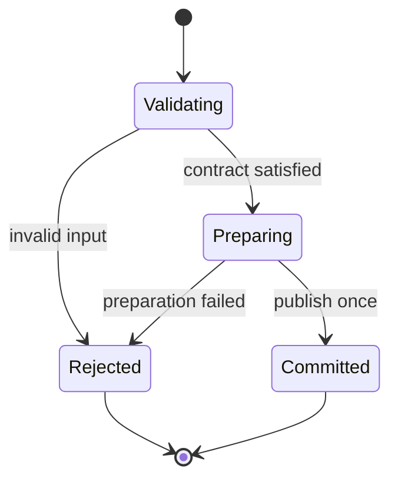

# Tiger Style for Swift

**Safety > performance > developer experience.**

A practical coding standard for Swift services, command-line tools, libraries, and editor
helpers on Linux and Apple platforms. It covers Swift 5.9 and newer, with Swift 6 strict
concurrency as the target mode; Swift 6 differences are marked where they matter. This is
an independent interpretation of
[TigerBeetle's Tiger Style](https://github.com/tigerbeetle/tigerbeetle/blob/main/docs/TIGER_STYLE.md),
not an official TigerBeetle or Apple document.

| Policy | Baseline |
| --- | --- |
| Language version | Swift 5.9+; Swift 6 language mode (`-swift-version 6`) is the target |
| Concurrency checking | Strict (`complete`); warnings are errors |
| Examples | Stable language features unless explicitly marked otherwise |
| Formatting | `swiftformat`, four spaces, 120-column target |
| Function size | Review ordinary functions above 70 physical lines |
| Primary platform | Linux (SwiftPM); Apple-platform notes where they change the rules |
| Document reviewed | 2026-10-06 |

The reference module in section 13 uses only stable Swift 5.9 APIs. It was carefully
reviewed but not compiled or executed for this documentation task; the sandbox has
no Swift toolchain. Validation details are recorded in section 16.

## Contents

- [1. Engineering contract](#1-engineering-contract)
- [2. Toolchain and build trust](#2-toolchain-and-build-trust)
- [3. Structure and naming](#3-structure-and-naming)
- [4. Types and state](#4-types-and-state)
- [5. Contracts and errors](#5-contracts-and-errors)
- [6. Bounds and arithmetic](#6-bounds-and-arithmetic)
- [7. Ownership and memory](#7-ownership-and-memory)
- [8. Control flow and concurrency](#8-control-flow-and-concurrency)
- [9. Unsafe code and foreign interfaces](#9-unsafe-code-and-foreign-interfaces)
- [10. Operating-system boundaries](#10-operating-system-boundaries)
- [11. Performance and reproducibility](#11-performance-and-reproducibility)
- [12. Tests and review gates](#12-tests-and-review-gates)
- [13. Complete reference module](#13-complete-reference-module)
- [14. Neovim integration](#14-neovim-integration)
- [15. Documentation and media](#15-documentation-and-media)
- [16. Review card and validation](#16-review-card-and-validation)

## 1. Engineering contract

Correctness comes before speed. Speed comes before convenience when the tradeoff is real.
Measure that tradeoff; do not use the priority order to justify speculative complexity.

Every substantial operation must identify:

1. Accepted inputs, rejected inputs, and the trust boundary.
2. Maximum work, memory, output, and elapsed time.
3. The owner of every allocation, handle, task, and subprocess.
4. The point at which externally visible state changes.
5. Failure, cancellation, and cleanup behavior.
6. The evidence: tests, measurements, or a written invariant.

Automatic reference counting is a foundation. It does not enforce authorization, bounded
queues, appropriate retry policies, secrecy of logs, or application-level state
transitions, and the concurrency checker does not catch a task that publishes a stale
result after cancellation. Treat these as explicit design obligations.

Use this rule for exceptions: name the rule, explain the need, bound the resulting risk,
and record a test or review condition near the affected code. Blanket waivers are
difficult to maintain. Prefer a direct implementation that a reviewer can reason about:
do not ban `map`, result builders, or generics merely because they are abstractions —
require them to make ownership, cost, and failure clearer.

## 2. Toolchain and build trust

Pin the toolchain per repository, not per editor configuration. On Linux, use
[swiftly](https://github.com/swiftlang/swiftly), the Swift project's toolchain manager:

```sh
# TEMPLATE — choose a tested toolchain and record it.
swiftly install 6.1
swiftly use 6.1
swift --version
```

On Apple platforms, record the Xcode version alongside the Swift version
(`xcodebuild -version`); Swift 6 ships with Xcode 16 and newer. If the terminal and
the editor disagree, verify both report the same `swift --version` before changing
code to silence a warning.

Select Swift 6 language mode explicitly: set `.swiftLanguageMode(.v6)` per target in
`Package.swift` (see the complete example in section 13).

In Xcode, this is the `SWIFT_VERSION = 6.0` build setting with strict concurrency
checking set to `complete`; treat any new concurrency warning as a build error.

Commit `Package.resolved`: it pins the exact resolved versions of every dependency.
Review dependency versions, declared products, and binary targets on every change. A
pin records resolution; it does not certify a dependency as safe.

Binary targets (`.binaryTarget`) ship precompiled XCFrameworks with a checksum. Verify
the checksum against the vendor's published value through an independent channel
before adding one, and re-verify on every update. Prefer source dependencies when the
source is available; a binary target is opaque to review.

Package plugins execute arbitrary code at build time. Treat adding a plugin dependency
like adding a build-time executable: opening an unfamiliar repository must not
silently authorize its builds, plugin execution, tests, or debugger launch.

Record `swift --version` and `swift package show-dependencies` when diagnosing
discrepancies between terminal, editor, and CI.

## 3. Structure and naming

Follow the [Swift API Design Guidelines](https://www.swift.org/documentation/api-design-guidelines/):
clarity at the point of use matters more than brevity. Names are documentation that the
compiler checks for consistency.

- Types and protocols use `UpperCamelCase`: `BoundedBuffer`, `CapacityExceeded`.
- Values, functions, and cases use `lowerCamelCase`: `append(_:)`, `remaining`,
  `case capacityExceeded`.
- Argument labels carry meaning at the call site: `append(contentsOf:)`,
  `write(to:options:)`. Omit a label only when the first argument is a natural
  sentence subject, as in `add(_:)`.
- Boolean properties and methods read as assertions: `isEmpty`, `isFull`,
  `hasPrefix(_:)`.
- Protocols describe capabilities with `-able`, `-ible`, or `-ing` suffixes:
  `Sendable`, `Collection`, `Sequence` — named for what they require, not for the
  types that conform.
- Factory methods read as the thing they make: `Data(capacity:)`,
  `URL(fileURLWithPath:)`.
- Acronyms keep uniform case: `url`, `httpBody`, `id` lower camel; `URL`,
  `HTTPBody`, `ID` upper camel. Do not mix `Url` and `URL` in one module.

Organize code so a reader can find things alphabetically: members within a type,
`case` statements in an enum, entries in a table, and files within a target group go in
alphabetical order unless dependency order requires otherwise. Inside a type, member
order is free, so alphabetical order is cheap and keeps large types navigable.

One concern per file, one file per type for public API. Mark `internal` helpers
explicitly; writing it down makes the intended surface obvious during review.

> **In plain terms:** Swift optionals make absence explicit: a `String` always has a value, a `String?` might not, and the compiler forces you to handle both cases before proceeding. Force-unwrapping with `!` is you telling the compiler "trust me" — which is fine for invariants you've actually proven, and a crash report waiting to happen for anything that touched the network, the disk, or a user. Treat every `!` as a small bet; make sure you'd take that bet with your own money.


## 4. Types and state

Model absence with `Optional`, never with a sentinel value. A missing port is `nil`,
not `-1` or `0`; a missing body is `nil`, not an empty `Data` that also means "present
but empty". If the protocol assigns meaning to the empty value, say so in a doc
comment and keep the distinction in the type.

Use enums with associated values for state machines. Each case carries exactly the data
valid in that state, so an invalid combination is unrepresentable:

```swift
// FRAGMENT — state machine shape.
enum ConnectionState: Sendable {
    case idle
    case connecting(attempt: Int, deadline: Date)
    case open(session: Session, openedAt: Date)
    case closing(reason: CloseReason)
    case closed(reason: CloseReason)
}
```

A `switch` over this enum is exhaustive: the compiler forces every state to be
handled when a new case is added. Prefer `switch` over chains of `if case` when the
handling must cover every state. Keep fields private when their relationship is an
invariant: expose initializers that validate and methods that preserve it. Decoding
is another initializer and must not bypass validation. Unwrap optionals with
`guard let` at the top of a function so the happy path stays flat; use `if let`
when both branches do real work. Prefer `map` and `flatMap` for single-expression
transformations, and `compactMap` to strip nils from a sequence:

```swift
// FRAGMENT — unwrapping patterns in priority order.
guard let port = config.port else {
    throw ConfigError.missingPort
}

if let session = cache.session(for: id) { return try await session.refresh() }
return try await establishSession(for: id)

let displayName = user.nickname.map { "@" + $0 } ?? user.fullName
let validPorts = candidates.compactMap { UInt16(exactly: $0) }
```

Never force-unwrap (`!`) or force-try (`try!`) on untrusted data: network input, file
contents, user input, and decoded values. Reserve `!` for invariants the type system
cannot express, each with a comment naming the guarantee. `try?` discards the error;
use it only when the error carries no actionable information, and say so.

A state transition follows **validate → prepare → commit → observe**: validate before
mutation, prepare fallible resources before publishing new state. If rollback is
impossible, document partial progress and return enough information for the caller to
recover safely.



Text equivalent: rejected validation or preparation leaves the published state
unchanged; only successful preparation reaches the commit point.

### Result builders

A result builder (`@resultBuilder`) turns a closure's statements into one value. The
builder protocol's methods each handle a language construct: `buildBlock` combines the
parts, `buildExpression` adapts each statement, `buildOptional` handles `if` without
`else`, `buildEither(first:)`/`buildEither(second:)` handle `if`/`else` and `switch`,
`buildArray` handles `for` loops, `buildLimitedAvailability` handles `#available`,
and `buildFinalResult` post-processes the whole. Prefer the builders the platform
ships over a custom one — a custom builder is a new little language and needs its own
tests, especially the empty-input and single-branch cases that `buildOptional` and
`buildEither` exist to handle. Keep builder output types explicit: inference across a
builder boundary produces diagnostics far from the mistake, and a builder that
silently drops a branch is a correctness bug wearing DSL syntax.

## 5. Contracts and errors

Validate external input with ordinary control flow and return a meaningful error. Assert
facts that a correct implementation has already established. An attacker supplying
malformed input is not an internal invariant failure.

| Situation | Preferred response |
| --- | --- |
| Corrupt internal relationship | `precondition` or `preconditionFailure` |
| Expensive redundant development check | `assert` |
| Expected missing value | `Optional`, or a domain error if absence violates the request |
| Invalid user input, protocol data, or configuration | A typed `Error` with bounded context |
| Programming error that must stop the process | `fatalError` with a message naming the invariant |
| Unavailable optional tool or feature | Explicit unavailable status; no fabricated success |

`precondition` stays active in optimized (`-O`) builds; `assert` is compiled out.
Neither should validate untrusted input. `fatalError` always traps and must never be the
response to a recoverable condition — a malformed request, a full disk, a dropped
connection, or a failed decode are all recoverable.

Prefer `throws` for operations that can fail. Use `Result<Value, Failure>` when the
error must be stored, passed through a non-throwing boundary, or accumulated before
being reported (via the `Result(catching:)` initializer and `mapError`); use
`Never` as the failure type when failure is impossible by
construction. Mark functions whose return value is safe to ignore with
`@discardableResult`; every other ignored result is a review finding.

Chain errors with context, not replacement. Wrap the underlying error so the caller
can see the full path from symptom to cause. Keep error payloads bounded: an offending
byte offset or a key path is useful; echoing megabytes of input into an error is a
memory and secrecy hazard. Never convert failure into an empty collection and report
success.

### Codable validation boundaries

Decoding is a trust boundary: the validation happens in the step that converts the
decoded carrier into the domain type, not somewhere downstream. Decode untrusted
bytes into a plain `Decodable` carrier, then convert to the validated type in a
failable step that enforces ranges, lengths, and relationships:

```swift
// FRAGMENT — decode into a carrier, then validate into the domain type.
struct RawConfig: Decodable { var port: Int; var host: String }
struct Config { let port: UInt16; let host: String }

func validatedConfig(from data: Data) throws -> Config {
    let raw = try JSONDecoder().decode(RawConfig.self, from: data)
    guard let port = UInt16(exactly: raw.port), !raw.host.isEmpty else {
        throw ConfigError.invalidValue
    }
    return Config(port: port, host: raw.host)
}
```

A custom `init(from:)` must call the same validation — never decode directly into
the validated type's stored properties, or the carrier step is bypassed. Use
`Decimal`, not `Double`, for currency; set explicit key strategies instead of
relying on property names matching the wire format.

## 6. Bounds and arithmetic

Swift's default arithmetic traps on overflow in both debug and release builds. The
masking operators wrap instead: `&+`, `&-`, `&*`. The reporting operators
(`addingReportingOverflow(_:)` and friends) return both the wrapped value and a
flag. Choose explicitly at each site:

```swift
// FRAGMENT — overflow policy per call site.
let total = base.addingReportingOverflow(count)   // explicit, checked
guard !total.overflow else {
    throw ArithmeticError.overflow(operation: "base + count")
}

let wrapped = base &+ count                       // explicit, wrapping; comment why
```

`-Ounchecked` disables overflow traps and assertions. Never ship it; it trades the
language's cheapest safety guarantee for speed you have not measured.

Conversions between integer types must name their policy: `Int(exactly:)` returns
`nil` on overflow, `Int(clamping:)` saturates, `Int(truncatingIfNeeded:)` drops high
bits. A bare `Int(x)` traps on overflow — the safe default for trusted values, the
wrong tool for untrusted ones. Widths are explicit: `Int`/`UInt` are the platform
word size; use `Int32`, `UInt64`, and friends when the protocol or file format fixes
the width.

Collection indices trap when out of bounds. Check membership before subscripting
untrusted indices:

```swift
// FRAGMENT — index discipline.
guard buffer.indices.contains(index) else {
    throw BufferError.indexOutOfBounds(index: index, count: buffer.count)
}
let byte = buffer[index]

let first = buffer.first   // Optional; nil when empty, never traps
```

`String` is not indexable by integer. Use `String.Index` and the bounded forms, and
name which view the consumer needs — UTF-8 length, `Character` count, and `utf16`
length are three different numbers:

```swift
// FRAGMENT — string slicing without traps.
let end = line.index(line.startIndex, offsetBy: maxLength, limitedBy: line.endIndex)
    ?? line.endIndex
let head = line[..<end]
```

Every buffer, queue, and accumulator gets a written memory budget, stated as a
formula. If a bound depends on input, validate the input before allocating: a 4-byte
length prefix claiming 4 GiB must be rejected before the allocation, not after it
fails.

| Component | Bound |
| --- | --- |
| `storage: [UInt8]` | `capacity` bytes payload, plus `Array` header (24 bytes) |
| `capacity: Int` | Set once at init; immutable |
| `count` | `0 ... capacity`, enforced by `append` |
| Error payload | Two `Int`s; no input echoed |

> **In plain terms:** Swift doesn't have a garbage collector sweeping up on a schedule — it counts references, and the moment the last strong reference drops, the object dies immediately and deterministically. The price of that predictability is cycles: two objects holding strong references to each other keep each other alive forever, like two people refusing to hang up first. `weak` breaks the cycle by not counting (and politely becoming `nil`); `unowned` breaks it by promising the other side outlives you — a promise the runtime enforces with a trap if you lie.


## 7. Ownership and memory

Swift uses automatic reference counting. A strong reference keeps an object alive;
cycles of strong references leak until the process ends. Break cycles with `weak`
(zeroing, becomes `nil`) or `unowned` (non-zeroing, traps on use after free).

Capture lists decide ownership at the closure's creation:

```swift
// FRAGMENT — capture discipline.
worker.onComplete = { [weak self] result in
    guard let self else { return }   // Swift 5.8+ shorthand
    self.handle(result)
}
```

Prefer `weak` everywhere. Use `unowned` only when the closure provably cannot outlive
the captured object, and comment the lifetime argument. A wrong `unowned` traps at
runtime; a wrong `weak` silently does nothing — so the `guard let self else { return }`
must be a deliberate decision about what "the owner is gone" means, not a reflex.

`deinit` is the cleanup hook for classes; pair every acquired resource with its
release. Use `defer` for scoped cleanup so the early-return path and the success path
share one release site.

Prefer value types (`struct`, `enum`) for data. Value semantics mean a copy is
independent: mutating your copy cannot surprise another owner. `Array`, `String`,
`Dictionary`, and `Data` are structs with copy-on-write storage, so copies are cheap
until mutated — still a cost model to state, not an excuse to copy large buffers in a
loop. Pass large values with `borrowing` (read-only, no copy) and transfer ownership
with `consuming` when the caller is done with the value:

```swift
// FRAGMENT — Swift 5.9+ ownership modifiers.
func checksum(of data: borrowing [UInt8]) -> UInt64 { /* reads only */ }
func seal(_ data: consuming [UInt8]) -> SealedBox { /* takes ownership */ }
```

`isKnownUniquelyReferenced(&_storage)` lets a class-backed type implement its own
copy-on-write; keep the check and the mutation adjacent. On Apple platforms,
`autoreleasepool` bounds autoreleased objects in long loops; on Linux it is
unnecessary. `nonisolated(unsafe)` opts a single declaration out of concurrency
checking — a promise the compiler cannot verify, so each use needs a comment naming
the synchronization that makes it safe.

> **In plain terms:** An actor is a bouncer for its own state: only one task gets in at a time, so data races are structurally impossible. But the bouncer steps aside at every `await` — another caller can walk in, change the state, and leave before your method resumes. That interleaving is called reentrancy, and the defense is unsexy: keep actor methods short and re-check any condition after an `await` before acting on it. Strict concurrency mode (`Sendable` checking) is the compiler auditing your sharing discipline at build time instead of letting the race show up as a heisenbug six months later.


## 8. Control flow and concurrency

Prefer structured concurrency: `async`/`await`, `async let`, and task groups. A child
task's lifetime is bounded by its parent's scope, and errors propagate to the parent
automatically. `Task.detached` escapes that structure; use it only at a genuine
top-level boundary and record who owns the detached task's lifetime.

```swift
// FRAGMENT — structured fan-out with a bound.
func fetchAll(urls: [URL]) async throws -> [Data] {
    try await withThrowingTaskGroup(of: Data.self) { group in
        for url in urls { group.addTask { try await self.fetch(url) } }
        var results = [Data]()
        for try await data in group { results.append(data) }
        return results
    }
}
```

Task groups do not limit concurrency by themselves. Bound fan-out by chunking the
input into batches of at most `maxConcurrent` items per group. An unbounded `addTask`
loop over attacker-sized input is a fork bomb with better syntax.

Cancellation is cooperative. Check `Task.isCancelled` or call
`Task.checkCancellation()` (which throws `CancellationError`) at sensible suspension
points, and make cleanup run in `defer` or `withTaskCancellationHandler` so a
cancelled task releases what it holds. Never publish a result after cancellation
without checking, and make the commit point idempotent so cancellation cannot
duplicate effects silently.

Actors serialize access to their isolated state, which eliminates data races but not
logic races: an `await` inside an actor method is a reentrancy point where another
caller can interleave. Keep actor methods short, and re-check after the `await`
when a check guards a mutation:

```swift
// FRAGMENT — actor reentrancy discipline: re-check after await.
actor SessionPool {
    private var sessions: [ID: Session] = [:]

    func checkout(id: ID) async throws -> Session {
        if let existing = sessions[id] { return existing }
        let fresh = try await Session.open(id: id) // reentrancy point
        if let raced = sessions[id] { await fresh.close(); return raced }
        sessions[id] = fresh
        return fresh
    }
}
```

Mark UI-bound code `@MainActor`, preferring a type-level annotation over sprinkling
`MainActor.run` at call sites. `nonisolated` exposes synchronous, thread-safe members
of an actor without hopping isolation; `isolated` parameters let a function adopt its
caller's actor isolation instead of forcing a hop.

`Sendable` marks types safe to cross concurrency domains. `@unchecked Sendable` is a
manual promise — document the lock, queue, or immutability that backs it, and
re-review it whenever the type's members change.

`AsyncSequence` models streams of values over time. `AsyncStream`'s default buffering
policy is `.unbounded`: a fast producer and a slow consumer grow memory without
limit. Choose an explicit buffering policy and a backpressure strategy before wiring
a stream to untrusted production rates. The `sending` modifier transfers a value
across an isolation boundary, ending the caller's access — use it where the
recipient must not share mutable state with the sender.

> **In plain terms:** Swift's safety guarantees end where C begins: an `UnsafePointer` is the language handing you the keys and wishing you luck. The discipline is to keep unsafe code in small, audited wrappers with safe signatures, so the unsafety is a contained implementation detail rather than a lifestyle. If you find yourself reaching for `unsafe` to work around the type system, that's usually the type system trying to tell you something worth hearing.


## 9. Unsafe code and foreign interfaces

Unsafe Swift suspends the guarantees the rest of this guide relies on. Keep every
unsafe block small, local, and reviewed; the safe wrapper carries the contract, the
unsafe interior carries a comment naming each invariant the compiler no longer
checks. Prefer the scoped accessors, which tie the pointer's lifetime to the
closure so it cannot escape:

```swift
// FRAGMENT — scoped unsafe access.
func checksum(bytes: [UInt8]) -> UInt64 {
    bytes.withUnsafeBytes { raw in
        var acc: UInt64 = 0
        for word in raw.bindMemory(to: UInt64.self) { acc &+= word }
        return acc
    }
}
```

If a pointer must outlive the call, that is a design review, not a coding pattern:
document who frees it, with what allocator, and what happens on the error path.

The pointer family, in the order to prefer it: `UnsafeBufferPointer` /
`UnsafeMutableBufferPointer` (bounded, indexable) over `UnsafePointer` /
`UnsafeMutablePointer` (manual arithmetic), and raw pointers only when the memory's
type is genuinely unknown. `bindMemory(to:capacity:)` establishes the type;
`assumingMemoryBound(to:)` asserts it was already bound;
`withMemoryRebound(to:capacity:_:)` temporarily rebinds. Each is a promise about the
memory's history — get it wrong and the result is undefined behavior, not a trap.

For C interop, import the C module (`import Glibc` on Linux, `import Darwin` on Apple
platforms, or a module map for vendored C) and wrap the C API in a Swift type that
owns the resource and enforces the contract. Translate C error conventions (return
codes, `errno`, out-parameters) into `throws` at the boundary; do not let `-1`
propagate through Swift code. `@_cdecl` and `@_silgen_name` are underscored,
unofficial attributes with no stability guarantee — use them only where no stable
alternative exists, and comment why.

## 10. Operating-system boundaries

The OS boundary is a trust boundary. Paths, environment variables, subprocess output,
and file contents are untrusted input until validated.

Work with `URL`, not string paths. `URL(fileURLWithPath:)` handles normalization;
string concatenation does not. Resolve user-supplied paths against an allowed root
and reject escapes (`..` components, symlinks pointing outside) before opening
anything. Prefer `FileManager` URLs (`temporaryDirectory`,
`homeDirectoryForCurrentUser`) over hardcoded paths, and write atomically
(`.atomic` option) when a crash mid-write must not leave a half-written file.

```swift
// FRAGMENT — path confinement.
func confinedURL(root: URL, userPath: String) throws -> URL {
    let candidate = root.appendingPathComponent(userPath).standardized
    guard candidate.path.hasPrefix(root.standardized.path + "/") else {
        throw PathError.escapeAttempt(path: userPath)
    }
    return candidate
}
```

Run subprocesses with `Foundation.Process`, never through a shell. Pass arguments as
an array so no quoting layer can reinterpret them, scrub the environment (start from
a minimal dictionary), and never pass secrets through arguments or environment.
Bound the subprocess's output (a `Pipe` with a reader that enforces a byte cap), its
runtime (a watchdog that terminates it), and its exit handling (check
`terminationReason`, not just the status):

```swift
// FRAGMENT — subprocess without a shell.
let process = Process()
process.executableURL = URL(fileURLWithPath: "/usr/bin/ffmpeg")
process.arguments = ["-i", input.path, "-f", "null", "-"]
process.standardOutput = FileHandle.nullDevice
try process.run()
process.waitUntilExit()
guard process.terminationStatus == 0 else {
    throw SubprocessError.nonZeroExit(status: process.terminationStatus)
}
```

Secrets live in the platform store: Keychain (`Security` framework) on Apple
platforms, a secret manager or restricted file (mode `0600`) on Linux. Never log
secrets, never interpolate them into error messages, and keep them out of crash
reports. Redact before logging, not after. Run with the least privilege the job needs
where the platform allows sandboxing, and treat "the sandbox denied it" as a design
signal, not an obstacle to route around.

## 11. Performance and reproducibility

Measure first. A benchmark with a stated environment (toolchain version, optimization
level, machine, input sizes) outranks any intuition about what is slow. Keep the
benchmark next to the code it justifies.

Optimization levels, in the order to reach for them:

| Level | Meaning | When to use |
| --- | --- | --- |
| `-Onone` | No optimization | Debugging only |
| `-O` | Standard optimization | Default for release (`swift build -c release`) |
| `-Osize` | Optimize for size | Constrained binaries; measure the speed cost |
| `-Ounchecked` | Disables overflow traps and assertions | Never ship; see section 6 |

Release builds already use whole-module optimization. Beyond that, the usual
high-value work is algorithmic: bounding the work (sections 6 and 8), avoiding copies
of large values (`borrowing`/`consuming`, section 7), and keeping hot loops free of
reference counting and dynamic dispatch. Profile with Instruments or `perf` before
restructuring.

Deterministic output is a feature. `Dictionary` and `Set` iteration order is
unspecified — sort keys before serializing (`JSONEncoder.outputFormatting =
.sortedKeys`). Seed random number generators explicitly for reproducible runs and
record the seed in the output so a run can be replayed.

## 12. Tests and review gates

Write tests with XCTest (`XCTestCase`, `XCTAssert*`) or Swift Testing (`@Test`,
`#expect`); both run under `swift test`. Name tests for the behavior they pin:
`testAppendBeyondCapacityThrowsAndPreservesState`, not `testAppend3`. Every bug fix
lands with a regression test that fails without the fix. Match the assertion to the
claim: `XCTAssertEqual` for values, `XCTAssertThrowsError` for failure paths
(inspecting the error, not just its type), `XCTUnwrap` for optionals that must be
non-nil — or `#expect`, `#expect(throws:)`, `#require` under Swift Testing.

Tests are bounded too: no network access in unit tests (inject a fake transport),
timeouts on every async test, and temporary directories cleaned up in `tearDown`
or `defer`. A test that passes only on a fast machine is a flaky test with good
marketing.

Run these gates before review; each is a shell command, not an aspiration. `swiftlint`
enforces style rules and `swiftformat` enforces formatting; keep their configurations
(`.swiftlint.yml`, `.swiftformat`) in the repository so every machine and the editor
agree. Disable a rule per line with a comment naming the reason, never globally
without review:

```sh
swift build && swift test && swift build -c release
swiftlint lint --strict                     # lint; zero warnings
swiftformat --lint .                        # format check; zero diffs
```

## 13. Complete reference module

A bounded byte buffer: capacity fixed at initialization, appends rejected with a
typed error before any mutation, value semantics throughout — sections 4, 5, 6,
and 7 in one compilable unit.

COMPLETE — save as `Sources/BoundedBuffer/BoundedBuffer.swift` in a SwiftPM package.

```swift
/// A bounded, append-only byte buffer with explicit capacity. Value semantics
/// throughout, so the type is unconditionally `Sendable`; `append` validates
/// before mutating, so a rejected append leaves the buffer unchanged.
public struct BoundedBuffer: Sendable {
    /// Rejection details for an append that would exceed capacity.
    /// Informational only: no input bytes, no access to the buffer.
    public struct CapacityExceeded: Error, Equatable, Sendable {
        public let remaining: Int
        public let requested: Int
    }

    /// Maximum bytes this buffer can ever hold. Immutable.
    public let capacity: Int

    /// Current stored bytes. Invariant: `0 <= count <= capacity`.
    public private(set) var count: Int = 0

    private var storage: [UInt8]

    /// - Parameter capacity: Maximum bytes. Must be non-negative; a negative
    ///   capacity is a programming error and traps.
    public init(capacity: Int) {
        precondition(capacity >= 0, "capacity must be non-negative")
        self.capacity = capacity
        self.storage = []
        self.storage.reserveCapacity(capacity)
    }

    /// `true` when no bytes are stored.
    public var isEmpty: Bool { count == 0 }

    /// `true` when no further bytes can be appended.
    public var isFull: Bool { count == capacity }

    /// Free space remaining. Cannot underflow: `count <= capacity` holds
    /// because `append` is the only mutator of `count`.
    public var remaining: Int { capacity - count }

    /// Snapshot of the stored bytes, in append order.
    public var bytes: [UInt8] { storage }

    /// Appends `newBytes`, or throws `CapacityExceeded` without mutating.
    /// - Parameter newBytes: Any `Collection` of `UInt8`.
    /// - Throws: `CapacityExceeded` carrying the free space and the request.
    public mutating func append<C: Collection>(_ newBytes: C) throws
    where C.Element == UInt8 {
        let requested = newBytes.count
        guard requested <= remaining else {
            throw CapacityExceeded(remaining: remaining, requested: requested)
        }
        storage.append(contentsOf: newBytes)
        count = storage.count
    }

    /// Discards all stored bytes, keeping the reserved capacity.
    public mutating func clear() {
        storage.removeAll(keepingCapacity: true)
        count = 0
    }
}
```

COMPLETE — save as `Tests/BoundedBufferTests/BoundedBufferTests.swift`.

```swift
import XCTest

@testable import BoundedBuffer

final class BoundedBufferTests: XCTestCase {
    func testAppendWithinCapacity() throws {
        var buffer = BoundedBuffer(capacity: 4)
        try buffer.append([0x61, 0x62])
        XCTAssertEqual(buffer.bytes, [0x61, 0x62])
        XCTAssertEqual(buffer.count, 2)
        XCTAssertEqual(buffer.remaining, 2)
        XCTAssertFalse(buffer.isEmpty)
        XCTAssertFalse(buffer.isFull)
    }

    func testAppendExactlyToCapacity() throws {
        var buffer = BoundedBuffer(capacity: 2)
        try buffer.append([0x61, 0x62])
        XCTAssertTrue(buffer.isFull)
        XCTAssertEqual(buffer.remaining, 0)
        // Empty appends never exceed capacity, even when full.
        try buffer.append([UInt8]())
        XCTAssertEqual(buffer.bytes, [0x61, 0x62])
    }

    func testAppendBeyondCapacityThrowsAndPreservesState() throws {
        var buffer = BoundedBuffer(capacity: 4)
        try buffer.append([0x61, 0x62])
        XCTAssertThrowsError(try buffer.append([0x63, 0x64, 0x65])) { error in
            let expected = BoundedBuffer.CapacityExceeded(remaining: 2, requested: 3)
            XCTAssertEqual(error as? BoundedBuffer.CapacityExceeded, expected)
        }
        XCTAssertEqual(buffer.bytes, [0x61, 0x62])
        XCTAssertEqual(buffer.count, 2)
    }

    func testZeroCapacityAcceptsOnlyEmptyInput() throws {
        var buffer = BoundedBuffer(capacity: 0)
        XCTAssertTrue(buffer.isFull)
        try buffer.append([UInt8]())
        XCTAssertEqual(buffer.bytes, [])
        XCTAssertThrowsError(try buffer.append([0x61]))
    }

    func testClearAllowsReuse() throws {
        var buffer = BoundedBuffer(capacity: 4)
        try buffer.append([0x61, 0x62, 0x63, 0x64])
        buffer.clear()
        XCTAssertTrue(buffer.isEmpty)
        XCTAssertEqual(buffer.remaining, 4)
        try buffer.append([0x65])
        XCTAssertEqual(buffer.bytes, [0x65])
    }

    func testCopiesAreIndependent() throws {
        var original = BoundedBuffer(capacity: 4)
        try original.append([0x61])
        var copy = original
        try copy.append([0x62])
        XCTAssertEqual(original.bytes, [0x61])
        XCTAssertEqual(copy.bytes, [0x61, 0x62])
    }
}
```

COMPLETE — minimal `Package.swift` wiring the module and its tests.

```swift
// swift-tools-version: 6.1
import PackageDescription

let package = Package(
    name: "BoundedBuffer",
    targets: [
        .target(name: "BoundedBuffer", swiftSettings: [.swiftLanguageMode(.v6)]),
        .testTarget(name: "BoundedBufferTests", dependencies: ["BoundedBuffer"]),
    ]
)
```

Run the gates from the package root: `swift build`, `swift test`,
`swift build -c release`.

Design notes, kept with the code: `precondition` marks the negative capacity as a
programming error. `CapacityExceeded` carries only `remaining` and `requested` —
bounded, informative, no input bytes. `bytes` returns a copy (copy-on-write keeps
the unmutated case cheap) so callers cannot alias the storage, and `clear()` keeps
the reservation, so the memory budget never changes across reuse.

## 14. Neovim integration

Use `sourcekit-lsp`, the language server shipped with every Swift toolchain, as the
LSP backend. Point the editor at the same toolchain the terminal uses: launch
Neovim from a shell where `swift --version` reports the pinned toolchain (or set
`TOOLCHAINS`), and verify the match with `:checkhealth` before changing code to
silence a diagnostic. A diagnostic that appears in the editor but not in
`swift build` is a toolchain mismatch until proven otherwise.

Format with `swiftformat` and lint with `swiftlint`, both driven by the repository's
`.swiftformat` and `.swiftlint.yml` so editor and CI agree. Keep one owner for
format-on-save: if the editor formats on save, CI checks with `swiftformat --lint`
rather than reformatting, so a disagreement surfaces as a failed gate instead of a
silent rewrite.

Make project execution deliberate: opening a Swift package must not implicitly run
its build, package plugins, tests, or debugger launch. Expensive checks should be
cancellable and must not block editor callbacks.

When a Swift helper feeds Neovim diagnostics, use a versioned output schema and
bounded records. Specify byte versus character positions and zero- versus one-based
indexing, carry buffer identity and input version through the request, and reject
stale results before publishing them. These are integration contracts, not
guarantees supplied by Swift's types.

## 15. Documentation and media

Keep the core guide readable as plain Markdown. Use a table for comparisons, Mermaid
for state and ownership relationships, and math only where it clarifies a bound.
Every diagram needs a textual equivalent. Code fences must identify their language
and whether they are complete, fragments, or templates. Use relative,
repository-owned images with meaningful alt text after adding the actual asset. The
following is a template, not an included image:

```markdown

```

For a trusted renderer that supports HTML video, provide controls and a fallback
link. Add the media files before inserting this template into a rendered document:

```html
<video controls preload="metadata" aria-label="Bounded buffer walkthrough">
  <source src="./assets/swift-buffer-demo.mp4" type="video/mp4">
  <a href="./assets/swift-buffer-demo.mp4">Open the walkthrough video</a>
</video>
```

SVG, custom CSS, JavaScript, video, and math support depend on the renderer. Keep
active HTML and scripts disabled for untrusted documentation. Never require
JavaScript to read a safety contract.

## 16. Review card and validation

Before merging:

- [ ] Inputs are validated before allocation, indexing, and mutation.
- [ ] Types distinguish domain concepts and make invalid states difficult to construct.
- [ ] Work, queues, memory, output, retries, and time have explicit budgets.
- [ ] Arithmetic and conversions preserve sizes and protocol meanings.
- [ ] Errors preserve failure; assertions enforce established invariants.
- [ ] Every resource has an owner and a cleanup/shutdown path.
- [ ] Cancellation cannot publish obsolete results or duplicate effects silently.
- [ ] Unsafe/FFI contracts are local, reviewed, and tested where possible.
- [ ] Logs and subprocess environments expose no unnecessary secrets.
- [ ] Toolchain and dependency changes receive execution-trust review.
- [ ] Boundary tests and the actual supported target/feature matrix are recorded.
- [ ] Performance claims include measurements and their environment.

**Validation record:** the `BoundedBuffer` module and its tests were carefully
reviewed for syntactic and semantic correctness against Swift 5.9+ language rules,
but neither was compiled nor executed: this sandbox has no Swift toolchain, so no
gate in section 12 was run for this documentation task. COMPLETE marks fences
intended to compile as saved, not fences that were compiled. The concurrency,
unsafe-pointer, and `Foundation.Process` examples are fragments illustrating shape
and discipline, reviewed against documented API signatures but not executed.

**Maintenance:** review this guide whenever the pinned toolchain, language mode,
deployment targets, foreign interfaces, trust model, or feature matrix changes.
Keep the rule and the evidence together. Remove obsolete workarounds when their
underlying constraint disappears.
