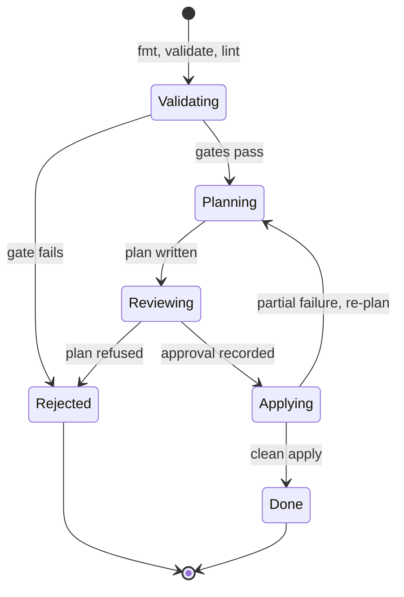

# Tiger Style for Terraform

**Safety > performance > developer experience.**

A practical coding standard for Terraform and OpenTofu infrastructure-as-code written in
HCL. Adapted from the supplied Rust guide. This is an independent interpretation of
[TigerBeetle's Tiger Style](https://github.com/tigerbeetle/tigerbeetle/blob/main/docs/TIGER_STYLE.md),
not an official TigerBeetle, HashiCorp, or OpenTofu document. Where this guide says
`terraform`, the same rule applies to `tofu` unless a behavioral difference is noted.

| Policy | Baseline |
| --- | --- |
| Engine | OpenTofu or Terraform 1.x, exact version pinned in `required_version` |
| Providers | Pessimistic constraints (`~>`) required on every provider; `.terraform.lock.hcl` committed |
| State | Remote backend mandatory; local state is never committed and never shared |
| Change discipline | Plan-before-apply always; apply only a reviewed, saved plan |
| Formatting | `terraform fmt`, two spaces |
| Module size | Review modules above ~300 lines of HCL |
| Primary platform | Provider APIs; cloud-behavior claims need provider-docs verification |
| Document reviewed | 2026-10-06 |

## Contents

- [1. Engineering contract](#1-engineering-contract)
- [2. Toolchain and build trust](#2-toolchain-and-build-trust)
- [3. Structure and naming](#3-structure-and-naming)
- [4. Schema and validation](#4-schema-and-validation)
- [5. Contracts and errors](#5-contracts-and-errors)
- [6. Bounds and blast radius](#6-bounds-and-blast-radius)
- [7. Resource lifecycle](#7-resource-lifecycle)
- [8. Ordering and dependencies](#8-ordering-and-dependencies)
- [9. Privilege and secret boundaries](#9-privilege-and-secret-boundaries)
- [10. Operating-system boundaries](#10-operating-system-boundaries)
- [11. Performance and reproducibility](#11-performance-and-reproducibility)
- [12. Tests and review gates](#12-tests-and-review-gates)
- [13. Complete reference module](#13-complete-reference-module)
- [14. Neovim integration](#14-neovim-integration)
- [15. Documentation and media](#15-documentation-and-media)
- [16. Review card and validation](#16-review-card-and-validation)

## 1. Engineering contract

Infrastructure correctness comes before speed of delivery. Speed comes before convenience
when the tradeoff is real. A two-minute plan review is cheaper than a two-hour outage and
orders of magnitude cheaper than data loss. Measure that tradeoff; do not use the priority
order to justify speculative complexity.

Terraform has four distinct artifacts, and confusing them is the root of most incidents:

- **Configuration** is intent: what you wrote.
- **State** is the record: what Terraform believes exists. It is the source of truth for
  subsequent plans, not a log.
- **Plan** is a proposed diff between configuration, state, and the real provider.
- **Apply** is the commit point: the only operation that changes real infrastructure.

Every substantial change must identify:

1. Accepted/rejected inputs and the trust boundary: who authors variables, approves plans, runs apply.
2. The blast radius: which resources change, how many, and what depends on them.
3. The owner of every resource: module, team, and tags that say so.
4. The point at which externally visible state changes: apply, against a saved plan.
5. Failure behavior: a partial apply records successes in state; the next plan reconciles the remainder. There is no transaction.
6. The evidence: the plan output, lint and policy gates, tests, and a reviewer's explicit approval.

Nothing changes infrastructure until `apply` runs. Treat the saved plan file as the
reviewed contract: apply the plan that was reviewed, not a freshly generated one.



Text equivalent: a rejected gate, plan, or review leaves infrastructure unchanged; only an
approved plan reaches apply, and a partial apply returns to planning for the remainder.

Use this rule for exceptions: name the rule, explain the need, bound the resulting risk,
and record a test or review condition. An exception belongs near the affected resource or
in its design record. Blanket waivers are difficult to maintain.

Prefer a direct module a reviewer can reason about. Do not ban `for_each`, dynamic blocks,
or provider functions merely because they are abstractions. Require them to make the blast
radius, cost, and failure clearer.

## 2. Toolchain and build trust

Pin the engine version in the root module, not in the editor configuration solely because
this guide lives there: `required_version` with an upper bound, and pessimistic (`~>`)
constraints on every provider. The reference module's `versions.tf` (section 13) shows
the shape; replace its bounds with a tested range before using it.

OpenTofu accepts the same `terraform` block syntax; its registry is the default provider
source for `tofu`. When a repository supports both engines, record which engine CI uses and
test the other explicitly rather than assuming compatibility.

Every provider needs a pessimistic constraint (`~> 5.60` allows 5.x patch and minor
updates, not 6.0). A bare `>=` permits a major upgrade the next time someone runs
`terraform init -upgrade`; that upgrade must be a reviewed decision, not an accident.

Commit `.terraform.lock.hcl` for every root module. The lock file pins provider hashes;
review it like code: registry source, version, licenses, and the platforms listed. Run
`terraform init` against the lock file in CI; run `init -upgrade` only as a deliberate,
reviewed change, and read the lock diff before committing it.

Do not open an unfamiliar checkout and run `init`, `plan`, or `apply` without deciding you
trust it. Initialization downloads and executes provider plugins; planning reads live
credentials and remote state. Apply the same trust decision in the editor and the
terminal. Teams that need reproducible provider delivery should use a provider network
mirror rather than the public registry, and record the mirror in the runbook.

On Arch Linux, keep the engine binary separate from rolling system updates; prefer
official release archives for pipelines and review any AUR build before executing it.
Record engine, provider, and backend versions in every apply's run log.

## 3. Structure and naming

Organize a module with one concern per file, in alphabetical order where dependencies
allow:

```text
modules/s3-audit-log/
  data.tf        # data sources, when the module reads existing infrastructure
  locals.tf      # local values (optional; small modules may keep locals in main.tf)
  main.tf        # resources
  outputs.tf     # outputs
  variables.tf   # input variables
  versions.tf    # terraform and provider constraints
  README.md      # purpose, inputs, outputs, example
```

Root configurations follow the same files. Prefer **directories per environment**
(`envs/dev`, `envs/prod`) over workspaces for anything real: directories give each
environment its own backend key and blast radius. Workspaces share one configuration —
acceptable only for ephemeral copies, never as the prod/non-prod boundary.

Use `snake_case` for resources, variables, outputs, and locals, with domain meaning and
units: `bucket_name`, `log_retention_days`, `kms_key_arn`. Physical cloud names come
from validated variables, never hardcoded strings.

Keep module interfaces narrow: few variables, concrete types, documented defaults,
public contract first. Split modules around ownership and domain responsibility; a
module managing two teams' resources is two modules.

Use `terraform fmt` as the mechanical authority. Comment intent, policy, and tradeoffs —
not syntax. Review modules above ~300 lines of HCL; split at ownership boundaries, not
into one-use modules.

Reference module sources with pinned versions. For registry modules, always set `version`:

```hcl
# Fragment: a version-pinned module call.
module "vpc" {
  source  = "terraform-aws-modules/vpc/aws"
  version = "~> 5.8"

  name = var.vpc_name
  cidr = var.vpc_cidr
}
```

A module call without a version constraint resolves to the newest published release at
init time. That is an unreviewed dependency change wearing a familiar name.

## 4. Schema and validation

Types are the cheapest contract. Represent distinct concepts with distinct constraints:
a CIDR is not a string, a retention period is not an arbitrary number, an environment is
not free text.

Every variable gets a `type`, a `description`, and — where the domain allows it — a
`validation` block. Validation blocks may reference only the variable being validated;
keep cross-variable invariants in `precondition` blocks (section 5) instead.

```hcl
# Fragment: a validated variable.
variable "log_retention_days" {
  type        = number
  default     = 365
  description = "Days to retain logs before expiration. Policy floor is 90 days."

  validation {
    condition     = var.log_retention_days >= 90 && var.log_retention_days <= 2555
    error_message = "Retention must be between 90 and 2555 days (7 years)."
  }
}
```

Prefer concrete types over `any`. Use `optional()` with explicit defaults inside object
types so callers see the full shape:

```hcl
# Fragment: an object type with documented optionality.
variable "backup" {
  type = object({
    enabled         = optional(bool, true)
    retention_days  = optional(number, 30)
    kms_key_arn     = optional(string)
  })
  default     = {}
  description = "Backup policy. Disabled only with an explicit enabled = false."
}
```

Mark secret inputs `sensitive = true`; sensitivity propagates, so outputs referencing
them must be marked sensitive too. Redaction is display-only: the state file still holds
plaintext (section 9).

Use `nullable = false` when a default must survive an explicit `null`. Never give a
secret variable a default — a default secret is committed to version control; require
the caller to supply it from the environment or a secret store.

Treat data sources as read boundaries: they observe infrastructure they do not own.
Bound data-driven `for_each` (section 6) — a growing data source silently expands the
resources Terraform manages.

Committed `.tfvars` files hold non-secret values only; secrets arrive via `TF_VAR_`
environment variables, a secret store, or an uncommitted gitignored file.

## 5. Contracts and errors

Validate external input before planning. Assert facts the configuration has already
established. A malformed variable is not an internal invariant failure.

| Situation | Preferred response |
| --- | --- |
| Invalid variable or configuration | Plan fails before any change; fix the input |
| Lint finding (`tflint`) | CI gate fails; fix the code, not the gate |
| Policy violation (`checkov`, `tfsec`) | CI gate fails; an exception needs a named approver and an expiry |
| Broken invariant (`precondition`) | Plan or apply stops before the resource is mutated |
| Broken post-apply assertion (`postcondition`) | Apply fails; state may hold a partial change — re-plan |
| Health assertion (`check` block) | Warning only; investigate, never ignore silently |
| Interrupted apply | State records what succeeded; re-run plan to reconcile |
| Provider API error | Retry only if the error class is retryable and the operation idempotent |

> **In plain terms:** Terraform splits every change into two phases, like a database transaction with a human in the middle. `plan` computes exactly what would change and writes it to a file; `apply` executes that file and nothing else. You review the plan the way you would review a contract — because once you sign it with `apply`, real infrastructure changes. Never apply a freshly generated plan you have not read; always apply the specific plan file that was reviewed.


Learn the exit codes; CI depends on them:

| Command | Exit code | Meaning |
| --- | --- | --- |
| `terraform plan -detailed-exitcode` | 0 | No changes |
| `terraform plan -detailed-exitcode` | 1 | Error |
| `terraform plan -detailed-exitcode` | 2 | Changes present |
| `terraform apply` | 0 | Success |
| `terraform apply` | 1 | Error, possibly partial |

Use `precondition` and `postcondition` blocks to enforce invariants at the resource
boundary (available since Terraform 1.2; same syntax in OpenTofu):

```hcl
# Fragment: lifecycle preconditions and postconditions.
resource "aws_db_instance" "main" {
  # ... configuration ...

  lifecycle {
    precondition {
      condition     = var.backup_retention_days >= 7
      error_message = "Production databases require at least 7 days of backups."
    }
    postcondition {
      condition     = self.backup_retention_period >= 7
      error_message = "Backup retention was not applied; investigate before proceeding."
    }
  }
}
```

Preconditions are evaluated before the change commits, postconditions after; both fail
the run. `check` blocks differ: they assert ongoing health after apply and warn, never
fail. Use checks for monitoring-shaped assertions, preconditions for gates that must
stop a bad change.

`terraform validate` checks syntax and internal consistency without calling providers.
A passing validate is not a passing plan, and a passing plan is not a guarantee:
provider-side drift between plan and apply is real.

Never `apply -auto-approve` outside reviewed automation. The flag exists for pipelines
whose review happened at plan time; on a terminal it skips the only human gate.

## 6. Bounds and blast radius

Name the blast radius of every change. A plan that touches 3 resources gets a quick
review; a plan that touches 300 gets a recorded approval and a maintenance window.
Set the threshold in the runbook; the reference module's numbers are examples.

`-target` is a recovery tool, not a workflow. Targeted plans create partial state and
hide dependency effects; routine use trains reviewers to accept plans they did not fully
see. Require a written reason whenever `-target` appears, and follow it with a full plan
to confirm nothing else drifted.

Bound every `for_each` and `count`. A collection that grows without a limit is an
unbounded resource factory:

```hcl
# Fragment: bounded iteration.
variable "subnets" {
  type        = map(string)
  description = "Subnet CIDR blocks keyed by availability zone."

  validation {
    condition     = length(var.subnets) >= 2 && length(var.subnets) <= 6
    error_message = "Provide between 2 and 6 subnets."
  }
}
```

When `count` is correct, keep it small, explicit, and validated — never driven by an
unbounded data source. (Identity rules for `for_each` versus `count` are in section 8.)

Control parallelism deliberately: the default `-parallelism=10` suits most providers;
lower it against rate-limited APIs and record why. Raising it past a provider's quota
trades a slow plan for a failing one.

> **In plain terms:** Drift is the gap between what Terraform's state file says exists and what actually exists in the cloud — someone clicked something in the console, an auto-scaler replaced a node, a colleague ran a hotfix. Terraform cannot manage what it cannot see, so drift makes plans lie: they propose changes against a fictional starting point. Refresh-only runs measure the gap before you decide whether to reconcile it or bless it.


Use `plan -refresh-only` to measure drift without proposing changes; `apply -refresh-only`
reconciles state with reality only after a reviewer approves the refresh plan.
Refresh-only runs still write state.

## 7. Resource lifecycle

Lifecycle meta-arguments are the safety rails of individual resources. They accept
**literals only**: no variables, no resource references, no functions. A rail that could
be switched off by an input is not a rail.

| Argument | Contract |
| --- | --- |
| `create_before_destroy = true` | Replacement creates the new resource before destroying the old; zero-downtime for stateful resources |
| `prevent_destroy = true` | Any plan that would destroy the resource fails; removal requires editing the configuration first |
| `ignore_changes = [...]` | Listed attributes are managed outside Terraform; narrow paths only, with a comment naming the external owner |
| `replace_triggered_by = [...]` | Forces replacement when a referenced value changes; use for secrets and immutable inputs |

`ignore_changes` needs discipline: the narrowest path the external owner writes,
documented and reviewed when that owner changes. `ignore_changes = all` is a smell —
unauditable infrastructure.

Refactor declaratively. `moved` blocks record that a resource changed address without
changing identity; `import` blocks bring existing infrastructure under management:

```hcl
# Fragments: declarative refactoring.
moved {
  from = aws_s3_bucket.logs
  to   = aws_s3_bucket.audit
}

import {
  to = aws_s3_bucket.audit
  id = "acme-audit-logs-prod"
}
```

State surgery (`state mv`, `state rm`, `pull`, `push`) is a last resort: back up with
`state pull` first, record a written reason, and never hand-edit a state file — one
malformed binding orphans real infrastructure. Prefer `moved`/`import` blocks: reviewed,
versioned, replayable.

## 8. Ordering and dependencies

Prefer implicit dependencies: referencing `aws_s3_bucket.audit.id` inside another
resource creates an ordering edge the reviewer can see and the graph can prove. Hidden
ordering is debt.

`depends_on` is explicit and rare: only for dependencies that are real but invisible to
references. Every one needs a comment explaining what the graph cannot see. On a whole
module it is a blunt instrument — wire outputs to inputs instead.

Choose `for_each` for resources with identity and `count` for fungible, identical
resources. Never mix them on one resource.

```hcl
> **In plain terms:** Terraform tracks every resource by its address, and the addressing scheme decides what happens when the list changes. `count` numbers resources by position — `subnet[0]`, `subnet[1]` — so inserting one in the middle renumbers everything after it, which Terraform reads as "destroy and recreate." `for_each` names resources by a stable key — `user["ana"]` — so reordering the input changes nothing. If your items have names, they have identity; give Terraform the keys and it stops destroying things you did not touch.


# Fragment: for_each keyed by a stable identifier.
resource "aws_iam_user" "team" {
  for_each = toset(var.team_members)
  name     = each.value
}
```

`for_each` over a map or a set of strings gives each instance a stable address
(`aws_iam_user.team["ana"]`) that survives reordering. `count` addresses instances by
index (`aws_subnet.main[0]`), so inserting an element in the middle destroys and
recreates everything after it. If the elements have names, they have identity: use
`for_each`.

Keep the dependency graph shallow: deep module chains serialize the plan and magnify
partial-apply risk. Audit with `terraform graph` when ordering surprises appear.

## 9. Privilege and secret boundaries

> **In plain terms:** Marking a value `sensitive` only hides it from terminal output and logs — that is redaction, not encryption. The state file itself still holds every secret in readable form, because Terraform needs the real values to compute the next plan. Whoever can read your state backend can read your database passwords. Size state access like production credential access, because that is what it is.

The state file is a secret. `sensitive = true` redacts values from CLI output and logs;
it does not encrypt the state. Anyone who can read the state can read every sensitive
value in it. Size backend access accordingly: the set of people who can read state is the
set of people who hold the secrets.

Rules:

- No secret appears in a `.tf` file, a committed `.tfvars` file, or a default value.
- Secret values arrive via environment variables, a secret store, or an uncommitted file.
- The backend encrypts state at rest (S3 `encrypt = true`, equivalent controls on other
  backends) and the state bucket denies unencrypted access.
- Plan files can embed secrets from the configuration; treat saved plans and CI
  artifacts as sensitive, with retention limits.
- Logs redact sensitive values automatically; verify it — a `TF_LOG=DEBUG` trace of a
  provider bug once printed credentials, and provider bugs recur.

Read secrets through data sources, not through configuration:

```hcl
# Fragment: secrets stay in the secret store.
data "aws_secretsmanager_secret_version" "db" {
  secret_id = var.db_secret_arn
}

resource "aws_db_instance" "main" {
  # ...
  password = data.aws_secretsmanager_secret_version.db.secret_string
}
```

The password still lands in state — that is why state is a secret — but it never lands in
version control, and rotation happens in the secret store, not in a pull request.

Prefer write-only arguments and ephemeral values where supported (Terraform 1.10+,
recent OpenTofu): write-only arguments (conventionally `_wo`-suffixed) never persist in
state, and ephemeral resources expose short-lived values outside state entirely.
Otherwise, document the state exposure explicitly.

Backend locking is a privilege boundary too. S3 with a DynamoDB lock table (or the
equivalent for your backend) prevents two applies from interleaving writes to the same
state. An apply without locking is two applies waiting to corrupt each other.

## 10. Operating-system boundaries

Provider credentials come from the environment, never from `.tf` files:

```sh
# Fragment: credential environment, never configuration.
export AWS_PROFILE=acme-prod
# or: AWS_ACCESS_KEY_ID / AWS_SECRET_ACCESS_KEY / AWS_SESSION_TOKEN
# Azure: ARM_CLIENT_ID / ARM_CLIENT_SECRET / ARM_TENANT_ID / ARM_SUBSCRIPTION_ID
# GCP:   GOOGLE_APPLICATION_CREDENTIALS=/run/secrets/gcp-key.json
```

A provider block may select a profile or a region; it must not contain a secret. If a
secret appears in a provider block during review, the review stops until it is removed.

Keep backend configuration out of the committed files with partial backend blocks; the
reviewer sees the shape, the pipeline supplies the values:

```hcl
# backend.tf — committed; values supplied at init.
terraform {
  backend "s3" {}
}
```

```sh
terraform init \
  -backend-config="bucket=acme-terraform-state" \
  -backend-config="key=prod/network.tfstate" \
  -backend-config="region=us-west-2" \
  -backend-config="dynamodb_table=acme-terraform-locks" \
  -backend-config="encrypt=true"
```

Backend blocks do not accept variables or interpolation; that is why `-backend-config`
exists. Do not work around it with generated files that smuggle secrets into version
control.

Gitignore everything the engine generates or that could leak state:

```text
# .gitignore — Terraform section.
.terraform/
*.tfstate
*.tfstate.*
crash.log
crash.*.log
override.tf
override.tf.json
*_override.tf
*_override.tf.json
.terraformrc
terraform.rc
tfplan*
```

Override files are a local escape hatch, gitignored so one operator's override cannot
silently change a shared plan. `TF_IN_AUTOMATION=true` and `TF_INPUT=false` belong in
every CI pipeline: no interactive prompt may ever block — or answer — a pipeline.

## 11. Performance and reproducibility

Establish a correct plan before tuning a slow one. Measure the actual dominant cost:
provider API latency, a data source that fans out, or an over-broad refresh.

Practical levers, in order:

1. **Plugin cache.** Set `TF_PLUGIN_CACHE_DIR` (or `plugin_cache_dir` in the CLI
   config) so `init` reuses downloaded providers instead of fetching them per run.
2. **Parallelism.** The default `-parallelism=10` is usually right; lower it against
   rate-limited APIs and record why. Raising it past the provider's quota trades a slow
   plan for a failing one.
3. **Refresh scope.** Data sources refresh on every plan. A data source that lists an
   entire account on each run is a recurring tax; narrow its filters or scope.
4. **Plan files are point-in-time.** A saved plan is bound to the configuration and
   state that produced it. Do not cache plans across configuration changes or reuse a
   stale plan after the state moved; regenerate and re-review.

Reproducibility is a contract: same engine version, same lock file, same configuration,
same state — same plan, modulo provider-side drift. The lock file pins providers; the
backend pins state; `required_version` pins the engine. Anything outside those three is
a variable you have not controlled.

Determinism in output matters for review: `terraform plan` renders resources in a stable
order, but provider APIs may return collections unordered. Sort or key anything a human
compares across runs, and prefer `for_each` maps over lists where ordering noise would
hide real changes.

## 12. Tests and review gates

Test contracts, not incidental formatting. Include invalid variables, boundary values,
policy violations, and drift. A passing formatter is not a passing validator; a passing
validator is not a passing policy check; a passing plan is not a successful apply. Report
each kind of evidence accurately.

Typical gates for a reviewed root module, in order:

```sh
terraform fmt -check -recursive
terraform init -input=false
terraform validate
tflint --recursive
checkov -d .            # or: tfsec .
terraform plan -input=false -out=tfplan -detailed-exitcode
```

Read the exit code of the plan step: `2` means changes are present and the pipeline
continues to review; `1` means the plan failed and the pipeline stops; `0` means no
changes and there is nothing to review. Wire these three outcomes explicitly — a
pipeline that treats `2` as failure blocks every legitimate change.

`tflint` catches provider misuse the engine accepts: invalid resource types, deprecated
arguments, missing required fields. Ship a `.tflint.hcl` with the repository, pinning
the `terraform` recommended preset and your cloud ruleset versions.

`checkov` and `tfsec` enforce policy: encryption at rest, no public buckets, restricted
security groups. Policy exceptions need a named approver and an expiry date, recorded
next to the suppression — a suppression without an expiry is a permanent hole with a
comment.

`terraform test` (Terraform 1.6+, OpenTofu equivalent) runs unit-style tests against the
module with mocked providers:

```hcl
# tests/retention.tftest.hcl — fragment.
mock_provider "aws" {}

run "retention_floor" {
  command = plan

  variables {
    bucket_name        = "test-audit-logs"
    environment        = "dev"
    kms_key_arn        = "arn:aws:kms:us-west-2:123456789012:key/00000000-0000-0000-0000-000000000000"
    log_retention_days = 30
  }

  expect_failures = [
    # The 30-day retention violates the 90-day validation; the plan must fail.
    var.log_retention_days,
  ]
}
```

Separate hermetic tests (mocked providers, no credentials) from integration tests against
a real account — which need their own backend and state, a bounded lifetime, and a
destroy step that actually runs.

Detect drift on schedule: periodic `plan -detailed-exitcode` against production,
alerting on exit `2`. Drift is information, not failure. Reconcile with a reviewed
`apply -refresh-only`, never by editing state.

## 13. Complete reference module

A self-contained module for an encrypted S3 audit-log bucket with enforced retention:
pinned versions, validated variables, literal lifecycle rails, a precondition, a
postcondition, and sensitive outputs. Save each fence as the named file under
`modules/s3-audit-log/`. Alphabetical order where dependencies allow.

```hcl
# versions.tf — complete file.
terraform {
  required_version = ">= 1.9.0, < 2.0.0"

  required_providers {
    aws = {
      source  = "hashicorp/aws"
      version = "~> 5.60"
    }
  }
}
```

```hcl
# variables.tf — complete file.
variable "bucket_name" {
  type        = string
  description = "Globally unique S3 bucket name for audit logs."

  validation {
    condition     = can(regex("^[a-z0-9][a-z0-9.-]{1,61}[a-z0-9]$", var.bucket_name))
    error_message = "Bucket name must be 3-63 lowercase characters, digits, dots, or hyphens, starting and ending with a letter or digit."
  }
}

variable "environment" {
  type        = string
  description = "Deployment environment. Used in tags and policy floors."

  validation {
    condition     = contains(["dev", "staging", "prod"], var.environment)
    error_message = "Environment must be one of: dev, staging, prod."
  }
}

variable "kms_key_arn" {
  type        = string
  sensitive   = true
  description = "ARN of the KMS key for bucket encryption. Redacted in CLI output; still plaintext in state."

  validation {
    condition     = can(regex("^arn:aws:kms:[a-z0-9-]+:[0-9]{12}:key/[0-9a-f-]{36}$", var.kms_key_arn))
    error_message = "KMS key ARN must match arn:aws:kms:<region>:<account>:key/<uuid>."
  }
}

variable "log_retention_days" {
  type        = number
  default     = 365
  description = "Days to retain audit logs before expiration. Policy floor is 90 days."

  validation {
    condition     = var.log_retention_days >= 90 && var.log_retention_days <= 2555
    error_message = "Retention must be between 90 and 2555 days (7 years)."
  }
}

```hcl
# main.tf — complete file.
locals {
  base_tags = {
    Environment = var.environment
    ManagedBy   = "terraform"
  }
}

resource "aws_s3_bucket" "audit" {
  bucket = var.bucket_name
  tags   = local.base_tags

  lifecycle {
    # Lifecycle arguments are literals: no variables, no references.
    create_before_destroy = true
    prevent_destroy       = true
    ignore_changes = [
      # External inventory automation writes this tag; Terraform must not fight it.
      tags["last-inventory-scan"],
    ]
    precondition {
      condition     = var.log_retention_days >= 90
      error_message = "Audit log retention is below the 90-day policy floor."
    }
  }
}

resource "aws_s3_bucket_lifecycle_configuration" "audit" {
  bucket = aws_s3_bucket.audit.id

  rule {
    id     = "expire-old-logs"
    status = "Enabled"

    filter {} # An empty filter applies the rule to every object in the bucket.

    expiration {
      days = var.log_retention_days
    }

    noncurrent_version_expiration {
      noncurrent_days = 30
    }
  }

  lifecycle {
    postcondition {
      condition     = self.rule[0].expiration[0].days == var.log_retention_days
      error_message = "Lifecycle expiration does not match the requested retention."
    }
  }
}

resource "aws_s3_bucket_server_side_encryption_configuration" "audit" {
  bucket = aws_s3_bucket.audit.id

  rule {
    apply_server_side_encryption_by_default {
      kms_master_key_id = var.kms_key_arn
      sse_algorithm     = "aws:kms"
    }
    bucket_key_enabled = true
  }
}

```hcl
# outputs.tf — complete file.
output "bucket_arn" {
  value       = aws_s3_bucket.audit.arn
  description = "ARN of the audit log bucket."
}

output "bucket_name" {
  value       = aws_s3_bucket.audit.bucket
  description = "Name of the audit log bucket."
}

output "kms_key_arn" {
  value       = var.kms_key_arn
  sensitive   = true
  description = "ARN of the KMS key encrypting the bucket. Sensitive: redacted in output, plaintext in state."
}
```

Run the section 12 gates before any plan against a real account. Note the
`prevent_destroy` rail: destroying this bucket requires editing the module first —
exactly the friction a log bucket should have. The `ignore_changes` entry is the
narrowest path the external owner writes, with the owner named in the comment.

## 14. Neovim integration

Place this document at `lua/config/lang/TIGER_STYLE_TERRAFORM.md` in Diver. Markdown is
reference material; do not `require()` it from `init.lua`. Your Terraform language
configuration, LSP definitions, lint runner, and formatter remain their own Lua modules.

Use `terraformls` as the language server for HCL: completion, go-to-definition across
modules, hover documentation, and `validate` diagnostics in the buffer. Keep the server's
view of the workspace consistent with the terminal: run `terraform init` (or
`tofu init`) before trusting module-aware features, and compare the editor's environment
with the terminal's before changing diagnostics to conceal a mismatch.

Run `tflint` as the linter and `terraform fmt` as the formatter on save — one owner for
format-on-save. The Treesitter `hcl` grammar provides highlighting independent of the
language server.

Make execution deliberate: workspace trust gates `init`, `plan`, and above all `apply`.
Never wire `apply` to an editor command, keymap, or save hook; plans may be generated
for review, but applying them is a terminal or pipeline act with its own approval.

When a Terraform helper feeds Neovim diagnostics, use a versioned output schema, carry
buffer identity and configuration version through the request, and reject stale results
before publishing them.

## 15. Documentation and media

Keep the core guide readable as plain Markdown. Use a table for comparisons, Mermaid for
plan/apply relationships, and math only where it clarifies a bound. Every diagram needs
a textual equivalent. Code fences must identify their language and whether they are
complete, fragments, or templates.

Use relative, repository-owned images with meaningful alt text after adding the actual
asset. The following is a template, not an included image:

```markdown

```

For a trusted renderer that supports HTML video, provide controls and a fallback link.
Add the media files before inserting this template into a rendered document:

```html
<video controls preload="metadata" aria-label="Reference module plan walkthrough">
  <source src="./assets/terraform-module-demo.mp4" type="video/mp4">
  <a href="./assets/terraform-module-demo.mp4">Open the walkthrough video</a>
</video>
```

SVG, custom CSS, JavaScript, video, and math support depend on the renderer. Keep active
HTML and scripts disabled for untrusted documentation. Never require JavaScript to read
a safety contract. If an interactive local page is useful, maintain it as a separate
reviewed asset with a static explanation in the Markdown.

## 16. Review card and validation

Before merging:

- [ ] The plan was generated from this exact configuration and state, read in full, and applied unmodified.
- [ ] The blast radius is explicit: resources changed, counts reviewed, approval recorded.
- [ ] Variables carry types, descriptions, and validation; secrets are sensitive and never in committed files.
- [ ] State lives in a remote, encrypted backend with locking; no local state is committed.
- [ ] Lifecycle rails are deliberate: `prevent_destroy`, `create_before_destroy`, `ignore_changes` justified and literal.
- [ ] Dependencies are implicit references; `depends_on` is rare and documented.
- [ ] `for_each` is keyed and bounded; `count` is only for fungible, identical resources.
- [ ] No `-target` in routine runs; no hand-edited state; refactoring uses `moved`/`import` blocks.
- [ ] Versions are pinned: `required_version`, provider constraints, reviewed `.terraform.lock.hcl`.
- [ ] `fmt`, `validate`, `tflint`, `checkov`/`tfsec` gates pass; plan exit code (0/1/2) understood and wired in CI.
- [ ] Credentials come from the environment; backends use partial configuration; `.gitignore` covers state, plugins, plans.
- [ ] Drift is detected on schedule; refresh-only runs are approved, never routine.
- [ ] Logs, plans, and CI artifacts expose no secrets.

**Validation record:** no Terraform/OpenTofu binary is installed here, so the reference
module was not executed: `fmt`, `validate`, and `tflint` were not run. Its HCL was
reviewed by hand against documented behavior (literal-only lifecycle arguments,
sensitive propagation to outputs, nested-block indexing, empty `filter {}` semantics).
Before use, run the section 12 gates, then `plan` against a non-production account and
read the full plan. The user's pinned engine, providers, backend, and Neovim
integration were not executed for this documentation task.

**Maintenance:** review this guide whenever the pinned engine version, a provider major
version, the backend, the secret-store integration, or the trust model changes. Keep the
rule and the evidence together. Remove obsolete workarounds when their underlying
constraint disappears.
